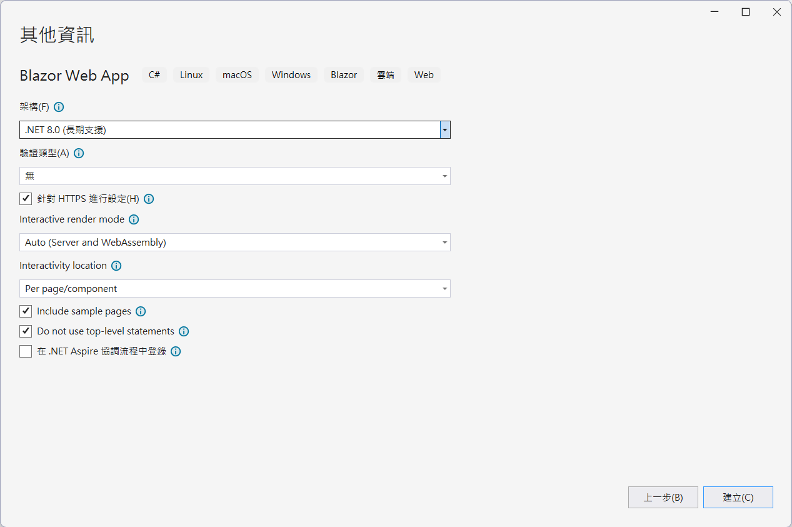
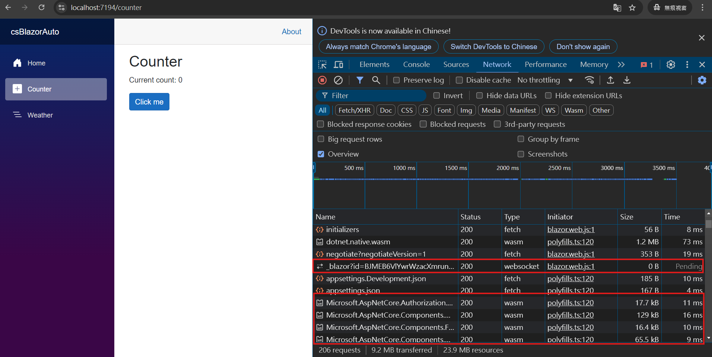

# .NET 8 Blazor 005 - 自動轉譯會決定如何在執行階段轉譯元件


在前四篇文章中 [.NET 8 Blazor 001 - 了解 SSR Static Server Render 運作模式](https://csharpkh.blogspot.com/2024/07/NET8-Blazor-Understand-SSR-Static-Server-Render.html) / [.NET 8 Blazor 002 - 了解 互動式伺服器端轉譯 Interactive server-side rendering (interactive SSR) 運作模式](https://csharpkh.blogspot.com/2024/10/NET8-Blazor-Understand-Interactive-server-side-SSR-Render.html) / [.NET 8 Blazor 003 - 了解 互動式 WebAssembly 用戶端端轉譯 Client-side rendering (CSR) 運作模式](https://csharpkh.blogspot.com/2024/10/NET8-Blazor-Understand-Client-SideRendering-CSR-Using-Blazor-WebAssembly.html) / [.NET 8 Blazor 004 - 觀察 Global 與 Per Page/Component 之間的差異](https://csharpkh.blogspot.com/2024/10/NET8-Blazor-Understand-Global-Per-CSR-Page-Component-Different.html) 中，說明了四種 Blazor 專案的轉譯設計方法，現在要來說明最後一種用法自動轉譯會決定如何在執行階段轉譯元件

## 建立 測試專案

請依照底下的操作，建立起這篇文章需要用到的練習專案

* 打開 Visual Studio 2022 IDE 應用程式
* 從 [Visual Studio 2022] 對話窗中，點選右下方的 [建立新的專案] 按鈕
* 在 [建立新專案] 對話窗右半部
  * 切換 [所有語言 (L)] 下拉選單控制項為 [C#]
  * 切換 [所有專案類型 (T)] 下拉選單控制項為 [Web]
* 在中間的專案範本清單中，找到並且點選 [Blazor Web App] 專案範本選項
  > A project template for creating a Blazor Web app that support both server-side rending and client interactivity. This template can be used for web apps with rich dynamic user interfaces (UIs)
* 點選右下角的 [下一步] 按鈕
* 在 [設定新的專案] 對話窗
* 找到 [專案名稱] 欄位，輸入 `csBlazorAuto` 作為專案名稱
* 在剛剛輸入的 [專案名稱] 欄位下方，確認沒有勾選 [將解決方案與專案至於相同目錄中] 這個檢查盒控制項
* 點選右下角的 [下一步] 按鈕
* 現在將會看到 [其他資訊] 對話窗
* 在 [架構] 欄位中，請選擇最新的開發框架，這裡選擇的 [架構] 是 : `.NET 8.0 (長期支援)`
* 在 [驗證類型] 欄位中，請選擇 [無] 
* 勾選 [針對 HTTPS 進行設定] 檢查盒欄位 
* 在 [Interactive render mode] 欄位中，請選擇 [Auto (Server and WebAssembly)] 
* 在 [Interactivity location] 欄位中，請選擇 [Per page/component] 
* 勾選 [Include sample pages] 檢查盒欄位 
* 勾選 [Do not use top-level statements] 檢查盒欄位 
  > 這裡的這個操作，可以由讀者自行決定是否要勾選這個檢查盒控制項
* 不要勾選 [在 .NET Aspire 協調流程中登入] 檢查盒欄位 
  
* 請點選右下角的 [建立] 按鈕

稍微等候一下，這個 Blazor Web App 專案將會建立完成

## Program.cs - Blazor 專案程式進入點

在這個 Blazor 專案中，`Program.cs` 檔案的內容如下，從這裡可以看到，這個專案是使用了自動轉譯的方式，這個專案會自動決定如何在執行階段轉譯元件。其中有用到了 `builder.Services.AddInteractiveServerComponents()`、`builder.Services.AddInteractiveWebAssemblyComponents()`方法，這表示了，這個專案將會可以使用到 Interactive SSR 與 CSR 兩種渲染方法。

在 `app.MapRazorComponents<App>()` 方法中，加入了 `.AddInteractiveServerRenderMode()` 與 `.AddInteractiveWebAssemblyRenderMode()` 方法，這表示了，這個專案將會可以使用到 Interactive SSR 與 CSR 兩種渲染方法。

```csharp
using csBlazorAuto.Client.Pages;
using csBlazorAuto.Components;

namespace csBlazorAuto
{
    public class Program
    {
        public static void Main(string[] args)
        {
            var builder = WebApplication.CreateBuilder(args);

            // Add services to the container.
            builder.Services.AddRazorComponents()
                .AddInteractiveServerComponents()
                .AddInteractiveWebAssemblyComponents();

            var app = builder.Build();

            // Configure the HTTP request pipeline.
            if (app.Environment.IsDevelopment())
            {
                app.UseWebAssemblyDebugging();
            }
            else
            {
                app.UseExceptionHandler("/Error");
                // The default HSTS value is 30 days. You may want to change this for production scenarios, see https://aka.ms/aspnetcore-hsts.
                app.UseHsts();
            }

            app.UseHttpsRedirection();

            app.UseStaticFiles();
            app.UseAntiforgery();

            app.MapRazorComponents<App>()
                .AddInteractiveServerRenderMode()
                .AddInteractiveWebAssemblyRenderMode()
                .AddAdditionalAssemblies(typeof(Client._Imports).Assembly);

            app.Run();
        }
    }
}
```

## 觀察計數器元件的程式碼

在此 [csBlazorCsr.Client] 專案內 [Pages] 資料夾內找到，並且找到並且打開 [Counter.razor] 這個檔案，就會看到底下內容

```html
@page "/counter"
@rendermode InteractiveAuto

<PageTitle>Counter</PageTitle>

<h1>Counter</h1>

<p role="status">Current count: @currentCount</p>

<button class="btn btn-primary" @onclick="IncrementCount">Click me</button>

@code {
    private int currentCount = 0;

    private void IncrementCount()
    {
        currentCount++;
    }
}
```

在這個元件中，有使用到 `@rendermode InteractiveAuto` 這個指示詞，這表示了，這個元件將會採用自動轉譯的方式，這個專案會自動決定如何在執行階段轉譯元件。

## 觀察運作模式

現在再次執行這個專案，接著，開啟無痕視窗

按下 F12 按鍵，進入到開發人員模式，切換到 [Network] 標籤頁次，接著在網址列輸入 `https://localhost:7297/`，就會看到底下的畫面

接著，切換到 [Counter] 頁面，就會看到底下的畫面



此時，可以看到當第一次顯示這個網頁將會採用 Interactive SSR 的方式，當點擊 [Click me] 按鈕時，可以從 WebSocket 頁籤中看到，這個專案會自動轉換成 Interactive CSR 的方式，這表示了，這個專案會自動決定如何在執行階段轉譯元件。

也就是說，[Counter] 頁籤會立即顯示在螢幕上，並且可以立即使用，這就是自動轉譯的運作模式。

同個時間，因為是第一次開起這個系統，此時會用背景方式進行載入 WebAssembly 檔案

因此，若對這個頁面重新整理，可以觀察到，之後的頁面將會採用 Interactive CSR 的方式，這表示了，這個專案會自動決定如何在執行階段轉譯元件。


