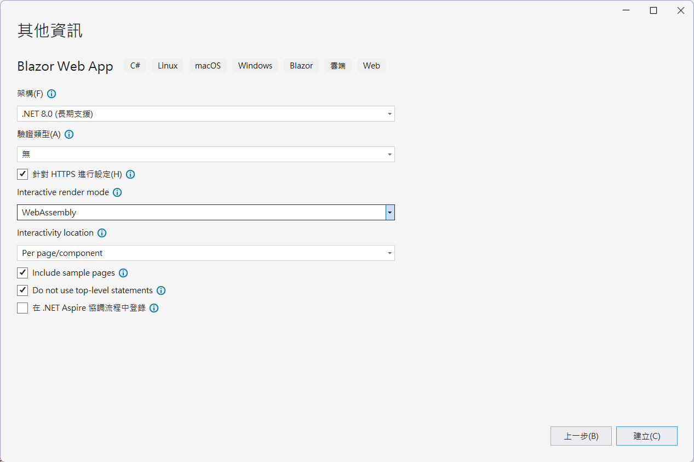
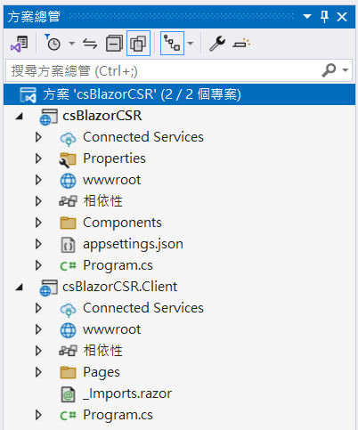
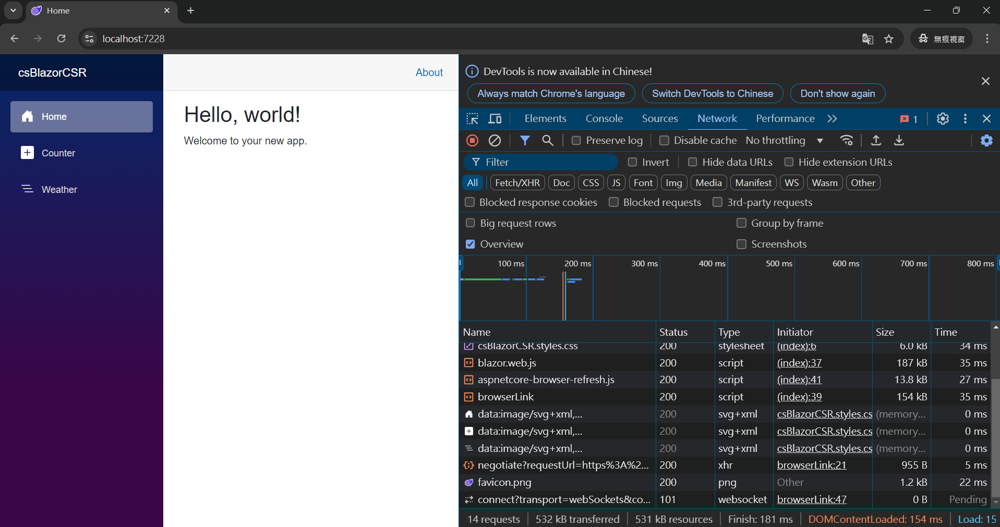
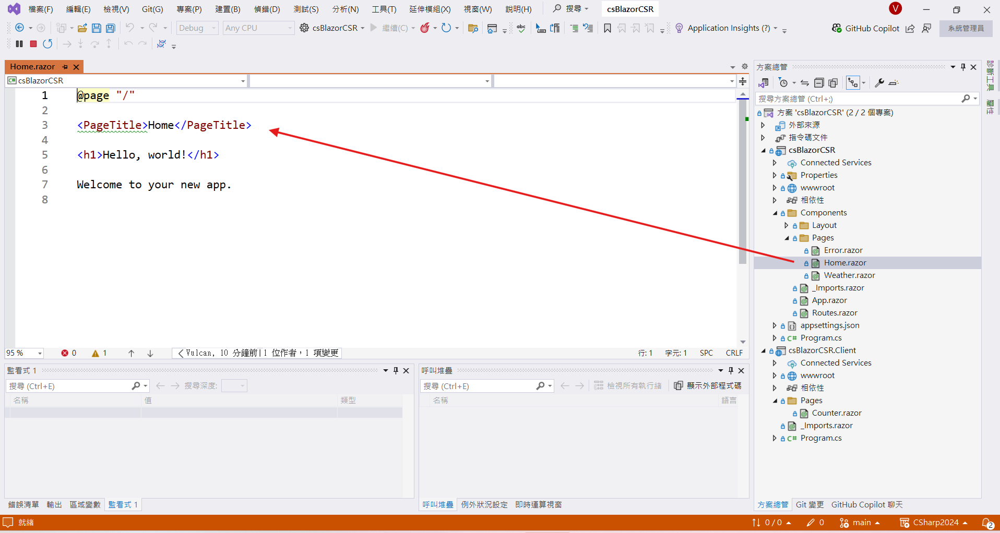
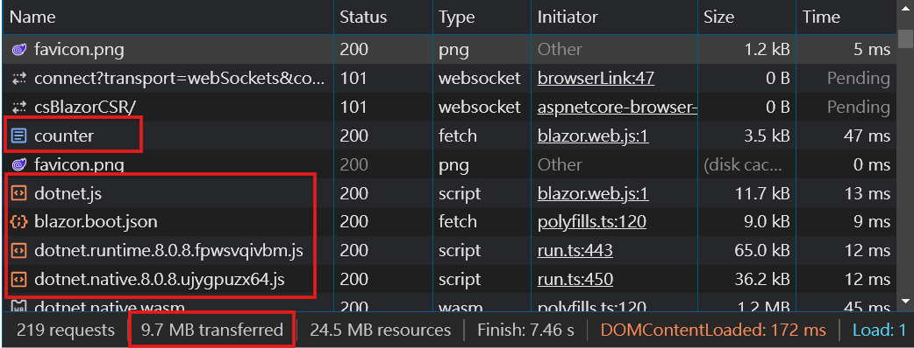
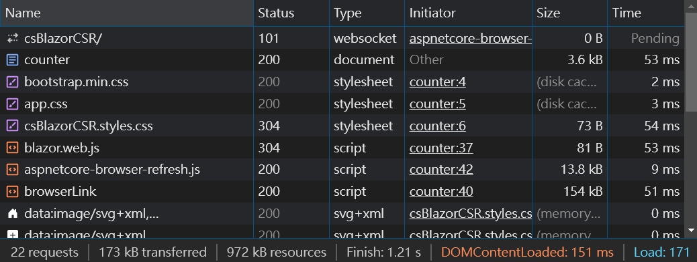

# .NET 8 Blazor 003 - 了解 互動式 WebAssembly 用戶端端轉譯 Client-side rendering (CSR) 運作模式


在上一篇 
[.NET 8 Blazor 002 - 了解 互動式伺服器端轉譯 Interactive server-side rendering (interactive SSR) 運作模式](https://csharpkh.blogspot.com/2024/10/NET8-Blazor-Understand-Interactive-server-side-SSR-Render.html) 介紹了 .NET 8 Blazor 支援的轉譯模式，這裡將介紹了互動式伺服器端轉譯 Interactive server-side rendering (interactive SSR) 運作模式，這是一種採用讓 Blazor 應用程式在伺服器端進行渲染，然後再將渲染結果傳送給客戶端。這樣的機制會有一個先天潛在的缺陷，那就是這樣的應用需要在網路持續有效的情況下，才能夠正常運作。

在這篇文章中，將會要來介紹 .NET 8 Blazor 支援的另一種轉譯模式，這種模式是互動式 WebAssembly 用戶端端轉譯 Client-side rendering (CSR) 運作模式，這是一種採用讓 Blazor 應用程式在客戶端進行渲染，也就是說，這個網頁的相關執行邏輯與互動操作事件，都會在客戶端上來執行，然後再將渲染結果傳送給伺服器端。

總結來說，這個模式是一種介於 SSR 與 CSR 之間的模式。用戶端與伺服器端之間的溝通，是透過 SignalR 這個技術來進行。伺服器端僅會將要渲染內容的差異部分傳送給客戶端，這樣可以讓 Blazor 應用程式在客戶端的效能得到提升。缺點就是，這個系統必須要在網路持續有效的情況下，才能夠正常運作。

但是，這個機制也存在著一個缺點，那就是在第一次開啟網頁來使用的時候，會需要載入一些必要的資源，這樣會造成一些等待時間，這個等待時間會讓使用者感到不便，所以在這個模式下，需要透過一些技術手段來進行優化，以提升使用者的體驗。

所謂的 WebAssembly 是一種可以讓網頁應用程式在瀏覽器中執行的一種技術，透過 WebAssembly 技術，可以讓我們在瀏覽器中執行一些較為複雜的應用程式，這樣可以讓我們的網頁應用程式更加的強大。現今的瀏覽器都已經支援了 WebAssembly 技術，所以可以放心的使用這個技術。透過 Wasm 技術的加持，可以讓 .NET & C# 開發出來的程式碼，可以在瀏覽器中執行，這樣可以讓我們的程式碼更加的強大，而不再需要限縮只能夠使用 JavaScript 程式語言了。

## 建立測試專案

請依照底下的操作，建立起這篇文章需要用到的練習專案

* 打開 Visual Studio 2022 IDE 應用程式
* 從 [Visual Studio 2022] 對話窗中，點選右下方的 [建立新的專案] 按鈕
* 在 [建立新專案] 對話窗右半部
  * 切換 [所有語言 (L)] 下拉選單控制項為 [C#]
  * 切換 [所有專案類型 (T)] 下拉選單控制項為 [Web]
* 在中間的專案範本清單中，找到並且點選 [Blazor Web App] 專案範本選項
  > A project template for creating a Blazor Web app that support both server-side rending and client interactivity. This template can be used for web apps with rich dynamic user interfaces (UIs)
* 點選右下角的 [下一步] 按鈕
* 在 [設定新的專案] 對話窗
* 找到 [專案名稱] 欄位，輸入 `csBlazorCSR` 作為專案名稱
* 在剛剛輸入的 [專案名稱] 欄位下方，確認沒有勾選 [將解決方案與專案至於相同目錄中] 這個檢查盒控制項
* 點選右下角的 [下一步] 按鈕
* 現在將會看到 [其他資訊] 對話窗
* 在 [架構] 欄位中，請選擇最新的開發框架，這裡選擇的 [架構] 是 : `.NET 8.0 (長期支援)`
* 在 [驗證類型] 欄位中，請選擇 [無] 
* 勾選 [針對 HTTPS 進行設定] 檢查盒欄位 
* 在 [Interactive render mode] 欄位中，請選擇 [WebAssembly] 
* 在 [Interactivity location] 欄位中，請選擇 [Per pages/component] 
* 勾選 [Include sample pages] 檢查盒欄位 
* 勾選 [Do not use top-level statements] 檢查盒欄位 
  > 這裡的這個操作，可以由讀者自行決定是否要勾選這個檢查盒控制項
* 不要勾選 [在 .NET Aspire 協調流程中登入] 檢查盒欄位 
  
* 請點選右下角的 [建立] 按鈕

稍微等候一下，這個 Blazor Web App 專案將會建立完成

## 方案結構說明

在上述的操作過程中，建立了一個 [csBlazorCSR] 方案，在這個方案內建立了兩個專案，分別是 [csBlazorCSR] / [csBlazorCSR.Client]；在這個 [csBlazorCSR] 專案內，將會參考到 [csBlazorCSR.Client] 專案。

在這兩專案內，都會有 Program.cs 檔案



## 在 [csBlazorCSR] 的 Program.cs - Blazor 專案程式進入點
在  [csBlazorCSR] 專案的根目錄下，找到 `Program.cs` 檔案，並且打開這個檔案，這個檔案的內容如下

第一篇文章所建立的專案，僅僅使用了 `builder.Services.AddRazorComponents();`，為了要在這個專案內可以使用互動式 WebAssembly 用戶端端轉譯 Client-side rendering (CSR) 運作模式，需要在 `Program.cs` 檔案中加入 `AddInteractiveWebAssemblyComponents()` 這個服務，這樣就可以在這個專案內使用互動式 WebAssembly 用戶端端轉譯 Client-side rendering (CSR) 運作模式。

另外，在 `app.MapRazorComponents<App>()` 這個方法中，加入 `..AddInteractiveWebAssemblyRenderMode()` 與 `.AddAdditionalAssemblies(typeof(Client._Imports).Assembly)` 方法，這樣就可以在這個專案內使用互動式 WebAssembly 用戶端端轉譯 Client-side rendering (CSR) 運作模式。而對於這個方法 `.AddAdditionalAssemblies(typeof(Client._Imports).Assembly)` 的呼叫，是為了讓這個專案可以使用到 [csBlazorCSR.Client] 專案內的組件。

在 [Program.cs] 檔案中的其他內容就沒有太大的差異了。

```csharp
using csBlazorCSR.Client.Pages;
using csBlazorCSR.Components;

namespace csBlazorCSR
{
    public class Program
    {
        public static void Main(string[] args)
        {
            var builder = WebApplication.CreateBuilder(args);

            // Add services to the container.
            builder.Services.AddRazorComponents()
                .AddInteractiveWebAssemblyComponents();

            var app = builder.Build();

            // Configure the HTTP request pipeline.
            if (app.Environment.IsDevelopment())
            {
                app.UseWebAssemblyDebugging();
            }
            else
            {
                app.UseExceptionHandler("/Error");
                // The default HSTS value is 30 days. You may want to change this for production scenarios, see https://aka.ms/aspnetcore-hsts.
                app.UseHsts();
            }

            app.UseHttpsRedirection();

            app.UseStaticFiles();
            app.UseAntiforgery();

            app.MapRazorComponents<App>()
                .AddInteractiveWebAssemblyRenderMode()
                .AddAdditionalAssemblies(typeof(Client._Imports).Assembly);

            app.Run();
        }
    }
}
```

## 在 [csBlazorCSR.Client] 的 Program.cs - Blazor 專案程式進入點
在 [csBlazorCSR] 專案的根目錄下，找到 `Program.cs` 檔案，並且打開這個檔案，這個檔案的內容如下

這個 [Program.cs] 檔案為 Wasm 服務的程式碼進入點，任何需要透過 WebAssembly 來執行的程式碼，若需要用到的相依性注入服務，則需要在這裡進行宣告與註冊這些服務到 IoC DI 容器內。

```csharp
using Microsoft.AspNetCore.Components.WebAssembly.Hosting;

namespace csBlazorCSR.Client
{
    internal class Program
    {
        static async Task Main(string[] args)
        {
            var builder = WebAssemblyHostBuilder.CreateDefault(args);

            await builder.Build().RunAsync();
        }
    }
}
```

## App.razor - Blazor 應用程式的根元件

從 [Components] 資料夾內找到並且打開 [App.razor] 這個檔案，就會看到底下內容

```html
<!DOCTYPE html>
<html lang="en">

<head>
    <meta charset="utf-8" />
    <meta name="viewport" content="width=device-width, initial-scale=1.0" />
    <base href="/" />
    <link rel="stylesheet" href="bootstrap/bootstrap.min.css" />
    <link rel="stylesheet" href="app.css" />
    <link rel="stylesheet" href="csBlazorCSR.styles.css" />
    <link rel="icon" type="image/png" href="favicon.png" />
    <HeadOutlet />
</head>

<body>
    <Routes />
    <script src="_framework/blazor.web.js"></script>
</body>

</html>
```

這裡使用的 [App.razor] 檔案內容，與第一篇文章所建立的專案內容是一樣的，這裡的內容是用來設定 Blazor 應用程式的根元件，這個根元件將會用來載入其他的 Razor 元件。

## Routes.razor - Blazor 路由元件

在 [Components] 資料夾內找到並且打開 [Routes.razor] 這個檔案，就會看到底下內容

```html
<Router AppAssembly="typeof(Program).Assembly" AdditionalAssemblies="new[] { typeof(Client._Imports).Assembly }">
    <Found Context="routeData">
        <RouteView RouteData="routeData" DefaultLayout="typeof(Layout.MainLayout)" />
        <FocusOnNavigate RouteData="routeData" Selector="h1" />
    </Found>
</Router>
```

這裡使用的 [Routes.razor] 檔案內容，與前一篇文章所建立的專案內容大致相同，這裡的內容是用來設定 Blazor 應用程式的路由元件，這個路由元件將會用來顯示路由的內容。

不過，在這裡用到的 [Router] 元件內，有用到 `AdditionalAssemblies` 這個屬性，這個屬性是用來設定這個 Blazor 應用程式所需要用到的組件，這樣就可以讓這個 Blazor 應用程式可以使用到這些組件(存在於 [csBlazorCSR.Client] WebAssembly 專案內)。

也就是說，在這種開發模式下，Blazor 應用程式的組件可以分散在不同的專案內，透過這個 `AdditionalAssemblies` 這個屬性，可以讓 Blazor 應用程式可以使用到這些組件。

## 觀察 互動式伺服器端轉譯 Interactive server-side rendering (interactive SSR) 運作模式

現在再次執行這個專案，接著，開啟無痕視窗

按下 F12 按鍵，進入到開發人員模式，切換到 [Network] 標籤頁次，接著在網址列輸入 `https://localhost:7228/`，就會看到底下的畫面



因為這個專案的首頁元件，採用的是 靜態 SSR 方式來渲染，所以在這個畫面中，可以看到有一個 `index` 的請求，這個請求是用來取得首頁的內容，這個內容是在伺服器端進行渲染，然後再將渲染結果傳送給客戶端。

在 [csBlazorCSR] 專案的 [Components] > [Pages] 資料夾內，找到並且打開 [Home.razor] Razor 元件，這個元件就是用來顯示首頁的內容，這個元件的內容如下



```html
@page "/"

<PageTitle>Home</PageTitle>

<h1>Hello, world!</h1>

Welcome to your new app.
```

從該元件所在的專案位置與該元件的內容來看，這個元件是用來顯示首頁的內容，這個元件的內容是在伺服器端進行渲染，然後再將渲染結果傳送給客戶端。

## 觀察計數器元件的程式碼

這個計數器元件位於 [csBlazorCSR.Client] 專案內，請在此專案內 [Pages] 資料夾內找到，並且找到並且打開 [Counter.razor] 這個檔案，就會看到底下內容

```html
@page "/counter"
@rendermode InteractiveWebAssembly

<PageTitle>Counter</PageTitle>

<h1>Counter</h1>

<p role="status">Current count: @currentCount</p>

<button class="btn btn-primary" @onclick="IncrementCount">Click me</button>

@code {
    private int currentCount = 0;

    private void IncrementCount()
    {
        currentCount++;
    }
}
```

在這個 [Counter.razor] 計數器之 Razor 元件中，可以看到，這裡使用了 `@rendermode InteractiveWebAssembly` 這個語法，宣告這個頁面需要採用 [互動式 WebAssembly 用戶端端轉譯 Interactive WebAssembly Client-side rendering (Interactive CSR)] 模式。

從開發人員模式視窗的 [Network] 頁籤內的訊息內容，可以看到底下的畫面



這裡可以看到，當 [Counter] 頁面被載入後，因為這是一個要採用 CSR 渲染模式，而此時這個瀏覽器環境中，尚未存在 .NET Runtime 的 WebAssembly 程式碼，因此，將會需要檔案，如 .NET CLR / 各種 .NET 組件檔案，這些檔案將會被載入到瀏覽器中，這樣才能夠讓這個 Blazor 應用程式可以在瀏覽器中執行。

現在，請重新整理這個網頁，就會看到底下的畫面



從這裡可以看到，因為 .NET 需要用到的 WebAssembly 程式碼已經被載入到瀏覽器中，所以，這裡就直接顯示了計數器的內容，這個內容是在客戶端進行渲染。

所以，對於想要執行 CSR 的元件，瀏覽器中必須要有 .NET Runtime 與相關的組件 WebAssembly 程式碼，這樣才能夠正常的執行。

