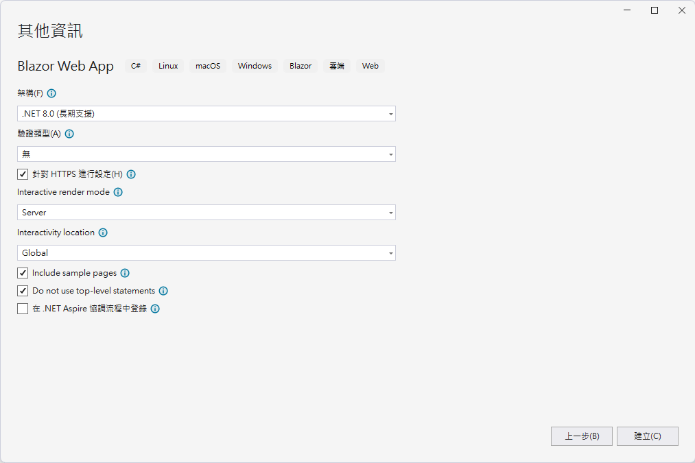
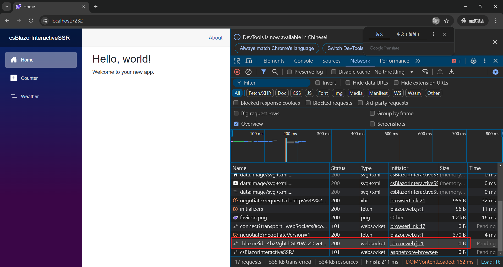
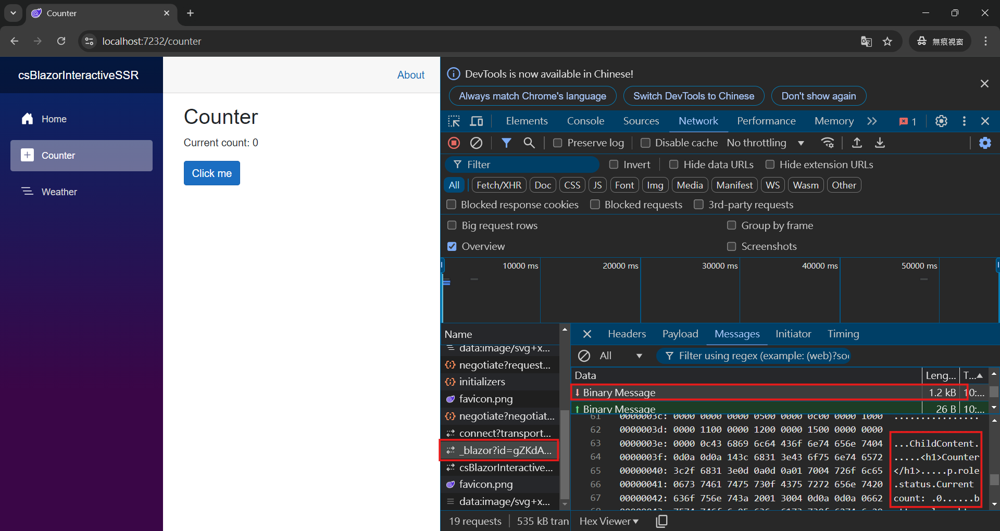
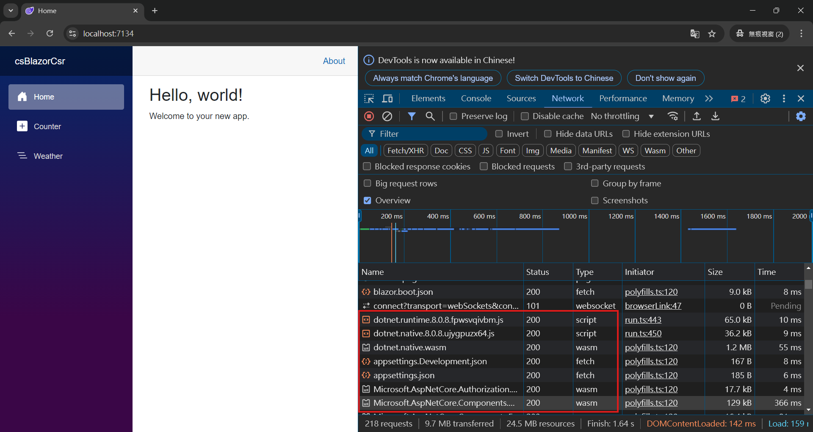

# .NET 8 Blazor 004 - 觀察 Global 與 Per Page/Component 之間的差異


在前三篇文章中 [.NET 8 Blazor 001 - 了解 SSR Static Server Render 運作模式](https://csharpkh.blogspot.com/2024/07/NET8-Blazor-Understand-SSR-Static-Server-Render.html) / [.NET 8 Blazor 002 - 了解 互動式伺服器端轉譯 Interactive server-side rendering (interactive SSR) 運作模式](https://csharpkh.blogspot.com/2024/10/NET8-Blazor-Understand-Interactive-server-side-SSR-Render.html) / [.NET 8 Blazor 003 - 了解 互動式 WebAssembly 用戶端端轉譯 Client-side rendering (CSR) 運作模式](https://csharpkh.blogspot.com/2024/10/NET8-Blazor-Understand-Client-SideRendering-CSR-Using-Blazor-WebAssembly.html) 中，我們已經了解到 Blazor 在 .NET 8 中支援了三種不同的 [ASP.NET Core Blazor 轉譯模式](https://learn.microsoft.com/zh-tw/aspnet/core/blazor/components/render-modes?view=aspnetcore-8.0&WT.mc_id=DT-MVP-5002220)，分別是 SSR (Static Server Render)、互動式伺服器端轉譯 Interactive server-side rendering (interactive SSR) 和互動式 WebAssembly 用戶端端轉譯 Client-side rendering (CSR)。

在這三種專案模式下，都是採用將轉譯模式套用至元件執行個體，這樣的設計方式將會讓元件執行個體在不同的轉譯模式下，可以有不同的行為。也就是說，對於頁面或者元件，若沒有特別的宣告，預設頁面或者元件將會採用靜態 SSR 轉譯模式。

這表示當時的頁面或元件要顯示的內容，將會全部由後端伺服器生成，再將全部的 HTML 內容傳送到瀏覽器用戶端，並且渲覽在網頁上，這樣的網頁並沒有互動的特性，所以才稱作為靜態 SSR。在此種模式下，若想要設計出具有互動效果的網頁功能，是需要透過 JavaScript 腳本來進行設計，也就是無法透過 C# 程式語言來設計具有互動效果的網頁。

然而在此模式下，還是可以在頁面或者元件執行個體中，指定採用互動式伺服器端轉譯 Interactive server-side rendering (interactive SSR) 或者互動式 WebAssembly 用戶端端轉譯 Client-side rendering (CSR)。若要做到這樣的設計，需要透過 [@rendermodeRazor 指示詞屬性](https://learn.microsoft.com/zh-tw/aspnet/core/blazor/components/render-modes?view=aspnetcore-8.0#apply-a-render-mode-to-a-component-instance)。

若在頁面或者元件中，使用了 [@rendermodeRazor 指示詞] ，將會設定 Razor 元件的轉譯模式，這裡可以有三種選擇
* InteractiveServer

  使用 Blazor Server 套用互動式伺服器轉譯。

  `@rendermode InteractiveServer` (這需要在元件內有使用參考 @using static Microsoft.AspNetCore.Components.Web.RenderMode) 或者 `@rendermode RenderMode.InteractiveServer
* InteractiveWebAssembly

  使用 Blazor WebAssembly 套用互動式 WebAssembly 轉譯。

  `@rendermode InteractiveWebAssembly` (這需要在元件內有使用參考 @using static Microsoft.AspNetCore.Components.Web.RenderMode) 或者 `@rendermode RenderMode.InteractiveWebAssembly
* InteractiveAuto

  一開始會使用 Blazor Server 套用互動式 WebAssembly 轉譯，然後在下載 Blazor 套件組合之後，會在後續造訪時使用 WebAssembly 套用互動式 WebAssembly 轉譯。

  `@rendermode InteractiveAuto` (這需要在元件內有使用參考 @using static Microsoft.AspNetCore.Components.Web.RenderMode) 或者 `@rendermode RenderMode.InteractiveAuto

對於 [RenderMode 類別](https://learn.microsoft.com/zh-tw/dotnet/api/microsoft.aspnetcore.components.web.rendermode?view=aspnetcore-8.0) 是一個靜態類別，他有三個靜態屬性 InteractiveServer、InteractiveWebAssembly 和 InteractiveAuto，這三個屬性分別代表了三種不同的轉譯模式。

* InteractiveAuto	
  IComponentRenderMode取得 ，表示轉譯模式會根據原則自動決定。

```csharp
public class InteractiveAutoRenderMode : IComponentRenderMode
{
    /// <summary>
    /// Constructs an instance of <see cref="InteractiveAutoRenderMode"/>.
    /// </summary>
    public InteractiveAutoRenderMode() : this(true)
    {
    }
 
    /// <summary>
    /// Constructs an instance of <see cref="InteractiveAutoRenderMode"/>
    /// </summary>
    /// <param name="prerender">A flag indicating whether the component should first prerender on the server. The default value is true.</param>
    public InteractiveAutoRenderMode(bool prerender)
    {
        Prerender = prerender;
    }
 
    /// <summary>
    /// A flag indicating whether the component should first prerender on the server. The default value is true.
    /// </summary>
    public bool Prerender { get; }
}
```

* InteractiveServer	
  取得 ， IComponentRenderMode 表示透過裝載于伺服器端預先呈現的 Blazor 伺服器，以互動方式呈現伺服器上的 。

```csharp
public class InteractiveServerRenderMode : IComponentRenderMode
{
    /// <summary>
    /// Constructs an instance of <see cref="InteractiveServerRenderMode"/>.
    /// </summary>
    public InteractiveServerRenderMode() : this(true)
    {
    }
 
    /// <summary>
    /// Constructs an instance of <see cref="InteractiveServerRenderMode"/>
    /// </summary>
    /// <param name="prerender">A flag indicating whether the component should first prerender on the server. The default value is true.</param>
    public InteractiveServerRenderMode(bool prerender)
    {
        Prerender = prerender;
    }
 
    /// <summary>
    /// A flag indicating whether the component should first prerender on the server. The default value is true.
    /// </summary>
    public bool Prerender { get; }
}
```

* InteractiveWebAssembly	
  取得 ， IComponentRenderMode 表示透過使用伺服器端預先呈現的 Blazor WebAssembly 裝載，以互動方式呈現用戶端。

```csharp
public class InteractiveAutoRenderMode : IComponentRenderMode
{
    /// <summary>
    /// Constructs an instance of <see cref="InteractiveAutoRenderMode"/>.
    /// </summary>
    public InteractiveAutoRenderMode() : this(true)
    {
    }
 
    /// <summary>
    /// Constructs an instance of <see cref="InteractiveAutoRenderMode"/>
    /// </summary>
    /// <param name="prerender">A flag indicating whether the component should first prerender on the server. The default value is true.</param>
    public InteractiveAutoRenderMode(bool prerender)
    {
        Prerender = prerender;
    }
 
    /// <summary>
    /// A flag indicating whether the component should first prerender on the server. The default value is true.
    /// </summary>
    public bool Prerender { get; }
}
```

對於採用 Blazor 開發框架開發的專案，若不想要使用這麼複雜的設定，可以採用全域 Global 的模式來建立專案，這樣的設計方式將會讓所有的頁面或者元件都採用相同的轉譯模式，這樣的設計方式將會讓開發者可以更加專注在開發功能上，而不是在設定上。

底下將會說明如何建立一個 Blazor 專案，並且設定全域 Global 的 互動式SSR 轉譯模式。

## 建立 Global 互動式SSR 轉譯模式 測試專案

請依照底下的操作，建立起這篇文章需要用到的練習專案

* 打開 Visual Studio 2022 IDE 應用程式
* 從 [Visual Studio 2022] 對話窗中，點選右下方的 [建立新的專案] 按鈕
* 在 [建立新專案] 對話窗右半部
  * 切換 [所有語言 (L)] 下拉選單控制項為 [C#]
  * 切換 [所有專案類型 (T)] 下拉選單控制項為 [Web]
* 在中間的專案範本清單中，找到並且點選 [Blazor Web App] 專案範本選項
  > A project template for creating a Blazor Web app that support both server-side rending and client interactivity. This template can be used for web apps with rich dynamic user interfaces (UIs)
* 點選右下角的 [下一步] 按鈕
* 在 [設定新的專案] 對話窗
* 找到 [專案名稱] 欄位，輸入 `csBlazorInteractiveSSR` 作為專案名稱
* 在剛剛輸入的 [專案名稱] 欄位下方，確認沒有勾選 [將解決方案與專案至於相同目錄中] 這個檢查盒控制項
* 點選右下角的 [下一步] 按鈕
* 現在將會看到 [其他資訊] 對話窗
* 在 [架構] 欄位中，請選擇最新的開發框架，這裡選擇的 [架構] 是 : `.NET 8.0 (長期支援)`
* 在 [驗證類型] 欄位中，請選擇 [無] 
* 勾選 [針對 HTTPS 進行設定] 檢查盒欄位 
* 在 [Interactive render mode] 欄位中，請選擇 [Server] 
* 在 [Interactivity location] 欄位中，請選擇 [Global] 
* 勾選 [Include sample pages] 檢查盒欄位 
* 勾選 [Do not use top-level statements] 檢查盒欄位 
  > 這裡的這個操作，可以由讀者自行決定是否要勾選這個檢查盒控制項
* 不要勾選 [在 .NET Aspire 協調流程中登入] 檢查盒欄位 
  
* 請點選右下角的 [建立] 按鈕

稍微等候一下，這個 Blazor Web App 專案將會建立完成

## 檢視 App.razor 檔案 - Blazor 應用程式的根元件

從 [Components] 資料夾內找到並且打開 [App.razor] 這個檔案，就會看到底下內容

```html
<!DOCTYPE html>
<html lang="en">

<head>
    <meta charset="utf-8" />
    <meta name="viewport" content="width=device-width, initial-scale=1.0" />
    <base href="/" />
    <link rel="stylesheet" href="bootstrap/bootstrap.min.css" />
    <link rel="stylesheet" href="app.css" />
    <link rel="stylesheet" href="csBlazorInteractiveSSR.styles.css" />
    <link rel="icon" type="image/png" href="favicon.png" />
    <HeadOutlet @rendermode="InteractiveServer" />
</head>

<body>
    <Routes @rendermode="InteractiveServer" />
    <script src="_framework/blazor.web.js"></script>
</body>

</html>
```

在這個檔案中，可以看到唯一的差異，就是在使用 [Routes] 元件的時候，有使用到 [@rendermode] 這個屬性，宣告要使用全域 Global 的 互動式伺服器端轉譯 InteractiveServer 轉譯模式。 `<Routes @rendermode="InteractiveServer" />

## 觀察計數器元件的程式碼

在此專案內 [Pages] 資料夾內找到，並且找到並且打開 [Counter.razor] 這個檔案，就會看到底下內容

```html
@page "/counter"

<PageTitle>Counter</PageTitle>

<h1>Counter</h1>

<p role="status">Current count: @currentCount</p>

<button class="btn btn-primary" @onclick="IncrementCount">Click me</button>

@code {
    private int currentCount = 0;

    private void IncrementCount()
    {
        currentCount++;
    }
}
```

在這個檔案中，並沒有使用 [@rendermode] 這個屬性，這表示這個元件將會採用全域 Global 的 互動式伺服器端轉譯 InteractiveServer 轉譯模式。

## 觀察 全域 互動式伺服器端轉譯 Interactive server-side rendering (interactive SSR) 運作模式

現在再次執行這個專案，接著，開啟無痕視窗

按下 F12 按鍵，進入到開發人員模式，切換到 [Network] 標籤頁次，接著在網址列輸入 `https://localhost:7232/`，就會看到底下的畫面



從開發人員工具網頁中，可以看到當這個網頁首次載入的時候，就會建立起一個 WebSocket 的 SignalR 的連線，這與 Per Page/Component 的 互動式伺服器端轉譯 Interactive server-side rendering (interactive SSR) 運作模式有所不同。

現在切換到 [Counter] 頁面，再來觀察開發人員工具網頁中的畫面



將會看到會有 1.2k 的內容要傳送到用戶端，接著觀察該 [Message] 的內容，可以看出這樣要從首頁，切換到計數器頁面的 DOM 物件的差異資訊，這表示這個網頁的內容是在伺服器端進行渲染，然後再將渲染結果傳送給客戶端。也就是說，當這網頁端收到這些資料之後，就會將這些資料進行渲染，然後再顯示在網頁上。

因此，在此專案內，任何頁面或者元件都會採用全域 Global 的 互動式伺服器端轉譯 Interactive server-side rendering (interactive SSR) 轉譯模式。


底下將會說明如何建立一個 Blazor 專案，並且設定全域 Global 的 CSR 轉譯模式。

## 建立 Global CSR 轉譯模式 測試專案

請依照底下的操作，建立起這篇文章需要用到的練習專案

* 打開 Visual Studio 2022 IDE 應用程式
* 從 [Visual Studio 2022] 對話窗中，點選右下方的 [建立新的專案] 按鈕
* 在 [建立新專案] 對話窗右半部
  * 切換 [所有語言 (L)] 下拉選單控制項為 [C#]
  * 切換 [所有專案類型 (T)] 下拉選單控制項為 [Web]
* 在中間的專案範本清單中，找到並且點選 [Blazor Web App] 專案範本選項
  > A project template for creating a Blazor Web app that support both server-side rending and client interactivity. This template can be used for web apps with rich dynamic user interfaces (UIs)
* 點選右下角的 [下一步] 按鈕
* 在 [設定新的專案] 對話窗
* 找到 [專案名稱] 欄位，輸入 `csBlazorCsr` 作為專案名稱
* 在剛剛輸入的 [專案名稱] 欄位下方，確認沒有勾選 [將解決方案與專案至於相同目錄中] 這個檢查盒控制項
* 點選右下角的 [下一步] 按鈕
* 現在將會看到 [其他資訊] 對話窗
* 在 [架構] 欄位中，請選擇最新的開發框架，這裡選擇的 [架構] 是 : `.NET 8.0 (長期支援)`
* 在 [驗證類型] 欄位中，請選擇 [無] 
* 勾選 [針對 HTTPS 進行設定] 檢查盒欄位 
* 在 [Interactive render mode] 欄位中，請選擇 [WebAssembly] 
* 在 [Interactivity location] 欄位中，請選擇 [Global] 
* 勾選 [Include sample pages] 檢查盒欄位 
* 勾選 [Do not use top-level statements] 檢查盒欄位 
  > 這裡的這個操作，可以由讀者自行決定是否要勾選這個檢查盒控制項
* 不要勾選 [在 .NET Aspire 協調流程中登入] 檢查盒欄位 
  
* 請點選右下角的 [建立] 按鈕

稍微等候一下，這個 Blazor Web App 專案將會建立完成

## 檢視 App.razor 檔案 - Blazor 應用程式的根元件

從 [csBlazorCsr] 專案，在 [Components] 資料夾內找到並且打開 [App.razor] 這個檔案，就會看到底下內容

```html
<!DOCTYPE html>
<html lang="en">

<head>
    <meta charset="utf-8" />
    <meta name="viewport" content="width=device-width, initial-scale=1.0" />
    <base href="/" />
    <link rel="stylesheet" href="bootstrap/bootstrap.min.css" />
    <link rel="stylesheet" href="app.css" />
    <link rel="stylesheet" href="csBlazorCsr.styles.css" />
    <link rel="icon" type="image/png" href="favicon.png" />
    <HeadOutlet @rendermode="InteractiveWebAssembly" />
</head>

<body>
    <Routes @rendermode="InteractiveWebAssembly" />
    <script src="_framework/blazor.web.js"></script>
</body>

</html>
```

在這個檔案中，可以看到唯一的差異，就是在使用 [Routes] 元件的時候，有使用到 [@rendermode] 這個屬性，宣告要使用全域 Global 的 CSR 轉譯模式。 `<Routes @rendermode="InteractiveWebAssembly" />

## 觀察計數器元件的程式碼

在此 [csBlazorCsr.Client] 專案內 [Pages] 資料夾內找到，並且找到並且打開 [Counter.razor] 這個檔案，就會看到底下內容

```html
@page "/counter"

<PageTitle>Counter</PageTitle>

<h1>Counter</h1>

<p role="status">Current count: @currentCount</p>

<button class="btn btn-primary" @onclick="IncrementCount">Click me</button>

@code {
    private int currentCount = 0;

    private void IncrementCount()
    {
        currentCount++;
    }
}
```

在這個檔案中，並沒有使用 [@rendermode] 這個屬性，這表示這個元件將會採用全域 Global 的 CSR 。

## 觀察 全域 CSR 運作模式

現在再次執行這個專案，接著，開啟無痕視窗

按下 F12 按鍵，進入到開發人員模式，切換到 [Network] 標籤頁次，接著在網址列輸入 `https://localhost:7134/`，就會看到底下的畫面



從開發人員工具網頁中，可以看到當這個網頁首次載入的時候，因為整體專案採用的是 WebAssembly 的 CSR 轉譯模式，所以並不會建立起一個 WebSocket 的 SignalR 的連線；並且因為這是第一次載入這個網頁，因此，需要先下載 Blazor WebAssembly 的套件組合，一旦相關 Wasm 檔案與 .NET CLR 檔案下載完成之後，就會開始執行這個網頁。

現在切換到 [Counter] 頁面，再來觀察開發人員工具網頁中的畫面


因此，在此專案內，任何頁面或者元件都會採用全域 Global 的 互動式CSR端轉譯 (WebAssembly SSR) 轉譯模式。


