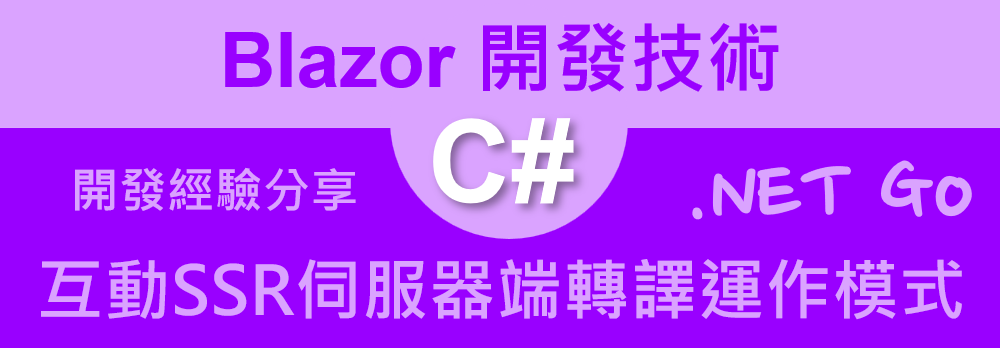

# .NET 8 Blazor 002 - 了解 互動式伺服器端轉譯 Interactive server-side rendering (interactive SSR) 運作模式



[.NET 8 Blazor 001 - 了解 SSR Static Server Render 運作模式](https://csharpkh.blogspot.com/2024/07/NET8-Blazor-Understand-SSR-Static-Server-Render.html) 介紹了 .NET 8 Blazor 支援的轉譯模式，其中介紹了 SSR (Static Server Render) 靜態伺服器渲染模式，這是一種採用讓 Blazor 應用程式在伺服器端進行渲染，然後再將渲染結果傳送給客戶端。

在這篇文章中，將會介紹如何在 .NET 8 Blazor 應用程式中，使用互動式伺服器端轉譯 Interactive server-side rendering (interactive SSR) 模式，這是一種採用讓 Blazor 應用程式在伺服器端進行渲染，也就是說，這個網頁的相關執行邏輯與互動操作事件，都會在伺服器端上來執行，然後再將渲染結果傳送給客戶端。總結來說，這個模式是一種介於 SSR 與 CSR 之間的模式。用戶端與伺服器端之間的溝通，是透過 SignalR 這個技術來進行。伺服器端僅會將要渲染內容的差異部分傳送給客戶端，這樣可以讓 Blazor 應用程式在客戶端的效能得到提升。缺點就是，這個系統必須要在網路持續有效的情況下，才能夠正常運作。

## 建立測試專案

請依照底下的操作，建立起這篇文章需要用到的練習專案

* 打開 Visual Studio 2022 IDE 應用程式
* 從 [Visual Studio 2022] 對話窗中，點選右下方的 [建立新的專案] 按鈕
* 在 [建立新專案] 對話窗右半部
  * 切換 [所有語言 (L)] 下拉選單控制項為 [C#]
  * 切換 [所有專案類型 (T)] 下拉選單控制項為 [Web]
* 在中間的專案範本清單中，找到並且點選 [Blazor Web App] 專案範本選項
  > A project template for creating a Blazor Web app that support both server-side rending and client interactivity. This template can be used for web apps with rich dynamic user interfaces (UIs)
* 點選右下角的 [下一步] 按鈕
* 在 [設定新的專案] 對話窗
* 找到 [專案名稱] 欄位，輸入 `csBlazorInteractiveSSR` 作為專案名稱
* 在剛剛輸入的 [專案名稱] 欄位下方，確認沒有勾選 [將解決方案與專案至於相同目錄中] 這個檢查盒控制項
* 點選右下角的 [下一步] 按鈕
* 現在將會看到 [其他資訊] 對話窗
* 在 [架構] 欄位中，請選擇最新的開發框架，這裡選擇的 [架構] 是 : `.NET 8.0 (長期支援)`
* 在 [驗證類型] 欄位中，請選擇 [無] 
* 勾選 [針對 HTTPS 進行設定] 檢查盒欄位 
* 在 [Interactive render mode] 欄位中，請選擇 [Server] 
* 在 [Interactivity location] 欄位中，請選擇 [Per pages/component] 
* 勾選 [Include sample pages] 檢查盒欄位 
* 勾選 [Do not use top-level statements] 檢查盒欄位 
  > 這裡的這個操作，可以由讀者自行決定是否要勾選這個檢查盒控制項
* 不要勾選 [在 .NET Aspire 協調流程中登入] 檢查盒欄位 
  
* 請點選右下角的 [建立] 按鈕

稍微等候一下，這個 Blazor Web App 專案將會建立完成

## Program.cs - Blazor 專案程式進入點

現在依序從程式進入點的 `Program.cs` 檔案中，了解到關於 Blazor SSR 的設定方式

在專案的根目錄下，找到 `Program.cs` 檔案，並且打開這個檔案，這個檔案的內容如下

前一篇文章所建立的專案，僅僅使用了 `builder.Services.AddRazorComponents();`，為了要在這個專案內可以使用互動式伺服器端轉譯 Interactive server-side rendering (interactive SSR) 運作模式，需要在 `Program.cs` 檔案中加入 `builder.Services.AddInteractiveServerComponents();` 這個服務，這樣就可以在這個專案內使用互動式伺服器端轉譯 Interactive server-side rendering (interactive SSR) 運作模式。

另外，在 `app.MapRazorComponents<App>()` 這個方法中，加入 `.AddInteractiveServerRenderMode();` 這個方法，這樣就可以在這個專案內使用互動式伺服器端轉譯 Interactive server-side rendering (interactive SSR) 運作模式。

在 [Program.cs] 檔案中的其他內容就沒有太大的差異了。

```csharp
using csBlazorInteractiveSSR.Components;

namespace csBlazorInteractiveSSR
{
    public class Program
    {
        public static void Main(string[] args)
        {
            var builder = WebApplication.CreateBuilder(args);

            // Add services to the container.
            builder.Services.AddRazorComponents()
                .AddInteractiveServerComponents();

            var app = builder.Build();

            // Configure the HTTP request pipeline.
            if (!app.Environment.IsDevelopment())
            {
                app.UseExceptionHandler("/Error");
                // The default HSTS value is 30 days. You may want to change this for production scenarios, see https://aka.ms/aspnetcore-hsts.
                app.UseHsts();
            }

            app.UseHttpsRedirection();

            app.UseStaticFiles();
            app.UseAntiforgery();

            app.MapRazorComponents<App>()
                .AddInteractiveServerRenderMode();

            app.Run();
        }
    }
}
```


## App.razor - Blazor 應用程式的根元件

從 [Components] 資料夾內找到並且打開 [App.razor] 這個檔案，就會看到底下內容

```html
<!DOCTYPE html>
<html lang="en">

<head>
    <meta charset="utf-8" />
    <meta name="viewport" content="width=device-width, initial-scale=1.0" />
    <base href="/" />
    <link rel="stylesheet" href="bootstrap/bootstrap.min.css" />
    <link rel="stylesheet" href="app.css" />
    <link rel="stylesheet" href="csBlazorInteractiveSSR.styles.css" />
    <link rel="icon" type="image/png" href="favicon.png" />
    <HeadOutlet />
</head>

<body>
    <Routes />
    <script src="_framework/blazor.web.js"></script>
</body>

</html>
```

這裡使用的 [App.razor] 檔案內容，與前一篇文章所建立的專案內容是一樣的，這裡的內容是用來設定 Blazor 應用程式的根元件，這個根元件將會用來載入其他的 Razor 元件。

## Routes.razor - Blazor 路由元件

在 [Components] 資料夾內找到並且打開 [Routes.razor] 這個檔案，就會看到底下內容

```html
<Router AppAssembly="typeof(Program).Assembly">
    <Found Context="routeData">
        <RouteView RouteData="routeData" DefaultLayout="typeof(Layout.MainLayout)" />
        <FocusOnNavigate RouteData="routeData" Selector="h1" />
    </Found>
</Router>
```

這裡使用的 [Routes.razor] 檔案內容，與前一篇文章所建立的專案內容是一樣的，這裡的內容是用來設定 Blazor 應用程式的路由元件，這個路由元件將會用來顯示路由的內容。

## 觀察 互動式伺服器端轉譯 Interactive server-side rendering (interactive SSR) 運作模式

現在再次執行這個專案，接著，開啟無痕視窗

按下 F12 按鍵，進入到開發人員模式，切換到 [Network] 標籤頁次，接著在網址列輸入 `https://localhost:7297/`，就會看到底下的畫面


從右下角可以看到，顯示出首頁的傳輸量僅 534KB，這個數值比起 CSR 模式的來說，小了許多(這樣的結果可以在下一篇文章中看到這樣的現象)，這是因為在 SSR 模式下，只會將要渲染內容的差異部分傳送給客戶端，這樣可以讓 Blazor 應用程式在客戶端的效能得到提升。

最後一行的 URL 如下，這是 SignalR 的連線 URL

```text
http://localhost:61560/3bf2c4b197bb4b37b450023834cde1a6/browserLinkSignalR/ping?requestUrl=https%3A%2F%2Flocalhost%3A7297%2F&browserName=&userAgent=Mozilla%2F5.0+(Windows+NT+10.0%3B+Win64%3B+x64)+AppleWebKit%2F537.36+(KHTML%2C+like+Gecko)+Chrome%2F129.0.0.0+Safari%2F537.36&browserIdKey=window.browserLink.initializationData.browserId&browserId=ab84-0bd9&_=1728374270075
```

有了 SingalR 的連線，就可以在伺服器端與客戶端之間進行即時的通訊，所以，在瀏覽器中的操作所觸發的事件，例如，鍵盤輸入、滑鼠移動、滑鼠點擊等等，都可以藉由 SingalR 協定傳送到後端伺服器上，經過處理之後，便可以將 DOM 物件的差異變化，再度透過 SignalR 的方式，回傳到瀏覽器端，此時，瀏覽器僅需要針對這些有差異的 DOM 物件進行更新，這樣，就可以做到該網頁具有互動操作的效果。不過，這裡的 SignalR 連線將會用於 Visual Studio 2022 進行開發除厝之用，這個連線將會在專案關閉之後，自動斷開。

所謂的 SingalR 是一種用於進程間通信的機制,主要用於Unix-like系統中。它允許一個進程向另一個進程發送通知,以觸發某些行為。

主要特點:

* 異步通信
* 用於通知事件發生,而不是傳輸數據
* 有限數量的預定義信號類型

現在，點選網頁上左方側欄的 [Counter] 頁面，就會看到底下的畫面


在 [Network] 頁籤的最後一行，將會看到底下的 URL，這是建立一個 WebSocket 連線

```
wss://localhost:7297/_blazor?id=UzoG1XbisGOUt5wX76JjSA
```

所謂的 WebSocket 是一種網絡通信協議,提供全雙工的通信渠道。

主要特點:

* 在單個 TCP 連接上進行全雙工通信
* 可以從服務器推送數據到客戶端
* 相比 HTTP 輪詢,減少了延遲
* 廣泛用於實時應用,如聊天、遊戲等

兩者的主要區別在於:Signal 主要用於本地進程間通信,而 WebSocket 用於網絡上的實時雙向通信。

現在點選剛剛那個 WebSocket 連線的 URL，就會看到底下的畫面


點選剛剛開啟項目的 [Messages] 頁籤，就會看到底下的畫面


這裡可以看到，這個 WebSocket 連線是用來傳送訊息的，現在點選左方的 [Counter] 按鈕，網頁中的計數器值會變成 1


接著觀察 [Messages] 標籤內的變化。

點選長度 (Length) 欄位，為 371B 的項目，就會看到底下的畫面


底下將會是這個 WebSocket 連線的訊息內容，這裡可以看到，這個訊息內容是一個 JSON 格式的字串，這個字串是用來告訴伺服器端，這個事件是由哪個元件所觸發的，這樣伺服器端就可以知道要對哪個元件進行處理。

```text
00000000: f102 9501 80c0 b742 6567 696e 496e 766f  .......BeginInvo
00000001: 6b65 446f 744e 6574 4672 6f6d 4a53 95a1  keDotNetFromJS..
00000002: 31c0 b244 6973 7061 7463 6845 7665 6e74  1..DispatchEvent
00000003: 4173 796e 6301 da01 3a5b 7b22 6576 656e  Async...:[{"even
00000004: 7448 616e 646c 6572 4964 223a 312c 2265  tHandlerId":1,"e
00000005: 7665 6e74 4e61 6d65 223a 2263 6c69 636b  ventName":"click
00000006: 222c 2265 7665 6e74 4669 656c 6449 6e66  ","eventFieldInf
00000007: 6f22 3a6e 756c 6c7d 2c7b 2264 6574 6169  o":null},{"detai
00000008: 6c22 3a31 2c22 7363 7265 656e 5822 3a2d  l":1,"screenX":-
00000009: 3135 3838 2c22 7363 7265 656e 5922 3a36  1588,"screenY":6
0000000a: 332c 2263 6c69 656e 7458 223a 3333 322c  3,"clientX":332,
0000000b: 2263 6c69 656e 7459 223a 3139 322c 226f  "clientY":192,"o
0000000c: 6666 7365 7458 223a 3439 2c22 6f66 6673  ffsetX":49,"offs
0000000d: 6574 5922 3a32 362c 2270 6167 6558 223a  etY":26,"pageX":
0000000e: 3333 322c 2270 6167 6559 223a 3139 322c  332,"pageY":192,
0000000f: 226d 6f76 656d 656e 7458 223a 302c 226d  "movementX":0,"m
00000010: 6f76 656d 656e 7459 223a 302c 2262 7574  ovementY":0,"but
00000011: 746f 6e22 3a30 2c22 6275 7474 6f6e 7322  ton":0,"buttons"
00000012: 3a30 2c22 6374 726c 4b65 7922 3a66 616c  :0,"ctrlKey":fal
00000013: 7365 2c22 7368 6966 744b 6579 223a 6661  se,"shiftKey":fa
00000014: 6c73 652c 2261 6c74 4b65 7922 3a66 616c  lse,"altKey":fal
00000015: 7365 2c22 6d65 7461 4b65 7922 3a66 616c  se,"metaKey":fal
00000016: 7365 2c22 7479 7065 223a 2263 6c69 636b  se,"type":"click
00000017: 227d 5d                                  "}]
```

若持續點選 [Counter] 按鈕，就會看到計數器值會持續增加，直到數值增加到 14


現在再度回到 WebSocket 連線的 [Messages] 頁籤，找到訊息長度為 161B(這個項目會在長度為 372B 的項目之後)，就會看到底下的畫面


```text
00000000: 9f01 9601 80c0 ae4a 532e 5265 6e64 6572  .......JS.Render
00000001: 4261 7463 6892 10c4 8700 0000 0003 0000  Batch...........
00000002: 0006 0000 0003 0000 0000 0000 00ff ffff  ................
00000003: ff05 0000 0001 0000 0000 0000 00ff ffff  ................
00000004: ff07 0000 0000 0000 0000 0000 00ff ffff  ................
00000005: ff01 0000 0000 0000 0002 0000 0000 0000  ................
00000006: 0038 0000 0001 0000 0002 0000 0000 0000  .8..............
00000007: 0000 0000 0000 0000 0000 0000 0000 0000  ................
00000008: 0000 0000 0002 3134 6c00 0000 4000 0000  ......14l...@...
00000009: 4c00 0000 6400 0000 6800 0000 6f00 0000  L...d...h...o...
0000000a: 90                                       .
```

此時，將會看到紅色框線內的 14 文字，這個訊息是用於通知瀏覽器端，要將顯示計數器的數值該為 14，這樣就可以做到網頁的即時更新效果。

若再度點選 [Counter] 按鈕，就會看到計數器值會持續增加，直到數值增加到 15，而從 WebSocket 連線的 [Messages] 頁籤內的訊息內容，也會看到 15 的數值，這樣就可以做到網頁的即時更新效果。


## 觀察計數器元件的程式碼

* 在 [Components] 資料夾內找到 [Pages] 資料夾，在此資料夾內，並且找到並且打開 [Counter.razor] 這個檔案，就會看到底下內容

```html
@page "/counter"
@rendermode InteractiveServer

<PageTitle>Counter</PageTitle>

<h1>Counter</h1>

<p role="status">Current count: @currentCount</p>

<button class="btn btn-primary" @onclick="IncrementCount">Click me</button>

@code {
    private int currentCount = 0;

    private void IncrementCount()
    {
        currentCount++;
    }
}
```

在這個 [Counter.razor] 計數器之 Razor 元件中，可以看到，這裡使用了 `@rendermode InteractiveServer` 這個語法，宣告這個頁面需要採用 [互動式式伺服器端轉譯 Interactive SSR] 模式。

會需要這麼設計，這是因為當在建立這個專案的時候，做了底下的設定

* 在 [Interactive render mode] 欄位中，請選擇 [Server] 
* 在 [Interactivity location] 欄位中，請選擇 [Per pages/component]

因此，需要針對每一個頁面或元件，進行設定，這樣才能夠在這個專案內使用互動式伺服器端轉譯 Interactive server-side rendering (interactive SSR) 運作模式，否則，將會採用靜態 SSR 模式來運作。

 

