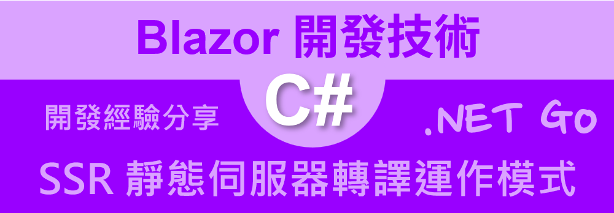
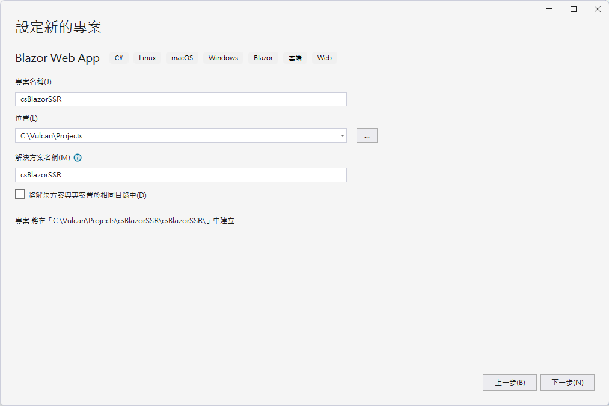
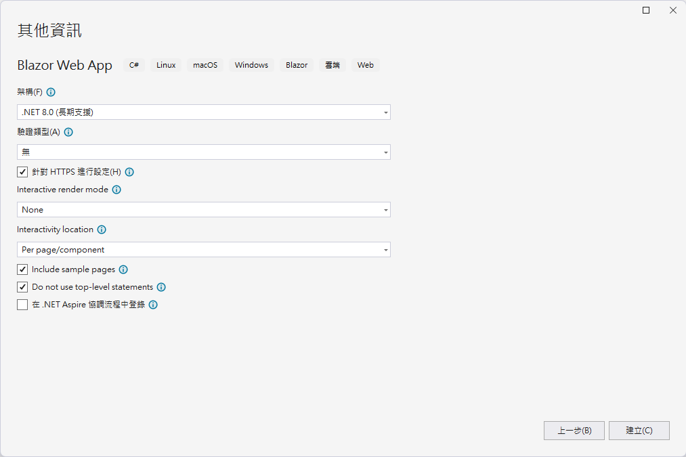

# .NET 8 Blazor 001 - 了解 SSR Static Server Render 運作模式



在 2023 年底，微軟正式推出 .NET 8 平台，對於 Blazor 這個 UI 開發框架，有著許多重大變化，其中最為重要的就是關於 Render 渲染(或稱為 轉譯)模式的運作機制，在微軟官方的文件中，將會有這樣的定義 :

> 轉譯一詞意指產生瀏覽器所顯示的 HTML 標記。

在 Blazor 中，轉譯是指將組件樹狀結構轉換為 HTML 標記。在 .NET 8 之前的版本，將會提供這兩種轉譯模式：伺服器端轉譯和客戶端轉譯。用戶端轉譯 (CSR) 意指最終的 HTML 標記由用戶端上的 Blazor WebAssembly 執行階段產生。伺服器端轉譯 (SSR) 意指最終的 HTML 標記由伺服器上的 ASP.NET Core 執行階段所產生。

在 .NET 8 中，Blazor 支援了一種新的運作模式，這個新的運作模式稱為 SSR (Static Server Render) 靜態伺服器渲染模式，這個模式將會讓 Blazor 應用程式在伺服器端進行渲染，然後再將渲染結果傳送給客戶端，這樣可以讓 Blazor 應用程式在客戶端的效能得到提升。

這裡總結 .NET 8 Blazor 支援的轉譯

* 靜態伺服器 

  靜態伺服器端轉譯 Static Server-Side Render (SSR)
  
  轉譯位置：伺服器
* 互動式伺服器	

  使用 Blazor Server 的互動式伺服器端轉譯 Interactive server-side rendering (interactive SSR) 。	
  
  轉譯位置：伺服器
* 互動式 WebAssembly

  使用 Blazor WebAssembly 的用戶端轉譯 Interactive WebAssembly , Client-side rendering (CSR)。	
  
  轉譯位置：Client
* 互動式自動	Interactive Auto

  一開始使用 Blazor Server 進行互動式 SSR，然後在下載 Blazor 套件組合之後，於後續造訪時使用 CSR。
  
  轉譯位置：伺服器，然後用戶端	

要如何充分應用與善用這樣的架構，將會是未來 Blazor 開發者需要思考的議題。因此，了解到各種轉譯模式的運作原理，將會有助於未來 Blazor 開發者在開發 Blazor 應用程式時，能夠更加靈活的運用這些技術。

在這篇文章中，將會介紹如何在 .NET 8 Blazor 應用程式中，使用 SSR 靜態伺服器渲染模式，這是一種採用讓 Blazor 應用程式在伺服器端進行渲染，然後再將渲染結果傳送給客戶端。

這一系列的文章，將會採用 Visual Studio 17.10.1 IDE 作為開發工具，並且使用 .NET 8 作為開發平台。

## 建立測試專案

請依照底下的操作，建立起這篇文章需要用到的練習專案

* 打開 Visual Studio 2022 IDE 應用程式
* 從 [Visual Studio 2022] 對話窗中，點選右下方的 [建立新的專案] 按鈕
* 在 [建立新專案] 對話窗右半部
  * 切換 [所有語言 (L)] 下拉選單控制項為 [C#]
  * 切換 [所有專案類型 (T)] 下拉選單控制項為 [Web]
* 在中間的專案範本清單中，找到並且點選 [Blazor Web App] 專案範本選項
  > A project template for creating a Blazor Web app that support both server-side rending and client interactivity. This template can be used for web apps with rich dynamic user interfaces (UIs)
* 點選右下角的 [下一步] 按鈕
* 在 [設定新的專案] 對話窗
* 找到 [專案名稱] 欄位，輸入 `csBlazorSSR` 作為專案名稱
* 在剛剛輸入的 [專案名稱] 欄位下方，確認沒有勾選 [將解決方案與專案至於相同目錄中] 這個檢查盒控制項



* 點選右下角的 [下一步] 按鈕
* 現在將會看到 [其他資訊] 對話窗
* 在 [架構] 欄位中，請選擇最新的開發框架，這裡選擇的 [架構] 是 : `.NET 8.0 (長期支援)`
* 在 [驗證類型] 欄位中，請選擇 [無] 
* 勾選 [針對 HTTPS 進行設定] 檢查盒欄位 
* 在 [Interactive render mode] 欄位中，請選擇 [None] 
* 在 [Interactivity location] 欄位中，請選擇 [Per pages/component] 
* 勾選 [Include sample pages] 檢查盒欄位 
* 勾選 [Do not use top-level statements] 檢查盒欄位 
  > 這裡的這個操作，可以由讀者自行決定是否要勾選這個檢查盒控制項
* 不要勾選 [在 .NET Aspire 協調流程中登入] 檢查盒欄位 



* 請點選右下角的 [建立] 按鈕

稍微等候一下，這個 Blazor Web App 專案將會建立完成

## Program.cs

現在依序從程式進入點的 `Program.cs` 檔案中，了解到關於 Blazor SSR 的設定方式

在專案的根目錄下，找到 `Program.cs` 檔案，並且打開這個檔案，這個檔案的內容如下

```csharp
var builder = WebApplication.CreateBuilder(args);

// Add services to the container.
builder.Services.AddRazorComponents();

var app = builder.Build();

// Configure the HTTP request pipeline.
if (!app.Environment.IsDevelopment())
{
    app.UseExceptionHandler("/Error");
    // The default HSTS value is 30 days. You may want to change this for production scenarios, see https://aka.ms/aspnetcore-hsts.
    app.UseHsts();
}

app.UseHttpsRedirection();

app.UseStaticFiles();
app.UseAntiforgery();

app.MapRazorComponents<App>();

app.Run();
```

對於 WebApplication.CreateBuilder 這個方法，將會回傳一個 WebApplicationBuilder 物件，這個物件將會用來設定應用程式的服務和中介軟體 (管線和路由)。

在上述程式碼中，使用了 `builder.Services.AddRazorComponents();` 這個方法，這個方法將會將 Razor 元件 ( 副檔案名稱為 .razor ) 服務加入到容器中，這個服務將會用來支援 Razor 元件的渲染。

這個 builder.Build() 方法將會 Build 出一個 WebApplication 物件，這個物件將會用來設定應用程式的 HTTP 請求管線。

在最後第二行程式碼中，使用了 `app.MapRazorComponents<App>();` 這個方法，這個方法將會將 App 元件 (App.razor) 指定為預設根元件 (載入的第一個元件)。

最後的 `app.Run();` 方法將會啟動這個 Blazor 應用程式。此時，這個 Web 專案將會啟動起來。


