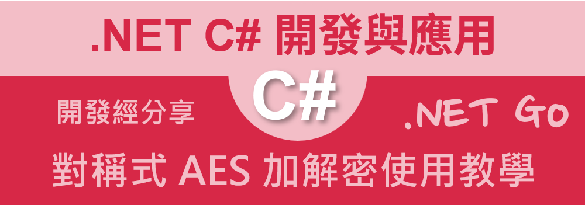

# .NET 8 / C# 對稱式 AES 加解密使用教學



為了要能夠保護資料的安全，我們可以透過資料加密與解密的演算法來進需要受到保護的資料，進行加密處理，進而產生出雜亂與毫無規章的序列資料，當想要把這些一經加密的資料還原回來的時候，此時，便可以應用解密演算法來將這些毫無頭緒的內容，重新還原成為原來的明碼，這就是資料加解密的應用情境。

一旦資料經過加密處理之後，將會產出與原來明碼 plantext 毫無關係的內容，這樣的加密內容，即使被不法之徒取得，也無法直接獲得原始資料的內容，這樣的加密方式，可以有效的保護資料的安全性。

一般來說，現今對於資料加解密的演算法，可以分為對稱式加密與非對稱式加密兩種，對稱式加密是指加密與解密使用相同的金鑰，而非對稱式加密則是指加密與解密使用不同的金鑰，對於對稱式加密演算法來說，加密與解密的速度會比非對稱式加密快上許多，因此在實際應用上，對稱式加密演算法會比較常被使用。

在對稱式加密演算法中，AES 是一種常見的加密演算法，AES 是一種區段式的加密演算法，透過將資料分割成固定長度的區段，再進行加密處理，這樣的加密方式，可以有效的保護資料的安全性。

在這篇文章中，將會介紹如何使用 C# 來進行 AES 加解密的操作，透過這篇文章的學習，讀者將可以學會如何使用 C# 來進行 AES 加解密的操作。

## 建立測試專案

請依照底下的操作，建立起這篇文章需要用到的練習專案

* 打開 Visual Studio 2022 IDE 應用程式
* 從 [Visual Studio 2022] 對話窗中，點選右下方的 [建立新的專案] 按鈕
* 在 [建立新專案] 對話窗右半部
  * 切換 [所有語言 (L)] 下拉選單控制項為 [C#]
  * 切換 [所有專案類型 (T)] 下拉選單控制項為 [服務]
* 在中間的專案範本清單中，找到並且點選 [背景工作服務] 專案範本選項
  > 用於建立 Worker Service 的空白專案範本
* 點選右下角的 [下一步] 按鈕
* 在 [設定新的專案] 對話窗
* 找到 [專案名稱] 欄位，輸入 `csSymmetricEncryption` 作為專案名稱
* 在剛剛輸入的 [專案名稱] 欄位下方，確認沒有勾選 [將解決方案與專案至於相同目錄中] 這個檢查盒控制項
* 點選右下角的 [下一步] 按鈕
* 現在將會看到 [其他資訊] 對話窗
* 在 [架構] 欄位中，請選擇最新的開發框架，這裡選擇的 [架構] 是 : `.NET 8.0 (長期支援)`
* 在這個練習中，需要去勾選 [不要使用最上層陳述式(T)] 這個檢查盒控制項
  > 這裡的這個操作，可以由讀者自行決定是否要勾選這個檢查盒控制項
* 請點選右下角的 [建立] 按鈕

稍微等候一下，這個 背景工作服務 專案將會建立完成

## 修改 Program.cs 類別內容

在這篇文章中，將會把會用到的新類別與程式碼，都寫入到 [Program.cs] 這個檔案中，請依照底下的操作，修改 [Program.cs] 這個檔案的內容

* 在專案中找到並且打開 [Program.cs] 檔案
* 將底下的程式碼取代掉 `Program.cs` 檔案中內容

```csharp
using System.Security.Cryptography;
using System.Text;

namespace csSymmetricEncryption;

internal class Program
{
    static void Main(string[] args)
    {
        SymmetricEncryption JimBobConversion = new SymmetricEncryption();
        Console.WriteLine($"此次使用的加解密金鑰 : {JimBobConversion.Key}");
        string plainText = "Hello, World!";
        Console.WriteLine($"Jim 準備要送出的未加密明碼文字 : {plainText}");
        string cipherText = JimBobConversion.Encrypt(plainText);
        Console.WriteLine($"Jim 加密後的密文文字 : {cipherText}");
        string decryptedText = JimBobConversion.Decrypt(cipherText);
        Console.WriteLine($"Bob 解密後的明碼文字 : {decryptedText}");
        Console.WriteLine(); Console.WriteLine();

        plainText = "What happened to you?  你怎麼了? 123";
        Console.WriteLine($"Jim 準備要送出的未加密明碼文字 : {plainText}");
        cipherText = JimBobConversion.Encrypt(plainText);
        Console.WriteLine($"Jim 加密後的密文文字 : {cipherText}");
        decryptedText = JimBobConversion.Decrypt(cipherText);
        Console.WriteLine($"Helen 解密後的明碼文字 : {decryptedText}");
        Console.WriteLine(); Console.WriteLine();

        SymmetricEncryption JimBobNewConversion = 
            new SymmetricEncryption("這裡指定需要使用的加解密金鑰 Key。代表抽象基底類別，進階加密標準 (AES) 的所有實作都必須從它繼承。");
        Console.WriteLine($"此次使用的加解密金鑰 : {JimBobNewConversion.Key}");
        plainText = "Hello, World!";
        Console.WriteLine($"Jim 準備要送出的未加密明碼文字 : {plainText}");
        cipherText = JimBobNewConversion.Encrypt(plainText);
        Console.WriteLine($"Jim 加密後的密文文字 : {cipherText}");
        decryptedText = JimBobNewConversion.Decrypt(cipherText);
        Console.WriteLine($"Bob 解密後的明碼文字 : {decryptedText}");
        Console.WriteLine(); Console.WriteLine();

    }
}

class SymmetricEncryption
{
    public SymmetricEncryption()
    {
        using (Aes aesAlgorithm = Aes.Create())
        {
            aesAlgorithm.KeySize = 256;
            aesAlgorithm.GenerateKey();
            this.Key = Convert.ToBase64String(aesAlgorithm.Key);
        }
    }

    public SymmetricEncryption(string key)
    {
        byte[] sourceBytes = Encoding.UTF8.GetBytes(key).ToArray().Take(32).ToArray();
        this.Key = Convert.ToBase64String(sourceBytes);
    }

    public string Key { get; set; } = "";

    public string Encrypt(string plainText)
    {
        byte[] iv; 
        using (Aes aes = Aes.Create())
        {
            aes.Key = Convert.FromBase64String(Key);
            aes.GenerateIV();
            iv = aes.IV; 

            using (MemoryStream memoryStream = new MemoryStream())
            {
                using (CryptoStream cryptoStream =
                    new CryptoStream(memoryStream, aes.CreateEncryptor(), CryptoStreamMode.Write))
                {
                    using (StreamWriter streamWriter = new StreamWriter(cryptoStream))
                    {
                        streamWriter.Write(plainText);
                    }
                }

                byte[] encryptedBytes = memoryStream.ToArray();
                byte[] result = new byte[iv.Length + encryptedBytes.Length];
                Buffer.BlockCopy(iv, 0, result, 0, iv.Length);
                Buffer.BlockCopy(encryptedBytes, 0, result, iv.Length, encryptedBytes.Length);

                return Convert.ToBase64String(result);
            }
        }
    }

    public string Decrypt(string cipherText)
    {
        byte[] fullCipher = Convert.FromBase64String(cipherText);

        using (Aes aes = Aes.Create())
        {
            aes.Key = Convert.FromBase64String(Key);

            byte[] iv = new byte[aes.IV.Length];
            byte[] cipher = new byte[fullCipher.Length - iv.Length];

            Buffer.BlockCopy(fullCipher, 0, iv, 0, iv.Length);
            Buffer.BlockCopy(fullCipher, iv.Length, cipher, 0, cipher.Length);

            aes.IV = iv;

            using (MemoryStream memoryStream = new MemoryStream(cipher))
            {
                using (CryptoStream cryptoStream =
                    new CryptoStream(memoryStream, aes.CreateDecryptor(), CryptoStreamMode.Read))
                {
                    using (StreamReader streamReader = new StreamReader(cryptoStream))
                    {
                        return streamReader.ReadToEnd();
                    }
                }
            }
        }
    }
}
```

在這個原始碼中，將會建立一個用於對稱式加解密的類別 `SymmetricEncryption`，這個類別中，包含了兩個建構式，分別用來產生隨機的加解密金鑰，以及指定使用者自訂的加解密金鑰，透過這個類別，可以進行對稱式加解密的操作。

在建構式中，需要指定金鑰的長度，這裡使用的是 256 位元的金鑰，透過這樣的金鑰長度，可以提高資料的安全性，接著透過 `GenerateKey` 方法，來產生隨機的金鑰，並且將金鑰轉換成 Base64 字串，這樣的方式，可以讓金鑰的內容更容易被處理。而對於指定金鑰的建構式，則是將使用者指定的金鑰，透過 UTF8 編碼轉換成位元組陣列，並且取出前 32 個位元組 (32位元組 = 256 位元) ，再將這些位元組轉換成 Base64 字串，這樣的方式，可以讓使用者自訂的金鑰，可以被正確的處理。

由於 AES 加解密演算法是一種區段式的加解密演算法，因此在這個類別中，會將資料分割成固定長度的區段，再進行加解密的操作，透過這樣的方式，可以有效的保護資料的安全性。

不論使用哪種方式來產生金鑰，都會將金鑰存放在 `Key` 屬性中，這樣的方式，可以讓其他的方法可以存取到這個金鑰。有了這把金鑰，就可以對明碼文字進行加解密的操作，並且使用同樣的金鑰來對已經加密過後的內容，進行解密。

在這個類別內，將會有兩個方法，分別是 [Encrypt] 與 [Decrypt] 方法，這兩個方法分別用來對明碼文字進行加密與對密文文字進行解密的操作，透過這兩個方法，可以對資料進行加解密的操作。

透過 [Encrypt] 方法，可以將明碼文字進行加密，這個方法中，將會得到一個明碼字串，接著將會透過 [Aes.Create()] 方法來建立一個型別為 [AES] 的物件，將建構式內自動生成或者指定的 Key，設定到這個 AES 物件內，然後，透過 [GenerateIV()] 方法來產生一個隨機的初始化向量 (IV)，這個初始化向量是用來增加加密的安全性，接著透過 `CreateEncryptor` 方法，來產生加密器，透過這個加密器，可以將明碼文字進行加密，最後將初始化向量與加密後的位元組陣列結合在一起，並且將這些位元組陣列轉換成 Base64 字串，這樣的方式，可以讓加密後的資料更容易被處理。

對於 [Decrypt] 方法，則是將會對密文文字進行解密，這個方法中，將會得到一個密文字串，這個字串是採用 Base64 編碼而成的，接著將會透過 `Convert.FromBase64String` 方法，將這個密文字串轉換成位元組陣列，這樣的方式，可以讓密文文字更容易被處理，接著透過 `CreateDecryptor` 方法，來產生解密器，透過這個解密器，可以將密文文字進行解密，最後將解密後的位元組陣列轉換成明碼文字，這樣的方式，可以讓解密後的資料更容易被處理。

在程式進入點 [Main] 方法中，將會建立一個 [SymmetricEncryption] 類別的物件，透過這個物件，可以進行對稱式加解密的操作，透過這個物件，可以對明碼文字進行加密，並且對密文文字進行解密，透過這樣的方式，可以保護資料的安全性。

首先，將會採用 AES 物件內的 [GenerateKey()] 方法，來產生一個隨機的金鑰，接著將這個金鑰顯示在螢幕上。對於 Jim 與 Bob 之間的對話，將會使用者這裡生成的金鑰，來進行加解密的操作，把 Jim 要對 Bob 對話的內容，也就是 [Hello World] 內容，進行加密並取得加密後的 Base64 編碼內容；一旦 Bob 收到這個加密後的 Base64 編碼內容，就可以呼叫 [SymmetricEncryption.Decrypt] 方法，進行解密，取得原來的明碼字串內容；透過這樣的方式，可以保護資料的安全性。

接下來，透過同樣的程序，將 "What happened to you?  你怎麼了? 123" 這個字串進行加解密的操作，這裡要進行測試，除了對文字之外的內容，若有加入中文字、數字等，也可以正確的進行加解密的操作。

最後，建立一個 [SymmetricEncryption] 類別的物件，並且指定一個自訂的金鑰，透過這個物件，可以進行對明碼文字進行加密，並且對密文文字進行解密，透過這樣的方式，可以保護資料的安全性。

## 執行程式
* 在 Visual Studio 2022 IDE 中，按下 `F5` 鍵，或者是在功能表中選擇 [除錯] -> [開始偵錯]，來執行這個程式
* 程式執行後，將會在輸出視窗中，看到這個程式的執行結果

執行結果如下：

```
此次使用的加解密金鑰 : hrq+qGDFRFIEXjeHyYNzV2dkA4lys1TcgP/1qnAj0p0=
Jim 準備要送出的未加密明碼文字 : Hello, World!
Jim 加密後的密文文字 : lmMZK7B82Tr8pMgomj6Hbcm2wA2wN+Bl/Ho5qZyApX0=
Bob 解密後的明碼文字 : Hello, World!


Jim 準備要送出的未加密明碼文字 : What happened to you?  你怎麼了? 123
Jim 加密後的密文文字 : P8BP8ZN0gpwONBI+HK2dyADpme9nANQxQYcKDOX5HNErDWf9fjmYX9PvHLs3TMJRKA95fCvXz1369SimKoa5hQ==
Helen 解密後的明碼文字 : What happened to you?  你怎麼了? 123


此次使用的加解密金鑰 : 6YCZ6KOh5oyH5a6a6ZyA6KaB5L2/55So55qE5Yqg6Kc=
Jim 準備要送出的未加密明碼文字 : Hello, World!
Jim 加密後的密文文字 : wd0OCp/OnChALBKebm/RH5UhQLa2O82bS9Lra79O7D0=
Bob 解密後的明碼文字 : Hello, World!
```

