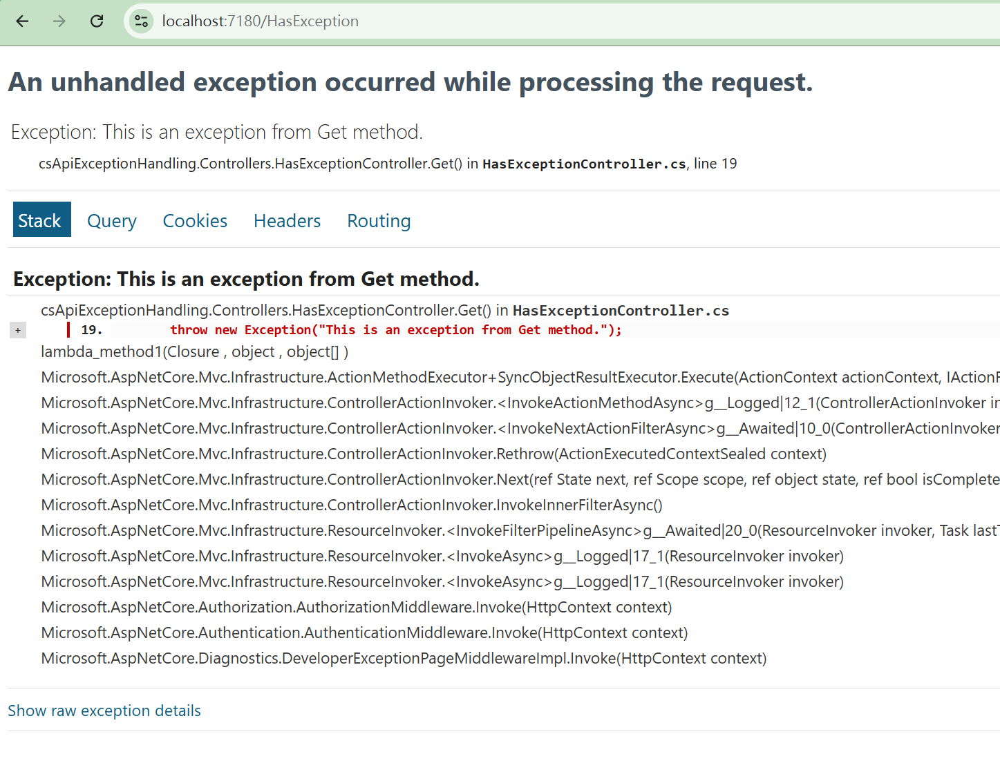

# 在 ASP.NET Core 處理全域例外的 Middleware


當採用 ASP.NET Core 來設計一個 Web API 時，若執行過程符合程式設計條件，將會依照設計邏輯，顯示出預期內容。

然而，當設計上發生問題，或者執行上遇到不可預期的狀況，此時，專案將會拋出例外異常，若該例外異常沒有其他程式碼中捕捉，將會導致程式停止執行，並且回應一個例外異常的訊息給客戶端。

我們可以透過 Middleware 來處理全域例外，這樣的設計可以讓我們在 API 發生例外異常時，可以透過 Middleware 來處理這些例外異常，並且回應一個包含例外詳細資訊的 JSON 物件，這樣的設計可以讓開發人員更容易的了解 API 的執行狀況。

## 建立測試專案

請依照底下的操作，建立起這篇文章需要用到的練習專案

* 打開 Visual Studio 2022 IDE 應用程式
* 從 [Visual Studio 2022] 對話窗中，點選右下方的 [建立新的專案] 按鈕
* 在 [建立新專案] 對話窗右半部
  * 切換 [所有語言 (L)] 下拉選單控制項為 [C#]
  * 切換 [所有專案類型 (T)] 下拉選單控制項為 [Web API]
* 在中間的專案範本清單中，找到並且點選 [ASP.NET Core Web API] 專案範本選項
  > 此專案範本可用於 ASP.NET Core 控制器或最小 API 建立 RESTful Web API，並可選擇性支援 OpenAPI 和驗證
* 點選右下角的 [下一步] 按鈕
* 在 [設定新的專案] 對話窗
* 找到 [專案名稱] 欄位，輸入 `csApiExceptionHandling` 作為專案名稱
* 在剛剛輸入的 [專案名稱] 欄位下方，確認沒有勾選 [將解決方案與專案至於相同目錄中] 這個檢查盒控制項
* 點選右下角的 [下一步] 按鈕
* 現在將會看到 [其他資訊] 對話窗
* 在 [架構] 欄位中，請選擇最新的開發框架，這裡選擇的 [架構] 是 : `.NET 9.0 (標準字詞支援)`
* 在 [驗證類型] 選擇無
* 在這個練習中，需要去勾選 [不要使用最上層陳述式(T)] 這個檢查盒控制項
  > 這裡的這個操作，可以由讀者自行決定是否要勾選這個檢查盒控制項
* 請點選右下角的 [建立] 按鈕

稍微等候一下，這個專案將會建立完成

## 建立 APIResult 類別

在這篇文章中，我們將會建立一個自訂的 APIResult 類別，這個類別將會用來回應 API 的結果，請依照底下的操作，建立 APIResult 類別

* 滑鼠右擊專案名稱 `csApiExceptionHandling`
* 從右鍵選單中，選擇 [新增] -> [類別]
* 在 [新增項目] 對話窗中
  * 在 [名稱] 欄位中，輸入 `APIResult`
  * 在 [類型] 欄位中，請選擇 [類別]
  * 請點選 [新增] 按鈕

當這個 APIResult 類別建立之後，請將底下的程式碼取代掉 `APIResult.cs` 檔案中的內容

```csharp
namespace csApiExceptionHandling;

public class APIResult
{
    public bool Success { get; set; }
    public string Message { get; set; }
    public object Data { get; set; }
    public ExceptionDetail Exception { get; set; }
}

public class ExceptionDetail
{
    public string Type { get; set; }
    public string Message { get; set; }
    public string StackTrace { get; set; }
}
```

在這個 APIResult 類別中，我們定義了四個屬性，分別是 `Success`、`Message`、`Data` 與 `Exception`，這些屬性將會用來回應 API 的結果，其中 `Exception` 屬性是用來回應例外的詳細資訊，這樣的設計可以讓我們在 API 回應時，可以同時回應例外的詳細資訊，這樣的設計可以讓開發人員更容易的了解 API 的執行狀況。

## 建立 ExceptionHandlingMiddleware 類別

在這篇文章中，我們將會建立一個自訂的 ExceptionHandlingMiddleware 類別，這個類別將會用來處理全域例外，請依照底下的操作，建立 ExceptionHandlingMiddleware 類別

* 滑鼠右擊專案名稱 `csApiExceptionHandling`
* 從右鍵選單中，選擇 [新增] -> [類別]
* 在 [新增項目] 對話窗中
  * 在 [名稱] 欄位中，輸入 `ExceptionHandlingMiddleware`
  * 在 [類型] 欄位中，請選擇 [類別]
  * 請點選 [新增] 按鈕

當這個 ExceptionHandlingMiddleware 類別建立之後，請將底下的程式碼取代掉 `ExceptionHandlingMiddleware.cs` 檔案中的內容

```csharp
using System.Net;
using System.Text.Json;

namespace csApiExceptionHandling;

public class ExceptionHandlingMiddleware
{
    private readonly RequestDelegate _next;
    private readonly ILogger<ExceptionHandlingMiddleware> _logger;

    public ExceptionHandlingMiddleware(RequestDelegate next, ILogger<ExceptionHandlingMiddleware> logger)
    {
        _next = next;
        _logger = logger;
    }

    public async Task InvokeAsync(HttpContext context)
    {
        try
        {
            await _next(context);
        }
        catch (Exception ex)
        {
            _logger.LogError(ex, "An unhandled exception occurred.");
            await HandleExceptionAsync(context, ex);
        }
    }

    private static async Task HandleExceptionAsync(HttpContext context, Exception exception)
    {
        context.Response.ContentType = "application/json";
        context.Response.StatusCode = (int)HttpStatusCode.InternalServerError;

        var result = new APIResult
        {
            Success = false,
            Message = "An error occurred while processing your request.",
            Exception = new ExceptionDetail
            {
                Type = exception.GetType().Name,
                Message = exception.Message,
                StackTrace = exception.StackTrace
            }
        };

        var json = JsonSerializer.Serialize(result, new JsonSerializerOptions
        {
            PropertyNamingPolicy = JsonNamingPolicy.CamelCase,
            WriteIndented = true
        });

        await context.Response.WriteAsync(json);
    }
}

// Extension method to easily add the middleware to the pipeline
public static class ExceptionHandlingMiddlewareExtensions
{
    public static IApplicationBuilder UseExceptionHandling(
        this IApplicationBuilder builder)
    {
        return builder.UseMiddleware<ExceptionHandlingMiddleware>();
    }
}
```

對於這個 Middleware 類別:ExceptionHandlingMiddleware，我們定義了一個 `InvokeAsync` 方法，在這個方法內，將會呼叫 `await _next(context);` 這個敘述，用於將請求傳遞到下一個 Middleware 管道；一旦接下來的 Middleware 管道中有不可預期的例外異常拋出，將會被 `try{...} catch {...}` 敘述捕捉起來，此時，將會呼叫 `await HandleExceptionAsync(context, ex);`，當然，同時也會此次的例外異常寫入到日誌內。。

在這個方法 [HandleExceptionAsync] 是用來處理全域例外，當例外發生時，這個方法將會回應一個包含例外詳細資訊的 JSON 物件，這樣的設計可以讓開發人員更容易的了解 API 的執行狀況。

其做法為使用 `context.Response.ContentType = "application/json";` 將回應的 [ContentType] 設定為 json 物件，並且使用這個敘述 `context.Response.StatusCode = (int)HttpStatusCode.InternalServerError;` 宣告 HTTP 狀態碼為 500，表示伺服器端發生錯誤。

接下來將會建立一個 APIResult 物件，這個物件將會包含例外的詳細資訊，並且將這個物件序列化為 JSON 字串，最後透過 `context.Response.WriteAsync(json);` 將這個 JSON 字串回應給客戶端。

現在可以來建立一個會拋出例外異常的 API，該 API 故意不去捕捉該例外異常，這樣就可以讓 ExceptionHandlingMiddleware 類別去處理這個例外異常。

在這個類別中，也建立一個擴充方法 Extension Method `ExceptionHandlingMiddlewareExtensions`，這個方法將會用來將 ExceptionHandlingMiddleware 類別註冊到 Middleware 管道中。

## 建立 拋出例外異常的 API 控制器

* 滑鼠右擊專案名稱 `csApiExceptionHandling` > [Controllers] 資料夾
* 從右鍵選單中，選擇 [新增] -> [類別]
* 在 [新增項目] 對話窗中
  * 在 [名稱] 欄位中，輸入 `HasExceptionController`
  * 在 [類型] 欄位中，請選擇 [類別]
  * 請點選 [新增] 按鈕

當這個 HasExceptionController 類別建立之後，請將底下的程式碼取代掉 `HasExceptionController.cs` 檔案中的內容

```csharp
using Microsoft.AspNetCore.Mvc;

namespace csApiExceptionHandling.Controllers;

[ApiController]
[Route("[controller]")]
public class HasExceptionController : ControllerBase
{
    private readonly ILogger<HasExceptionController> _logger;

    public HasExceptionController(ILogger<HasExceptionController> logger)
    {
        _logger = logger;
    }

    [HttpGet]
    public string Get()
    {
        throw new Exception("This is an exception from Get method.");
        return null;
    }
}
```

在這個 HasExceptionController 控制器中，我們定義了一個 `Get` 方法，這個方法將會拋出一個例外異常，這樣的設計可以讓我們在呼叫這個 API 時，可以觸發 ExceptionHandlingMiddleware 類別去處理這個例外異常。

## 註冊 ExceptionHandlingMiddleware 到 Middleware 管道

在這個步驟中，我們將會註冊 ExceptionHandlingMiddleware 到 Middleware 管道中，請依照底下的操作，註冊 ExceptionHandlingMiddleware 到 Middleware 管道中

* 打開 `Program.cs` 檔案
* 找到 `var app = builder.Build();` 這一行程式碼
* 在這一行程式碼的上方，加入底下的程式碼

```csharp
app.UseExceptionHandling();
```

## 測試 API

* 在 Visual Studio 2022 IDE 中，按下 `F5` 鍵，或者是在功能表中選擇 [除錯] -> [開始偵錯]，來執行這個程式
* 開啟瀏覽器，輸入這個服務端點 `https://localhost:7180/WeatherForecast/`，按下 `Enter` 鍵
* 將會看到一個正常回應的 API 的回傳結果


        
* 現在，請嘗試呼叫這個服務端點 `https://localhost:7180/HasException`，按下 `Enter` 鍵
* 將會看到一個例外異常的回應結果，這個回應結果將會包含例外的詳細資訊


透過這個範例，我們可以看到 ExceptionHandlingMiddleware 類別是如何處理全域例外異常，並且回應一個包含例外詳細資訊的 JSON 物件，這樣的設計可以讓開發人員更容易的了解 API 的執行狀況。

若沒有做這樣的設計，而去呼叫 這個服務端點 `https://localhost:7180/HasException`，將會看到一個例外異常的回應結果



這樣將會產生一個問題，Client 無法正常解析這次的回應內容，也就無法流暢的處理相關作業。


