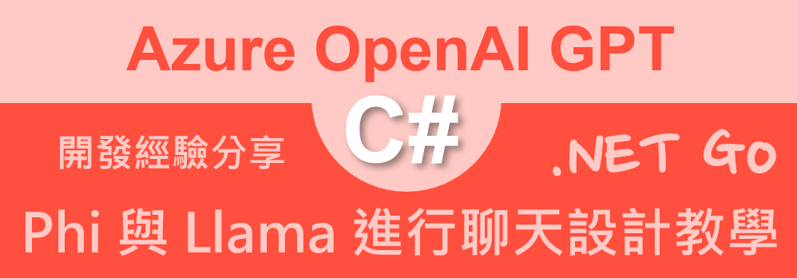

# Azure OpenAI AOAI 2.0 : 12 使用 Phi-3.5-vision 與 Meta-Llama-3-1-70B 進行聊天設計教學



## 建立測試專案

請依照底下的操作，建立起這篇文章需要用到的練習專案

* 打開 Visual Studio 2022 IDE 應用程式
* 從 [Visual Studio 2022] 對話窗中，點選右下方的 [建立新的專案] 按鈕
* 在 [建立新專案] 對話窗右半部
  * 切換 [所有語言 (L)] 下拉選單控制項為 [C#]
  * 切換 [所有專案類型 (T)] 下拉選單控制項為 [主控台]
* 在中間的專案範本清單中，找到並且點選 [主控台應用程式] 專案範本選項
  > 專案，用於建立可在 Windows、Linux 及 macOS 於 .NET 執行的命令列應用程式
* 點選右下角的 [下一步] 按鈕
* 在 [設定新的專案] 對話窗
* 找到 [專案名稱] 欄位，輸入 `csInference` 作為專案名稱
* 在剛剛輸入的 [專案名稱] 欄位下方，確認沒有勾選 [將解決方案與專案至於相同目錄中] 這個檢查盒控制項
* 點選右下角的 [下一步] 按鈕
* 現在將會看到 [其他資訊] 對話窗
* 在 [架構] 欄位中，請選擇最新的開發框架，這裡選擇的 [架構] 是 : `.NET 8.0 (長期支援)`
* 在這個練習中，需要去勾選 [不要使用最上層陳述式(T)] 這個檢查盒控制項
  > 這裡的這個操作，可以由讀者自行決定是否要勾選這個檢查盒控制項
* 請點選右下角的 [建立] 按鈕

稍微等候一下，這個 背景工作服務 專案將會建立完成

## 安裝要用到的 NuGet 開發套件

因為開發此專案時會用到這些 NuGet 套件，請依照底下說明，將需要用到的 NuGet 套件安裝起來。

### 安裝 Azure.AI.Inference 套件

請依照底下說明操作步驟，將這個套件安裝到專案內

* 滑鼠右擊 [方案總管] 視窗內的 [專案節點] 下方的 [相依性] 節點
* 從彈出功能表清單中，點選 [管理 NuGet 套件] 這個功能選項清單
* 此時，將會看到 [NuGet: csInference] 視窗
* 切換此視窗的標籤頁次到名稱為 [瀏覽] 這個標籤頁次
* 在左上方找到一個搜尋文字輸入盒，在此輸入 `Azure.AI.Inference`
  > 與使用 Azure OpenAI 用安裝 Azure.AI.OpenAI 套件不同，這裡需要安裝 Azure.AI.Inference 這個套件
* 在視窗右方，將會看到該套件詳細說明的內容，其中，右上方有的 [安裝] 按鈕
  > 請確認有取消 Pre-release 這個選項，與選擇 2.0 正式版
* 點選這個 [安裝] 按鈕，將這個套件安裝到專案內

## 修改 Program.cs 類別內容

在這篇文章中，將會把會用到的新類別與程式碼，都寫入到 [Program.cs] 這個檔案中，請依照底下的操作，修改 [Program.cs] 這個檔案的內容

* 在專案中找到並且打開 [Program.cs] 檔案
* 將底下的程式碼取代掉 `Program.cs` 檔案中內容

```csharp
using Azure.AI.Inference;
using Azure;
using System.ClientModel.Primitives;

namespace csInference
{
    internal class Program
    {
        static void Main(string[] args)
        {
            string apiKeyAzureLlama3170B = System.Environment.GetEnvironmentVariable("AzureLlama3170B");
            string apiKeyAzurePhi35Vision = System.Environment.GetEnvironmentVariable("AzurePhi35Vision");
            Console.WriteLine($"與 Meta 的 Llama LLM 聊天");
            Chart("https://Meta-Llama-3-1-70B-Instruct-wcwg.eastus2.models.ai.azure.com",
                 apiKeyAzureLlama3170B);
            Console.WriteLine($"與 Microsoft 的 Phi LLM 聊天");
            Chart("https://Phi-3-5-vision-instruct-havbt.eastus2.models.ai.azure.com",
                apiKeyAzurePhi35Vision);
        }

        private static void Chart(string endpoint, string key)
        {
            ChatCompletionsClient client = new ChatCompletionsClient(
                new Uri(endpoint),
                new AzureKeyCredential(key)
            );

            var requestOptions = new ChatCompletionsOptions()
            {
                Messages = {
        new ChatRequestUserMessage("'''就醫時間為 2020-2022 年之間，具有糖尿病診斷且為門診就醫的搜尋條件'''") ,
        new ChatRequestUserMessage("請將上述需求，使用底下 JSON 格式來表達，只需要生成 JSON，不需要其他說明") ,
        new ChatRequestUserMessage("{\r\n  // 醫療紀錄搜尋條件\r\n  \"BaseCondition\": {\r\n    \"BeginDate\": \"\", // 就醫紀錄搜尋開始時間\r\n    \"EndDate\": \"\",  // 就醫紀錄搜尋結束時間\r\n    \"Department\": \"\",      // 就醫紀錄搜尋科別 內科,心臟科\r\n    \"RecordType\": \"\"       // 就醫紀錄搜尋類型 門診,急診,住院\r\n  }\r\n  \"ICD10\": [] // ICD10疾病碼 搜尋條件\r\n  \"Medicine\": [] // 藥品名稱 搜尋條件\r\n}") },
                AdditionalProperties = { { "logprobs", BinaryData.FromString("false") } },
            };

            var response = client.Complete(requestOptions);
            Console.WriteLine($"Response:\n {response.Value.Content}");
            Console.WriteLine();
            Console.WriteLine();
            Console.WriteLine(new string('-',40));
            Console.WriteLine();
            Console.WriteLine();
        }
    }
}
```

在程式一開始啟動時，會使用 [System.Environment.GetEnvironmentVariable] 方法來讀取環境變數 `AzureLlama3170B` 與 `AzurePhi35Vision` 的值，這兩個值是 Azure Llama 3170B 與 Azure Phi 35 Vision 的 API Key

接著將會分別把這兩個 Key 傳入到 [Chart] 這個方法內，其中第一個傳入的引數將會為要使用推論用的 LLM 服務端點，第二個則是 API Key

在 [Chart] 方法內，會建立一個 [ChatCompletionsClient] 的物件，並且傳入服務端點與 API Key

接著建立一個 [ChatCompletionsOptions] 的物件，並且設定 [Messages] 屬性，這裡設定了三個 [ChatRequestUserMessage] 的物件，分別是要求生成 JSON 的需求，底下將會是原始的 Prompt 文字

```plaintext
'''就醫時間為 2020-2022 年之間，具有糖尿病診斷且為門診就醫的搜尋條件'''
請將上述需求，使用底下 JSON 格式來表達，只需要生成 JSON，不需要其他說明
{
  // 醫療紀錄搜尋條件
  "BaseCondition": {
    "BeginDate": "", // 就醫紀錄搜尋開始時間
    "EndDate": "",  // 就醫紀錄搜尋結束時間
    "Department": "",      // 就醫紀錄搜尋科別 內科,心臟科
    "RecordType": ""       // 就醫紀錄搜尋類型 門診,急診,住院
  }
  "ICD10": [] // ICD10疾病碼 搜尋條件
  "Medicine": [] // 藥品名稱 搜尋條件
}
```

最後呼叫 [client.Complete] 方法，並且傳入這個 [ChatCompletionsOptions] 的物件，這個方法將會回傳一個 [ChatCompletion] 的物件，這個物件將會包含了生成的 JSON 內容

## 執行測試專案
* 按下 `F5` 開始執行專案
* 將會看到輸出結果

```plaintext
與 Meta 的 Llama LLM 聊天
Response:
 ```
{
  "BaseCondition": {
    "BeginDate": "2020-01-01",
    "EndDate": "2022-12-31",
    "Department": "",
    "RecordType": "門診"
  },
  "ICD10": [
    {
      "Code": "E11",
      "Desc": "2型糖尿病"
    }
  ],
  "Medicine": []
}
```


----------------------------------------


與 Microsoft 的 Phi LLM 聊天
Response:

{
  "BaseCondition": {
    "BeginDate": "2020-2022", // 搜尋條件開始的時間
    "EndDate": "", // 搜尋條件結束的時間
    "Department": "門診", // 搜尋條件的科別
    "RecordType": "門診" // 搜尋條件的類型
  },
  "ICD10": [], // 搜尋條件的糖尿病碼
  "Medicine": [] // 搜尋條件的藥品名稱
}


任何其他需求，?告訴我，我會盡力幫助您。


----------------------------------------
```

這樣就完成了這個教學，這個教學將會展示如何使用 Azure.AI.Inference 來進行聊天設計，這個教學將會展示如何使用 Phi-3.5-vision 與 Meta-Llama-3-1-70B 進行聊天設計