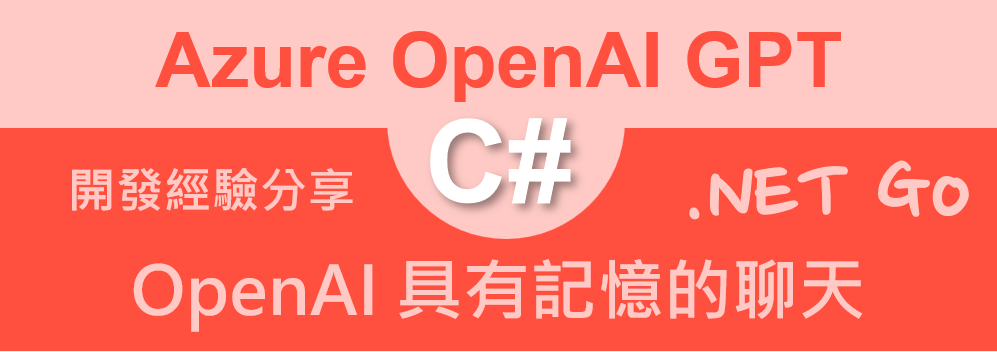

# Azure OpenAI AOAI 2.0 : 13 具有記憶的聊天



如同大家對 GPT 的認識與了解，OpenAI 的 GPT 會針對提交出來的 Prompt 透過 Transformer 的技術，生成出 Completion 的回應文字，這樣的技術可以應用在許多場景，例如：對話式應用程式、自動回覆、自動翻譯、自動摘要、自動生成程式碼等等。

然而，對於一連串的與 GPT 對話過程中，GPT 是不會知道上次提問的問題與生成內容是那些，這樣的情況下，就會需要一個具有記憶的聊天機制，這樣的機制可以讓 GPT 記住上次的對話內容，這樣的機制可以讓 GPT 生成的回應文字更加的符合上下文。

由於這不是 Azure OpenAI 內建的功能，想要具備這樣的聊天與對話的能力就需要透過程式碼的方式來實現，這樣的功能可以透過 ChatMessage 這個類別來實現，這個類別可以記錄每一次的對話內容，這樣的功能可以讓 GPT 生成的回應文字更加的符合上下文。

## 建立測試專案

請依照底下的操作，建立起這篇文章需要用到的練習專案

* 打開 Visual Studio 2022 IDE 應用程式
* 從 [Visual Studio 2022] 對話窗中，點選右下方的 [建立新的專案] 按鈕
* 在 [建立新專案] 對話窗右半部
  * 切換 [所有語言 (L)] 下拉選單控制項為 [C#]
  * 切換 [所有專案類型 (T)] 下拉選單控制項為 [主控台]
* 在中間的專案範本清單中，找到並且點選 [主控台應用程式] 專案範本選項
  > 專案，用於建立可在 Windows、Linux 及 macOS 於 .NET 執行的命令列應用程式
* 點選右下角的 [下一步] 按鈕
* 在 [設定新的專案] 對話窗
* 找到 [專案名稱] 欄位，輸入 `csAzureAIOpenAIHistory` 作為專案名稱
* 在剛剛輸入的 [專案名稱] 欄位下方，確認沒有勾選 [將解決方案與專案至於相同目錄中] 這個檢查盒控制項
* 點選右下角的 [下一步] 按鈕
* 現在將會看到 [其他資訊] 對話窗
* 在 [架構] 欄位中，請選擇最新的開發框架，這裡選擇的 [架構] 是 : `.NET 8.0 (長期支援)`
* 在這個練習中，需要去勾選 [不要使用最上層陳述式(T)] 這個檢查盒控制項
  > 這裡的這個操作，可以由讀者自行決定是否要勾選這個檢查盒控制項
* 請點選右下角的 [建立] 按鈕

稍微等候一下，這個 背景工作服務 專案將會建立完成

## 安裝要用到的 NuGet 開發套件

因為開發此專案時會用到這些 NuGet 套件，請依照底下說明，將需要用到的 NuGet 套件安裝起來。

### 安裝 Azure.AI.OpenAI 套件

請依照底下說明操作步驟，將這個套件安裝到專案內

* 滑鼠右擊 [方案總管] 視窗內的 [專案節點] 下方的 [相依性] 節點
* 從彈出功能表清單中，點選 [管理 NuGet 套件] 這個功能選項清單
* 此時，將會看到 [NuGet: csAzureAIOpenAIHistory] 視窗
* 切換此視窗的標籤頁次到名稱為 [瀏覽] 這個標籤頁次
* 在左上方找到一個搜尋文字輸入盒，在此輸入 `Azure.AI.OpenAI`
* 在視窗右方，將會看到該套件詳細說明的內容，其中，右上方有的 [安裝] 按鈕
  > 請確認有取消 Pre-release 這個選項，與選擇 2.0 正式版
* 點選這個 [安裝] 按鈕，將這個套件安裝到專案內

## 修改 Program.cs 類別內容

在這篇文章中，將會把會用到的新類別與程式碼，都寫入到 [Program.cs] 這個檔案中，請依照底下的操作，修改 [Program.cs] 這個檔案的內容

* 在專案中找到並且打開 [Program.cs] 檔案
* 將底下的程式碼取代掉 `Program.cs` 檔案中內容

```csharp
using Azure.AI.OpenAI;
using OpenAI.Chat;

namespace csAzureAIOpenAIHistory;

internal class Program
{
    static void Main(string[] args)
    {
        List<ChatMessage> history = new();
        string userPrompt = "請列出何謂 GPT 與其四個主要的特色";
        history.Add(UserChatMessage.CreateUserMessage(userPrompt));
        GptChart(history);

        userPrompt = "請列出何謂 LLM ";
        history.Add(UserChatMessage.CreateUserMessage(userPrompt));
        GptChart(history);

        userPrompt = "請列出何謂 Transformer ";
        history.Add(UserChatMessage.CreateUserMessage(userPrompt));
        GptChart(history);
    }

    private static void GptChart(List<ChatMessage> prompts)
    {
        // 讀取環境變數 AOAILabKey 的 API Key
        string apiKey = System.Environment.GetEnvironmentVariable("AOAILabKey");
        AzureOpenAIClient azureClient = new(
            new Uri("https://gpt4tw.openai.azure.com/"),
            new System.ClientModel.ApiKeyCredential(apiKey));
        ChatClient chatClient = azureClient.GetChatClient("gpt-4");

        foreach (var message in prompts)
        {
            string roleName = message is SystemChatMessage ? "System" :
                message is UserChatMessage ? "User" :
                "Assistant";
            Console.WriteLine($"{DateTime.Now}  [{roleName}]: {message.Content[0].Text}");
        }

        ChatCompletion completion = chatClient.CompleteChat(prompts);

        Console.WriteLine($"{DateTime.Now}  [Assistant]");
        foreach (var message in completion.Content)
        {
            if (message.Text != null && message.Text.Trim() != "")
            {
                Console.WriteLine($"{DateTime.Now} {message.Text}");
                prompts.Add(AssistantChatMessage.CreateAssistantMessage(message.Text));
            }
        }

        Console.WriteLine($"");
        Console.WriteLine($"Role : {completion.Role}");
        Console.WriteLine($"InputTokenCount : {completion.Usage.InputTokenCount}");
        Console.WriteLine($"OutputTokenCount : {completion.Usage.OutputTokenCount}");
        Console.WriteLine($"ReasoningTokenCount : {completion.Usage.OutputTokenDetails?.ReasoningTokenCount}");
        Console.WriteLine($"TotalTokenCount : {completion.Usage.TotalTokenCount}");
        Console.WriteLine();
        Console.WriteLine();
        Console.WriteLine(new string('-', 40));
        Console.WriteLine(new string('-', 40));
        Console.WriteLine();
        Console.WriteLine();
    }
}
```

在這支展示程式中，我們透過 [List<ChatMessage>] 這個類別，來記錄每一次的對話內容，這包含了使用者提出的 Prompt，這個內容將會使用 [UserChatMessage] 這個類別來記錄，而 Assistant 回應的內容將會使用 [AssistantChatMessage] 這個類別來記錄，這樣的設計可以讓 GPT 生成的回應文字更加的符合上下文。

在此建立了一個 history 物件，首先將會產生一個 `string userPrompt = "請列出何謂 GPT 與其四個主要的特色";` 提示文字，並且將這個 Prompt 加入到 history 物件中，接著透過 `GptChart(history);` 這個方法來進行 GPT 的對話，這樣的設計可以讓 GPT 生成的回應文字更加的符合上下文。

在 [GptChart] 方法內，首先會透過 `ChatCompletion completion = chatClient.CompleteChat(prompts);` 這個方法來進行 GPT 的對話，這樣的設計可以讓 GPT 生成的回應文字更加的符合上下文，接著將 Assistant 回應的內容加入到 history 物件中，這樣的設計可以讓 GPT 生成的回應文字更加的符合上下文。

## 執行測試專案
* 按下 `F5` 開始執行專案
* 將會看到輸出結果
* 從這裡的輸出結果可以看出，每次對 GPT 送出請求的時候，會將之前的對話與回應內容，都放在此次對話中，這樣的設計可以讓 GPT 生成的回應文字更加的符合上下文

```plaintext
2025/1/20 上午 09:40:06  [User]: 請列出何謂 GPT 與其四個主要的特色
2025/1/20 上午 09:40:22  [Assistant]
2025/1/20 上午 09:40:22 GPT（Generative Pre-trained Transformer）是一種基於 Transformer 架構的自然語言處理（NLP）模型， 由 OpenAI 開發。其主要目的是生成文本和執行各種語言任務，例如翻譯、問答和文本摘要。以下是 GPT 的四個主要特色：

1. **預訓練和微調（Pre-training and Fine-tuning）**:
   GPT 使用了一種兩階段的訓練策略。首先，在預訓練階段，模型在大量的文本數據上進行無監督學習，學習語言的通用規律和模式。 其次，在微調階段，模型可以被適應到特定的下游任務，例如分類或問答，通過在有標籤的數據集上進行額外的訓練。

2. **Transformer 架構**:
   GPT 基於 Transformer，這是一種關注機制的深度學習架構，專門設計用來處理序列化的數據。此架構能夠捕捉到長距離的依賴關係 ，並在 NLP 任務中取得了顯著的成效。

3. **自回歸性質（Autoregressive Property）**:
   GPT 在生成文本時具有自回歸性，即在預測下一個單詞時，會考慮到所有先前的單詞。這意味著它可以使用上下文來生成連貫且與先 前文本相關的句子。

4. **大規模參數和資料使用**:
   GPT 模型的獨特之處在於它們通常有大量的參數（例如，GPT-3 有1750億個參數），這需要極大的計算資源來訓練。這樣大量的參數 使得 GPT 擁有強大的學習能力，可以捕捉複雜的語言模式。它們同時也是在大量的文本數據上進行訓練，從而獲得了廣泛的知識和語言 理解。

GPT 系列模型在自然語言處理領域中表現卓越，尤其是在生成相關任務上的性能，使其在多種應用中都非常實用和強大。

Role : Assistant
InputTokenCount : 30
OutputTokenCount : 766
ReasoningTokenCount :
TotalTokenCount : 796


----------------------------------------
----------------------------------------


2025/1/20 上午 09:40:22  [User]: 請列出何謂 GPT 與其四個主要的特色
2025/1/20 上午 09:40:22  [Assistant]: GPT（Generative Pre-trained Transformer）是一種基於 Transformer 架構的自然語言處理（NLP）模型，由 OpenAI 開發。其主要目的是生成文本和執行各種語言任務，例如翻譯、問答和文本摘要。以下是 GPT 的四個主要特色：

1. **預訓練和微調（Pre-training and Fine-tuning）**:
   GPT 使用了一種兩階段的訓練策略。首先，在預訓練階段，模型在大量的文本數據上進行無監督學習，學習語言的通用規律和模式。 其次，在微調階段，模型可以被適應到特定的下游任務，例如分類或問答，通過在有標籤的數據集上進行額外的訓練。

2. **Transformer 架構**:
   GPT 基於 Transformer，這是一種關注機制的深度學習架構，專門設計用來處理序列化的數據。此架構能夠捕捉到長距離的依賴關係 ，並在 NLP 任務中取得了顯著的成效。

3. **自回歸性質（Autoregressive Property）**:
   GPT 在生成文本時具有自回歸性，即在預測下一個單詞時，會考慮到所有先前的單詞。這意味著它可以使用上下文來生成連貫且與先 前文本相關的句子。

4. **大規模參數和資料使用**:
   GPT 模型的獨特之處在於它們通常有大量的參數（例如，GPT-3 有1750億個參數），這需要極大的計算資源來訓練。這樣大量的參數 使得 GPT 擁有強大的學習能力，可以捕捉複雜的語言模式。它們同時也是在大量的文本數據上進行訓練，從而獲得了廣泛的知識和語言 理解。

GPT 系列模型在自然語言處理領域中表現卓越，尤其是在生成相關任務上的性能，使其在多種應用中都非常實用和強大。
2025/1/20 上午 09:40:22  [User]: 請列出何謂 LLM
2025/1/20 上午 09:40:39  [Assistant]
2025/1/20 上午 09:40:39 LLM 是指「Large Language Models」，也就是「大型語言模型」。這些模型是近年來自然語言處理（NLP）領域的一個重要發展趨勢，它們通常由數十億甚至數萬億個參數組成，是藉由在極大規模的文本數據上進行預訓練而開發出來的深度學習模型。以下是LLM的幾個主要特點：

1. **參數規模巨大**：LLM通常具有很大的模型規模，擁有大量的模型參數來捕捉語言的複雜性與多樣性，這讓LLM能夠學習和理解文本 的細微差異和深層意義。

2. **廣泛的知識和語言掌握**：透過在廣闊的文本數據集上訓練，LLM能夠捕捉到世界知識、文化背景、常識和專業術語等各個方面的知識，從而提供更全面、準確的語言理解和生成。

3. **多用途靈活性**：LLM通常在訓練時不專注於某個特定的下游任務，而是學習一般性的語言能力。訓練完成後可透過微調（fine-tuning）來適應各式各樣的應用，包括但不限於問答、摘要編寫、語言翻譯、文本生成、情感分析等。

4. **驚人的文本生成能力**：那些如GPT-3這樣的LLM特別以其生成的文本質量而著稱，能夠編寫逼真的文章、詩歌、對話和其他各種類 型的文本，有時幾乎無法與人類寫作區分開來。

由於LLM的這些特點，這些模型在提供語言理解和生成服務的同時也引發了一系列倫理和實踐上的問題，比如偏見、隱私侵犯、誤導性內 容生成，以及它們對於計算資源的巨大需求。因此，雖然LLM在技術上實現了巨大進步，但它們的使用和部署仍需仔細考量。

Role : Assistant
InputTokenCount : 816
OutputTokenCount : 777
ReasoningTokenCount :
TotalTokenCount : 1593


----------------------------------------
----------------------------------------


2025/1/20 上午 09:40:39  [User]: 請列出何謂 GPT 與其四個主要的特色
2025/1/20 上午 09:40:39  [Assistant]: GPT（Generative Pre-trained Transformer）是一種基於 Transformer 架構的自然語言處理（NLP）模型，由 OpenAI 開發。其主要目的是生成文本和執行各種語言任務，例如翻譯、問答和文本摘要。以下是 GPT 的四個主要特色：

1. **預訓練和微調（Pre-training and Fine-tuning）**:
   GPT 使用了一種兩階段的訓練策略。首先，在預訓練階段，模型在大量的文本數據上進行無監督學習，學習語言的通用規律和模式。 其次，在微調階段，模型可以被適應到特定的下游任務，例如分類或問答，通過在有標籤的數據集上進行額外的訓練。

2. **Transformer 架構**:
   GPT 基於 Transformer，這是一種關注機制的深度學習架構，專門設計用來處理序列化的數據。此架構能夠捕捉到長距離的依賴關係 ，並在 NLP 任務中取得了顯著的成效。

3. **自回歸性質（Autoregressive Property）**:
   GPT 在生成文本時具有自回歸性，即在預測下一個單詞時，會考慮到所有先前的單詞。這意味著它可以使用上下文來生成連貫且與先 前文本相關的句子。

4. **大規模參數和資料使用**:
   GPT 模型的獨特之處在於它們通常有大量的參數（例如，GPT-3 有1750億個參數），這需要極大的計算資源來訓練。這樣大量的參數 使得 GPT 擁有強大的學習能力，可以捕捉複雜的語言模式。它們同時也是在大量的文本數據上進行訓練，從而獲得了廣泛的知識和語言 理解。

GPT 系列模型在自然語言處理領域中表現卓越，尤其是在生成相關任務上的性能，使其在多種應用中都非常實用和強大。
2025/1/20 上午 09:40:39  [User]: 請列出何謂 LLM
2025/1/20 上午 09:40:39  [Assistant]: LLM 是指「Large Language Models」，也就是「大型語言模型」。這些模型是近年來自然語 言處理（NLP）領域的一個重要發展趨勢，它們通常由數十億甚至數萬億個參數組成，是藉由在極大規模的文本數據上進行預訓練而開發 出來的深度學習模型。以下是LLM的幾個主要特點：

1. **參數規模巨大**：LLM通常具有很大的模型規模，擁有大量的模型參數來捕捉語言的複雜性與多樣性，這讓LLM能夠學習和理解文本 的細微差異和深層意義。

2. **廣泛的知識和語言掌握**：透過在廣闊的文本數據集上訓練，LLM能夠捕捉到世界知識、文化背景、常識和專業術語等各個方面的知識，從而提供更全面、準確的語言理解和生成。

3. **多用途靈活性**：LLM通常在訓練時不專注於某個特定的下游任務，而是學習一般性的語言能力。訓練完成後可透過微調（fine-tuning）來適應各式各樣的應用，包括但不限於問答、摘要編寫、語言翻譯、文本生成、情感分析等。

4. **驚人的文本生成能力**：那些如GPT-3這樣的LLM特別以其生成的文本質量而著稱，能夠編寫逼真的文章、詩歌、對話和其他各種類 型的文本，有時幾乎無法與人類寫作區分開來。

由於LLM的這些特點，這些模型在提供語言理解和生成服務的同時也引發了一系列倫理和實踐上的問題，比如偏見、隱私侵犯、誤導性內 容生成，以及它們對於計算資源的巨大需求。因此，雖然LLM在技術上實現了巨大進步，但它們的使用和部署仍需仔細考量。
2025/1/20 上午 09:40:39  [User]: 請列出何謂 Transformer
2025/1/20 上午 09:41:01  [Assistant]
2025/1/20 上午 09:41:01 Transformer 是一種深度學習模型，專為處理序列數據，如自然語言文本或時間序列數據而設計。它於 2017 年由 Ashish Vaswani 和其他 Google 研究員在論文《Attention Is All You Need》中提出。Transformer 模型在自然語言處理（NLP）領域獲得了巨大的成功，已成為許多最先進模型的基礎架構，如 BERT、GPT 和 T5 等。

以下是 Transformer 的幾個關鍵特點：

1. **自注意力機制（Self-Attention）**:
   Transformer 使用自注意力機制來處理輸入序列。自注意力讓模型能在處理序列中的每個元素時，考慮到序列中的所有元素，這使得 Transformer 能夠捕捉長距離依賴關係，即序列中相隔很遠的元素之間的關係。

2. **並行處理（Parallelization）**:
   與先前使用遞歸神經網絡（RNNs）和卷積神經網絡（CNNs）相比，Transformer 不依賴序列化的數據處理，使其能夠更有效地利用現 代的多核處理器來並行處理數據。這一特點大幅提高了訓練模型的速度。

3. **層疊結構（Stacked Layers）**:
   Transformer 包括多個相同的層，每層有兩個主要子結構：多頭自注意力機制（Multi-Head Attention）和位置全連接前饋網絡（Position-wise Feed-Forward Networks）。這種層疊的結構讓 Transformer 能夠學習複雜的特徵表示。

4. **位置編碼（Positional Encoding）**:
   由於 Transformer 不像 RNN 那樣自然地處理序列順序，所以它需要一種方法來考慮輸入元素在序列中的位置。位置編碼提供了這樣 的信息，它被加到輸入序列的每個元素上，以保留順序信息。

Transformer 自推出以來，已成為許多 NLP 任務的主流架構，並持續激發新的研究和架構的開發，令該領域的技術發展突飛猛進。

Role : Assistant
InputTokenCount : 1612
OutputTokenCount : 773
ReasoningTokenCount :
TotalTokenCount : 2385


----------------------------------------
----------------------------------------
```


