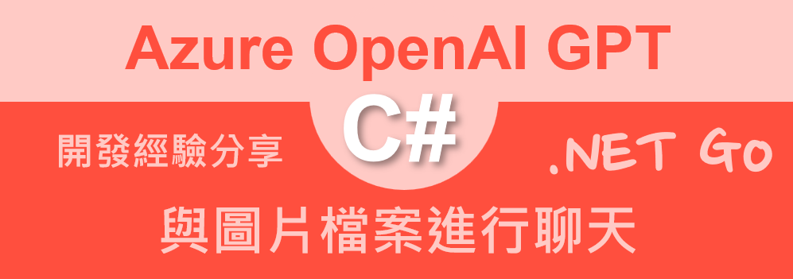
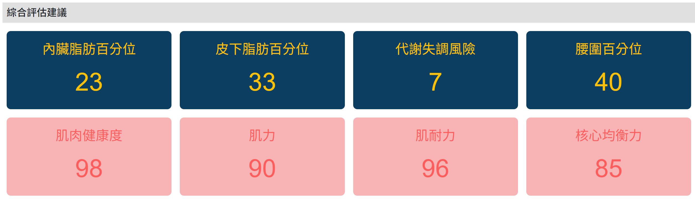
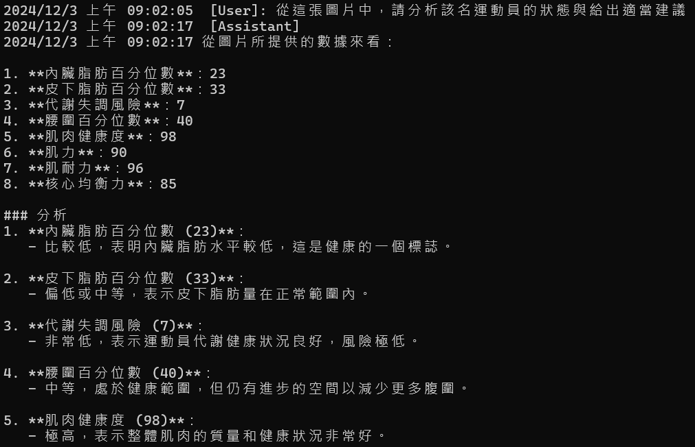

# Azure OpenAI AOAI 2.0 : 9 與圖片檔案進行聊天



在這篇文章之前，當要使用 Azure OpenAI 進行聊天程式設計時，我們都是使用文字輸入的方式，來與 Azure OpenAI 進行對話。但是，有些時候，取得的內容可能是一張圖片，此時，想要能夠讓 LLM 能夠看懂這張圖片，也就是，當我們要使用圖片檔案並且與之聊天時，該如何進行呢？

在 LLM 會有多模態（Multimodal）這個名詞，這是指AI系統能夠處理和理解多種不同類型的輸入數據，例如文字、圖像、音頻、視頻等。在大型語言模型（LLM）的應用中，多模態具有重要的價值和意義：

1. 全面感知與理解
多模態AI可以像人類一樣，整合來自不同感官的信息。例如，不僅僅侷限於文字描述，還能同時理解圖像中的場景、物體、顏色和空間關係。這種全面的感知能力使AI的理解更加豐富和立體。

2. 更自然的人機交互
傳統的AI交互主要依賴文字，而多模態技術使得人機交互更加自然和直觀。用戶可以通過語音、圖像、手勢等多種方式與AI系統溝通，大大提升了交互的靈活性和用戶體驗。

3. 複雜任務解決
多模態AI可以處理更加複雜的任務，如：
- 醫學影像診斷：結合醫學圖像和文字報告
- 自動駕駛：整合攝像頭、雷達和傳感器數據
- 教育：根據學生的表情和行為調整教學內容
- 翻譯：理解語境和非語言交流信號

4. 跨模態推理
多模態AI能夠在不同模態之間進行推理和轉換。例如，從圖像生成文字描述，或從文字描述重建圖像，這種能力極大地擴展了AI的應用邊界。

5. 更精確的上下文理解
通過整合多種模態的信息，AI可以獲得更豐富的上下文，從而做出更準確和有洞察力的判斷。比如在社交媒體分析中，不僅看文字，還可以分析圖像和視頻。

6. 無障礙與包容性技術
多模態技術可以幫助殘疾人更好地與技術交互。例如，為視障人士提供圖像描述，或為聽障人士提供語音轉文字服務。

7. 創新應用場景
- 藝術創作：AI可以根據文字提示生成圖像
- 內容推薦：基於用戶的多模態行為數據
- 虛擬助手：更智能、更人性化的交互體驗

8. 研究與發展前沿
多模態AI代表了人工智能向更接近人類認知和理解方式的重要發展方向，是未來AI技術的重要研究領域。

總的來說，多模態技術正在徹底改變我們與AI交互的方式，使AI系統變得更加智能、靈活和貼近人類的感知模式。它不僅是一種技術創新，更是邁向更智能、更自然的人工智能的重要一步。

因此，在這篇文章中，將會介紹如何使用 Azure OpenAI 進行圖片檔案的聊天，也就是，當我們有一張圖片檔案時，該如何透過 Azure OpenAI 進行聊天。

## 建立測試專案

請依照底下的操作，建立起這篇文章需要用到的練習專案

* 打開 Visual Studio 2022 IDE 應用程式
* 從 [Visual Studio 2022] 對話窗中，點選右下方的 [建立新的專案] 按鈕
* 在 [建立新專案] 對話窗右半部
  * 切換 [所有語言 (L)] 下拉選單控制項為 [C#]
  * 切換 [所有專案類型 (T)] 下拉選單控制項為 [主控台]
* 在中間的專案範本清單中，找到並且點選 [主控台應用程式] 專案範本選項
  > 專案，用於建立可在 Windows、Linux 及 macOS 於 .NET 執行的命令列應用程式
* 點選右下角的 [下一步] 按鈕
* 在 [設定新的專案] 對話窗
* 找到 [專案名稱] 欄位，輸入 `csChatImage` 作為專案名稱
* 在剛剛輸入的 [專案名稱] 欄位下方，確認沒有勾選 [將解決方案與專案至於相同目錄中] 這個檢查盒控制項
* 點選右下角的 [下一步] 按鈕
* 現在將會看到 [其他資訊] 對話窗
* 在 [架構] 欄位中，請選擇最新的開發框架，這裡選擇的 [架構] 是 : `.NET 8.0 (長期支援)`
* 在這個練習中，需要去勾選 [不要使用最上層陳述式(T)] 這個檢查盒控制項
  > 這裡的這個操作，可以由讀者自行決定是否要勾選這個檢查盒控制項
* 請點選右下角的 [建立] 按鈕

稍微等候一下，這個 背景工作服務 專案將會建立完成

## 安裝要用到的 NuGet 開發套件

因為開發此專案時會用到這些 NuGet 套件，請依照底下說明，將需要用到的 NuGet 套件安裝起來。

### 安裝 Azure.AI.OpenAI 套件

請依照底下說明操作步驟，將這個套件安裝到專案內

* 滑鼠右擊 [方案總管] 視窗內的 [專案節點] 下方的 [相依性] 節點
* 從彈出功能表清單中，點選 [管理 NuGet 套件] 這個功能選項清單
* 此時，將會看到 [NuGet: csChatImage] 視窗
* 切換此視窗的標籤頁次到名稱為 [瀏覽] 這個標籤頁次
* 在左上方找到一個搜尋文字輸入盒，在此輸入 `Azure.AI.OpenAI`
* 在視窗右方，將會看到該套件詳細說明的內容，其中，右上方有的 [安裝] 按鈕
  > 請確認有取消 Pre-release 這個選項，與選擇 2.0 正式版
* 點選這個 [安裝] 按鈕，將這個套件安裝到專案內

## 修改 Program.cs 類別內容

在這篇文章中，將會把會用到的新類別與程式碼，都寫入到 [Program.cs] 這個檔案中，請依照底下的操作，修改 [Program.cs] 這個檔案的內容

* 在專案中找到並且打開 [Program.cs] 檔案
* 將底下的程式碼取代掉 `Program.cs` 檔案中內容

```csharp
using Azure.AI.OpenAI;
using OpenAI.Chat;
using System.Reflection.PortableExecutable;
using System.Text;

namespace csChatImage;

internal class Program
{
    static void Main(string[] args)
    {
        // 讀取環境變數 AOAILabKey 的 API Key
        string apiKey = System.Environment.GetEnvironmentVariable("AOAILabKey");
        AzureOpenAIClient azureClient = new(
            new Uri("https://gpt4tw.openai.azure.com/"),
            new System.ClientModel.ApiKeyCredential(apiKey));
        ChatClient chatClient = azureClient.GetChatClient("gpt-4o");

        ChatImage(chatClient);
    }
    private static void ChatImage(ChatClient chatClient)
    {
        #region 提供圖片並與其聊天
        List<ChatMessage> prompts;
        ChatCompletion completion;
        string userPrompt1 = $"從這張圖片中，請分析該名運動員的狀態與給出適當建議";

        var imageFilePath = "sample.png";
        using Stream imageStream = File.OpenRead(imageFilePath);
        var imageBytes = BinaryData.FromStream(imageStream);

        prompts = new List<ChatMessage>
            {
                new UserChatMessage(new List<ChatMessageContentPart>
                {
                    ChatMessageContentPart.CreateTextPart(userPrompt1),
                    ChatMessageContentPart.CreateImagePart(imageBytes, "image/png")
                })
            };

        foreach (var message in prompts)
        {
            string roleName = message is SystemChatMessage ? "System" :
                message is UserChatMessage ? "User" :
                "Assistant";
            Console.WriteLine($"{DateTime.Now}  [{roleName}]: {message.Content[0].Text}");
        }

        completion = chatClient.CompleteChat(prompts);
        Console.WriteLine($"{DateTime.Now}  [Assistant]");
        foreach (var message in completion.Content)
        {
            Console.WriteLine($"{DateTime.Now} {message.Text}");
        }

        Console.WriteLine($"");
        Console.WriteLine($"Role : {completion.Role}");
        Console.WriteLine($"InputTokenCount : {completion.Usage.InputTokenCount}");
        Console.WriteLine($"OutputTokenCount : {completion.Usage.OutputTokenCount}");
        Console.WriteLine($"ReasoningTokenCount : {completion.Usage.OutputTokenDetails?.ReasoningTokenCount}");
        Console.WriteLine($"TotalTokenCount : {completion.Usage.TotalTokenCount}");
        Console.WriteLine($"");
        Console.WriteLine($"");
        #endregion
    }
}
```

首先，同樣的是要取得 Azure OpenAI 的 API Key，這裡使用環境變數 `AOAILabKey` 來存放這個 API Key，這樣可以避免直接寫在程式碼中，這樣可以增加安全性。

接著會呼叫 [ChatImage] 這個方法，在此方法內，將會嘗試進提供的圖片檔案，送至 Azure OpenAI 內，並且進行聊天。

在這個專案內，將會有個 [sample.png] 圖片檔案，其內容如下



首先將會宣告要提問的提示詞 [userPrompt1] ，設定其值為 `從這張圖片中，請分析該名運動員的狀態與給出適當建議`，接著，將會讀取這個圖片檔案，並且將其轉換為 `BinaryData` 類別的物件，這樣才能夠將圖片檔案送至 Azure OpenAI 內。

BinaryData 類別是 .NET 中的一個類別，主要用於處理和管理二進位資料。這個類別的目的是提供一種標準、高效且靈活的方式來處理位元組資料。讓我詳細解釋其主要特點和用途：

1. 統一的二進位資料表示
- BinaryData 提供了一個一致的方式來表示和處理任意長度的二進位資料
- 可以從各種來源建立 BinaryData 實例，如位元組陣列、串流或其他二進位資料源

2. 記憶體效率
- 類別內部優化了記憶體管理
- 支援零拷貝作業，可以減少記憶體複製和分配的開銷
- 對於大型二進位資料，提供了更高效的處理方式

3. 常見使用場景
- 檔案處理
- 網路通訊
- 資料序列化
- 圖像和多媒體資料處理
- 加密和解密作業

4. 主要功能
- 資料讀取和寫入
- 資料轉換
- 記憶體管理
- 支援不同資料格式的轉換

5. 與現代 .NET 整合
- 設計用於支援新的 .NET API
- 在 .NET 6 及更新版本中引入
- 提供更現代和高效的二進位資料處理方式

在 List<ChatMessage> 提示詞內，將會首先加入要提問的提示詞文字內容，接著，使用 `ChatMessageContentPart.CreateImagePart(imageBytes, "image/png")` 這個方法，將圖片檔案加入到提示詞內。

最後，呼叫 [CompleteChat] 方法，將這些提示詞送至 Azure OpenAI 內，並且取得回應結果，將會看到回應結果的內容。

## 執行測試專案
* 按下 `F5` 開始執行專案
* 將會看到輸出結果



```plaintext
2024/12/3 上午 09:02:05  [User]: 從這張圖片中，請分析該名運動員的狀態與給出適當建議
2024/12/3 上午 09:02:17  [Assistant]
2024/12/3 上午 09:02:17 從圖片所提供的數據來看：

1. **內臟脂肪百分位數**：23
2. **皮下脂肪百分位數**：33
3. **代謝失調風險**：7
4. **腰圍百分位數**：40
5. **肌肉健康度**：98
6. **肌力**：90
7. **肌耐力**：96
8. **核心均衡力**：85

### 分析
1. **內臟脂肪百分位數 (23)**：
   - 比較低，表明內臟脂肪水平較低，這是健康的一個標誌。

2. **皮下脂肪百分位數 (33)**：
   - 偏低或中等，表示皮下脂肪量在正常範圍內。

3. **代謝失調風險 (7)**：
   - 非常低，表示運動員代謝健康狀況良好，風險極低。

4. **腰圍百分位數 (40)**：
   - 中等，處於健康範圍，但仍有進步的空間以減少更多腹圍。

5. **肌肉健康度 (98)**：
   - 極高，表示整體肌肉的質量和健康狀況非常好。

6. **肌力 (90)**：
   - 非常好，表示運動員擁有優秀的肌肉力量。

7. **肌耐力 (96)**：
   - 極高，表示運動員的肌耐力非常強。

8. **核心均衡力 (85)**：
   - 優秀，表明核心區域的平衡力和穩定性很好。

### 建議
1. **維持現有的運動和飲食習慣**：
   - 現在的運動和飲食計劃已經達到了很好的效果，應該繼續保持。

2. **針對核心區域進行增強訓練**：
   - 雖然核心均衡力已經很高，但仍可以進一步通過瑜伽或普拉提等訓練來進一步提升。

3. **保持低代謝失調風險**：
   - 繼續保持健康的生活方式，避免高糖和高脂肪飲食，以維持低代謝失調風險。

4. **適當增加腰腹運動**：
   - 可以進行更多針對腰腹的運動，以進一步降低腰圍，進一步提升整體健康狀況。

總的來說，這位運動員的健康狀況非常良好，只需要在現有基礎上進行些微調整即可進一步提升表現與健康。

Role : Assistant
InputTokenCount : 1477
OutputTokenCount : 639
ReasoningTokenCount :
TotalTokenCount : 2116
```

