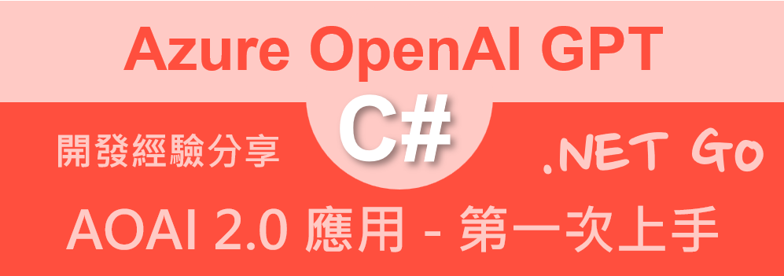
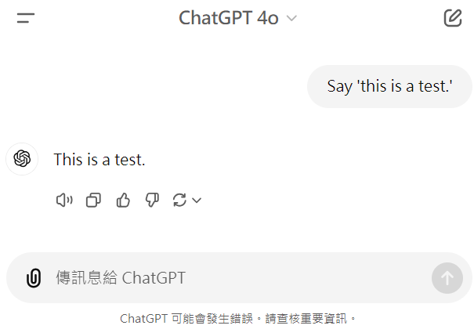
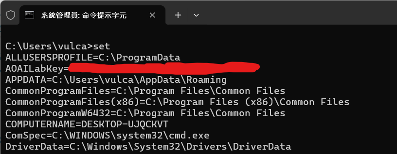
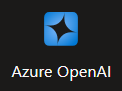
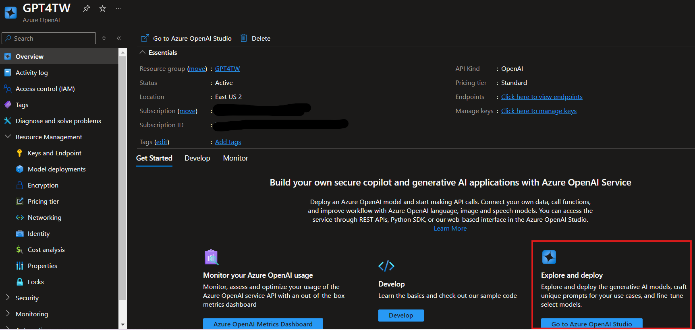
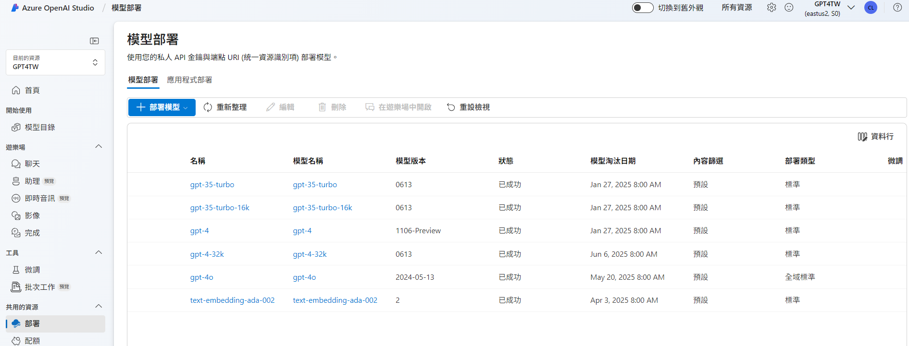
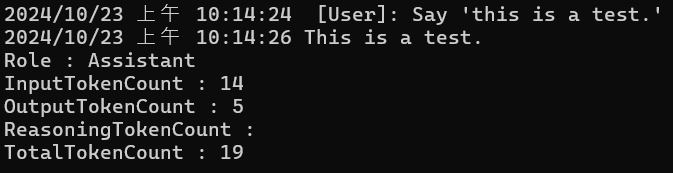

# AOAI 2.0 : 第一次使用 Azure.AI.OpenAI 2.0.0 開發教學



在 2024/10/01 微軟宣布 [Azure.AI.OpenAI 2.0.0](https://devblogs.microsoft.com/azure-sdk/announcing-the-stable-release-of-the-azure-openai-library-for-net/) 正式發布，這是一個重大的里程碑，因為這是一個全新的版本，並且有許多新功能和改進。在此之前，所使用的 Azure OpenAI client library for .NET 套件都是 Beta 版本，而在此正式版堆出之後，將會有一些使用方式的改變與增加許多功能，所以，將會針對這些 Azure OpenAI client library for .NET 2.0 版本進行一系列的教學。

在這裡先要來了解 AOAI 採用的是大語言模型技術，使用者可以傳入文字，透過大語言模型的處理，就會生成出一段回應文字，這樣的技術可以應用在許多場景，例如：對話式應用程式、自動回覆、自動翻譯、自動摘要、自動生成程式碼等等。

這個傳入的文字可以稱之為 Prompt 「提示詞」、「提示訊息」或「引導詞」，而生成的回應文字可以稱之為 Completion 「完成詞」、「完成訊息」或「完成句」。

在這個教學中，將會介紹如何使用 Azure.AI.OpenAI 2.0.0 來開發一個提問與回答的應用程式，這個應用程式可以透過 Prompt 提問，然後透過 Completion 來回答，這個應用程式可以應用在許多場景，例如：自動回覆、自動翻譯、自動摘要、自動生成程式碼等等。

例如，若使用者輸入了一個 Prompt 「Say 'this is a test.'」，這個 Prompt 將會被傳入到 Azure OpenAI 服務中，然後 Azure OpenAI 服務將會生成一段 Completion 回應文字 [ This is a test.]。下圖將會展示這個應用程式的運作方式。



## 建立測試專案

請依照底下的操作，建立起這篇文章需要用到的練習專案

* 打開 Visual Studio 2022 IDE 應用程式
* 從 [Visual Studio 2022] 對話窗中，點選右下方的 [建立新的專案] 按鈕
* 在 [建立新專案] 對話窗右半部
  * 切換 [所有語言 (L)] 下拉選單控制項為 [C#]
  * 切換 [所有專案類型 (T)] 下拉選單控制項為 [主控台]
* 在中間的專案範本清單中，找到並且點選 [主控台應用程式] 專案範本選項
  > 專案，用於建立可在 Windows、Linux 及 macOS 於 .NET 執行的命令列應用程式
* 點選右下角的 [下一步] 按鈕
* 在 [設定新的專案] 對話窗
* 找到 [專案名稱] 欄位，輸入 `csAzureAIOpenAIQuickStart` 作為專案名稱
* 在剛剛輸入的 [專案名稱] 欄位下方，確認沒有勾選 [將解決方案與專案至於相同目錄中] 這個檢查盒控制項
* 點選右下角的 [下一步] 按鈕
* 現在將會看到 [其他資訊] 對話窗
* 在 [架構] 欄位中，請選擇最新的開發框架，這裡選擇的 [架構] 是 : `.NET 8.0 (長期支援)`
* 在這個練習中，需要去勾選 [不要使用最上層陳述式(T)] 這個檢查盒控制項
  > 這裡的這個操作，可以由讀者自行決定是否要勾選這個檢查盒控制項
* 請點選右下角的 [建立] 按鈕

稍微等候一下，這個 背景工作服務 專案將會建立完成

## 安裝要用到的 NuGet 開發套件

因為開發此專案時會用到這些 NuGet 套件，請依照底下說明，將需要用到的 NuGet 套件安裝起來。

### 安裝 Azure.AI.OpenAI 套件

請依照底下說明操作步驟，將這個套件安裝到專案內

* 滑鼠右擊 [方案總管] 視窗內的 [專案節點] 下方的 [相依性] 節點
* 從彈出功能表清單中，點選 [管理 NuGet 套件] 這個功能選項清單
* 此時，將會看到 [NuGet: csAzureAIOpenAIQuickStart] 視窗
* 切換此視窗的標籤頁次到名稱為 [瀏覽] 這個標籤頁次
* 在左上方找到一個搜尋文字輸入盒，在此輸入 `Azure.AI.OpenAI`
* 在視窗右方，將會看到該套件詳細說明的內容，其中，右上方有的 [安裝] 按鈕
  > 請確認有取消 Pre-release 這個選項，與選擇 2.0 正式版
* 點選這個 [安裝] 按鈕，將這個套件安裝到專案內

## 修改 Program.cs 類別內容

在這篇文章中，將會把會用到的新類別與程式碼，都寫入到 [Program.cs] 這個檔案中，請依照底下的操作，修改 [Program.cs] 這個檔案的內容

* 在專案中找到並且打開 [Program.cs] 檔案
* 將底下的程式碼取代掉 `Program.cs` 檔案中內容

```csharp
using Azure.AI.OpenAI;
using Azure;
using OpenAI.Chat;
using System.Net;

namespace csAzureAIOpenAIQuickStart;

internal class Program
{
    static void Main(string[] args)
    {
        // 讀取環境變數 AOAILabKey 的 API Key
        string apiKey = System.Environment.GetEnvironmentVariable("AOAILabKey");
        AzureOpenAIClient azureClient = new(
            new Uri("https://gpt4tw.openai.azure.com/"),
            new System.ClientModel.ApiKeyCredential(apiKey));
        ChatClient chatClient = azureClient.GetChatClient("gpt-4");

        string userPrompt = "Say 'this is a test.'";
        Console.WriteLine($"{DateTime.Now}  [User]: {userPrompt}");
        ChatCompletion completion = chatClient.CompleteChat("Say 'this is a test.'");

        foreach (var message in completion.Content)
        {
            Console.WriteLine($"{DateTime.Now} {message.Text}");
        }
        Console.WriteLine($"Role : {completion.Role}");
        Console.WriteLine($"InputTokenCount : {completion.Usage.InputTokenCount}");
        Console.WriteLine($"OutputTokenCount : {completion.Usage.OutputTokenCount}");
        Console.WriteLine($"ReasoningTokenCount : {completion.Usage.OutputTokenDetails?.ReasoningTokenCount}");
        Console.WriteLine($"TotalTokenCount : {completion.Usage.TotalTokenCount}");
    }
}
```

當要使用 Azure OpenAI library for .NET 來呼叫 ChatGPT 相關應用 API 的時候，首先需要建立一個 [AzureOpenAIClient] 類別的物件，這個物件是用來建立一個 Azure OpenAI client library for .NET 的物件，這個物件是用來呼叫 Azure OpenAI 的 API 服務。

在此需要宣告與傳入兩個參數，第一個參數是 Azure OpenAI 的 API 服務的網址，第二個參數是 Azure OpenAI 的 API 服務的金鑰，這個金鑰是用來驗證使用者的身份，這個金鑰是在 Azure OpenAI 的網站上申請的。有了這兩個資訊，便可以取得與使用 Azure 所提供的 OpenAI 服務，透過其雲端大語言模型技術，來進行文字的生成。

因此，在這裡使用了 `AzureOpenAIClient azureClient = new(new Uri("https://gpt4tw.openai.azure.com/"), new System.ClientModel.ApiKeyCredential(apiKey));` 敘述來完成上述需求，不過，對於 Azure OpenAI 用到的金鑰資訊，是具有敏感性的，因為，任何人取得了服務端點與該金鑰，就可以使用你訂閱的服務，所產生的費用，則是由你負擔，因此，在這裡不會將該金鑰放在專案原始碼內，而是透過環境變數的方式來取得。這樣的好處是，可以避免金鑰資訊外洩，而且，可以在不同的環境中，使用不同的金鑰資訊。

此時，打開命令提示字元視窗，輸入 [set] 指令，便可以看到所有環境參數的清單



從上面螢幕截圖，可以看到已經有設定一個環境變數 `AOAILabKey`，這個環境變數是用來存放 Azure OpenAI 金鑰資訊的。

使用底下命令將建立 OpenAI Key 永久性的環境變數，這代表這個環境變數將會一直存在，不會因為該系統重新開機之後，該環境變數就不存在了，直到你刪除它為止

```
setx AOAILabKey "剪貼簿內的 OpenAI Key 值" /M
```

如何刪除此環境變數

```
REG delete "HKLM\SYSTEM\CurrentControlSet\Control\Session Manager\Environment" /V AOAILabKey /f
```

若金鑰與服務端點都設定完成，並且 AzureOpenAIClient azureClient 可以正常運作，接下來就要產生 ChatClient chatClient 物件，這裡使用了 `ChatClient chatClient = azureClient.GetChatClient("gpt-4");` 敘述來取得 ChatClient 類別的物件，這個物件是用來呼叫 ChatGPT 相關應用 API 服務的。

想要知道有那些模型可以使用，可以透過 Azure 網頁來查詢

進入到 Azure 網頁，搜尋或找到 [Azure OpenAI] 服務



點選進入後，參考下圖，在網頁中間下方，可以看到 [Explore and deploy] 選項



點選進入後，可以看到 [Azure OpenAI Studio] 頁面，在最左方找到 [部署] 連結，就可以看到所有的模型清單，這裡使用的是 `gpt-4` 模型



現在要來建立一個 ChatClient chatClient 物件，這個物件是用來呼叫 ChatGPT 相關應用 API 服務的，這裡使用了 `ChatClient chatClient = azureClient.GetChatClient("gpt-4");` 敘述來取得 ChatClient 類別的物件，這個物件是用來呼叫 ChatGPT 相關應用 API 服務的。
 azureClient.GetChatClient("gpt-4");

 在 [AzureOpenAIClient Class Methods](https://learn.microsoft.com/en-us/dotnet/api/azure.ai.openai.azureopenaiclient?view=azure-dotnet-preview#methods&WT.mc_id=DT-MVP-5002220) 中，有列出所有可用取得特定服務方法

* GetAudioClient(String)	
	
  取得一個新的OpenAI.Audio.AudioClient實例，該實例配置為與 Azure OpenAI 服務一起使用音訊操作。

* GetChatClient(String)	

  取得一個新的OpenAI.Chat.ChatClient實例，該實例配置為與 Azure OpenAI 服務一起使用聊天完成操作。

* GetEmbeddingClient(String)	

  取得一個新的OpenAI.Embeddings.EmbeddingClient實例，該實例配置為與 Azure OpenAI 服務一起使用嵌入操作。

* GetImageClient(String)	
取得一個新的OpenAI.Images.ImageClient實例，該實例配置為與 Azure OpenAI 服務一起使用映像操作。

透過這個方法 GetChatClient 取得的物件，可以進行對指定大語言模型進行對話式應用程式的操作，這個物件是用來呼叫 ChatGPT 相關應用 API 服務的。

想要對大語言模型提出問題，可以使用類似這樣用法 `chatClient.CompleteChat("Say 'this is a test.'")` ；其中，使用 CompleteChat 方法傳入進去的字串，就是 Prompt，該方法將會回傳 [ChatCompletion]，透過這個物件，就可以獲得大語言模型生成的文字內容。

在 [ChatCompletion] 物件內有個型別為 [ChatMessageContent] 的屬性 [Content] ，這個屬性是用來存放 ChatGPT 生成的文字內容，透過這個屬性，就可以取得 ChatGPT 生成的文字內容。這裡使用底下方法將生成文字內容列印在螢幕上。

```csharp
foreach (var message in completion.Content)
{
    Console.WriteLine($"{DateTime.Now} {message.Text}");
}
```

該物件也可以取得 ChatGPT 生成的文字內容的其他資訊，例如：Role、InputTokenCount、OutputTokenCount、ReasoningTokenCount、TotalTokenCount 等等，這些資訊可以透過 ChatCompletion 物件的屬性來取得。有了這些資訊，便可以計算出此次呼叫 GPT 運算的成本，這樣就可以控制 Azure OpenAI 服務的使用成本。

```csharp
Console.WriteLine($"Role : {completion.Role}");
Console.WriteLine($"InputTokenCount : {completion.Usage.InputTokenCount}");
Console.WriteLine($"OutputTokenCount : {completion.Usage.OutputTokenCount}");
Console.WriteLine($"ReasoningTokenCount : {completion.Usage.OutputTokenDetails?.ReasoningTokenCount}");
Console.WriteLine($"TotalTokenCount : {completion.Usage.TotalTokenCount}");
```

## 執行測試專案
* 按下 `F5` 開始執行專案
* 將會看到輸出結果



```plaintext
2024/10/23 上午 10:14:24  [User]: Say 'this is a test.'
2024/10/23 上午 10:14:26 This is a test.
Role : Assistant
InputTokenCount : 14
OutputTokenCount : 5
ReasoningTokenCount :
TotalTokenCount : 19
```
