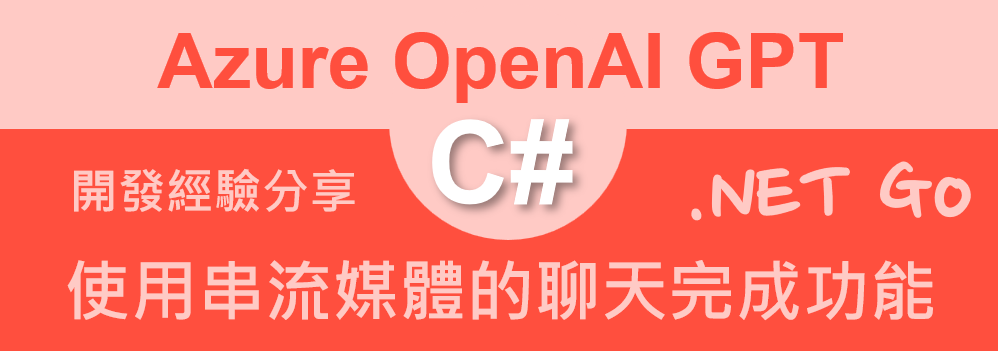
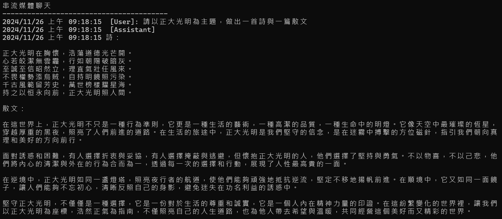

# Azure OpenAI AOAI 2.0 : 8 透過串流媒體使用聊天完成功能



在之前的 Azure OpenAI 的程式設計文章中，我們已經介紹了如何使用 Azure OpenAI 的 AOAI 2.0 來進行聊天功能的設計，這次要介紹的是如何透過串流媒體的方式，來使用聊天完成功能。這個串流媒體的方式，可以讓我們在聊天的過程中，不斷的取得新的回應，而不需要等到整個對話結束後，才能取得回應。

## 建立測試專案

請依照底下的操作，建立起這篇文章需要用到的練習專案

* 打開 Visual Studio 2022 IDE 應用程式
* 從 [Visual Studio 2022] 對話窗中，點選右下方的 [建立新的專案] 按鈕
* 在 [建立新專案] 對話窗右半部
  * 切換 [所有語言 (L)] 下拉選單控制項為 [C#]
  * 切換 [所有專案類型 (T)] 下拉選單控制項為 [主控台]
* 在中間的專案範本清單中，找到並且點選 [主控台應用程式] 專案範本選項
  > 專案，用於建立可在 Windows、Linux 及 macOS 於 .NET 執行的命令列應用程式
* 點選右下角的 [下一步] 按鈕
* 在 [設定新的專案] 對話窗
* 找到 [專案名稱] 欄位，輸入 `csChatStream` 作為專案名稱
* 在剛剛輸入的 [專案名稱] 欄位下方，確認沒有勾選 [將解決方案與專案至於相同目錄中] 這個檢查盒控制項
* 點選右下角的 [下一步] 按鈕
* 現在將會看到 [其他資訊] 對話窗
* 在 [架構] 欄位中，請選擇最新的開發框架，這裡選擇的 [架構] 是 : `.NET 8.0 (長期支援)`
* 在這個練習中，需要去勾選 [不要使用最上層陳述式(T)] 這個檢查盒控制項
  > 這裡的這個操作，可以由讀者自行決定是否要勾選這個檢查盒控制項
* 請點選右下角的 [建立] 按鈕

稍微等候一下，這個 背景工作服務 專案將會建立完成

## 安裝要用到的 NuGet 開發套件

因為開發此專案時會用到這些 NuGet 套件，請依照底下說明，將需要用到的 NuGet 套件安裝起來。

### 安裝 Azure.AI.OpenAI 套件

請依照底下說明操作步驟，將這個套件安裝到專案內

* 滑鼠右擊 [方案總管] 視窗內的 [專案節點] 下方的 [相依性] 節點
* 從彈出功能表清單中，點選 [管理 NuGet 套件] 這個功能選項清單
* 此時，將會看到 [NuGet: csChatStream] 視窗
* 切換此視窗的標籤頁次到名稱為 [瀏覽] 這個標籤頁次
* 在左上方找到一個搜尋文字輸入盒，在此輸入 `Azure.AI.OpenAI`
* 在視窗右方，將會看到該套件詳細說明的內容，其中，右上方有的 [安裝] 按鈕
  > 請確認有取消 Pre-release 這個選項，與選擇 2.0 正式版
* 點選這個 [安裝] 按鈕，將這個套件安裝到專案內

## 修改 Program.cs 類別內容

在這篇文章中，將會把會用到的新類別與程式碼，都寫入到 [Program.cs] 這個檔案中，請依照底下的操作，修改 [Program.cs] 這個檔案的內容

* 在專案中找到並且打開 [Program.cs] 檔案
* 將底下的程式碼取代掉 `Program.cs` 檔案中內容

```csharp
using Azure.AI.OpenAI;
using OpenAI.Chat;
using System.ClientModel;

namespace csChatStream;

internal class Program
{
    static async Task Main(string[] args)
    {
        // 讀取環境變數 AOAILabKey 的 API Key
        string apiKey = System.Environment.GetEnvironmentVariable("AOAILabKey");
        AzureOpenAIClient azureClient = new(
            new Uri("https://gpt4tw.openai.azure.com/"),
            new System.ClientModel.ApiKeyCredential(apiKey));
        ChatClient chatClient = azureClient.GetChatClient("gpt-4");

        await ChatStream(chatClient, "請以正大光明為主題，做出一首詩與一篇散文");
    }

    private static async Task ChatStream(ChatClient chatClient, string promptText)
    {
        #region 串流媒體聊天
        List<ChatMessage> prompts;
        AsyncCollectionResult<StreamingChatCompletionUpdate> completionUpdates;
        Console.WriteLine("串流媒體聊天");
        Console.WriteLine(new string('-', 40));
        prompts = new()
        {
            UserChatMessage.CreateUserMessage(promptText),
        };
        foreach (var message in prompts)
        {
            string roleName = message is SystemChatMessage ? "System" :
                message is UserChatMessage ? "User" :
                "Assistant";
            Console.WriteLine($"{DateTime.Now}  [{roleName}]: {message.Content[0].Text}");
        }

        //completion = chatClient.CompleteChat(prompts);
        completionUpdates =
           chatClient.CompleteChatStreamingAsync(prompts);
        Console.WriteLine($"{DateTime.Now}  [Assistant]");
        Console.Write($"{DateTime.Now} ");
        await foreach (StreamingChatCompletionUpdate completionUpdate in completionUpdates)
        {
            if (completionUpdate.ContentUpdate.Count > 0)
            {
                foreach (var message in completionUpdate.ContentUpdate)
                {
                    Console.Write($"{message.Text}");
                }
            }
        }
        Console.WriteLine();
        #endregion
    }
}
```

在 [Main] 方法內，同樣的會透過環境變數來取的需要的授權金鑰，接著建立 AzureOpenAIClient 這個類別的物件，並且取得 ChatClient 這個類別的物件，接著呼叫 [ChatStream] 這個方法將指定提示詞產生初完成的本文。

在 [ChatStream] 方法內，首先建立一個 [List<ChatMessage>] 的物件，接著透過 [chatClient.CompleteChatStreamingAsync(prompts)] 這個方法，來取得串流媒體的聊天回應，並且將回應的內容顯示在螢幕上。

一旦 [chatClient.CompleteChatStreamingAsync(prompts)] 這個方法執行完成後，將會回傳型別為 [AsyncCollectionResult<StreamingChatCompletionUpdate>] 的物件，這個物件是一個串流的物件，可以透過 `await foreach` 來取得串流的回應內容。

在 `await foreach` 迴圈內，將會取得串流的回應內容，並且將內容顯示在螢幕上。

## 執行測試專案

* 按下 `F5` 開始執行專案
* 將會看到輸出結果



```plaintext
串流媒體聊天
----------------------------------------
2024/11/26 上午 09:18:15  [User]: 請以正大光明為主題，做出一首詩與一篇散文
2024/11/26 上午 09:18:15  [Assistant]
2024/11/26 上午 09:18:15 詩：

正大光明在胸懷，浩蕩道德光芒開。
心若皎潔無雲霾，行如朝陽破暗灰。
至誠至信昭然立，理直氣壯任風來。
不畏權勢添烏賊，自持明鏡照污染。
千古風範留芳史，萬世榜樣耀星海。
持之以恒永向前，正大光明照人間。

散文：

在這世界上，正大光明不只是一種行為準則，它更是一種生活的藝術，一種高潔的品質，一種生命中的明燈。它像天空中最璀璨的恆星，穿越厚重的黑夜，照亮了人們前進的道路。在生活的旅途中，正大光明是我們堅守的信念，是在迷霧中搏擊的方位磁針，指引我們朝向真理和美好的方向前行。

面對誘惑和困難，有人選擇折衷與妥協，有人選擇掩蔽與逃避，但懷抱正大光明的人，他們選擇了堅持與勇氣。不以物喜，不以己悲，他們將內心的清潔與外在的行為合而為一，透過每一次的選擇和行動，展現了人性最高貴的一面。

在逆境中，正大光明如同一盞燈塔，照亮夜行者的航道，使他們能夠頑強地抵抗逆流，堅定不移地揚帆前進。在順境中，它又如同一面鏡子，讓人們能夠不忘初心，清晰反照自己的身影，避免迷失在功名利益的誘惑中。

堅守正大光明，不僅僅是一種選擇，它是一份對於生活的尊重和誠實，它是一個人內在精神力量的印證。在這紛繁變化的世界裡，讓我們以正大光明為座標，浩然正氣為指南，不僅照亮自己的人生道路，也為他人帶去希望與溫暖，共同經營這個美好而又精彩的世界。
```