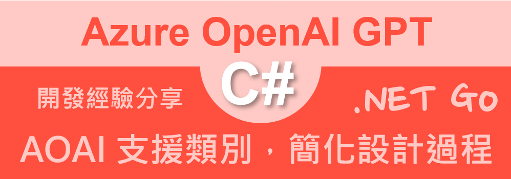
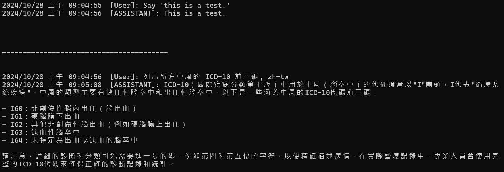

# Azure OpenAI AOAI 2.0 : 2 設計 支援類別，簡化設計過程



這是繼第一篇 [Azure OpenAI AOAI 2.0 : 1 第一次使用 Azure.AI.OpenAI 2.0.0 開發教學](https://csharpkh.blogspot.com/2024/10/csharp-Azure-OpenAI-AI-ChatCompletion-Prompt-ASSISTANT-Quick-Start.html) 關於 Azure OpenAI for .NET 2.0 開發文章的接續內容，這也是一個系列文章，將會持續更新，希望能夠幫助大家更快速的上手 Azure OpenAI 2.0 的開發。在上一篇文章中，從基本的建立起 AzureOpenAIClient 物件，以及創建該物件需要提供的參數該如何進行安全性的保護設計做出說明，接著需要創建 ChatClient 物件，以便可以進行對話 Chat Completion 的操作，而創建該物件需要提供的模型名稱，需要從哪裡取得做出說明；之後，設計一個 Prompt 提示詞，透過 ChatClient 來呼叫對應的 API，將提示詞送入到 Azure OpenAI LLM 大語言模型內，一旦大語言模型生成出內容之後，便會得到 Completion 完成內容之一系列設計過程。

在這篇文章中，我們將會討論如何設計一個支援類別，來簡化設計過程，讓開發者可以更快速的開發出 Azure OpenAI 2.0 的應用程式。

## 建立測試專案

請依照底下的操作，建立起這篇文章需要用到的練習專案

* 打開 Visual Studio 2022 IDE 應用程式
* 從 [Visual Studio 2022] 對話窗中，點選右下方的 [建立新的專案] 按鈕
* 在 [建立新專案] 對話窗右半部
  * 切換 [所有語言 (L)] 下拉選單控制項為 [C#]
  * 切換 [所有專案類型 (T)] 下拉選單控制項為 [主控台]
* 在中間的專案範本清單中，找到並且點選 [主控台應用程式] 專案範本選項
  > 專案，用於建立可在 Windows、Linux 及 macOS 於 .NET 執行的命令列應用程式
* 點選右下角的 [下一步] 按鈕
* 在 [設定新的專案] 對話窗
* 找到 [專案名稱] 欄位，輸入 `csAzureAIOpenAIHelper` 作為專案名稱
* 在剛剛輸入的 [專案名稱] 欄位下方，確認沒有勾選 [將解決方案與專案至於相同目錄中] 這個檢查盒控制項
* 點選右下角的 [下一步] 按鈕
* 現在將會看到 [其他資訊] 對話窗
* 在 [架構] 欄位中，請選擇最新的開發框架，這裡選擇的 [架構] 是 : `.NET 8.0 (長期支援)`
* 在這個練習中，需要去勾選 [不要使用最上層陳述式(T)] 這個檢查盒控制項
  > 這裡的這個操作，可以由讀者自行決定是否要勾選這個檢查盒控制項
* 請點選右下角的 [建立] 按鈕

稍微等候一下，這個 背景工作服務 專案將會建立完成

## 安裝要用到的 NuGet 開發套件

因為開發此專案時會用到這些 NuGet 套件，請依照底下說明，將需要用到的 NuGet 套件安裝起來。

### 安裝 Azure.AI.OpenAI 套件

請依照底下說明操作步驟，將這個套件安裝到專案內

* 滑鼠右擊 [方案總管] 視窗內的 [專案節點] 下方的 [相依性] 節點
* 從彈出功能表清單中，點選 [管理 NuGet 套件] 這個功能選項清單
* 此時，將會看到 [NuGet: csAzureAIOpenAIHelper] 視窗
* 切換此視窗的標籤頁次到名稱為 [瀏覽] 這個標籤頁次
* 在左上方找到一個搜尋文字輸入盒，在此輸入 `Azure.AI.OpenAI`
* 在視窗右方，將會看到該套件詳細說明的內容，其中，右上方有的 [安裝] 按鈕
  > 請確認有取消 Pre-release 這個選項，與選擇 2.0 正式版
* 點選這個 [安裝] 按鈕，將這個套件安裝到專案內

## 修改 Program.cs 類別內容

在這篇文章中，將會把會用到的新類別與程式碼，都寫入到 [Program.cs] 這個檔案中，請依照底下的操作，修改 [Program.cs] 這個檔案的內容

* 在專案中找到並且打開 [Program.cs] 檔案
* 將底下的程式碼取代掉 `Program.cs` 檔案中內容

```csharp
using Azure.AI.OpenAI;
using Azure;
using OpenAI.Chat;

namespace csAzureAIOpenAIQuickStart;

public class MagicObject
{
    public const string AZURE_OPENAI_API_ENDPOINT = "https://gpt4tw.openai.azure.com/";
    public const string GPT4_Model_NAME = "gpt-4";
    public const string GPT4_32K_Model_NAME = "gpt-4-32k";
    public const string GPT35_TURBO_16K_Model_NAME = "gpt-35-turbo-16k";
    public const string GPT35_TURBO_Model_NAME = "GPT-35-TURBO";
}

public class AzureOpenAIClientFactory
{
    public AzureOpenAIClient CreateAzureOpenAIClient(string apiKey, string endPoint)
    {

        // 使用 API Key 建立 AzureOpenAIClient 物件
        AzureOpenAIClient azureClient = new(
            new Uri(endPoint),
            new System.ClientModel.ApiKeyCredential(apiKey));
        return azureClient;
    }

    public ChatClient CreateChatClient(AzureOpenAIClient azureClient, string modelName)
    {
        ChatClient chatClient = azureClient.GetChatClient(modelName);
        return chatClient;
    }
}

internal class Program
{
    static void Main(string[] args)
    {
        // 讀取環境變數 AOAILabKey 的 API Key
        string apiKey = System.Environment.GetEnvironmentVariable("AOAILabKey");
        var openAiFactory = new AzureOpenAIClientFactory();
        AzureOpenAIClient azureClient = openAiFactory
            .CreateAzureOpenAIClient(apiKey, MagicObject.AZURE_OPENAI_API_ENDPOINT);
        ChatClient chatClient = openAiFactory.CreateChatClient(azureClient, MagicObject.GPT4_Model_NAME);

        //string userPrompt = "Hello, I am a chatbot. How can I help you today?";
        string userPrompt = "Say 'this is a test.'";
        Console.WriteLine($"{DateTime.Now}  [User]: {userPrompt}");
        ChatCompletion completion = chatClient.CompleteChat("Say 'this is a test.'");

        foreach (var content in completion.Content)
        {
            Console.WriteLine($"{DateTime.Now}  [ASSISTANT]: {content.Text}");
        }

        Console.WriteLine(Environment.NewLine);
        Console.WriteLine(Environment.NewLine);
        Console.WriteLine(new string('-', 40));
        Console.WriteLine(Environment.NewLine);

        userPrompt = "列出所有中風的 ICD-10 前三碼, zh-tw";
        Console.WriteLine($"{DateTime.Now}  [User]: {userPrompt}");

        completion = chatClient.CompleteChat(userPrompt);

        foreach (var content in completion.Content)
        {
            Console.WriteLine($"{DateTime.Now}  [ASSISTANT]: {content.Text}");
        }
    }
}
```

在這個檔案內，我們新增了兩個類別，一個是 `MagicObject` 類別，另一個是 `AzureOpenAIClientFactory` 類別，這兩個類別的目的是為了簡化程式碼的設計，讓開發者可以更快速的開發出 Azure OpenAI 2.0 的應用程式。

對於 [MagicObject] 類別，我們將會把所有的常數值，都放在這個類別內，這樣可以讓程式碼更容易閱讀，也更容易維護。首先是 [AZURE_OPENAI_API_ENDPOINT] 這個常數，將會定義出需要存取的 Azure OpenAI API 服務的網址。接著，我們定義了四個不同的模型名稱，這些模型名稱將會用在 ChatClient 的建立過程中，這樣可以讓開發者更容易的切換不同的模型，來進行對話的操作。

接著建立了一個 [AzureOpenAIClientFactory] 類別，這個類別將會負責建立 AzureOpenAIClient 物件，以及 ChatClient 物件，這樣可以讓開發者更容易的建立這些物件，並且可以更快速的進行對話的操作。這個類別內將會提供兩個方法，一個是 [CreateAzureOpenAIClient] 方法，這個方法將會用來建立 AzureOpenAIClient 物件，另一個是 [CreateChatClient] 方法，這個方法將會用來建立 ChatClient 物件。

想要使用上述的支援類別取得可以操作 Azure OpenAI 2.0 的物件，同樣的需要先取得儲存在環境變數內的 API Key，這樣才能夠建立 AzureOpenAIClient 物件。這裡使用到了 `System.Environment.GetEnvironmentVariable("AOAILabKey")` 方法，將儲存在環境變數內的 API Key 讀取出來，接著，我們將會使用 AzureOpenAIClientFactory 類別，來建立 AzureOpenAIClient 物件，以及 ChatClient 物件，並且進行對話的操作。

有了這兩個物件，便可以進行使用 Chat Completion 的操作，這樣可以讓開發者更快速的開發出 Azure OpenAI 2.0 的應用程式。對於建立的 [chatClient] 物件，我們可以使用 `CompleteChat` 方法，來進行對話的操作，呼叫該方法的時候，僅需要提供一個 Prompt 提示詞，便可以得到 Completion 完成內容之一系列設計過程。

呼叫完成之後，將會得到一個 [ChatCompletion] 物件，這個物件內包含了一個 [Content] 屬性，這個屬性是一個集合(其型別為 [Collection<ChatMessageContentPart>])，裡面包含了一系列的對話內容，開發者可以透過這個集合，來取得對話的內容，並且顯示在螢幕上。

## 執行測試專案
* 按下 `F5` 開始執行專案
* 將會看到輸出結果



```plaintext
2024/10/28 上午 09:04:55  [User]: Say 'this is a test.'
2024/10/28 上午 09:04:56  [ASSISTANT]: This is a test.


----------------------------------------


2024/10/28 上午 09:04:56  [User]: 列出所有中風的 ICD-10 前三碼, zh-tw
2024/10/28 上午 09:05:08  [ASSISTANT]: ICD-10（國際疾病分類第十版）中用於中風（腦卒中）的代碼通常以"I"開頭，I代表"循環系統疾病"。中風的類型主要有缺血性腦卒中和出血性腦卒中。以下是一些涵蓋中風的ICD-10代碼前三碼：

- I60：非創傷性腦內出血（腦出血）
- I61：硬腦膜下出血
- I62：其他非創傷性腦出血（例如硬腦膜上出血）
- I63：缺血性腦卒中
- I64：未特定為出血或缺血的腦卒中

請注意，詳細的診斷和分類可能需要進一步的碼，例如第四和第五位的字符，以便精確描述病情。在實際醫療記錄中，專業人員會使用完整的ICD-10代碼來確保正確的診斷記錄和統計。
```