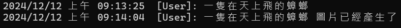

# Azure OpenAI AOAI 2.0 : 11 透過 Prompt 產生圖片


對於想要透過文字提示詞，來產生圖片的需求，Azure OpenAI 服務提供了一個功能，可以透過文字提示詞，來產生圖片。那就是透過與使用 Dall-e-3，其是一個強大的 AI 模型，能夠根據文字描述生成高品質、逼真的圖像。透過 Azure OpenAI 服務，您可以輕鬆地將這個功能整合到您的應用程式中。

若想要使用這樣功能，首先需要在 Azure OpenAI 服務中建立一個 Dall-e-3 模型，然後透過這個模型，來產生圖片。 完成部署 Dall-e-3 模型之後，您將會獲得一個 API 金鑰，這個金鑰是您用來呼叫 Dall-e-3 API 的憑證，並且需要保存該服務的 Endpoint，這兩個資訊將會於等下開發時候會用到。

在這篇文章中，將會展示出如何使用  Dall-e-3 模型，來產生圖片的做法。

## 建立測試專案

請依照底下的操作，建立起這篇文章需要用到的練習專案

* 打開 Visual Studio 2022 IDE 應用程式
* 從 [Visual Studio 2022] 對話窗中，點選右下方的 [建立新的專案] 按鈕
* 在 [建立新專案] 對話窗右半部
  * 切換 [所有語言 (L)] 下拉選單控制項為 [C#]
  * 切換 [所有專案類型 (T)] 下拉選單控制項為 [主控台]
* 在中間的專案範本清單中，找到並且點選 [主控台應用程式] 專案範本選項
  > 專案，用於建立可在 Windows、Linux 及 macOS 於 .NET 執行的命令列應用程式
* 點選右下角的 [下一步] 按鈕
* 在 [設定新的專案] 對話窗
* 找到 [專案名稱] 欄位，輸入 `csGenerateImage` 作為專案名稱
* 在剛剛輸入的 [專案名稱] 欄位下方，確認沒有勾選 [將解決方案與專案至於相同目錄中] 這個檢查盒控制項
* 點選右下角的 [下一步] 按鈕
* 現在將會看到 [其他資訊] 對話窗
* 在 [架構] 欄位中，請選擇最新的開發框架，這裡選擇的 [架構] 是 : `.NET 8.0 (長期支援)`
* 在這個練習中，需要去勾選 [不要使用最上層陳述式(T)] 這個檢查盒控制項
  > 這裡的這個操作，可以由讀者自行決定是否要勾選這個檢查盒控制項
* 請點選右下角的 [建立] 按鈕

稍微等候一下，這個 背景工作服務 專案將會建立完成

## 安裝要用到的 NuGet 開發套件

因為開發此專案時會用到這些 NuGet 套件，請依照底下說明，將需要用到的 NuGet 套件安裝起來。

### 安裝 Azure.AI.OpenAI 套件

請依照底下說明操作步驟，將這個套件安裝到專案內

* 滑鼠右擊 [方案總管] 視窗內的 [專案節點] 下方的 [相依性] 節點
* 從彈出功能表清單中，點選 [管理 NuGet 套件] 這個功能選項清單
* 此時，將會看到 [NuGet: csGenerateImage] 視窗
* 切換此視窗的標籤頁次到名稱為 [瀏覽] 這個標籤頁次
* 在左上方找到一個搜尋文字輸入盒，在此輸入 `Azure.AI.OpenAI`
* 在視窗右方，將會看到該套件詳細說明的內容，其中，右上方有的 [安裝] 按鈕
  > 請確認有取消 Pre-release 這個選項，與選擇 2.0 正式版
* 點選這個 [安裝] 按鈕，將這個套件安裝到專案內

## 修改 Program.cs 類別內容

在這篇文章中，將會把會用到的新類別與程式碼，都寫入到 [Program.cs] 這個檔案中，請依照底下的操作，修改 [Program.cs] 這個檔案的內容

* 在專案中找到並且打開 [Program.cs] 檔案
* 將底下的程式碼取代掉 `Program.cs` 檔案中內容

```csharp
using Azure.AI.OpenAI;
using OpenAI.Chat;
using OpenAI.Images;
using System.ClientModel;
using static System.Net.Mime.MediaTypeNames;

namespace csGenerateImage;

internal class Program
{
    static void Main(string[] args)
    {
        // 讀取環境變數 AOAILabKey 的 API Key
        string apiKey = System.Environment.GetEnvironmentVariable("AOAIImageKey");
        AzureOpenAIClient azureClient = new(
            new Uri("https://vulca-m2mwld4n-australiaeast.openai.azure.com/"),
            new System.ClientModel.ApiKeyCredential(apiKey));
        ImageClient imageClient = azureClient.GetImageClient("dall-e-3");

        string userPrompt = "一隻在天上飛的蟑螂";
        Console.WriteLine($"{DateTime.Now}  [User]: {userPrompt}");
        ImageGenerationOptions options = new()
        {
            Quality = GeneratedImageQuality.High,
            Size = GeneratedImageSize.W1792xH1024,
            Style = GeneratedImageStyle.Vivid,
            ResponseFormat = GeneratedImageFormat.Bytes
        };
        GeneratedImage generatedImage = imageClient.GenerateImage(userPrompt, options);

        BinaryData bytes = generatedImage.ImageBytes;
        using FileStream stream = File.OpenWrite($"bug.png");
        bytes.ToStream().CopyTo(stream);
        Console.WriteLine($"{DateTime.Now}  [User]: {userPrompt} 圖片已經產生了");
    }
}
```

一開始還是同樣要建立型別為 [AzureOpenAIClient] 的 [azureClient] 物件，並且將 Azure OpenAI 的完成佈署的 Dall-e 模型的 服務端點 Endpoint 與 API Key 傳入這個物件中。接著，透過這個物件，取得 [ImageClient] 物件，並且指定使用的模型為 `dall-e-3`。

現在完成好了準備工作，接下來就是要準備要產生圖片的提示詞，這裡使用了 `string userPrompt = "一隻在天上飛的蟑螂";` 這個提示詞。

其中也用到 [ImageGenerationOptions] 這個物件，這個物件是用來設定圖片的品質、大小、風格與回應格式。這裡設定了圖片的品質 (屬性名稱為 Quality) 為 `High`、大小 (屬性名稱為 Size) 為 `W1792xH1024`、風格 (屬性名稱為 ) 為 `Style`、回應格式 (屬性名稱為 ResponseFormat) 為 `Bytes`。

其中，對於 [ResponseFormat] 這個屬性，他的型別為 [GeneratedImageFormat?]，底下是這個型別的定義，這裡將會使用到 `Bytes` 這個屬性值。

```csharp
public readonly partial struct GeneratedImageFormat
{
    // CUSTOM: Renamed.
    /// <summary> Returned as bytes in a base64-encoded string. </summary>
    [CodeGenMember("B64Json")]
    public static GeneratedImageFormat Bytes { get; } = new GeneratedImageFormat(BytesValue);

    // CUSTOM: Renamed.
    /// <summary>
    /// Returned as a URI pointing to a temporary internet location from where the image can be downlaoded. This URI is
    /// only valid for 60 minutes after the image is generated.
    /// </summary>
    [CodeGenMember("Url")]
    public static GeneratedImageFormat Uri { get; } = new GeneratedImageFormat(UriValue);
}
```


接著使用了 `imageClient.GenerateImage(userPrompt, options)`，建立了一個 [GeneratedImage] 物件，該物件會依據所傳入的圖片的品質、大小、風格與回應格式與與提示詞文字，要求 Dall-e 模型來生成一張符合要求的圖片。

最後，透過 GeneratedImage 物件,來將其物件內所持有的圖片資料，進行產生圖片，並且將圖片存成 `bug.png` 的檔案。

## 執行測試專案
* 按下 `F5` 開始執行專案
* 將會看到輸出結果



當程式執行完畢後，將會看到一個 `bug.png` 的圖片檔案，這個圖片檔案就是透過 Azure OpenAI 服務產生的圖片


