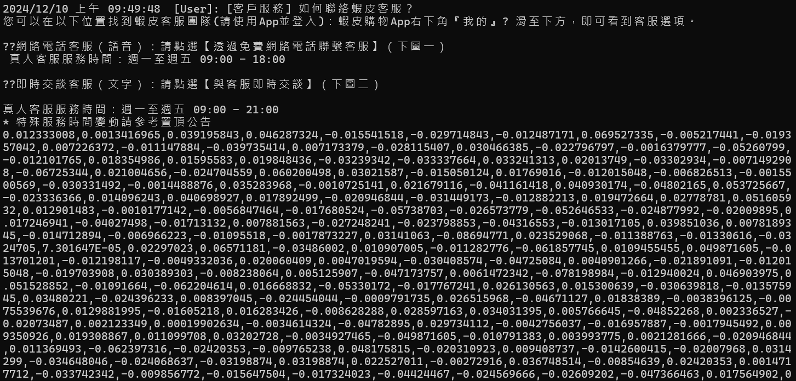

# Azure OpenAI AOAI 2.0 : 10 如何產生文字嵌入向量


內嵌 Embedding 在大語言模型中，扮演著一個重要的角色，這個功能可以讓我們將文字轉換成向量，這個向量可以用來計算文字之間的相似度，這個功能在自然語言處理中，是一個非常重要的功能。

為什麼需要用到內嵌 Embedding呢? 這是因為在自然語言處理中，我們需要將文字轉換成數字，這樣才能夠進行數學運算，而這個轉換過程，就是透過 Embedding 來完成的。而甚麼是 Embedding 呢? Embedding 是一個將文字轉換成向量的過程，這個向量可以用來表示文字的特徵，這樣我們就可以用這個向量來計算文字之間的相似度。

對於擁有了大量的 Embedding 之後，我們就可以用這些 Embedding 來進行文字之間的相似度計算，這樣我們就可以找到相似的文字，這個功能在自然語言處理中，是一個非常重要的功能。

而要進行 Embedding 相似度運算，可以有不同的演算法，不過，在這篇文章僅描述如何將本文文字轉換成 Embedding 向量，這個功能是透過 Azure OpenAI AOAI 2.0 服務來完成的。對於如何比對相似性的應用，將會在其他文章中來說明。

在 AOAI 中，提供兩種生成 Embedding 的模型，分別是 text-embedding-3-large / text-embedding-3-small，這兩個模型的差異在於模型的大小，大模型的 Embedding 向量維度較大，而小模型的 Embedding 向量維度較小，這樣的設計是為了讓使用者可以根據自己的需求來選擇適合的模型。

對於 text-embedding-3-large 模型，可以產生出最大 3072 維度的 Embedding 向量，而 text-embedding-3-small 模型，可以產生出 1536 維度的 Embedding 向量，對於要輸入最大 Token 數量，則皆為 8191 ，這樣的設計是為了讓使用者可以根據自己的需求來選擇適合的模型。

## 建立測試專案

請依照底下的操作，建立起這篇文章需要用到的練習專案

* 打開 Visual Studio 2022 IDE 應用程式
* 從 [Visual Studio 2022] 對話窗中，點選右下方的 [建立新的專案] 按鈕
* 在 [建立新專案] 對話窗右半部
  * 切換 [所有語言 (L)] 下拉選單控制項為 [C#]
  * 切換 [所有專案類型 (T)] 下拉選單控制項為 [主控台]
* 在中間的專案範本清單中，找到並且點選 [主控台應用程式] 專案範本選項
  > 專案，用於建立可在 Windows、Linux 及 macOS 於 .NET 執行的命令列應用程式
* 點選右下角的 [下一步] 按鈕
* 在 [設定新的專案] 對話窗
* 找到 [專案名稱] 欄位，輸入 `csEmbeddings` 作為專案名稱
* 在剛剛輸入的 [專案名稱] 欄位下方，確認沒有勾選 [將解決方案與專案至於相同目錄中] 這個檢查盒控制項
* 點選右下角的 [下一步] 按鈕
* 現在將會看到 [其他資訊] 對話窗
* 在 [架構] 欄位中，請選擇最新的開發框架，這裡選擇的 [架構] 是 : `.NET 8.0 (長期支援)`
* 在這個練習中，需要去勾選 [不要使用最上層陳述式(T)] 這個檢查盒控制項
  > 這裡的這個操作，可以由讀者自行決定是否要勾選這個檢查盒控制項
* 請點選右下角的 [建立] 按鈕

稍微等候一下，這個 背景工作服務 專案將會建立完成

## 安裝要用到的 NuGet 開發套件

因為開發此專案時會用到這些 NuGet 套件，請依照底下說明，將需要用到的 NuGet 套件安裝起來。

### 安裝 Azure.AI.OpenAI 套件

請依照底下說明操作步驟，將這個套件安裝到專案內

* 滑鼠右擊 [方案總管] 視窗內的 [專案節點] 下方的 [相依性] 節點
* 從彈出功能表清單中，點選 [管理 NuGet 套件] 這個功能選項清單
* 此時，將會看到 [NuGet: csEmbeddings] 視窗
* 切換此視窗的標籤頁次到名稱為 [瀏覽] 這個標籤頁次
* 在左上方找到一個搜尋文字輸入盒，在此輸入 `Azure.AI.OpenAI`
* 在視窗右方，將會看到該套件詳細說明的內容，其中，右上方有的 [安裝] 按鈕
  > 請確認有取消 Pre-release 這個選項，與選擇 2.0 正式版
* 點選這個 [安裝] 按鈕，將這個套件安裝到專案內

## 修改 Program.cs 類別內容

在這篇文章中，將會把會用到的新類別與程式碼，都寫入到 [Program.cs] 這個檔案中，請依照底下的操作，修改 [Program.cs] 這個檔案的內容

* 在專案中找到並且打開 [Program.cs] 檔案
* 將底下的程式碼取代掉 `Program.cs` 檔案中內容

```csharp
using Azure.AI.OpenAI;
using OpenAI.Chat;
using OpenAI.Embeddings;
using System.ClientModel;

namespace csEmbeddings;

internal class Program
{
    static void Main(string[] args)
    {
        string apiKey = System.Environment.GetEnvironmentVariable("AOAILabKey");
        AzureOpenAIClient azureClient = new(
            new Uri("https://gpt4tw.openai.azure.com/"),
            new System.ClientModel.ApiKeyCredential(apiKey));
        //EmbeddingClient embeddingClient = azureClient.GetEmbeddingClient("text-embedding-3-large");
        EmbeddingClient embeddingClient = azureClient.GetEmbeddingClient("text-embedding-3-small");

        string userPrompt = "[客戶服務] 如何聯絡蝦皮客服？\n" +
        "您可以在以下位置找到蝦皮客服團隊(請使用App並登入)：蝦皮購物App右下角『我的』➜ 滑至下方，即可看到客服選項。\n\n" +
        "🔹網路電話客服（語音）：請點選【透過免費網路電話聯繫客服】（下圖一）\n" +
        " 真人客服服務時間：週一至週五 09:00 - 18:00\n\n" +
        "🔹即時交談客服（文字）：請點選【與客服即時交談】（下圖二）\n\n" +
        "真人客服服務時間：週一至週五 09:00 - 21:00\n" +
        "* 特殊服務時間變動請參考置頂公告";

        Console.WriteLine($"{DateTime.Now}  [User]: {userPrompt}");

        ClientResult<OpenAIEmbedding> embedding = 
            embeddingClient.GenerateEmbedding(userPrompt);

        ReadOnlyMemory<float> vector = embedding.Value.ToFloats();

        foreach (var value in vector.Span)
        {
            Console.Write($"{value},");
        }

        Console.WriteLine();
    }
}
```

由於在這裡需要將傳入的 Prompt 文字，生成出 Embedding 向量，在這個範例中，所要使用的模型名稱，將會設定到變數 `embeddingClient` 中，這裡使用的是 `text-embedding-3-small` 模型，這個模型可以生成出 1536 維度的 Embedding 向量。而該物件的型別則是 `EmbeddingClient`，這個物件是由 `AzureOpenAIClient` 這個物件所產生出來的。

在此要計算的本文將會儲存在 userPrompt 物件內，這裡的內容將會從網路上隨機抓取一段文字，這段文字將會用來計算 Embedding 向量。

若要取得該文字的 Embedding 向量，將會呼叫 `embeddingClient.GenerateEmbedding(userPrompt)` 方法，這個方法將會回傳一個 `ClientResult<OpenAIEmbedding>` 物件，這個物件將會包含了該文字的 Embedding 向量。

透過敘述 `ReadOnlyMemory<float> vector = embedding.Value.ToFloats();` 這個敘述，將會取得該 Embedding 向量的數值，這個數值將會是一個 `ReadOnlyMemory<float>` 物件，這個物件將會包含了該 Embedding 向量的數值。

最後，透過 `foreach` 迴圈，將會將該 Embedding 向量的數值 `vector.Span`，逐一印出到螢幕上。


## 執行測試專案
* 按下 `F5` 開始執行專案
* 將會看到輸出結果



這裡將會使採用 [text-embedding-3-small] 模型產生的 1536 個向量

```plaintext
0.012333008,0.0013416965,0.039195843,0.046287324,-0.015541518,-0.029714843,-0.012487171,0.069527335,-0.005217441,-0.019357042,0.007226372,-0.011147884,-0.039735414,0.007173379,-0.028115407,0.030466385,-0.022796797,-0.0016379777,-0.05260799,-0.012101765,0.018354986,0.01595583,0.019848436,-0.03239342,-0.033337664,0.033241313,0.02013749,-0.03302934,-0.0071492908,-0.06725344,0.021004656,-0.024704559,0.060200498,0.03021587,-0.015050124,0.01769016,-0.012015048,-0.006826513,-0.0015500569,-0.030331492,-0.0014488876,0.035283968,-0.0010725141,0.021679116,-0.041161418,0.040930174,-0.04802165,0.053725667,-0.023336366,0.014096243,0.040698927,0.017892499,-0.020946844,-0.031449173,-0.012882213,0.019472664,0.02778781,0.051605932,0.012901483,-0.0010177142,-0.0056847464,-0.017680524,-0.05738703,-0.026573779,-0.052646533,-0.024877992,-0.02009895,0.017246941,-0.04027498,-0.01713132,0.007881563,-0.027248241,-0.023798853,-0.04316553,-0.013017105,0.039851036,0.0078189345,-0.014712894,-0.006966223,-0.01095518,-0.0017873227,0.03141063,-0.08694771,0.023529068,-0.011388763,-0.01330616,-0.0324705,7.301647E-05,0.02297023,0.06571181,-0.03486002,0.010907005,-0.011282776,-0.061857745,0.0109455455,0.049871605,-0.013701201,-0.012198117,-0.0049332036,0.020060409,0.0047019594,-0.030408574,-0.04725084,0.0040901266,-0.021891091,-0.012015048,-0.019703908,0.030389303,-0.008238064,0.005125907,-0.047173757,0.0061472342,-0.078198984,-0.012940024,0.046903975,0.051528852,-0.01091664,-0.062204614,0.016668832,-0.05330172,-0.017767241,0.026130563,0.015300639,-0.030639818,-0.013575945,0.03480221,-0.024396233,0.008397045,-0.024454044,-0.0009791735,0.026515968,-0.04671127,0.01838389,-0.0038396125,-0.0075539676,0.0129881995,-0.01605218,0.016283426,-0.008628288,0.028597163,0.034031395,0.005766645,-0.04852268,0.002336527,-0.02073487,0.002123349,0.00019902634,-0.0034614324,-0.04782895,0.029734112,-0.0042756037,-0.016957887,-0.0017945492,0.009350926,0.019308867,0.011099708,0.03202728,-0.0034927465,-0.049871605,-0.010791383,0.003993775,0.0021281666,-0.020946844,0.011369493,-0.062397316,-0.02420353,-0.009765238,0.048175815,-0.020310923,0.009408737,-0.0142600415,-0.02007968,0.0314299,-0.034648046,-0.024068637,-0.03198874,0.03198874,0.022527011,-0.00272916,0.036748514,-0.00854639,0.02420353,0.0014717712,-0.033742342,-0.009856772,-0.015647504,-0.017324023,-0.04424467,-0.024569666,-0.02609202,-0.047366463,0.017564902,0.009745968,0.038791165,-0.0021341885,-0.00093280425,0.0062676733,-0.031025225,-0.015512613,-0.0005007274,-0.011099708,0.0013151998,0.066598244,0.004627287,0.007240825,-0.023240013,0.0050921836,0.016649561,0.009991664,0.015984736,0.039812494,-0.032451227,0.010232544,0.01031926,-0.05738703,-0.03312569,0.047597706,-0.03661362,-0.01414442,-0.0030495292,-0.029657032,-0.02129371,0.007655137,-0.0009538811,-0.006219498,0.042124934,0.04671127,-0.021736927,0.009244939,-0.0030230323,0.014703259,0.060393203,0.009982029,0.0048850277,0.025629533,-0.035052724,-0.012467901,0.02191036,-0.010386705,-0.024743099,0.022122335,-0.027479485,-1.3013116E-05,0.018566959,-0.019607557,-0.03767349,0.023278553,-0.06324521,0.004328597,0.030331492,0.019886976,0.0053378805,0.01892346,-0.033954315,0.060778607,-0.023201473,0.01838389,0.047019597,0.024588937,0.00218116,0.012573888,0.014076973,-0.014500921,0.0033674894,0.06995128,-0.045323808,-0.0071878317,0.045786295,-0.046248782,0.016418317,-0.078391686,-0.0024051776,0.020850493,0.030350763,0.0064555593,-0.028847678,-0.07288037,-0.020908304,0.013681931,0.0014910415,-0.02237285,-0.028809138,-0.0074190754,-0.06351499,-0.013257984,0.032181446,0.009047418,-0.04197077,0.026805023,0.036401644,0.0119572375,-0.025513912,-0.03258612,0.014558732,0.0146358125,0.009529176,0.023895204,0.020272383,0.009211216,0.028231028,0.0041623903,0.010589045,-0.038521383,-0.014992313,0.006378478,0.013123092,0.023509799,0.036941215,-0.0072697303,-0.05966093,-0.043011367,0.04135412,-0.034147017,-0.05619227,-0.017295118,-0.05376421,0.028057596,0.024184259,-0.0038781532,-0.05129761,0.05962239,-0.04771333,-0.014057703,0.025841508,-0.005501678,-0.018798202,0.005063278,-0.024550395,-0.02482018,-0.009904948,0.0057425573,-0.098972395,0.03906095,-0.026862834,0.030543467,0.054111075,0.024434773,-0.014125149,0.031564794,0.018788569,-0.014529826,-0.008271787,-0.02250774,-0.007125203,0.053532965,0.0026448523,0.0008888438,-0.0009400306,0.011456209,0.0777365,0.018056296,0.030003898,-0.036941215,-0.00934129,-0.03547667,0.0010863646,0.015281369,-0.023548339,-0.032855906,0.0212359,-0.018354986,-0.0017608261,0.0006636219,-0.007009581,0.031449173,-0.025552452,0.023182202,0.010608315,0.050603878,-0.061780665,-0.0075539676,0.02541756,0.0032639115,-0.0069517703,-0.057078704,-0.019135434,-0.018249,0.049833063,-0.017863592,0.05850471,0.01585948,-0.04728938,-0.004904298,-0.0069517703,0.031005954,-0.011581466,-0.05017993,0.051336147,0.010078381,-0.015792033,0.028674245,-0.0058437265,0.01765162,-0.055305835,0.023895204,0.006783155,0.01535845,0.022604093,-0.021505684,-0.04424467,0.006272491,-0.028654976,-0.0016656788,-0.001617503,0.012227022,0.030370034,-0.047482084,-0.012940024,0.032123633,0.038694814,0.001715059,-0.054149617,0.016678467,0.06948879,-0.014568366,-0.01274732,0.0013597624,0.0076165963,-0.010762477,-0.045362346,-0.016042547,0.016957887,0.050758038,0.052762154,-0.04035206,-0.026169103,-0.01798885,0.015281369,-0.016717007,-0.039812494,-0.018393526,0.032971527,0.024569666,0.0059015374,-0.030389303,-0.05854325,-0.029098192,-0.014433474,-0.0068650534,-0.005920808,-0.04547797,-0.03788546,-0.030793982,0.029329436,0.031063765,0.046518568,0.023798853,0.007891199,-0.0329908,-0.020484356,0.018181553,0.012824402,-0.019154703,0.046981055,-0.033877235,-0.009355743,-0.008994425,-0.020233842,0.010521598,0.019116163,0.014192595,-0.00047844608,0.012679875,0.002659305,-0.03320277,0.020831222,-0.01944376,0.011070802,0.035322506,0.078391686,-0.023471257,0.03611259,0.013768648,-0.012400455,-0.024319151,-0.0045959726,0.013893905,0.014086609,0.007077027,-0.036844864,0.01683263,-0.0065952693,-0.040043738,-0.016206345,0.039928116,0.000551312,0.012227022,-0.017102415,-0.047173757,0.024955072,-0.024049368,0.022835337,0.028038325,-0.0034614324,0.016505035,-0.0076406845,0.034628775,-0.052646533,-0.041739527,0.019308867,-0.07322724,-0.023336366,0.008189889,-0.006884324,0.02609202,0.054149617,-0.040043738,-0.021004656,-0.033472557,0.011918697,0.021640576,0.030928873,0.0057040164,0.012140306,-0.040621847,-0.035650104,0.01183198,0.011610371,-0.0017367381,-0.05083512,-0.0017933447,-0.022719715,0.033434015,-0.020484356,-0.022083793,-0.009259392,-0.028231028,-0.007313089,-0.037557866,-0.0014633404,0.038232327,-0.02609202,-0.016360506,0.01898127,0.015965465,0.006021977,-0.0045839287,0.000100115365,0.017304752,-0.030485656,0.012400455,-0.023509799,-0.024473313,0.021409333,0.0103578,-0.016928982,-0.032374147,0.010165097,0.011388763,0.004571885,-0.0076840427,0.015146476,0.022854608,-0.0056799287,-7.9640646E-05,0.005848544,-0.023471257,-0.026882105,-0.015213923,0.026438888,0.019453393,0.023991557,0.001998092,-0.010569774,0.00400341,0.011224965,0.0057521923,-0.004412905,-0.037981812,0.004106988,-0.035110533,0.052145503,-0.01476107,0.013739742,0.012911119,0.036324564,0.026805023,-0.009114864,-0.03788546,0.03726881,0.0071878317,-0.019395582,0.03551521,0.05445794,-0.026381077,-0.0018029799,0.014847786,-0.0103096245,3.0222796E-05,0.058080763,0.020465087,-0.022700444,-0.015069395,0.012063224,0.021447873,-0.038058896,-0.041623905,0.038771898,0.05865887,-0.038733356,0.0047959024,-0.0070384867,-0.0354574,0.012679875,0.011860886,0.003442162,0.0003673406,0.01743001,0.028231028,0.040621847,0.01718913,0.0064507416,0.025937859,0.0029483598,-0.012265563,0.03191166,-0.029695572,0.008729458,-0.040930174,0.01884638,-0.023741042,0.013778283,0.04489986,-0.001934259,0.0062917615,-0.049409118,-0.0048392606,-0.05249237,0.026939915,0.0129881995,-0.010492693,0.014414204,-0.0028182853,-0.006436289,0.0013597624,-0.03426264,0.0072022844,-0.0056943814,0.003037485,-0.00029658235,-0.008907708,0.012824402,0.014366028,-0.011292411,0.03189239,-0.01476107,-0.012834037,-0.030003898,-0.013277255,0.01214994,0.039966658,-0.050603878,0.022392118,-0.03073617,-0.0047814497,-0.019289596,-0.004465898,0.015666775,0.014308217,0.028539352,-0.002376272,0.0039431904,0.03829014,0.039446358,-0.0011718767,0.02302804,-0.010299989,-0.025648804,0.0030784346,0.0018258634,-0.024781639,0.0139806215,-0.0042539244,0.01005911,0.030582007,-0.0045405705,0.008122442,-0.0026737577,0.024126448,0.03308715,-0.03362672,0.009158223,-0.027383134,-0.01705424,0.01575349,-0.0011652525,0.02954141,0.02778781,-0.015156112,0.059468225,-0.008517484,0.000569679,0.021717658,-0.018817473,-0.040506225,0.041816607,0.0129689295,-0.011697088,-0.015425896,-0.04840706,0.005559489,-0.005501678,0.0076262318,0.016129263,-0.025051424,0.0010863646,-0.003789028,0.012785861,0.0307169,-0.010772112,-0.0029001841,-0.011138248,-0.0071300208,0.0012206547,-0.029811194,0.03736516,-0.036363106,-0.0057377396,0.032740284,-0.01854769,0.03179604,0.042279094,-0.02416499,0.007332359,-0.009225668,0.0067542493,0.01681336,-0.0040780827,0.019886976,0.005713652,-0.038656276,0.051451772,0.052530907,0.0075684204,0.00501992,0.007077027,-0.068833604,0.011147884,0.007289001,-0.028770598,-0.01444311,-0.02133225,-0.009692974,0.012544982,0.025533183,-0.0025653623,0.014770705,0.02842373,-0.08239991,0.06324521,0.010386705,0.0014777931,-0.023972286,0.0019691864,-0.026381077,-0.02489726,-0.018817473,-0.009182311,0.011629642,0.024396233,0.03239342,-0.011494749,0.009982029,0.014529826,0.03829014,0.0064314716,-0.033318393,-0.031622604,-0.021081736,-0.0034999729,-0.019491935,-0.028654976,-0.031449173,0.04832998,0.024376962,-0.024376962,-0.035052724,0.04563213,0.01681336,-0.018056296,0.007852658,-0.0030447114,0.021139547,-0.020542167,-0.026959186,-0.059005737,-0.010521598,-0.00048055375,-0.011388763,0.002428061,-0.021717658,-0.011273141,-0.05908282,-0.014867056,-0.02957995,0.0064073834,0.016996428,-0.0028760962,-0.0076406845,-0.022950958,-0.02364469,0.011803075,-0.025340479,-0.02836592,0.0010008526,0.011571831,0.022681173,0.04274158,0.014491285,-0.01689044,-0.03709538,0.012043954,0.0069325,0.027980514,0.025475372,-0.0062917615,0.010165097,0.0071203853,0.020310923,0.034840748,0.08926015,0.012217387,-0.005386056,0.011465844,0.0045213,0.047366463,-0.018538054,-0.0361704,-0.0011417668,0.009452095,-0.02177547,0.021062467,0.024608206,-0.00679279,0.011783805,-0.008459673,-0.020156762,0.0005492043,0.012901483,0.0070047635,0.03784692,-0.008392227,-0.02601494,-0.026785754,0.0027893798,0.039292194,-0.021679116,-0.015869113,0.009866407,-0.009008878,-0.018566959,-0.01769016,-0.0051403595,-0.0020125448,0.03191166,0.01625452,-0.05017993,-0.02539829,-0.012641334,-0.04262596,-0.010049475,-0.016736278,0.012641334,-0.027440945,0.004526118,-0.005275252,0.02241139,-0.005434232,0.025051424,-0.026959186,-0.027383134,0.017025333,-0.011928332,-0.012535347,-0.0038540652,0.029252356,-0.018634405,0.03198874,-0.012920754,-0.019694272,-0.0022871469,-0.0099338535,-0.04848414,0.0023690457,0.055305835,-0.010540868,-0.010136192,0.02535975,0.008609018,-0.03428191,0.008719822,0.042818666,0.0056799287,0.011330952,0.0009960349,0.0052800695,-0.0041720257,0.009885677,-0.016803725,0.0074672513,-0.015262098,0.017468551,-0.012602793,0.0122944685,0.0030350764,0.0129881995,-0.0050921836,-0.024646748,0.051104903,-0.00663381,0.035958428,0.0058340915,0.015734222,0.006826513,0.021602036,0.009071506,-0.012419725,-0.013913175,0.026323266,0.032643933,-0.036131863,0.0010833537,-0.009586987,0.003960052,-0.008676465,-0.004608017,0.015319909,0.0017499864,-0.017458916,0.0136048505,0.022083793,-0.01535845,-0.0009617097,0.0009857976,0.017083144,-0.058735956,-0.0021510501,-0.008604201,0.0043791817,-0.026785754,-0.010511963,0.008931796,-0.011687453,0.007862293,0.010820288,-0.005848544,0.022122335,0.013970986,-0.035071995,-0.065095164,0.033645988,0.017256577,-0.024492584,-0.045978997,-0.02773,0.025841508,0.0023497753,-0.021351522,-0.011783805,0.0053137923,-0.03141063,-0.025321208,-0.0074046226,0.0074576163,0.03557302,-0.009018512,-0.0319502,0.008464491,0.048638303,0.010791383,-0.017063873,0.025629533,0.028635705,0.076657355,0.025301939,-0.026342535,0.0052897045,-0.0017752788,0.017324023,-0.009269027,0.026766483,0.03599697,0.011282776,0.011860886,0.00011915987,-0.004099762,0.046171702,-0.01651467,0.001721081,0.01621598,0.016273791,0.011369493,0.015936559,0.037712026,0.013383241,0.0012887031,-0.012072859,0.051066365,-0.021679116,0.017796146,0.030292952,-0.015531883,-0.028789867,-0.06621284,-0.0032036917,-0.02360615,0.012092129,-0.031776767,0.010849194,-0.042240556,-0.0052415286,-0.0035505577,0.004114215,-0.0020546985,0.016042547,0.009456913,0.015242828,0.0031049312,-0.009582169,0.032624662,-0.0032976347,-0.026747212,0.0071541085,-0.007977915,-0.0049765618,0.014674353,0.053532965,0.020811953,0.007019216,-0.02250774,0.032701742,0.020889033,0.011330952,0.023856664,-0.018143011,0.019694272,0.023259284,0.019983329,0.029098192,-0.025822237,-0.008170619,0.0043791817,0.011880156,-0.0142793115,0.01715059,-0.005573942,-0.02129371,0.013171268,-0.03470586,-0.027710728,0.03838649,-0.013922811,0.0401979,-0.0040443595,0.010001299,0.005275252,0.030466385,-0.010367435,-0.013209809,-0.02888622,0.0042418805,-0.014240771,0.015637869,-0.009307568,-0.0069903107,-0.0319502,-0.01769016,-0.047173757,-0.011138248,-0.034532424,0.028462272,0.049755983,-0.015165746,0.017863592,0.0065567284,-0.028231028,-0.014992313,0.01214994,-0.013392877,0.019684639,-0.014973043,0.071762696,-0.014028798,0.00531861,0.0019884568,0.026130563,-0.007289001,0.034089208,4.9163796E-06,-0.020985385,0.018152647,0.039619792,-0.003786619,0.024550395,-0.038675543,0.0020510852,-0.003960052,0.011041896,0.020503627,0.002890549,0.023355635,0.028789867,-0.03075544,0.045208186,0.016977157,0.022719715,0.055729784,0.0168519,-0.0018354986,0.032643933,0.010714301,0.0054824078,0.024473313,-0.0016741096,0.00902333,0.0136241205,0.057078704,0.0266894,-0.0023437534,0.018470608,-0.03008098,0.0042852387,-0.0031988742,0.011485115,-0.035149075,-0.009895313,-0.04243326,0.03667143,-0.022623362,-0.028809138,0.00607497,0.01623525,-0.013508499,-0.037519325,-0.004617652,0.001218246,-0.010377071,0.016360506,-0.01272805,-0.010030204,-0.004995832,-0.0077177654,0.0037023113,0.0146165425,-0.013990257,0.011494749,-0.02362542,0.04890809,-0.02902111,0.008522302,-0.007886381,-0.009847136,0.018412797,0.011186425,0.015185017,0.0089799715,-0.0030904785,-0.019010177,0.014337122,-0.0102903545,0.0048778015,0.01416369,-0.01741074,-0.0025171863,0.006884324,-0.002635217,0.03081325,-0.012959294,-0.005920808,-0.004776632,0.022180146,-0.03767349,-0.007019216,0.002083604,0.011995778,0.042163473,0.025841508,-0.012882213,-0.015117571,-0.0074094404,-0.0060557,-0.015406625,-0.019906247,0.0011809097,0.0034156654,0.035842806,0.015724586,0.008690917,0.0068216952,-0.01031926,0.031853847,0.02067706,0.011542926,-0.0024376963,0.019983329,-0.039928116,0.0016235249,0.0029989446,-0.028751327,-0.010878099,-0.007009581,-0.024531126,-0.0011887383,-0.04258742,2.8585571E-05,-0.035322506,-0.028173218,-0.0048488956,0.006412201,-0.0021305755,0.049062252,0.026920646,0.028866949,-0.035264697,-0.019655732,-0.014433474,0.0052993395,-0.008209159,0.03306788,0.051181987,0.0022245182,-0.00051427685,0.025841508,-0.015589694,-0.021447873,-0.005222258,-0.049139332,0.02244993,0.0053908736,0.0065567284,-0.019588286,-0.032759555,-0.004398452,-0.040429145,0.023336366,0.026072752,-0.018354986,0.0009906152,0.010695031,0.0449384,-0.001922215,-0.011022626,0.0061520515,0.011523655,0.032778826,-0.036883403,0.0025725886,-0.0098037785,0.011330952,-0.014327488,0.005559489,0.001410347,-0.059314065,0.008739093,-0.002083604,-0.001721081,-0.02183328,0.011889791,-0.013836094,0.03724954,-0.013469958,-0.015474072,0.002007727,0.009664069,-0.012178846,0.004246698,0.058234926,-0.00014279613,-0.02956068,-0.016649561,0.01155256,-0.03193093,0.0036011422,-0.00963998,0.023953015,0.021929631,0.039234385,-0.014597272,-0.016023276,0.004995832,0.014346758,-0.0008749932,0.035226155,-0.02067706,0.010126556,0.017776877,-0.0142985815,0.02956068,0.017882863,-0.0023979512,-0.012997835,-0.0070433044,0.0068313307,0.010598679,-0.009389467,0.038598463,0.010136192,0.0029194544,0.040429145,-0.0025364566,-0.016842265,0.018181553,-0.009269027,-0.01537772,-0.01920288,0.003384351,0.00902333,0.0194823,-0.028539352,-0.045747753,0.012814767,-0.01804666,-0.013681931,0.0015608964,0.01625452,-0.0010562547,0.012670239,-0.007057757,0.012766591,-0.018162282,0.0013621711,-0.026978457,0.0106275845,0.014712894,0.03900314,-0.018576594,-0.014086609,-0.018663311,0.021447873,0.03410848,0.0426645,0.035919886,0.024010826,-0.015888384,-0.016109992,-0.0033674894,-0.019019812,0.0047380915,0.004779041,0.035052724,0.014655083,0.032354876,-0.023529068,0.0010237361,0.0005455911,0.005227076,0.024068637,0.008854715,-0.0065567284,-0.0062821265,0.010078381,0.013787919,0.016187074,0.003316905,0.00651337,-0.0119765075,0.022854608,0.020754142,-0.001806593,0.022488471,0.0063351197,0.009755603,0.011446574,-0.0018258634,0.011668183,-0.010405976,0.0019005359,0.01922215,0.024068637,-0.017275847,-0.025764426,0.030292952,-0.009244939,-0.012024684,-0.0022943732,-0.0043430496,-0.025032153,0.016187074,-0.026400346,-0.022758255,-0.015204287,0.0017680525,0.0472123,0.01774797,0.029637761,0.004273195,0.018114107,-0.0051499945,0.012679875,-0.01890419,-0.040814552,-0.038097434,-0.03210436,0.008117625,0.015396991,-0.031063765,-0.019530475,0.012121035,-0.003155516,0.016919347,0.014674353,-0.003177195,0.023798853,0.030697629,0.019829165,0.012766591,-0.045670673,0.0050343727,0.012487171,-0.029637761,-0.027575837,-0.028153947,0.007525062,-0.018065931,0.02133225,-7.553817E-05,-0.009572535,0.012188481,0.032547582,0.030582007,0.032701742,-0.023432717,-0.021736927,-0.015069395,0.031179387,0.015281369,-0.007833388,-0.021467144,0.03908022,-0.0030543467,-0.02549464,-0.004367138,0.013450688,0.013797553,0.0034036213,0.07133875,-0.019617192,0.031622604,0.04840706,0.025475372,0.008464491,0.0009918195,0.0027990148,-0.0126124285,0.031526253,0.013412147,-0.031873118,0.04127704,-0.044051964,0.0024292655,-0.003063982,0.013893905,0.040968712,-0.00045767025,0.010801018,0.0034036213,0.037981812,0.04621024,-0.017218037,0.003981731,0.032181446,0.073458485,0.02665086,0.001876448,-0.004547797,0.0069999457,0.025513912,0.021043196,0.013730107,-0.02364469,0.026438888,0.03015806,0.015493342,0.011051532,-0.0071878317,0.0005735933,-0.003487929,-0.016726643,-0.012381185,-0.00792974,0.0069951285,0.018220093,0.013209809,-0.0061954097,0.010280719,-0.025899319,0.010926275,0.013315795,-0.015233193,0.001157424,-0.0045453883,-0.022276497,-0.00665308,0.0014645448,0.008700552,-0.014019162,-0.0021365974,0.039272923,0.024723828,0.016543575,-0.011465844,-0.015792033,-0.026670132,-0.007953827,-0.027807081,-0.011745264,0.0012381185,-0.0007123999,-0.01689044,0.056462057,-0.010049475,-0.006388113,0.023143662,-0.025321208,0.04135412,0.00095087016,-0.0014982679,-0.015705315,-0.0067976075,-0.02004114,-0.006768702,-0.01770943,0.0041816607,0.006783155,0.04786749,-0.024184259,-0.026072752,-0.0027026632,-0.03609332,0.0016861536,-0.0034373445,-0.00014053789,0.011504385,0.029001841,-0.001154413,-0.010415611
```

若改成 [text-embedding-3-large] 模型，將會得到 3072 維度更好的結果。

```plaintext
-0.059536025,-0.031905506,-0.007211585,0.00677036,-0.0014523672,-0.015148741,0.042004663,0.011658157,0.026042107,-0.032631073,0.02866985,5.9404574E-05,0.012766124,-0.032297704,0.007995986,0.006451697,0.0027821718,0.0275913,-0.02694417,0.020923892,-0.025140047,0.029669961,-0.008687239,0.018207904,0.03527843,0.036455028,-0.010893366,0.002293147,0.017521555,-0.04831909,-0.01412902,0.043102827,0.009800108,-0.03955341,-0.043808788,-0.0013077433,-0.0010252364,-0.030042551,0.05671218,-0.0036719765,0.009947184,-0.026002888,0.01444278,-0.020296372,0.0047333688,-0.014952641,0.04373035,0.034376368,0.011903283,0.0062604994,0.040788844,-0.012628853,-0.008574482,-0.011442447,0.011687572,0.014521221,0.0064664045,0.024336036,0.031846672,-0.07032154,-0.022649575,-0.049378034,-0.004076433,-0.008182282,0.011805233,0.051064495,-0.026708849,0.014079995,-0.01980612,0.023041775,0.016825398,-0.0283757,0.011471862,-0.00935398,-0.03516077,-0.017325453,0.01831576,0.00968735,0.058006443,-0.031356424,-0.008858827,0.031297594,0.049731012,0.012795539,-0.008554872,-0.010069746,-0.024747847,-0.06592889,0.006814482,0.023688905,0.0032258485,-0.032336924,0.015982168,-0.022394644,0.03523921,-0.022708405,-0.0087313615,0.0018249576,-0.00677036,0.015374256,0.018227514,0.023041775,-0.019462945,-0.003804344,0.01757058,0.021178823,0.0026326454,0.0066232844,-0.006015374,-0.026022498,0.0005444845,0.0055937585,0.032709517,0.0369845,0.007780276,0.013491695,0.0040200544,-0.026414698,-0.012197433,-0.042475305,0.012844563,-0.047730792,0.012315094,-0.00057972124,-0.0012250135,-0.00074640644,0.034376368,0.0283757,0.04573057,-0.019531582,0.0029635644,-0.011030637,-0.0057898588,0.019649241,-0.011491472,0.018090244,0.021041553,-0.015854701,-0.018286346,0.018619714,0.0061085215,0.01845303,-0.0385533,-0.015678212,-0.011109077,-0.00876568,0.014658491,-0.025473418,-0.06318349,0.032807566,-0.024159545,-0.045965888,0.023316314,-0.016139047,0.026414698,-0.04733859,0.013668185,-0.07020388,0.0039440654,0.060477305,-0.0031498596,0.024787067,-0.02802272,0.0008432309,0.008535261,0.0051966556,0.020433642,-0.04047508,0.010001111,-0.0039220043,-0.016403783,0.022022054,0.019904172,0.0073978803,0.012844563,0.010148186,-0.0025958766,-0.041377146,-0.003637659,-0.021276873,-0.006074204,0.016795984,0.019139381,-0.020100271,-0.008540164,-0.0054662935,-0.007255708,-0.0076184934,-0.018423615,-0.019423725,-0.015256597,-0.009172588,0.005230973,-0.029140491,-0.044906948,0.006897825,0.021551413,0.019511972,0.01356033,0.02755208,-0.014472196,-0.006441892,-0.004142617,0.008216599,0.004640221,-0.006642895,-0.017776484,-0.024571355,0.015942948,0.014511416,0.016894033,0.011030637,-0.0040739817,0.010167796,-0.07498872,4.940806E-05,-0.00060821703,0.020786623,0.019590411,-0.021374922,-0.03688645,0.0023789406,-0.0031596646,0.011991528,-0.04690717,-0.000624763,-0.02023754,0.02796389,0.008035206,0.020982722,-0.012481778,-0.041690905,-0.0054957084,-0.070674516,-0.014589855,-0.024296816,-0.029081661,-0.031572133,-0.022414254,-0.016168462,0.0056574913,0.032023165,0.03586673,0.029905282,-0.033278205,-0.029493472,0.011177712,0.03886706,-0.0007868521,-0.004684344,-0.0395338,-0.001561448,-0.0050691906,0.021963224,0.032631073,-0.0033606673,0.005897714,-0.024512526,-0.004596099,0.0054564886,0.0049784943,-0.021884784,-0.021531804,-0.0060693016,0.01422707,-0.01416824,0.040749624,0.0027870743,0.0056672962,0.033866506,0.03849447,0.015050692,0.0057114186,0.02021793,-0.04545603,0.015119326,0.015531137,-0.039984833,0.0055643436,0.015697822,-0.061026387,0.035435308,0.028512971,-0.024296816,0.0055153184,0.017698044,-0.024669407,-0.030317092,0.0021938712,0.024257597,0.002385069,-0.040200543,-0.0009529245,0.016717544,0.007054705,-0.022159323,0.019227626,0.027650129,-0.0042553744,0.051182155,-0.023551635,-0.029081661,-0.030375922,-0.0071527553,-0.007525346,0.033552747,0.00075376016,0.013923115,0.019541387,0.010628631,0.04376957,-0.02843453,-0.03590595,0.004870639,-0.016913643,0.013030859,-0.01416824,-0.020080661,-0.024885116,-0.052241094,0.023237875,0.02761091,-0.034121435,0.0060006664,0.03510194,0.007211585,-0.0032233973,-0.02800311,0.01857069,0.0047505274,-0.016678322,-0.016884228,0.034964666,0.00053743715,-0.00015305009,0.00041487452,-0.030925004,0.0016705287,0.008814705,0.008711752,0.024453696,-0.033827286,0.023885006,-0.0078096907,-0.02833648,-0.026022498,-0.05514338,-0.008456822,0.011726793,-0.0027331468,0.0005015876,-0.03688645,0.006618382,0.0010675205,0.008260721,-0.041494805,-0.017815704,-0.03506272,0.0026988292,-0.02790506,0.038259152,-0.026002888,-0.01815888,0.02702261,0.043338146,-0.01815888,-0.024649797,-0.0026841217,-0.021414142,0.029375812,-0.02886595,-0.008231306,-0.0033214474,0.039788734,-0.039337702,-0.000718217,0.020688573,-0.023120215,-0.015178156,0.0061673517,0.0047872965,-0.014707516,-0.032003555,0.021316092,-0.009001,0.011177712,-0.021982834,-0.0145800505,0.03500389,0.052711736,-0.02788545,0.032984056,-0.016286122,0.016580272,0.043965667,-0.03884745,-0.011618937,0.029669961,0.006285012,0.008496041,-0.008540164,0.029140491,-0.00059504155,-0.02808155,0.00696646,-0.016550858,0.060947947,-0.0138937,0.004998104,0.0009670192,-0.009898158,0.004189191,0.009711863,0.00082116964,0.008770582,0.03708255,0.008064621,0.0050495802,0.044867728,-0.011118882,-0.0060987165,0.0011269634,-0.01438395,0.016237097,-0.0187864,5.1399704E-05,0.022786845,0.072008,0.0037675754,0.0013310302,-0.02845414,0.0024635089,-0.025061607,-0.022002444,0.01919821,0.003591085,0.03614127,-0.031140713,-0.017099937,-0.042083107,-0.02923854,-0.0035249013,-0.036435418,-0.0018568239,0.0031081883,-0.0039048453,-0.0069517526,0.021571023,0.026787288,-0.06271285,-0.018217709,-0.012354313,0.029552301,0.01984534,-0.030905394,-0.045142267,-0.032317314,-0.021669073,-0.006569357,0.0004056823,-0.017541165,-0.018090244,0.009961891,-0.0135799395,0.0027110854,0.027650129,-0.04988789,0.025512638,0.01381526,-0.0017403894,-0.0052260705,0.0118444525,0.06804677,-0.015099716,0.010226626,-0.061418585,0.0019695815,0.0031621158,-0.040024053,-0.012923004,-0.021982834,0.006858605,-0.015119326,0.020335592,-0.007804788,0.036376588,0.026689239,-0.009182393,0.04631887,0.012972029,0.020590521,0.011628742,0.031709403,0.006726237,-0.016295927,-0.04565213,0.018698156,-0.017384283,-0.005083898,0.006642895,0.0031596646,-0.022728015,-0.04475007,-0.0048755417,0.0103246765,-0.02802272,0.0075302483,0.016874423,0.035533357,0.014550636,0.008437212,0.03743553,0.023041775,0.033219375,2.0376037E-05,-0.01794317,0.020688573,-0.002718439,0.015727237,0.008412699,0.0051770457,0.032787956,-0.033356644,-0.013109299,0.008559775,0.026375478,0.004988299,-0.008422504,-0.00169259,0.008481334,0.033199765,0.0075351507,0.0049686893,0.00720178,0.0022036762,0.03500389,-0.00020115591,0.014805566,0.0072508054,-0.024120325,-0.012756319,0.033121325,0.035454918,0.012452363,-0.011030637,0.0073292456,-0.03810227,0.011422837,-0.026277428,0.029826842,0.020531692,0.0035469625,0.04463241,0.0009137044,0.04522071,-0.0037798316,-0.00052089116,0.016227292,-0.02921893,0.00935398,-0.06620343,0.020786623,0.010756097,0.012393533,0.01860991,0.0014940385,-0.0010638436,0.049966335,0.017345063,0.04525993,-0.018011805,0.00015856541,-0.026414698,-0.021100383,-0.027277539,0.016374368,0.008015596,-0.024728237,0.010912977,-0.004328912,0.0013947628,0.015462502,0.014893811,-0.020492472,-0.033474308,0.0038974916,0.051378254,-0.008878437,0.02761091,-0.012099383,0.048397534,-0.014393755,-0.015560552,0.016040998,0.02776779,0.016599882,0.0023409463,-0.016423393,0.026826508,0.0063683544,-0.0036915864,0.0052064606,0.013040664,0.012609243,-0.033984166,0.002338495,0.043455806,0.0145702455,0.033160545,0.03676879,0.009050025,0.018756986,0.022590743,-0.024120325,-0.020747403,0.0017538712,0.016825398,0.0047872965,0.029336592,-0.0073390505,-0.0100893555,-0.0063144267,0.042985167,0.015972363,0.0028924781,-0.043181267,-0.015982168,-0.009765791,-0.0049147615,-0.016639102,-0.012422948,-0.011873867,-0.012158213,0.020512082,0.030925004,0.026689239,0.015854701,-0.017668629,0.012570024,0.015982168,-0.00960891,-0.039847564,-0.002391197,0.049378034,-0.011903283,0.010059941,0.006005569,-0.022924114,0.0048485775,-0.005373146,0.001456044,-0.011158102,0.005520221,-0.0138348695,0.032905616,-0.002453704,0.017374478,0.0040323106,0.023100605,-0.034631297,0.021021942,0.0033435086,-0.017354868,0.02843453,0.016148852,0.029787622,0.01843342,-0.0066821147,0.012491584,0.022610355,-0.016746959,0.010138381,0.018502055,-0.025473418,0.011716988,-0.0008248465,0.008363674,-0.052672517,0.0365923,-7.146934E-05,-0.023649685,-0.023257485,-0.03421949,-0.029571911,0.0015406123,-0.00045930347,-0.025728347,0.028532581,0.020708183,0.001945069,0.0015136485,0.016129242,0.026748069,-0.007741056,0.008040109,-0.018325565,0.0052260705,-0.0054417807,-0.003181726,-0.013619159,-0.0028262944,0.019158991,-0.033238985,-0.0020259602,0.003007687,0.020649353,-0.0035003887,0.030022942,0.019570801,-0.008633312,0.022884894,-0.014717321,0.003917102,0.008255819,-0.01442317,0.038239542,-0.004988299,0.0105894115,0.0022281886,0.0135015,0.0036646228,0.0077018356,0.01371721,-0.0052701933,-0.006937045,-0.022296594,-0.016286122,0.008324454,-0.018217709,-0.016295927,-0.0036891352,0.0068193846,-0.024316426,0.0055251233,0.017668629,-0.008701947,0.00039649013,-0.0014315315,-0.012432753,-0.011462057,-0.005025068,-0.034709737,-0.013609354,-0.034160655,-0.011667962,-0.036396198,-0.016452808,-0.003358216,0.0054319757,-0.02923854,0.016658712,-0.042985167,0.03682762,-0.012452363,-0.021335702,0.0028459043,-0.017335258,-0.005299608,-0.015599771,-0.0058388836,0.0025591077,0.013668185,-0.016374368,0.018874645,-0.0036523663,-0.0075547607,0.016246902,-0.014256486,0.023022166,-0.00011360024,-0.043259706,0.021806343,0.00029445672,0.03716099,-0.019266846,-0.0070203873,0.0073047327,0.01011877,-0.014942836,0.015119326,-0.0055839536,-0.016903838,0.034788176,0.0266108,-0.0017685788,0.0187864,0.03753358,-0.0183942,-0.012069968,-0.012011138,0.010716877,-0.015050692,-0.017933365,0.0022710855,0.013599549,-0.0153252315,0.00072986045,-0.016472418,0.042357646,0.015854701,0.019904172,0.0027870743,0.0019732583,-0.0014327571,-0.0064664045,0.030964224,0.0066821147,-0.0057212235,-0.023218265,-0.0023029519,-0.050554633,0.0064075743,-0.011177712,0.02780701,-0.009736376,-0.004811809,-0.0005542895,0.01833537,0.01972768,-0.002013704,0.019492362,0.017276429,0.027140269,0.022178933,-0.01864913,0.0055496357,0.03839642,0.022767235,-0.01864913,-0.019443335,0.01438395,0.0050299703,0.032886006,0.024963556,0.017403893,-0.004821614,0.032042775,0.016040998,0.03519999,0.0072704153,-0.032415364,0.0064173792,-0.010893366,-0.016158657,-0.005887909,-0.0155801615,-0.016531248,0.012815149,0.049534913,0.04722093,-0.029473862,-0.009741278,-0.011971918,-0.000997047,0.00067899696,-0.016364563,0.013040664,-0.017423503,0.0029071856,0.0012378825,0.03725904,0.03614127,-0.022375034,0.0063683544,0.012687684,-0.005510416,-0.010520777,-0.019266846,-0.0046230624,0.008883339,-0.010157991,-0.011040442,0.0015418379,-0.0053780484,-0.009638325,-0.014972251,-0.006265402,0.026395088,0.005034873,0.0039930907,0.009736376,-0.0020786622,-0.032376144,0.022022054,-0.008775485,-0.001440111,0.034807786,-0.021727903,-0.0008983841,-0.01929626,-0.0028336481,0.0145702455,-0.008795095,0.011432642,0.006461502,0.0013935372,-0.0070792176,-0.010059941,-0.024669407,0.0025493028,0.011128687,-0.0100893555,-0.0135015,-0.005064288,-0.032219265,0.033238985,0.012619048,0.0033288011,0.041534025,-0.011197322,0.043573465,0.019325675,-0.010314871,0.0037969903,0.015923336,0.022335814,0.0075743706,-0.008863729,0.015099716,0.0030027844,-0.0048387726,-0.018217709,-0.00050649006,0.008770582,-0.014452586,-0.02927776,0.0010601667,-0.005142728,0.00011965177,0.024649797,0.011020832,-0.005735931,0.004608355,0.0011894703,0.01381526,0.0128347585,0.00030181048,0.021061163,-0.03767085,0.019227626,0.02696378,-0.015786067,-0.008422504,-0.010824732,0.022590743,-0.032081995,-0.030375922,0.01405058,-0.0283757,-0.036004,-0.022924114,-0.02757169,0.005309413,-0.01925704,0.016982278,-0.004230862,-0.0046255137,-0.0060987165,-0.020002222,0.00896178,-0.014795761,-0.015638992,0.0029586619,0.014560441,0.004463731,0.006103619,-0.033552747,0.03753358,0.026140157,0.032160435,0.023080995,0.0027012804,0.0015234535,0.0057947612,0.042043883,-0.03780812,0.015560552,-0.03523921,-0.057810344,-0.015737042,-0.008603897,0.0029341495,-0.026787288,-0.029866062,-0.01860991,-0.04600511,-0.0052554854,-0.009559886,1.3635093E-05,-0.02763052,-0.002046796,0.0108443415,0.005559441,-0.043848008,0.020374812,-0.0027919768,0.0046696365,-0.0143251205,0.0057016136,-0.022629965,-0.02774818,0.022571133,-0.021531804,-0.020119881,0.0066723097,-0.0066477973,0.008907852,0.021257263,0.017148964,-0.023198655,-0.0013984396,0.0015516429,0.008515651,0.0010031752,-0.009599105,0.012413143,-0.014452586,-0.022080883,-0.012422948,0.02868946,-0.043024387,0.032415364,0.009800108,0.021943614,-0.0006140388,0.007804788,-0.0077998857,0.0045691347,0.0024488014,0.009437323,0.009241222,0.0028508068,0.00024589128,-0.009907963,-0.02753247,-0.031650573,-0.0033680212,-0.048475973,0.007334148,-0.0011067406,0.04894661,0.018198099,0.017688239,0.004640221,0.016570468,0.006441892,0.0012403338,-0.0050691906,0.010295261,-0.03518038,0.029532691,0.0150604965,0.0075939805,0.030199433,-0.021982834,-0.02655197,-0.0016116987,-0.016521443,0.039396532,-0.035631407,0.016099827,0.0017550968,-0.0011864062,0.023198655,-0.009251027,0.009133367,-0.01381526,0.005348633,-0.009907963,0.018502055,-0.012942614,0.026904948,0.03872979,-0.026512748,0.033650797,0.004230862,-0.039023943,-0.023159435,-0.0025444003,0.02704222,0.00898139,-0.023512416,0.0133152045,0.00945203,0.005481001,-0.011364007,0.0015638992,-0.015001666,0.013197544,-0.017168574,0.007829301,-0.004434316,-0.00931476,-0.004588745,-0.024590967,0.039749514,-0.022159323,0.019904172,-0.009010805,0.025473418,-0.033670407,0.0041082995,-0.0183942,0.03872979,0.0012145956,-0.0090990495,0.013138714,0.017090132,-0.011530693,0.038278762,0.0020909186,-0.013295595,0.020727793,-0.0023433976,-0.011991528,0.0034293025,0.015335036,0.0050544827,-0.0023078544,0.017041108,0.02796389,0.0028164892,-0.021119993,0.02827765,-0.029885672,-0.027218709,-0.0051574353,-0.011138492,-0.024100715,0.008603897,-0.0071674627,-0.0076381033,-0.007760666,-0.0068635074,0.0069321427,0.00040721433,0.026748069,-0.009643228,0.017796094,-0.0015455148,0.020100271,0.022355424,-0.021982834,0.022316204,0.0145800505,0.012060163,-0.005966349,0.024747847,-0.02835609,0.047691572,0.01794317,-0.0024916984,-0.006074204,0.03767085,0.016325343,0.02741481,0.010530582,-0.016933253,0.020472862,0.0044073523,0.021747513,0.032415364,-0.0105796065,0.017864728,0.026767679,-0.021276873,0.0014977154,0.0059026163,0.0013800552,-0.0041842884,-0.009805011,-0.02761091,0.011471862,-0.024983168,0.0044710846,-0.016707737,-0.0067752623,-0.031003444,-0.03665113,-0.011471862,0.030003332,-0.011432642,0.005539831,0.019982612,-0.0067752623,0.01438395,-0.001571253,0.011462057,-0.015374256,-0.008991195,-0.008187184,0.01894328,0.019904172,-0.013207349,0.010971807,0.027003,0.0007954315,0.0005331474,0.019531582,0.010540387,-0.02023754,0.020139491,-0.014648686,0.008094036,0.008893144,0.00882451,-0.033435088,-0.013766235,-0.027257929,0.0011955985,-0.039102383,-0.038945504,0.0135015,-0.025473418,-0.020551302,0.0051182155,0.0052898033,0.012520999,0.019737486,-0.024434086,0.014276096,0.016286122,0.030317092,0.02870907,-0.006015374,0.047652353,-0.017247014,0.0013530914,0.011569913,0.0017330357,-0.0049784943,0.011883672,0.0100893555,0.014893811,0.0033288011,0.0082215015,-0.0075057354,-0.012403338,-0.009456933,-0.0049711405,0.022629965,-0.01888445,0.010658046,-0.011285567,-0.016266512,0.0069027273,0.0113247875,-0.002745403,0.016413588,-0.023983056,-0.01418785,0.023433976,-0.041769344,-0.019600216,0.0006992198,-0.01751175,0.013393644,-0.01375643,0.021218043,-0.031591743,0.031042663,0.020904282,0.00044367672,-0.02800311,-0.005520221,-0.01831576,0.01843342,0.01794317,0.032356534,-0.01762941,-0.022061273,-0.00947164,0.012109188,0.01904133,-0.02696378,0.005446683,0.003919553,-0.022159323,-0.018070634,-0.015913531,-0.013903505,-0.021355312,-0.004338717,-0.0017734813,-3.0927913E-05,0.020551302,0.019482557,0.008633312,0.016237097,0.0072704153,0.0065154294,0.0100991605,0.007569468,-0.03594517,-0.005427073,0.00720178,-0.0031277984,0.0033606673,-0.008780387,0.014933031,-0.0023041775,0.023786955,0.020727793,0.016531248,-0.0266108,-0.0016153755,-0.03725904,0.014374145,0.011618937,-0.0029415032,0.018541275,0.008878437,-0.00016959604,-0.010481556,-0.0043019485,-0.013217154,-0.019090356,0.0021460718,0.009398103,-0.0108345365,0.041690905,0.01414863,0.01011877,-0.013883895,0.023179045,-0.0055839536,-0.005329023,0.002013704,0.0017820607,0.0013077433,-0.01348189,-0.0072066826,0.027257929,0.025591077,0.022100493,0.021139603,0.004706405,-0.008628409,-0.03863174,-0.014521221,-0.0049221152,-0.0056820037,-2.1486761E-05,0.007128243,-0.009496152,-0.0057898588,-0.0135015,0.005329023,0.008584287,-0.025453808,-0.016158657,-0.011599327,-4.841224E-05,-0.016962668,0.027316758,0.016139047,-0.0068438975,-0.007353758,0.015854701,-0.0024586064,0.00012440106,-0.031807452,-0.014648686,0.00115454,0.03851408,-0.0014339827,0.016109632,-0.023335924,0.015688017,0.026728459,-0.010883561,0.012246458,0.008094036,-0.023767345,-0.0036548176,-0.0077557634,0.0019683558,0.020943502,0.009809913,0.026179379,-0.004426962,0.022708405,0.04714249,-0.0032430072,0.014864396,0.013619159,-0.013962335,-0.0024916984,0.023022166,-0.0100893555,-0.025375368,0.016031193,-0.018678546,-0.010530582,-0.010157991,-0.006343842,0.021924004,0.00915788,0.0008904175,0.0023237874,0.011354202,-0.021061163,-0.009535373,0.011511083,0.013109299,0.0014499159,0.016815593,0.021080773,0.0074076853,0.008942169,-0.015540942,-0.023237875,0.0066379923,0.014119215,-0.022041664,0.00013926179,-0.015109521,0.002125236,-0.005510416,-0.024512526,-0.017766679,-0.03665113,-0.01831576,0.016148852,-0.0020357652,-0.017178379,-0.0017060718,0.00022919213,0.001557771,0.014521221,0.028552191,-0.007927351,-0.023237875,-0.019580606,0.00015994423,-0.025728347,0.02792467,0.0041082995,-0.015844896,0.010824732,0.014648686,0.0352196,0.021139603,-0.0066625047,0.016452808,-0.009496152,0.009202003,0.0036793302,-0.010991417,-0.0042651794,0.025826398,-0.02827765,-0.0015026178,0.017168574,-0.015158546,-0.030356312,-0.032317314,0.025728347,0.0025591077,-0.008344064,-0.030473974,-0.0016840106,-0.008780387,-0.018855035,-0.002050473,0.008535261,-0.0052701933,-0.022198543,-0.032415364,-0.013658379,-0.0048755417,0.0072606103,0.0015798323,-0.014903616,0.018776596,0.016423393,0.011628742,-0.008319551,-0.025826398,0.012217043,0.00686841,0.021943614,-0.0014793309,-0.00059442874,0.011756208,-0.0070988275,0.025865618,0.034690127,-0.0053878534,-0.0018788851,0.0044318647,0.026669629,-0.011364007,-0.012854368,-0.03518038,-0.020649353,-0.022924114,0.004804455,-0.016178267,0.011393422,-0.0049123103,0.0076577133,-0.016129242,0.0032479097,-0.021727903,0.008378382,-0.018178489,-0.0123347035,0.010981612,-0.016148852,-0.005373146,0.023473196,-0.013746625,0.011922893,-0.0059467386,0.020315982,-0.0074861255,0.008535261,0.002696378,-0.024120325,-0.0058094687,-0.01849225,0.011275762,0.031846672,0.0070694126,0.006157547,0.001348189,-0.012540609,0.010314871,-0.00018675481,0.040631965,0.0047333688,0.01933548,-0.0026841217,0.009501055,-0.017845118,0.016060608,0.003637659,0.008344064,-0.008942169,0.023473196,0.00045562658,0.005750639,0.024689017,0.031140713,0.0047676866,-0.0013886347,0.0039220043,-0.012069968,-0.030728903,-0.0042945947,-0.003880333,-0.004024957,-0.011030637,0.0054172683,0.0073684654,-0.0031743723,0.0045568785,0.0040225056,0.019011915,-0.009280442,0.018011805,0.010697266,0.0007954315,-0.030885784,0.032866396,0.018305955,0.013844674,-0.009035317,-0.005932031,0.02774818,0.010010916,-0.0030812246,-0.02819921,0.023943836,-0.0019610021,0.007976376,-0.00052977697,-0.030415142,-0.0058290786,0.0057114186,0.0061281314,0.016658712,-0.009005902,0.004630416,-0.0047186613,0.027669739,-0.01860991,-0.0035714752,0.011128687,0.013668185,0.008799997,0.017482333,0.009148075,0.007226293,-0.007750861,-0.0009982727,0.031709403,-0.007917546,0.001125125,0.0073880753,-0.007770471,0.008971585,0.023630075,-0.00043999986,0.0066036745,-0.0035396088,0.019570801,0.0062604994,0.021610243,0.028964002,-0.016815593,0.005637881,-0.0061379364,0.026767679,0.020178711,-0.008094036,0.01412902,-0.0055741486,-0.012403338,-0.0057849563,0.011716988,-0.022022054,-0.0010711974,0.006740945,0.0057898588,-0.011226737,-0.016168462,0.0042749844,-0.003716099,0.0070890225,-0.001164345,-0.008795095,-0.010128576,-0.014648686,0.025296926,0.012040553,0.008373479,-0.044946168,0.0040617255,-0.004772589,-0.001954874,-0.01444278,0.0009210582,-0.005750639,-0.011413032,-0.009383395,0.0015393867,-0.00017786902,-0.0013874089,0.008648019,0.011364007,0.0076577133,-0.015540942,0.00929515,-0.015403671,0.00953047,0.024492916,0.008878437,0.003250361,-0.0018286344,-0.013040664,0.022218155,0.0100991605,0.0013567683,-0.010373701,0.0012623951,-0.010001111,0.025277317,-0.016050803,0.011893477,0.020374812,0.030611243,-0.005329023,0.0022490243,-0.012069968,-0.008853924,-0.004640221,-0.033219375,0.005329023,0.024669407,-0.007927351,0.022237765,0.012295484,0.028571801,-0.0113345925,-0.012168018,-0.0005107798,-0.012305289,-0.001902172,0.030140603,-0.0138250645,-0.01933548,0.008907852,-0.00061710284,0.00070841203,0.019688461,0.011226737,-0.0105894115,0.0007035095,0.0026645116,-0.021806343,0.009172588,0.008422504,-0.021178823,0.025081217,0.017433308,-0.0070498027,-0.016178267,0.0053584385,0.011746403,0.0045740376,0.0143153155,-0.031983946,-0.0006759329,-0.010491361,-0.00032877427,-0.0017428406,0.01444278,0.0007886905,-0.023179045,0.0079665715,0.006231084,0.03772968,-0.0058535915,0.00071086327,-0.021806343,0.025257707,-0.0128347585,-0.008407797,-0.00042621154,-0.015815482,0.03618049,-0.026179379,-0.0055937585,-0.0118346475,0.0030101382,0.015491917,-0.017560774,-0.014501611,0.011452252,0.015688017,-0.0015528685,-0.007245903,0.023296705,-0.005348633,-0.034631297,-0.008863729,-0.0030297483,-0.018168684,0.0021509742,0.0059712515,-0.0048485775,-0.005211363,-0.001813927,0.023375144,0.003250361,0.0082215015,-0.015952753,0.00018093309,0.0075743706,-0.012707294,0.019100161,-6.400068E-05,0.005338828,-0.0035249013,0.002374038,0.0048730904,0.035729457,0.0108345365,-0.0108345365,-0.00483387,-0.0017440662,0.0077753733,0.005059385,-0.025963668,-0.0063585495,0.008486236,0.013089689,-0.011128687,-0.034042995,-0.014472196,-0.016482223,0.0052554854,0.008750972,-0.0051574353,-0.031121103,0.00086590496,0.011040442,0.00448089,0.007873423,0.016031193,-0.0029611131,0.0004884121,0.012883784,0.018972695,0.018443225,0.0031106395,-0.011383617,0.008162672,0.0063879644,-0.002669414,-7.3805684E-05,0.017845118,0.0006097491,0.005735931,0.005250583,-0.018168684,0.0021411693,-0.0011122558,0.010069746,0.015550747,0.010079551,-0.0016901387,0.008363674,0.0040739817,-0.010824732,0.02755208,0.012452363,-0.017972585,-0.03704333,-0.015246792,-0.0020271859,-0.02823843,-0.0009780498,0.010618826,0.00677036,-0.013295595,0.0015418379,0.019011915,0.01438395,-8.96718E-06,-0.0115797175,0.0064762095,0.010207016,0.0053241206,-0.00026121162,0.014854591,-0.021080773,0.019208016,0.012315094,0.010256041,-0.003909748,-0.0015700273,0.031709403,0.002361782,0.004221057,0.0113345925,-0.0029464057,-0.017394088,-0.007373368,0.0057114186,-0.013217154,-0.0011729244,0.008152866,0.01984534,0.012069968,-0.0008708075,0.032434974,0.024473306,-0.022767235,0.038984723,-0.011265957,-0.015835091,0.00072924764,0.0018114757,-0.0055447333,-0.008196989,0.0018752082,0.0039146505,0.01461927,0.0041058483,-0.012432753,0.006579162,0.0014633979,-0.03749436,0.006794872,0.014501611,-0.04733859,7.150764E-05,0.020492472,-0.003755319,0.023473196,-0.022963334,0.012756319,0.007525346,-0.010540387,-0.00992267,0.0010803896,0.015648797,0.0024120326,0.0039563216,0.0008315875,-0.0022514756,-0.014266291,-0.017335258,-0.0038582718,0.026708849,-0.0068537025,0.012217043,-0.008437212,0.0014646235,-0.009427518,-0.016845008,0.00921671,0.0140898,0.010295261,0.011030637,-0.011971918,-0.030297482,-0.008118548,-0.015756652,-0.004336266,0.015658602,0.012638658,-0.013099494,-0.005034873,0.0067850673,0.003105737,-0.0041279094,0.021335702,-0.0015565454,-0.01810005,-0.006402672,0.020119881,-0.008089134,0.009069635,-0.0052358755,0.0019573253,-0.014540831,-0.016550858,-0.0133054,0.017698044,-0.014923226,-0.0055545387,-0.007226293,0.023394754,-0.01764902,-0.03971029,0.012246458,0.009505957,0.025787178,-0.002377715,0.0010785512,0.0063977693,0.018698156,-0.0136976,0.021845564,-0.023159435,0.0185903,-0.0187864,0.012128798,-0.014815371,0.012864173,-0.00712334,-0.024963556,0.00036493022,-0.012217043,-0.028611021,0.035396088,0.017276429,-0.00072311953,-0.0066134795,0.015521332,-0.005598661,-0.018002,-0.0066330894,-0.007951863,0.0118444525,-0.008201892,-0.0008867406,-0.020414032,-0.001180891,0.008412699,0.008540164,-0.023179045,-0.0073292456,0.009206905,-0.010648241,0.010824732,0.0092216125,-0.021139603,0.008206794,0.016639102,-0.021139603,0.013668185,0.014266291,0.008241111,-0.0115895225,-0.0045348173,0.010157991,-0.00094863476,0.0008346515,-0.012393533,0.005025068,0.00706451,0.0019989966,-0.008726459,-0.015178156,0.022061273,0.010599216,-0.0059271287,0.009599105,0.0064222817,-0.008397992,-0.015187961,-0.0038558203,0.020296372,0.0027821718,-0.008089134,-0.039965224,-0.00031498595,0.010746292,-0.0059810565,-0.00896178,0.0014915873,0.017443113,-0.020963112,0.0076577133,0.0067752623,0.0063879644,0.0047333688,0.00696646,-0.011922893,-0.0029856258,-0.022610355,0.008241111,-0.017599994,0.011560108,-0.0039220043,0.016158657,-0.0027870743,-0.0027625617,-0.014795761,0.024492916,-0.0052701933,0.008491139,-0.024414476,-0.020629741,0.010677656,0.0022416706,0.005319218,0.016688127,-0.009001,0.016727349,-0.0047015026,-0.016090022,0.0088049,0.0050888006,0.011118882,-0.008363674,0.013491695,-0.0017036205,0.004103397,0.006054594,-0.010952197,0.006084009,0.007422393,-0.0054859035,0.0067899697,0.005530026,0.002213481,-0.013295595,0.025022388,-0.005412366,-0.013070079,-0.0030787734,-0.008623507,-0.014805566,-0.00086774345,-0.01751175,0.0021791635,0.027238319,-0.0016509186,0.019168796,0.0046157087,-0.00091493,0.007912643,0.030787732,-0.003649915,0.009839328,-0.008437212,-0.012785734,-0.008187184,0.0011042893,-0.012236653,0.0023054031,0.014001555,-0.0029929795,-0.015491917,0.0010417823,-0.0069174347,0.010922782,0.011118882,-0.023826176,0.019521777,-0.0095794955,0.01837459,-0.0011471863,-0.013266179,-0.024806676,0.002823843,-0.0140701905,-0.004162227,0.0019315871,-0.011736598,0.029552301,0.004985848,-0.009775596,0.006427184,-0.015844896,0.017109744,0.022982944,-0.015952753,0.0003030361,0.011432642,-0.0014180497,0.004686795,-0.0028091355,0.012128798,0.004434316,0.014482001,-0.029728793,0.007858716,-0.012932809,-0.021688683,-0.00927554,-0.026748069,0.017335258,-0.0021656817,0.0023127568,0.023590855,0.012030748,0.0028973806,-0.004973592,0.0025566565,0.008138158,0.001561448,-0.0019009464,0.009716765,0.013472085,-0.022786845,0.0035396088,0.0015295816,-0.009574593,0.014707516,-0.013589744,0.0016484674,0.020806232,0.0050103604,0.029689573,0.019423725,0.025708737,-0.030846562,0.021551413,-0.0009823395,-0.0059516416,-0.005804566,-0.030022942,0.01416824,0.014119215,0.0026252915,-0.011648352,0.021002332,0.014815371,-0.0076184934,0.004326461,-0.0053045107,-0.005559441,-0.00694685,0.012305289,-0.0021828404,0.0020455704,-0.021119993,-0.0030420045,-0.0010834537,-0.0037013914,0.008947073,0.0068831174,-0.015442892,0.006740945,0.0035150964,-0.0001348955,0.0033925336,0.013844674,-0.0070449,-0.028571801,0.006726237,0.026630409,-0.005338828,-0.035356868,-0.0041303607,-0.018345175,-0.016639102,-0.005093703,-0.00070044544,0.008687239,0.020767013,0.008613702,0.015040887,0.0040715304,0.019933587,0.021198433,0.0073390505,0.0033533135,-7.641014E-05,0.016188072,0.020492472,-0.019070746,-0.004976043,-0.008564677,-0.003086127,-0.0025958766,0.0026669628,-0.010599216,3.069811E-05,-0.00083526433,0.011471862,-0.007824399,-0.0070203873,-0.008549969,0.0097314725,-0.0003117687,-0.009001,-0.0037724779,0.012305289,0.018345175,-0.0362001,0.0125798285,0.024120325,-0.009805011,0.012707294,-0.014962446,-0.019139381,0.0035812801,0.013423059,-0.01461927,0.012256263,0.010863951,0.00904022,-0.009138269,0.023708515,-0.020012027,-0.0014842334,-0.013011249,-0.0051770457,-0.0033435086,-0.009937379,0.019953197,-0.023257485,-0.008545066,0.004985848,-0.0015013922,-0.00070105825,0.0007500833,0.012766124,0.0034464612,0.022747625,0.008147963,-0.0052701933,-0.009569691,0.0033288011,-0.013275985,0.0105894115,0.013766235,-0.0054172683,-1.467879E-05,-0.007265513,-0.011952308,0.010658046,0.0007028967,-0.0022196092,-0.005696711,0.0019046234,-0.0038239541,0.0061869617,-0.03531765,-0.0024218375,-0.022041664,-0.016266512,0.006182059,0.0040641767,0.011305178,0.00729983,-0.003929358,-0.008206794,0.0027135366,-0.028964002,-0.0020847903,-0.005427073,0.015550747,-0.00089593284,-0.020374812,-0.014766346,-0.0037798316,-0.010697266,0.0044416697,0.020257153,0.0014940385,-0.010059941,0.02827765,-0.001590863,0.0038288566,-0.010050136,-0.019884562,0.0052064606,0.015295817,-0.034494027,-0.028532581,0.0014082446,0.00014301528,0.010981612,-0.033984166,-0.019090356,-0.0026032303,0.016825398,0.0076626157,0.007824399,-0.010422726,0.0055545387,0.016276317,0.010442336,0.010962002,-0.015197766,0.00083097466,0.012981834,0.011158102,0.007976376,-0.0072410004,0.006025179,0.0342391,0.010677656,-0.031277984,0.008344064,-0.0057898588,-0.004093592,-0.022551524,-0.040749624,0.041965444,-0.0004804455,-0.022943724,0.022473084,0.013638769,-0.0026841217,0.017452918,-0.006353647,-0.0003493035,0.014687906,0.0067997747,0.0072802203,-0.0055251233,0.00915788,-0.008079329,-0.0066134795,0.020492472,-0.03582751,-0.023335924,0.00041364887,0.01373682,0.0108443415,-0.0053878534,0.0014903616,-0.0055937585,-0.0009670192,-0.010197211,-0.004309302,-0.014305511,-0.022002444,-0.022943724,-0.015207571,0.022355424,0.012422948,0.0024586064,0.0026424504,0.005461391,-0.016766569,0.02806194,-0.012246458,-0.006240889,-0.006897825,0.0020002222,-0.014305511,-0.0007421167,0.02702261,0.00898139,0.019168796,0.021119993,-0.0008401668,0.005113313,0.0155703565,0.015286012,-0.008628409,0.0022710855,0.015452697,0.02749325,0.018874645,-0.006211474,0.022669185,-0.0009130916,-0.011628742,0.0140701905,0.012471973,-0.01806083,-0.0020982723,-0.0034047898,-0.024983168,0.011991528,0.023943836,-0.010025623,-0.01755097,0.015187961,-0.02735598,-0.033690017,0.008133256,-0.009138269,0.0063340366,0.005647686,-0.0037871853,-0.015129131,-0.029140491,-0.0039538704,0.03631776,-0.014197655,-0.011167907,-0.009829523,-0.026493138,0.006804677,0.01356033,-0.022276985,-0.003980834,-0.011716988,0.0066330894,-0.03529804,-0.001630083,-0.0013935372,0.0033998874,-0.00033306394,0.008079329,0.018384395,-0.005083898,0.017050913,0.024434086,-0.015403671,-0.0032626172,0.0042676306,0.008947073,0.012481778,-0.009677545,-0.019139381,-0.0021767123,-0.0034709738,-0.013128909,0.006275207,0.01375643,-0.024277207,-0.015815482,-0.033278205,0.017148964,-0.010344286,-0.030199433,-0.0090892445,-0.039259262,-0.009559886,-0.018658934,0.01933548,0.0028311969,0.024022276,0.0014254034,0.0022625062,-0.009123562,-0.004723564,0.019462945,-0.011030637,0.017796094,-0.012011138,-0.006451697,0.019511972,-0.003988188,-0.0034954862,0.014629075,0.0031792747,-0.014178045,-0.012844563,-0.0052603884,-0.001679108,-0.025198877,0.0058388836,-0.00048167113,0.016678322,0.002686573,0.003453815,-0.0019879658,-0.0033802774,0.0076724207,-0.0016251805,-0.0033140935,-0.0071870727,-0.024296816,0.0012648463,0.0150604965,0.020492472,0.0053976583,0.020551302,-0.0042823385,-0.0025296926,-0.0017930913,0.00056685216,0.018992305,0.013648574,-0.023277095,0.0143251205,-0.0075351507,-0.041259483,0.0025787177,-0.010295261,-0.01405058,-0.011354202,0.012001333,-0.009050025,0.009775596,0.0058486885,0.007760666,0.0072949277,-0.006255597,0.004179386,-0.016266512,-0.009172588,0.026238209,0.011246347,-0.0067360424,-0.020061051,-0.012570024,-0.0016092473,0.00729983,-0.008942169,0.0006459051,0.019080551,-0.0040200544,0.010059941,-0.023120215,0.009932476,-0.009800108,0.01890406,0.0026081328,-0.009540276,0.004824065,-0.00018736762,0.015403671,0.0047407225,-0.025375368,-0.00483387,-0.0033606673,0.013374034,0.009584398,-0.006084009,0.017011693,-0.01463888,-0.0103246765,0.010491361,0.0042357645,0.011295372,0.016933253,-0.009260832,0.000662451,-0.0049049566,0.0025064058,-0.018815815,-0.0072851228,-0.003948968,-0.013099494,0.002823843,0.004326461,0.0015369355,0.011001222,-0.030395532,0.020276763,-2.704038E-05,-0.0032724224,-0.012619048,0.016531248,-0.014589855,-0.010932587,0.039141603,-0.0059222262,0.0044882437,-0.00045409455,-0.0029537594,-0.016560663,0.00352245,0.010452141,-0.01379565,0.0027086341,0.0026816705,-0.0015737042,0.016570468,-0.015207571,-0.0113345925,0.025238097,-0.0019560996,-0.0017869632,0.0032479097,-0.005211363,-0.0029145393,0.012315094,0.004198996,-0.0015589966,0.017394088,-0.0050397753,0.012981834,-0.010883561,0.004198996,0.004211252,-0.0023348182,-0.009501055,-0.016943058,-0.004125458,0.00070044544,0.0022588293,0.012432753,-0.0043999986,-0.020414032,0.0123248985,-0.03527843,0.0059810565,0.010824732,0.011079662,-0.014982056,-0.0035101937,0.010746292,0.0069713625,-0.010932587,-0.011766013,-0.009015707,0.011422837,0.014560441,0.0028483556,0.012756319,-0.018188294,-0.010069746,-0.005382951,-0.004554427,-0.011471862,0.0027405005,-0.0024181607,0.0065252343,-0.005726126,-2.5029587E-05,-0.0010442336,-0.0033018372,0.017599994,0.020051247,0.006780165,0.010295261,-0.010452141,0.0018703057,0.004561781,-0.013668185,0.014393755,-0.007191975,0.012854368,0.0025174364,0.01354072,-0.0047995527,0.0034023386,-0.034003776,0.019531582,-0.0076920306,-0.000270557,-0.024728237,-0.022433864,0.004297046,-0.015991973,-0.0034317537,-0.029552301,0.020551302,0.02870907,-0.0027527567,0.005191753,-0.0039734803,-0.0072704153,-0.008618604,-0.0011471863,0.021688683,0.0053878534,-0.0020982723,-0.0020026735,0.004863285,-0.006687017,-0.009202003,-0.013001444,-0.018256929,-0.0038018927,0.0028287456,0.033631187,0.006579162,-0.020531692,0.042945947,-0.034729347,0.00036217258,0.015403671,-0.004100946,-0.031611353,0.012491584,-0.00032019487,-0.014687906,-0.0143153155,0.021002332,0.012344508,-0.0108443415,0.0087215565,0.004627965,-0.02774818,-0.011501278,-0.005446683,-0.012217043,-0.0068635074,-0.005833981,-0.02794428,-0.0037528677,-0.01397214,0.020315982,0.0049686893,-0.00710373,-0.015697822,-0.0032552634,0.013628964,0.012226848,-0.014629075,-0.0037479652,-0.0030027844,-0.0041597756,-0.0066379923,-0.004152422,0.03527843,-0.01381526,-0.0051966556,-0.03657269,-0.011128687,0.0015369355,-0.003027297,0.024983168,-0.00075253454,0.02737559,-0.006995875,0.0041082995,0.0055153184,0.009878548,-0.014040775,-0.0047529787,-0.009540276,0.008270526,0.010471751,0.0021044004,0.0046524773,-0.0074665155,0.008799997,0.021982834,-0.013217154,0.003066517,0.015972363,-0.023316314,-0.015080106,0.00025018098,-0.025277317,-0.00015994423,-0.00079114176,0.00013244424,-0.010569802,0.006804677,-0.0110992715,-0.0025885229,-0.0070988275,0.015962558,-0.023277095,-0.0033533135,-0.0022772136,-0.0061624493,-0.0027993305,-0.013070079,-0.005191753,0.011187517,0.0069909724,-0.016031193,-0.01405058,0.018256929,-0.021688683,0.014991861,0.0044759875,0.003017492,0.018188294,-0.019306066,-0.0072900252,0.020923892,-0.0108345365,-0.00085058465,0.021688683,-0.00696646,0.0016055704,0.0068831174,0.002890027,0.016501833,-0.005338828,0.0063340366,-0.0018972695,-0.006240889,0.0026645116,-0.01371721,0.006157547,-0.014040775,-0.020070856,0.0066576023,-0.008089134,0.0029415032,-0.0025345953,0.009662838,-0.00029951244,-0.023983056,0.0018776595,0.0061379364,-0.017658824,0.0012452364,-0.008152866,0.007976376,0.0012893588,0.026650019,-0.008182282,0.005618271,0.0148251755,-0.0057996637,0.012972029,-0.0089568775,0.006510527,0.00453972,-0.024100715,0.031591743,-0.0066919196,-0.016992083,0.024728237,0.021492584,0.0027380493,-0.004152422,0.002804233,0.009800108,0.013148519,0.0040494693,-0.013727015,-0.018286346,-0.014393755,0.0029758208,-0.0073782704,0.0125798285,0.015756652,0.0027012804,-0.000773983,-0.026512748,-0.001334707,-0.012501389,0.012609243,0.011648352,-0.0093932,0.022688795,0.0022968238,0.019560996,0.01841381,0.011295372,-0.011040442,0.021531804,-0.0028164892,0.0100991605,0.006687017,-0.010442336,-0.026022498,0.017815704,0.017050913,0.0125798285,0.0027993305,-0.017933365,-0.023198655,0.016697932,0.014756541,-0.021786733,-0.0007255708,0.0002736211,0.024983168,-0.005608466,0.006319329,0.025983278,0.006976265,0.02761091,-0.0036793302,-0.0021718098,-0.004551976,0.017011693,0.008559775,-0.0015320329,-0.020433642,0.009545178,-0.014923226,-0.007211585,0.010197211,0.005211363,0.0070890225,0.03714138,0.020865062,-0.003027297,-0.0021019492,0.025747957,0.0037871853,-0.012540609,-0.009746181,0.019492362,-0.007211585,-0.019590411,-0.006265402,0.003958773,0.0011098046,-0.010648241,-0.005579051,-0.010354091,0.0043142047,-0.034925446,-0.0012697489,0.012864173,0.026728459,0.004897603,0.0005843174,0.009162783,0.003142506,-0.0074272957,-0.007687128,-0.0033631185,-0.002706183,-0.049181934,-0.006549747,0.0074371006,0.018305955,-0.004958884,0.009388298,0.0018041219,0.006343842,-0.014482001,0.010903171,0.013511305,-0.02763052,0.008701947,-0.0079665715,-0.031768233,0.024277207,0.010883561,-0.015589966,0.0038484666,-0.007971474,0.011903283,0.0030223944,0.016099827,-0.00452011,-0.0066576023,-0.0017783837,0.017639214,-0.0032626172,0.0059908614,-0.0020443448,-0.007995986,-0.0010074648,0.025904838,-0.0011159327,-0.0037381602,0.015442892,0.0060006664,-0.0066919196,-0.008510749,-0.00348323,-0.0063144267,0.0028385506,-0.022120103,-0.0021571023,0.027199099,-0.008898047,-0.0060791066,0.0022490243,-0.00698607,0.007907741,-0.0051574353,-0.009422615,0.00042988843,-0.017041108,0.0072311955,-0.00966774,0.01935509,-0.00034225616,0.007510638,0.001954874,0.0028017818,-0.024139935,0.0031179932,0.00015626736,0.009133367,-0.006123229,-0.0028581605,0.032709517,0.0050789956,-0.020708183,-0.005976154,-0.01892367,-0.01833537,0.001669303,0.023688905,-7.951251E-05,-0.007643006,0.0037920878,-0.006608577,0.0064958194,0.04047508,0.018364785,0.013158324,0.009618715,0.019649241,-0.0069272397,-0.0051770457,-0.0027503055,-0.005868299,-0.008270526,-0.0059222262,-0.008147963,0.010893366,-0.00013152503,0.031081883,0.015815482,0.005868299,-0.016197877,-0.0013984396,0.01874718,0.0024242888,-0.0138348695,0.004005347,-0.024139935,0.006255597,-0.015815482,-0.004024957,-0.008726459,0.016697932,0.012030748,0.00045378815,0.0118444525,0.007942058,0.0015920886,0.012217043,0.0043803887,-0.023218265,0.022963334,-0.0052701933,-0.015501722,-0.03510194,0.0049270177,0.0063781594,-0.017041108,0.010481556,0.0105894115,-0.0028410018,0.0077851783,0.0015602222,0.021884784,0.003951419,-0.029101271,0.0070399977,-0.030140603,0.031003444,-0.020178711,0.00027545952,-0.014178045,0.008927462,-0.0031841772
```


