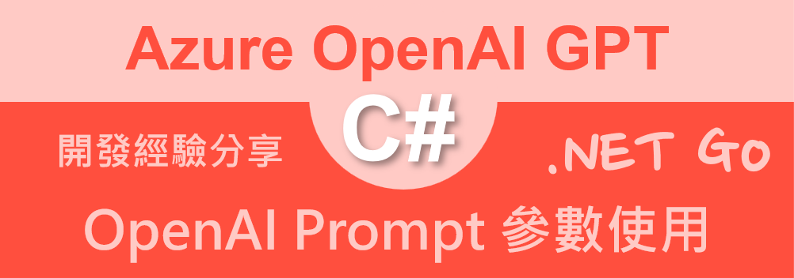

# Azure OpenAI AOAI 2.0 : 14 Prompt 的各種參數使用與變化差異



當在進行呼叫 Azure OpenAI API，用來進行聊天操作時候，可以透過 ChatCompletionOptions 物件設定不同的參數，來達到不同的效果。這些參數將會包含了 MaxOutputTokenCount：控制回應的最大長度、Temperature：控制回應的隨機性，值越高回應越有創意但可能不夠精確，值越低回應越保守但更可預測、TopP：另一種控制輸出多樣性的方式，與 Temperature 擇一使用即可、FrequencyPenalty：減少模型重複使用相同詞彙的傾向、PresencePenalty：增加模型談論新主題的傾向。

透過不同的參數設定，可以讓回應的內容有不同的風格，這篇文章將會示範如何透過 Temperature 與 TopP 這兩個參數，來控制回應的內容風格。

## 建立測試專案

請依照底下的操作，建立起這篇文章需要用到的練習專案

* 打開 Visual Studio 2022 IDE 應用程式
* 從 [Visual Studio 2022] 對話窗中，點選右下方的 [建立新的專案] 按鈕
* 在 [建立新專案] 對話窗右半部
  * 切換 [所有語言 (L)] 下拉選單控制項為 [C#]
  * 切換 [所有專案類型 (T)] 下拉選單控制項為 [主控台]
* 在中間的專案範本清單中，找到並且點選 [主控台應用程式] 專案範本選項
  > 專案，用於建立可在 Windows、Linux 及 macOS 於 .NET 執行的命令列應用程式
* 點選右下角的 [下一步] 按鈕
* 在 [設定新的專案] 對話窗
* 找到 [專案名稱] 欄位，輸入 `csPromptOption` 作為專案名稱
* 在剛剛輸入的 [專案名稱] 欄位下方，確認沒有勾選 [將解決方案與專案至於相同目錄中] 這個檢查盒控制項
* 點選右下角的 [下一步] 按鈕
* 現在將會看到 [其他資訊] 對話窗
* 在 [架構] 欄位中，請選擇最新的開發框架，這裡選擇的 [架構] 是 : `.NET 8.0 (長期支援)`
* 在這個練習中，需要去勾選 [不要使用最上層陳述式(T)] 這個檢查盒控制項
  > 這裡的這個操作，可以由讀者自行決定是否要勾選這個檢查盒控制項
* 請點選右下角的 [建立] 按鈕

稍微等候一下，這個 背景工作服務 專案將會建立完成

## 安裝要用到的 NuGet 開發套件

因為開發此專案時會用到這些 NuGet 套件，請依照底下說明，將需要用到的 NuGet 套件安裝起來。

### 安裝 Azure.AI.OpenAI 套件

請依照底下說明操作步驟，將這個套件安裝到專案內

* 滑鼠右擊 [方案總管] 視窗內的 [專案節點] 下方的 [相依性] 節點
* 從彈出功能表清單中，點選 [管理 NuGet 套件] 這個功能選項清單
* 此時，將會看到 [NuGet: csPromptOption] 視窗
* 切換此視窗的標籤頁次到名稱為 [瀏覽] 這個標籤頁次
* 在左上方找到一個搜尋文字輸入盒，在此輸入 `Azure.AI.OpenAI`
* 在視窗右方，將會看到該套件詳細說明的內容，其中，右上方有的 [安裝] 按鈕
  > 請確認有取消 Pre-release 這個選項，與選擇 2.0 正式版
* 點選這個 [安裝] 按鈕，將這個套件安裝到專案內

## 修改 Program.cs 類別內容

在這篇文章中，將會把會用到的新類別與程式碼，都寫入到 [Program.cs] 這個檔案中，請依照底下的操作，修改 [Program.cs] 這個檔案的內容

* 在專案中找到並且打開 [Program.cs] 檔案
* 將底下的程式碼取代掉 `Program.cs` 檔案中內容

```csharp
using Azure.AI.OpenAI;
using OpenAI.Chat;

namespace csPromptOption;

internal class Program
{
    static void Main(string[] args)
    {
        // 讀取環境變數 AOAILabKey 的 API Key
        string apiKey = System.Environment.GetEnvironmentVariable("AOAILabKey");
        AzureOpenAIClient azureClient = new(
            new Uri("https://gpt4tw.openai.azure.com/"),
            new System.ClientModel.ApiKeyCredential(apiKey));
        ChatClient chatClient = azureClient.GetChatClient("gpt-4");

        string userPrompt = "你如何形容海灘？";
        ChatCompletionOptions options = new();
        options.Temperature = 0.8f;

        Chart(chatClient, userPrompt, options);
        NewLine();

        userPrompt = "你如何形容海灘？";
        options = new();
        options.Temperature = 0.3f;

        Chart(chatClient, userPrompt, options);
        NewLine();

        userPrompt = "形容一棵樹";
        options = new();
        options.TopP = 1f;

        Chart(chatClient, userPrompt, options);
        NewLine();

        userPrompt = "形容一棵樹";
        options = new();
        options.TopP = 0.1f;

        Chart(chatClient, userPrompt, options);
        NewLine();
    }

    private static void NewLine()
    {
        Console.WriteLine(new string('-', 40));
        Console.WriteLine(new string('=', 40));
    }

    private static void Chart(ChatClient chatClient, string userPrompt, ChatCompletionOptions options)
    {
        List<ChatMessage> prompts = new()
        {
            UserChatMessage.CreateUserMessage(userPrompt)
        };

        foreach (var message in prompts)
        {
            string roleName = message is SystemChatMessage ? "System" :
                message is UserChatMessage ? "User" :
                "Assistant";
            Console.WriteLine($"{DateTime.Now}  [{roleName}]: {message.Content[0].Text}");
        }

        ChatCompletion completion = chatClient.CompleteChat(prompts, options);
        Console.WriteLine($"Role : {completion.Role}");

        foreach (var message in completion.Content)
        {
            Console.WriteLine($"{DateTime.Now} {message.Text}");
        }
        Console.WriteLine($"InputTokenCount : {completion.Usage.InputTokenCount}");
        Console.WriteLine($"OutputTokenCount : {completion.Usage.OutputTokenCount}");
        Console.WriteLine($"ReasoningTokenCount : {completion.Usage.OutputTokenDetails?.ReasoningTokenCount}");
        Console.WriteLine($"TotalTokenCount : {completion.Usage.TotalTokenCount}");
    }
}
```

第一個提示詞將會是 [你如何形容海灘？] ，在這裡將會建立一個 [ChatCompletionOptions] 物件，使用 `options.Temperature = 0.8f;` 敘述，將溫度值設定為 0.8，其中，溫度值越高回應越有創意但可能不夠精確，值越低回應越保守但更可預測，看看呈現結果為何?

第二個提示詞將會是 [你如何形容海灘？] ，在這裡將會建立一個 [ChatCompletionOptions] 物件，使用 `options.Temperature = 0.3f;` 敘述，將溫度值設定為 0.3，看看呈現結果為何?

第三個提示詞將會是 [形容一棵樹] ，在這裡將會建立一個 [ChatCompletionOptions] 物件，使用 `options.TopP = 1f;` 敘述，將 TopP 值設定為 1，這個值是另一種控制輸出多樣性的方式，與 Temperature 擇一使用即可，看看呈現結果為何?

第四個提示詞將會是 [形容一棵樹] ，在這裡將會建立一個 [ChatCompletionOptions] 物件，使用 `options.TopP = 0.1f;` 敘述，將 TopP 值設定為 0.1，看看呈現結果為何?

## 執行測試專案
* 按下 `F5` 開始執行專案
* 將會看到輸出結果

```plaintext
2025/2/21 上午 09:09:19  [User]: 你如何形容海灘？
Role : Assistant
2025/2/21 上午 09:09:37 海灘是自然界中一種迷人且多樣化的景象，通常由以下幾個特徵來描述：

1. **地理位置**：海灘是海洋與陸地相遇的地方，通常位於海岸線沿岸。

2. **沙質**：許多海灘擁有細軟的沙粒，這些沙子可能是由於岩石經歷風化和侵蝕作用而形成的，顏色可以從白色、金色、粉紅色到黑 色不等。

3. **海浪**：海浪從溫和的拂浪到強烈的激浪不等，提供了不同的水上活動場景，如衝浪或是悠閒的浮潛。

4. **生物多樣性**：海灘上經常有各式各樣的生物，從海鳥、螃蟹到各種貝殼和海洋植物，是生物多樣性的熱點。

5. **聲音**：海浪拍打沙灘的聲音帶來了一種舒緩的節奏，而海鳥的叫聲則增添了一種自然的樂章。

6. **氣味**：海灘特有的鹹鹹的海水氣息，以及海藻和海洋生物的香味，構成了一個獨特的嗅覺體驗。

7. **景觀**：從壯麗的日出到黃昏時分的日落，海灘的美景不斷變化，提供了絕佳的拍照機會。

8. **氣氛**：海灘通常與休閒和放鬆聯繫在一起，是人們逃離日常生活壓力、尋求寧靜的好去處。

海灘可以是活潑的，充滿人們嬉戲、運動和社交；也可以是偏遠和寧靜的，讓人有機會獨自沉思。??如何，海??是能?以其自然之美和宁?之感吸引?我?。
InputTokenCount : 16
OutputTokenCount : 677
ReasoningTokenCount :
TotalTokenCount : 693
----------------------------------------
========================================
Role : Assistant9:09:37  [User]: 你如何形容海灘？
2025/2/21 上午 09:09:54 海灘是一個自然景觀，通常由細膩的沙子、礫石或小石頭構成，它位於陸地與海洋、湖泊或河流的交界處。以下是對 海灘的一些形容詞和描述：

1. 寧靜的：一片平靜的海灘，海浪輕輕拍打著岸邊，營造出一種放鬆和安詳的氛圍。
2. 熱鬧的：在熱門的旅遊地點，海灘可能會擠滿了遊客，充滿了活力和喧囂，有人在玩沙、曬太陽、游泳或參與水上運動。
3. 原始的：一些較少被開發的海灘保持著它們的自然美，周圍可能有茂密的植被、岩石或懸崖。
4. 金色的：許多海灘以其閃亮的金色沙粒而聞名，這些沙粒在陽光下閃閃發光，給人一種溫暖的感覺。
5. 白色的：有些海灘擁有純白色的細沙，這些沙灘在陽光下顯得特別耀眼和引人注目。
6. 岩石的：不是所有的海灘都有細軟的沙子，有些海灘可能是由鋒利的岩石或圓滑的卵石構成，給人一種粗獷和原始的感覺。
7. 寬闊的：某些海灘擁有非常寬廣的沙岸，讓人有大片空間可以遊玩和放鬆。
8. 窄長的：有些海灘可能只有一條窄窄的沙帶，夾在海水和高地之間。
9. 清澈的：海灘旁的水域可能非常清澈，可以看到水下的沙子、岩石甚至海洋生物。
10. 翡翠綠的：有時候，海灘附近的海水會呈現出翡翠綠色，這通常是由於水質極佳和海底的特定礦物質。

海灘不僅是一個美麗的自然場所，也是許多人休閒和娛樂的目的地。它們可以是浪漫的、冒險的、放鬆的或者是運動的場所，取決於海灘的特點 和訪客的興趣。
InputTokenCount : 16
OutputTokenCount : 806
ReasoningTokenCount :
TotalTokenCount : 822
----------------------------------------
========================================
2025/2/21 上午 09:09:54  [User]: 形容一棵樹
Role : Assistant
2025/2/21 上午 09:10:07 形容一棵?的方式有很多，取?于你想表?的具体特征和情感。以下是一些形容?和句子作?例子：

1. 壯觀的（Majestic）- ?棵?以其宏?的姿?傲立在山?，仿若一位年?的守?者，俯瞰?周?的一切。

2. 繁茂的（Lush）- ?上??繁茂，?炎?的夏日提供了一??爽的避?所。

3. 古老的（Ancient）- ?干扭曲粗?，??了??年的??雨雨，它的存在是??的??者。

4. 粗糙的（Rough）- ?干上皮糙肉厚，布?了?月的?路，摸起?如同?史的碑文。

5. 高?的（Towering）- ?冠高?入云，仿佛要触及天空的??。

6. 枯萎的（Withered）- ?枝枯萎?力，?子?了，生命力似乎正在慢慢流逝。

7. 芬芳的（Fragrant）- ?花季??，?上的花朵散?出??芬芳，吸引?了蜂蝶的舞?。

8. 落幕的（Deciduous）- ??秋天的到?，??如同金?的地毯一般落?了地面。

9. 持久的（Sturdy）- ?管???吹雨打，?棵?依然屹立不倒，根深蒂固，在大自然中?得十分??。

10. 生机勃勃的（Vibrant）- 春天???，?上的新芽嫩?欲滴，生机勃勃，充?了希望和活力。

形容一棵?，你可以?它的外?（如高矮、粗?、?色）、年?（如古老或年?）、?境（如孤立或森林中）、季??化（落?或常青）、生命力（如?健或 瑟?）等多??度去描述。
InputTokenCount : 15
OutputTokenCount : 701
ReasoningTokenCount :
TotalTokenCount : 716
----------------------------------------
========================================
2025/2/21 上午 09:10:07  [User]: 形容一棵樹
Role : Assistant
2025/2/21 上午 09:10:21 形容一棵樹可以從多個角度進行，包括它的外觀、生長環境、生態作用以及與人類的關聯等。以下是一個例子：

這棵樹挺拔而雄偉，它的樹幹粗壯而堅固，像是一位經歷風霜的老士兵，屹立不搖。樹皮粗糙，刻滿了時間的痕跡，透露出一種古老而神秘的氣 息。它的枝椏繁茂，葉片綠油油，如同無數綠色的小手在空中輕輕搖曳，與陽光嬉戲。在春天，樹上可能開滿了花朵，散發著淡淡的香氣，吸引 著蜜蜂和蝴蝶前來採蜜。夏天時，它提供了一片涼爽的陰涼，成為行人休憩的好地方。秋天，樹葉漸漸變成金黃色或火紅色，像是為大地披上了 一層絢爛的地毯。冬天，樹枝裸露，顯得格外堅韌，即使覆蓋著白雪，依然挺立，等待春天的到來。

這棵樹不僅是自然界的一部分，也是許多生物的家園，鳥兒在它的枝頭築巢，昆蟲在它的樹皮下尋找食物。對於人類而言，它可能是一個歷史的 見證者，見證了周圍環境的變遷和人們生活的點滴。它是大自然的一份子，也是我們共同的寶貴財富。
InputTokenCount : 15
OutputTokenCount : 604
ReasoningTokenCount :
TotalTokenCount : 619
----------------------------------------
========================================
```
