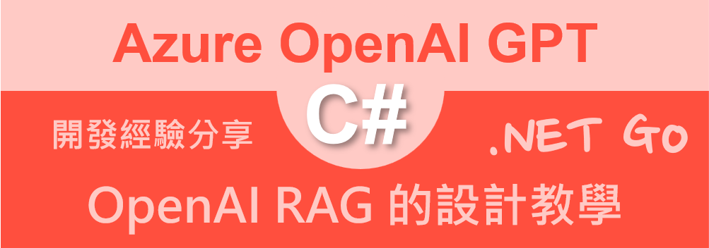

# Azure OpenAI AOAI 2.0 : 15 RAG 的設計教學



當大語言模型訓練完成後，該模型的知識將會永久停留在當時訓練資料提供的時間點，也就是說，這個語言模型對於現在與未來發生的事實，將也不會有任何這方面的知識，因此，若在使用該語言模型時候，詢問飛訓練資料時間內的事實，也就是不訓練資料沒有的事實，例如，企業內部的專屬知識，則該大語言模型將無法推理出想要的答案，進而將會產生所謂的幻覺。

為了解決這個問題，OpenAI 提供了一個新的模型，稱為 RAG（Retrieval-Augmented Generation），這個模型將會結合了檢索式的資料庫，進而提供更加準確的答案。

在運作流程中，將會把私有知識文件，透過 Embedding 模型，將會把這些文件計算出 Embedding，這是一個多維度的向量值，接著將這些 Embedding 存放到資料庫中，當使用者提問時，會先將提問文字，將會透過 Embedding 模型，將使用者的問題轉換成 Embedding，進而透過 Cosine 相似度計算，找出最相近的文件，進而得到最接近該問題的私有文件內容。

最後，將會把這個檔案的內容，與提問的問題，送至 GPT 內，進行生成最終答案，透過這樣的做法，將會得到最真實的需要內容，而且也會降低幻覺的發生機會與次數。

## 建立測試專案

請依照底下的操作，建立起這篇文章需要用到的練習專案

* 打開 Visual Studio 2022 IDE 應用程式
* 從 [Visual Studio 2022] 對話窗中，點選右下方的 [建立新的專案] 按鈕
* 在 [建立新專案] 對話窗右半部
  * 切換 [所有語言 (L)] 下拉選單控制項為 [C#]
  * 切換 [所有專案類型 (T)] 下拉選單控制項為 [主控台]
* 在中間的專案範本清單中，找到並且點選 [主控台應用程式] 專案範本選項
  > 專案，用於建立可在 Windows、Linux 及 macOS 於 .NET 執行的命令列應用程式
* 點選右下角的 [下一步] 按鈕
* 在 [設定新的專案] 對話窗
* 找到 [專案名稱] 欄位，輸入 `csRAG` 作為專案名稱
* 在剛剛輸入的 [專案名稱] 欄位下方，確認沒有勾選 [將解決方案與專案至於相同目錄中] 這個檢查盒控制項
* 點選右下角的 [下一步] 按鈕
* 現在將會看到 [其他資訊] 對話窗
* 在 [架構] 欄位中，請選擇最新的開發框架，這裡選擇的 [架構] 是 : `.NET 8.0 (長期支援)`
* 在這個練習中，需要去勾選 [不要使用最上層陳述式(T)] 這個檢查盒控制項
  > 這裡的這個操作，可以由讀者自行決定是否要勾選這個檢查盒控制項
* 請點選右下角的 [建立] 按鈕

稍微等候一下，這個 背景工作服務 專案將會建立完成

## 安裝要用到的 NuGet 開發套件

因為開發此專案時會用到這些 NuGet 套件，請依照底下說明，將需要用到的 NuGet 套件安裝起來。

### 安裝 Azure.AI.OpenAI 套件

請依照底下說明操作步驟，將這個套件安裝到專案內

* 滑鼠右擊 [方案總管] 視窗內的 [專案節點] 下方的 [相依性] 節點
* 從彈出功能表清單中，點選 [管理 NuGet 套件] 這個功能選項清單
* 此時，將會看到 [NuGet: csRAG] 視窗
* 切換此視窗的標籤頁次到名稱為 [瀏覽] 這個標籤頁次
* 在左上方找到一個搜尋文字輸入盒，在此輸入 `Azure.AI.OpenAI`
* 在視窗右方，將會看到該套件詳細說明的內容，其中，右上方有的 [安裝] 按鈕
  > 請確認有取消 Pre-release 這個選項，與選擇 2.0 正式版
* 點選這個 [安裝] 按鈕，將這個套件安裝到專案內

### 安裝 itext7 套件

這個 [itext7] 套件是用來讀取 PDF 檔案的套件

請依照底下說明操作步驟，將這個套件安裝到專案內

* 滑鼠右擊 [方案總管] 視窗內的 [專案節點] 下方的 [相依性] 節點
* 從彈出功能表清單中，點選 [管理 NuGet 套件] 這個功能選項清單
* 此時，將會看到 [NuGet: csRAG] 視窗
* 切換此視窗的標籤頁次到名稱為 [瀏覽] 這個標籤頁次
* 在左上方找到一個搜尋文字輸入盒，在此輸入 `itext7`
* 在視窗右方，將會看到該套件詳細說明的內容，其中，右上方有的 [安裝] 按鈕
  > 請確認有取消 Pre-release 這個選項，與選擇 2.0 正式版
* 點選這個 [安裝] 按鈕，將這個套件安裝到專案內

## 修改 Program.cs 類別內容

在這篇文章中，將會把會用到的新類別與程式碼，都寫入到 [Program.cs] 這個檔案中，請依照底下的操作，修改 [Program.cs] 這個檔案的內容

* 在專案中找到並且打開 [Program.cs] 檔案
* 將底下的程式碼取代掉 `Program.cs` 檔案中內容

```csharp
using Azure.AI.OpenAI;
using iText.Kernel.Pdf;
using iText.Kernel.Pdf.Canvas.Parser;
using iText.Kernel.Pdf.Canvas.Parser.Listener;
using OpenAI.Chat;
using OpenAI.Embeddings;
using System.Text;

namespace csRAG
{
    public class ChunkItem
    {
        public string Text { get; set; }
        public string Filename { get; set; }
        public List<float> Embedding { get; set; }
        public float Similarity { get; set; }
    }

    internal class Program
    {
        static void Main(string[] args)
        {
            // 讀取環境變數 AOAILabKey 的 API Key
            string apiKey = System.Environment.GetEnvironmentVariable("AOAILabKey");
            AzureOpenAIClient azureClient = new(
                new Uri("https://gpt4tw.openai.azure.com/"),
                new System.ClientModel.ApiKeyCredential(apiKey));
            //EmbeddingClient embeddingClient = azureClient.GetEmbeddingClient("text-embedding-3-large");
            EmbeddingClient embeddingClient = azureClient.GetEmbeddingClient("text-embedding-3-small");
            ChatClient chatClient = azureClient.GetChatClient("gpt-4o");

            // 建立 Embedding
            List<ChunkItem> embeddings = BuildEmbedding(embeddingClient);

            string prompt = "對於一本好的 ASP.NET Core Web API 開發書籍，最重要的五個章節是甚麼?";
            //string prompt = "若要設計一個軟體醫材並且要能更進行推廣與獲得更多的成效，該如何做";
            ChunkItem promptEmbedding = PromptToEmbedding(embeddingClient, prompt);

            ChunkItem result = FindMostSimilarDocument(embeddings, promptEmbedding);

            System.Console.WriteLine($"最相關的文件是 ({result.Similarity}) {result.Filename}");
            prompt = $"{prompt}\n\n使用底下內容來生成 zh-tw 結果\n\n'''{result.Text}'''";

            ChatWithGPT(chatClient, prompt);
        }

        #region 根據最相近的檔案進行 GPT 對話
        static void ChatWithGPT(ChatClient chatClient, string prompt)
        {
            List<ChatMessage> prompts = new()
            {
                UserChatMessage.CreateUserMessage(prompt),
            };

            foreach (var message in prompts)
            {
                string roleName = message is SystemChatMessage ? "System" :
                    message is UserChatMessage ? "User" :
                    "Assistant";
                Console.WriteLine($"{DateTime.Now}  [{roleName}]: {message.Content[0].Text}");
            }

            ChatCompletion completion = chatClient.CompleteChat(prompts);

            Console.WriteLine($"{DateTime.Now}  [Assistant]");
            foreach (var message in completion.Content)
            {
                if (message.Text != null && message.Text.Trim() != "")
                    Console.WriteLine($"{DateTime.Now} {message.Text}");
            }
        }
        #endregion

        #region 找出最相關的文件
        static ChunkItem FindMostSimilarDocument(List<ChunkItem> embeddings,
            ChunkItem promptEmbedding)
        {
            ChunkItem result = new ChunkItem();
            double maxSimilarity = 0;
            foreach (var item in embeddings)
            {
                double similarity = CosineSimilarity(item.Embedding.ToArray(),
                    promptEmbedding.Embedding.ToArray());
                item.Similarity = (float)similarity;
                if (similarity > maxSimilarity)
                {
                    maxSimilarity = similarity;
                    result = item;
                }
            }
            return result;
        }
        static float CosineSimilarity(float[] vectorA, float[] vectorB)
        {
            if (vectorA.Length != vectorB.Length)
                throw new ArgumentException("Vectors must be of the same length.");

            float dotProduct = vectorA.Zip(vectorB, (a, b) => a * b).Sum();
            float magnitudeA = (float)Math.Sqrt(vectorA.Sum(a => a * a));
            float magnitudeB = (float)Math.Sqrt(vectorB.Sum(b => b * b));

            return dotProduct / (magnitudeA * magnitudeB);
        }
        #endregion

        #region prompt 轉 Embedding
        static ChunkItem PromptToEmbedding(EmbeddingClient embeddingClient,
            string prompt)
        {
            ChunkItem result = new ChunkItem();
            string content = prompt;
            var embedding = embeddingClient.GenerateEmbedding(content);
            var value = embedding.Value.ToFloats().ToArray().ToList();
            result = new ChunkItem
            {
                Text = content,
                Filename = "Prompt",
                Embedding = value
            };
            return result;
        }
        #endregion

        #region 讀取檔案文字並且取得文件內容的 Embedding
        static List<ChunkItem> BuildEmbedding(EmbeddingClient embeddingClient)
        {
            List<ChunkItem> embeddings = new List<ChunkItem>();
            for (int i = 1; i <= 4; i++)
            {
                string filename = $"file{i}.pdf";
                string content = GetPdf(filename);
                var embedding = embeddingClient.GenerateEmbedding(content);
                var value = embedding.Value.ToFloats().ToArray().ToList();
                ChunkItem item = new ChunkItem
                {
                    Text = content,
                    Filename = filename,
                    Embedding = value
                };
                embeddings.Add(item);
            }
            return embeddings;
        }
        #endregion

        #region 讀取 PDF
        static string GetPdf(string filename)
        {
            StringBuilder result = new StringBuilder();

            using (PdfReader pdfReader = new PdfReader(filename))
            {
                using (PdfDocument pdfDoc = new PdfDocument(pdfReader))
                {
                    int numberOfPages = pdfDoc.GetNumberOfPages();

                    for (int i = 1; i <= numberOfPages; i++)
                    {
                        ITextExtractionStrategy strategy = new SimpleTextExtractionStrategy();
                        string pageContent = PdfTextExtractor.GetTextFromPage(pdfDoc.GetPage(i), strategy);
                        result.AppendLine(pageContent);
                    }
                }
            }

            string content = result.ToString();
            return content;
        }
        #endregion
    }
}
```

在上述程式碼中，首先會看到 [ChunkItem] 這個類別，這個類別是用來存放 Embedding 的資料，包含了文字內容、檔案名稱、Embedding 與相似度等資料。由於這是一個使用 C# 開發 RAG 的開發教學文章，對於實際的 RAG 應用程式在處理的時候，由於每個文件內容大小都不一致，而再將這些文字內容送至 Embedding 模型的時候，將會面對每次處理的最大 Token 數量有限制的問題，因此，將會需要將這些內容切割成為不同的 Chunk，接下來需要對於這些 Chunk 進行 Embedding 的計算，此時，將會得到一個多維度的向量值，最後需要將其儲存到向量資料庫內。

不過，這個範例程式碼中，將不會使用到向量資料庫，也不會處理切割 Chunk 的問題，所有得到的 Embedding 值，將會儲存在記憶體內。

接著，將會看到 `Main` 方法，這個方法是這個程式的進入點，這裡將會建立 [EmbeddingClient] 物件，用來進行 Embedding 的計算，接著，將會建立 [ChatClient] 物件，用來進行 GPT-4 的對話。

接下來的工作將會呼叫 [BuildEmbedding] 方法，這個回傳值將會是一個 List 類型，裡面包含了所有文件的 Embedding 資料。在這個方法內，將會固定讀取專案內內建的四個 PDF 檔案，並且將這些檔案的內容透過 `GetPdf` 方法讀取出來，在這個方法內將會透過 [itext7] 套件的方法，將這些 PDF 檔案內的文字內容抽取出來，並且將這些文字內容，儲存到 [content] 物件內，接著，將會透過 Embedding 模型，呼叫 `embeddingClient.GenerateEmbedding(content)` 方法，將這些內容轉換成 Embedding 值。

現在就可以使用 `embedding.Value.ToFloats().ToArray().ToList()` 表示式，取得 `List<float>` 的 Embedding 值，最後，建立一個 [ChunkItem] 物件，將這些資料儲存到這個物件內，並且將這個物件加入到 `List<ChunkItem>` 內。因此，經過 [BuildEmbedding] 方法執行後，將會得到每個 PDF 檔案的 Embedding 值。

繼續回到 [Main] 方法內，將會需要 `string prompt = "對於一本好的 ASP.NET Core Web API 開發書籍，最重要的五個章節是甚麼?";` 敘述設定要提問的提示詞，接著透過 [PromptToEmbedding] 方法，將這個提示詞文字轉成 Embedding 值，將其儲存到 [promptEmbedding] 物件內。

此時，將會執行 `FindMostSimilarDocument(embeddings, promptEmbedding)` 這個方法，將所有 PDF 文件的 Embedding 值與這個提示詞的 Embedding 值，傳入到這個方法內，便可以開始進行透過最相近的演算法，找到每個 PDF 文章與這個提示詞的相似度數值，找到最相近的文章是哪個 PDF。在這個方法內，將會呼叫 [CosineSimilarity] 方法，透過 Cosine 演算法，用來計算兩個向量之間的餘弦相似度。餘弦相似度是一種衡量兩個向量之間相似度的指標，範圍在 -1 到 1 之間，便可以得到文章相似度數值。

執行過程說明，將會分別計算

1.	檢查向量長度：首先，方法會檢查 vectorA 和 vectorB 的長度是否相同。如果長度不同，則拋出 ArgumentException 異常。
2.	計算點積：使用 Zip 方法將兩個向量的對應元素相乘，並使用 Sum 方法將這些乘積相加，得到兩個向量的點積。
3.	計算向量的大小：分別計算 vectorA 和 vectorB 的大小（即向量的歐幾里得範數）。這是通過將每個向量元素的平方相加，然後取平方根來實現的。
4.	計算餘弦相似度：最後，將點積除以兩個向量大小的乘積，得到餘弦相似度並返回。

現在，已經得到了最接近此提示詞的PDF檔案內容，這些內容將將會儲存到 [result] 物件內。

最後，呼叫 [ChatWithGPT] 方法，在這個方法內，將會把提示詞與PDF 文字內容，送給 GPT 生成內容。

## 執行測試專案
* 按下 `F5` 開始執行專案
* 將會看到輸出結果

```plaintext
最相關的文件是 (0.6679299) file3.pdf
2025/2/21 下午 03:24:10  [User]: 對於一本好的 ASP.NET Core Web API 開發書籍，最重要的五個章節是甚麼?

使用底下內容來生成 zh-tw 結果

'''file3.md 2025-02-21
1 / 4
這本《ASP.NET Core 9 Web API 開發實戰》書籍將以 實際案例引導學習，適合 有 C# 基礎但不熟悉 Web API
開發的讀者。書中將從零開始，循序漸進地帶領讀者構建 符合 REST 精神 的 API，並涵蓋 資料庫存取、?份驗
證、權限控管、測試、CI/CD 與容器化 等主題，確保讀者學會開發可落地的 Web API。
ASP .NET Core 9 Web API 開發實戰 - 章節?綱
第?部分：基礎概念與專案準備
1. Web API 是什麼？為什麼需要 Web API？
Web API 的概念與應?場景
Web API vs. MVC vs. gRPC
RESTful API 原則與最佳實踐
HTTP 動詞與狀態碼
2. 環境設置與開發?具
介紹 .NET 9 SDK 與 Visual Studio / VS Code
版本管理與 LTS 策略
使? Postman 或 Swagger 進? API 測試
設置 SQL Server / PostgreSQL / SQLite / NoSQL 環境（依書籍案例需求）
3. 專案架構與解決?案規劃
Web API 專案的基本結構
?案（Solution）與專案（Project）的分?
資料夾與命名空間的規劃（Domain、Application、Infrastructure、API）
介紹 Clean Architecture、DDD（Domain-Driven Design）與分層架構
第?部分：建立 Web API 服務
4. 建立第?個 Web API
使? dotnet new webapi 指令建立專案
了解 Program.cs、appsettings.json 配置
介紹 Controller 與 Endpoint
建立 GET /api/health 進?基本測試
5. Controller、Service、Repository 設計
Controller 負責接收請求與回應
Service 層負責業務邏輯
Repository 模式實作資料存取
使? Dependency Injection (DI) 管理物件?命週期
6. 符合 REST 精神的 API 設計
RESTful API 設計規範與最佳實踐
路由設計 ([Route]、[HttpGet]、[HttpPost])
file3.md 2025-02-21
2 / 4
避免 "胖 Controller"，拆分適當的 Service
設計 DTO (Data Transfer Object) 提升 API 穩定性
錯誤處理與統?回應格式 (ProblemDetails, ApiResult)
第三部分：資料庫存取
7. 使? Entity Framework Core 進?資料存取
設計 Database Model (DbContext、Entity)
使? Code-First 與 Migration 建立資料庫
基本 CRUD 操作 (Add, Update, Delete, Query)
使? AsNoTracking 與 LazyLoading 進?效能調優
8. 使? Dapper 進??效能查詢
Dapper vs. EF Core
撰寫 SQL 指令與查詢參數
透過 IDbConnection 進?資料存取
動態 SQL 查詢與物件映射
第四部分：?份驗證與權限管理
9. ?份驗證（Authentication）
JWT (JSON Web Token) 與 OAuth 2.0
使? ASP.NET Core Identity
登入、登出、Token ?成與驗證
設定 Refresh Token 機制
10. 權限管理（Authorization）
??（Roles）與權限（Claims-Based Authorization）
使? Policy-Based Authorization
API 限制存取 ([Authorize]、[AllowAnonymous])
根據權限篩選 API 回應內容
第五部分：API 安全性與最佳實踐
11. 保護 API 安全性
使? Rate Limiting 防?濫?請求
使? CORS 限制跨域請求
設定 Content Security Policy（CSP）
使? HTTPS 與 HSTS 確保安全傳輸
12. 記錄與監控
使? Serilog 進?記錄與?誌管理
記錄 API 訪問?誌與請求內容
file3.md 2025-02-21
3 / 4
監控 API 健康狀態（HealthChecks）
使? OpenTelemetry 進?分散式追蹤
第六部分：測試與 CI/CD
13. 測試 Web API
單元測試 (xUnit / MSTest)
整合測試 (TestServer)
使? Mock 進?依賴模擬（Moq, FakeItEasy）
14. CI/CD 部署
使? GitHub Actions / Azure DevOps 進? CI/CD
?動化測試與建置（Build & Test）
使? Docker 容器化 Web API
部署到雲端（Azure / AWS / GCP）
第七部分：進階應?與最佳實踐
15. API 版本管理
API 版本控制策略
使? Microsoft.AspNetCore.Mvc.Versioning
16. GraphQL vs. REST API
GraphQL 基本概念
何時選擇 GraphQL？
17. 事件驅動架構與背景任務
使? Hangfire 或 BackgroundService
Web API 如何與 Event Bus（如 Kafka, RabbitMQ）整合
18. ElasticSearch / Redis 快取
使? MemoryCache 與 DistributedCache
利? Redis 進? API 快取優化
ElasticSearch 快速搜尋應?
第八部分：專案實作
19. 完整專案案例
需求分析與系統規劃
建立 Web API 服務
?份驗證與權限控管
API 安全性與測試
file3.md 2025-02-21
4 / 4
CI/CD ?動化部署
20. 總結與未來展望
Web API 發展趨勢
API Gateway 與微服務架構的發展
如何進?步提升 Web API 的效能與安全性
結語
這本書的設計?標是讓讀者能夠 從零開始，實戰開發?個完整的 ASP .NET Core 9 Web API 專案，並學會 從
架構規劃、資料庫存取、?份驗證、權限管理、測試、CI/CD 到 API 最佳實踐。讓讀者不僅能夠 開發 API，還
能 讓 API 維運更?效、擴展更容易、安全性更?。
這份?綱是否符合你的需求？如果有特定案例或技術細節希望深入探討，可以進?步調整章節內容！
'''
2025/2/21 下午 03:24:20  [Assistant]
2025/2/21 下午 03:24:20 對於一本好的 ASP.NET Core Web API 開發書籍，以下是最重要的五個章節：

### ASP.NET Core 9 Web API 開發實戰 - 章節大綱

#### 第一部分：基礎概念與專案準備
1. **Web API 是什麼？為什麼需要 Web API？**
   - Web API 的概念與應用場景
   - Web API vs. MVC vs. gRPC
   - RESTful API 原則與最佳實踐
   - HTTP 動詞與狀態碼

#### 第二部分：建立 Web API 服務
2. **建立第一個 Web API**
   - 使用 `dotnet new webapi` 指令建立專案
   - 了解 `Program.cs`、`appsettings.json` 配置
   - 介紹 Controller 與 Endpoint
   - 建立 `GET /api/health` 進行基本測試

3. **Controller、Service、Repository 設計**
   - Controller 負責接收請求與回應
   - Service 層負責業務邏輯
   - Repository 模式實作資料存取
   - 使用 Dependency Injection (DI) 管理物件生命週期

#### 第三部分：資料庫存取
4. **使用 Entity Framework Core 進行資料存取**
   - 設計 Database Model (`DbContext`、Entity)
   - 使用 Code-First 與 Migration 建立資料庫
   - 基本 CRUD 操作 (Add, Update, Delete, Query)
   - 使用 `AsNoTracking` 與 LazyLoading 進行效能調優

#### 第四部分：身份驗證與權限管理
5. **身份驗證（Authentication）**
   - JWT (JSON Web Token) 與 OAuth 2.0
   - 使用 ASP.NET Core Identity
   - 登入、登出、Token 生成與驗證
   - 設定 Refresh Token 機制

這些章節提供了開發 Web API 的核心知識和實踐，涵蓋了從基礎概念到身份驗證的各個方面，確保讀者能夠構建出安全且高效的 Web API 系統。
```