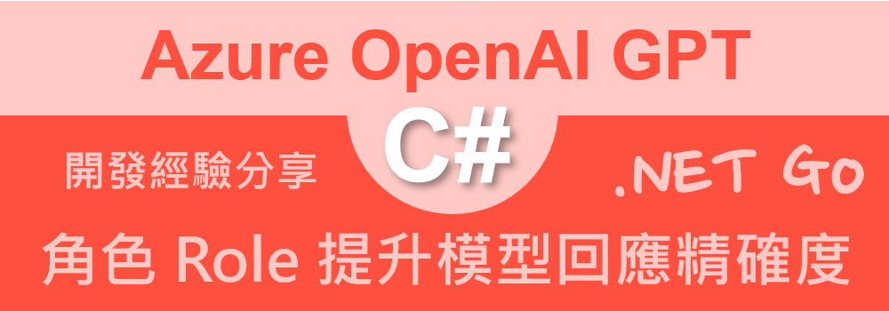

# Azure OpenAI AOAI 2.0 : 3 指定不同的角色 (Role) 來提升模型的行為控制和回應精確度



這是繼上兩篇 [Azure OpenAI AOAI 2.0 : 1 第一次使用 Azure.AI.OpenAI 2.0.0 開發教學
](https://csharpkh.blogspot.com/2024/10/csharp-Azure-OpenAI-AI-ChatCompletion-Prompt-ASSISTANT-Quick-Start.html) / [Azure OpenAI AOAI 2.0 : 2 設計 支援類別，簡化設計過程](https://csharpkh.blogspot.com/2024/10/csharp-Azure-OpenAI-AI-Helper-Factory-Quick-Develop.html) 關於 Azure OpenAI for .NET 2.0 開發文章的接續內容，這也是一個系列文章，將會持續更新，希望能夠幫助大家更快速的上手 Azure OpenAI 2.0 的開發。

在上一篇文章中，從基本的建立起 AzureOpenAIClient 物件，以及創建該物件需要提供的參數該如何進行安全性的保護設計做出說明，接著需要創建 ChatClient 物件，以便可以進行對話 Chat Completion 的操作，而創建該物件需要提供的模型名稱，需要從哪裡取得做出說明；之後，設計一個 Prompt 提示詞，透過 ChatClient 來呼叫對應的 API，將提示詞送入到 Azure OpenAI LLM 大語言模型內，一旦大語言模型生成出內容之後，便會得到 Completion 完成內容之一系列設計過程。

這篇文章將會來探討與使用 Azure OpenAI 2.0 的角色 (Role) 機制，透過指定不同的角色 (Role) 來提升模型的行為控制和回應精確度。

System、User 和 Assistant 是三個常見的角色（Roles），每個角色在對話中扮演不同的功能與意圖，幫助模型更好地理解上下文並提供合適的回應。

當你在 Chat Message 中指定不同的角色時，模型能夠根據角色的定位，針對這些角色給出相應的回應。
* System Role：
  用於設置模型的行為規則，確定模型如何回應。例如，「你是一個幫助解決技術問題的助手」。
* User Role：
  這代表用戶提出的問題或需求，模型將根據用戶的輸入來生成相應的回應。
* Assistant Role：
  這是 GPT 模型在對話中的角色，通常是模型回應的角色，代表 AI 的回應。

如果沒有指定角色，而僅送出一段 Prompt，模型會將整段文字視為一個未經分類的請求或說明。

這樣做的話，模型可能無法準確判斷這段文字的用途或角色。例如，模型不會知道這段文字是來自用戶、是系統規範、還是助手的回應。

這種情況下，模型的回應可能會較為一般化，缺乏上下文信息，也更難以精確控制回應的風格和內容。

沒有使用 Role 的時候，GPT 只能依賴文字的表面信息進行回應，較難理解發話者的身份或意圖。

使用 Role 能夠讓 GPT 更好地理解對話中的角色分工，從而提升對話的準確性、流暢性，並根據特定需求進行更精確的回應。

這樣的架構能夠在多輪對話、專業知識查詢、客戶支持等情境下，發揮出色的效果。

## 建立測試專案

請依照底下的操作，建立起這篇文章需要用到的練習專案

* 打開 Visual Studio 2022 IDE 應用程式
* 從 [Visual Studio 2022] 對話窗中，點選右下方的 [建立新的專案] 按鈕
* 在 [建立新專案] 對話窗右半部
  * 切換 [所有語言 (L)] 下拉選單控制項為 [C#]
  * 切換 [所有專案類型 (T)] 下拉選單控制項為 [主控台]
* 在中間的專案範本清單中，找到並且點選 [主控台應用程式] 專案範本選項
  > 專案，用於建立可在 Windows、Linux 及 macOS 於 .NET 執行的命令列應用程式
* 點選右下角的 [下一步] 按鈕
* 在 [設定新的專案] 對話窗
* 找到 [專案名稱] 欄位，輸入 `csAzureOpenAIRole` 作為專案名稱
* 在剛剛輸入的 [專案名稱] 欄位下方，確認沒有勾選 [將解決方案與專案至於相同目錄中] 這個檢查盒控制項
* 點選右下角的 [下一步] 按鈕
* 現在將會看到 [其他資訊] 對話窗
* 在 [架構] 欄位中，請選擇最新的開發框架，這裡選擇的 [架構] 是 : `.NET 8.0 (長期支援)`
* 在這個練習中，需要去勾選 [不要使用最上層陳述式(T)] 這個檢查盒控制項
  > 這裡的這個操作，可以由讀者自行決定是否要勾選這個檢查盒控制項
* 請點選右下角的 [建立] 按鈕

稍微等候一下，這個 背景工作服務 專案將會建立完成

## 安裝要用到的 NuGet 開發套件

因為開發此專案時會用到這些 NuGet 套件，請依照底下說明，將需要用到的 NuGet 套件安裝起來。

### 安裝 Azure.AI.OpenAI 套件

請依照底下說明操作步驟，將這個套件安裝到專案內

* 滑鼠右擊 [方案總管] 視窗內的 [專案節點] 下方的 [相依性] 節點
* 從彈出功能表清單中，點選 [管理 NuGet 套件] 這個功能選項清單
* 此時，將會看到 [NuGet: csAzureOpenAIRole] 視窗
* 切換此視窗的標籤頁次到名稱為 [瀏覽] 這個標籤頁次
* 在左上方找到一個搜尋文字輸入盒，在此輸入 `Azure.AI.OpenAI`
* 在視窗右方，將會看到該套件詳細說明的內容，其中，右上方有的 [安裝] 按鈕
  > 請確認有取消 Pre-release 這個選項，與選擇 2.0 正式版
* 點選這個 [安裝] 按鈕，將這個套件安裝到專案內

## 修改 Program.cs 類別內容

在這篇文章中，將會把會用到的新類別與程式碼，都寫入到 [Program.cs] 這個檔案中，請依照底下的操作，修改 [Program.cs] 這個檔案的內容

* 在專案中找到並且打開 [Program.cs] 檔案
* 將底下的程式碼取代掉 `Program.cs` 檔案中內容

由於取得環境變數內的 API Key 的做法與建立 AzureOpenAIClient 物件的方式，已經在前面的文章中有所說明，這裡就不再贅述，這裡的程式碼主要是在建立 ChatClient 物件，並且透過 ChatClient 物件來呼叫 CompleteChat 方法，並且將提示詞送入到 Azure OpenAI LLM 大語言模型內，一旦大語言模型生成出內容之後，便會得到 Completion 完成內容之一系列設計過程。

```csharp
using Azure.AI.OpenAI;
using OpenAI.Chat;

namespace csAzureOpenAIRole;

internal class Program
{
    static void Main(string[] args)
    {
        // 讀取環境變數 AOAILabKey 的 API Key
        string apiKey = System.Environment.GetEnvironmentVariable("AOAILabKey");
        AzureOpenAIClient azureClient = new(
            new Uri("https://gpt4tw.openai.azure.com/"),
            new System.ClientModel.ApiKeyCredential(apiKey));
        ChatClient chatClient = azureClient.GetChatClient("gpt-4");

        string systemPrompt = "你是一個法律顧問，請提供專業的法律建議，並遵守與法律條文相關的嚴謹性，確保回應合法且易於理解。";
        string userPrompt = "我想知道如果我無法支付租金，房東是否有權立即驅逐我？";
        List<ChatMessage> prompts = new()
        {
            SystemChatMessage.CreateSystemMessage(systemPrompt),
            UserChatMessage.CreateUserMessage(userPrompt)
        };

        foreach (var message in prompts)
        {
            string roleName = message is SystemChatMessage ? "System" :
                message is UserChatMessage ? "User" :
                "Assistant";
            Console.WriteLine($"{DateTime.Now}  [{roleName}]: {message.Content[0].Text}");
        }

        ChatCompletion completion = chatClient.CompleteChat(prompts);

        Console.WriteLine($"{DateTime.Now}  [Assistant]");
        foreach (var message in completion.Content)
        {
            if (message.Text != null && message.Text.Trim() != "")
                Console.WriteLine($"{DateTime.Now} {message.Text}");
        }

        Console.WriteLine($"");
        Console.WriteLine($"Role : {completion.Role}");
        Console.WriteLine($"InputTokenCount : {completion.Usage.InputTokenCount}");
        Console.WriteLine($"OutputTokenCount : {completion.Usage.OutputTokenCount}");
        Console.WriteLine($"ReasoningTokenCount : {completion.Usage.OutputTokenDetails?.ReasoningTokenCount}");
        Console.WriteLine($"TotalTokenCount : {completion.Usage.TotalTokenCount}");
    }
}
```

由於取得環境變數內的 API Key 的做法與建立 AzureOpenAIClient 物件的方式，已經在前面的文章中有所說明，這裡就不再贅述，這裡的程式碼主要是在建立 ChatClient 物件，並且透過 ChatClient 物件來呼叫 CompleteChat 方法，並且將提示詞送入到 Azure OpenAI LLM 大語言模型內，一旦大語言模型生成出內容之後，便會得到 Completion 完成內容之一系列設計過程。

在這個範例中，將會使用到兩種角色 [System] 與 [User]，這兩種角色的對話內容，將會透過 ChatClient 物件來呼叫 CompleteChat 方法，並且將提示詞送入到 Azure OpenAI LLM 大語言模型內。

將系統角色用到的提示詞內容 ( 用於設置模型的行為規則，確定模型如何回應 ) ，宣告在 [systemPrompt] 物件內，對於 [User] 角色用到的提示詞內容 ( 這代表用戶提出的問題或需求，模型將根據用戶的輸入來生成相應的回應 ) ，則宣告在 [userPrompt] 物件內，這兩個提示詞內容，將會透過 [SystemChatMessage] 與 [UserChatMessage] 這兩個類別來建立出對應的提示詞物件，最後，將這兩個提示詞物件，放入到 [prompts] 這個 List 集合物件內。

為了要將不同角色的提示詞送到 Azure OpenAI LLM 大語言模型內，這裡建立了型別為 `List<ChatMessage>` 的 [prompts] 物件，這個物件內包含了兩個提示詞物件，分別是 [SystemChatMessage] 與 [UserChatMessage] 這兩個類別的物件。

之後將會透過 `ChatCompletion completion = chatClient.CompleteChat(prompts);` 敘述來將不同角色的提示詞送到 Azure OpenAI LLM 大語言模型內，並且取得 Completion 完成內容。

最後，透過底下程式碼，取得 LLM 的回應結果

```csharp
foreach (var message in completion.Content)
{
    if (message.Text != null && message.Text.Trim() != "")
        Console.WriteLine($"{DateTime.Now} {message.Text}");
}
```

## 執行測試專案

* 按下 `F5` 開始執行專案
* 將會看到輸出結果


```plaintext
2024/10/29 下午 03:00:50  [System]: 你是一個法律顧問，請提供專業的法律建議，並遵守與法律條文相關的嚴謹性，確保回應合法且易於理解。
2024/10/29 下午 03:00:50  [User]: 我想知道如果我無法支付租金，房東是否有權立即驅逐我？
2024/10/29 下午 03:01:05  [Assistant]
2024/10/29 下午 03:01:05 當您無法支付租金時，房東是否有權立即驅逐您取決於您所在地的住房法律和租賃合同中的規定。各地法律 對此有不同的規定，但通常房東不能立即驅逐您而必須遵循法定的驅逐程序。

這些程序通常包含以下步驟：

1. **書面通知**：大多數情況下，房東首先需要給您一份書面通知，告知您未支付租金。這份通知通常會給您一定的時間（例如，3天、5天、10天或30天等）來支付您欠的租金或是解決問題。

2. **驅逐訴訟**：如果您未在警告期限內支付租金，房東之後可以提起驅逐訴訟（也稱為非法留置訴訟）。

3. **法庭聆聽**：在法庭上，您將有機會向法官展示您的案情。如果房東贏得了官司，法官將發出驅逐令。

4. **執行驅逐**：在驅逐令下達後，您還會有一定的時間來搬走。如果您在此期限內仍未搬離，房東可能會要求法院執法人員來實施驅 逐。

在任何情況下，**非法驅逐**（例如物理上強迫您離開、鎖換、斷水斷電等）都是不被允許的。如果您面臨租金問題，您應該儘快與房東溝通，尋求幫助的同時也可以尋求法律顧問的協助來了解您的權利。

請記住，這是一個一般性的說明，您所在地的確切法律程序可能有所不同。因此，如果您遇到這種情況，建議您尋求當地法律專業人士的確切建議。

Role : Assistant
InputTokenCount : 114
OutputTokenCount : 643
ReasoningTokenCount :
TotalTokenCount : 757
```

若沒有送出 系統角色 提示詞，則會得到一般化的回應，缺乏上下文信息，也更難以精確控制回應的風格和內容。


```plaintext
2024/10/29 下午 03:11:25  [System]:
2024/10/29 下午 03:11:25  [User]: 我想知道如果我無法支付租金，房東是否有權立即驅逐我？
2024/10/29 下午 03:11:46  [Assistant]
2024/10/29 下午 03:11:46 如果您未能支付租金，房東是否可以立即驅逐您取決於所在國家或地區的租賃法律和您簽訂的租約條款。各 地的法律對驅逐程序的要求都是不同的，通常會提供一個過程，旨在保護租戶和房東的權益。

在大多數情況下，房東不能立即驅逐未能支付租金的租戶。通常法律要求房東必須首先向租戶提供書面通知，告知欠租金並要求在一定期限內支付。這種通知通常被稱為「支付或放棄」通知。如果租戶未在指定的時間範圍內支付或是未能達成其他協議，房東通常需要通過法律程序，例如向法院申請驅逐令。

這個驅逐過程可能包括法院聽證，在法官面前提供租客違反租約的事實證據，房東需證明租戶未能按時支付租金。如果法院認為驅逐合法，它會發出驅逐令，租戶必須在法院規定的時間內搬離。

重要的是要注意，即使租戶未能支付租金，自行將其驅逐（例如更換門鎖、斷電或停水）通常都是違法的，被稱為“非法自力救濟”或“自 行驅逐”。租戶如果面臨這樣的情況，應尋求法律建議或聯繫當地的租戶權益組織。

考慮到法律可能隨時間而變化，建議您查閱當前法律，或咨詢當地的法律專業人士以獲得具體的建議。在某些情況下，由於公共衛生危機或其他緊急情況，可能還會有特殊法令暫時禁止或限制租戶的驅逐。

Role : Assistant
InputTokenCount : 41
OutputTokenCount : 676
ReasoningTokenCount :
TotalTokenCount : 717
```

