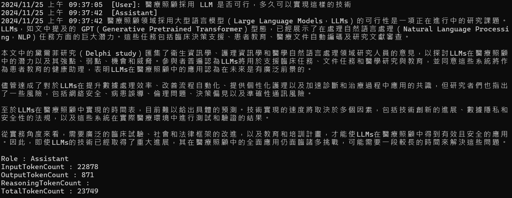

# Azure OpenAI AOAI 2.0 : 6 與 PDF 檔案對談


最近為何要研究大語言模型 LLM 與 ChatGPT 在醫療領域上有些甚麼議題或者研究，所以，就順手上網搜尋相關研究論文，為了要能夠在最快的時間將找到的四篇論文內容，快速看過一遍，並且針對心中的疑惑或者問題，看看是否可以在這些論文上獲得解答，所以，就想到了這個標題的主題，來看看如何透過 Azure OpenAI AOAI 2.0 來將 PDF 檔案內容，進行聊天的應用程式設計作法。

為了要進行這樣的程式開發練習，首先先找到了一篇 [ Potential of Large Language Models in Health Care:Delphi Study](https://www.jmir.org/2024/1/e52399/) 文章，這篇文章是關於在醫療保健領域中，大語言模型的潛力，透過 Delphi 研究的方式，來探討大語言模型在醫療保健領域中的應用與可能性。將這篇論文的 PDF 下載下來，接著，將這篇論文的內容，透過 Azure OpenAI AOAI 2.0 來進行聊天的應用程式設計。

## 建立測試專案

請依照底下的操作，建立起這篇文章需要用到的練習專案

* 打開 Visual Studio 2022 IDE 應用程式
* 從 [Visual Studio 2022] 對話窗中，點選右下方的 [建立新的專案] 按鈕
* 在 [建立新專案] 對話窗右半部
  * 切換 [所有語言 (L)] 下拉選單控制項為 [C#]
  * 切換 [所有專案類型 (T)] 下拉選單控制項為 [主控台]
* 在中間的專案範本清單中，找到並且點選 [主控台應用程式] 專案範本選項
  > 專案，用於建立可在 Windows、Linux 及 macOS 於 .NET 執行的命令列應用程式
* 點選右下角的 [下一步] 按鈕
* 在 [設定新的專案] 對話窗
* 找到 [專案名稱] 欄位，輸入 `csPdfChat` 作為專案名稱
* 在剛剛輸入的 [專案名稱] 欄位下方，確認沒有勾選 [將解決方案與專案至於相同目錄中] 這個檢查盒控制項
* 點選右下角的 [下一步] 按鈕
* 現在將會看到 [其他資訊] 對話窗
* 在 [架構] 欄位中，請選擇最新的開發框架，這裡選擇的 [架構] 是 : `.NET 8.0 (長期支援)`
* 在這個練習中，需要去勾選 [不要使用最上層陳述式(T)] 這個檢查盒控制項
  > 這裡的這個操作，可以由讀者自行決定是否要勾選這個檢查盒控制項
* 請點選右下角的 [建立] 按鈕

稍微等候一下，這個 背景工作服務 專案將會建立完成

## 安裝要用到的 NuGet 開發套件

因為開發此專案時會用到這些 NuGet 套件，請依照底下說明，將需要用到的 NuGet 套件安裝起來。

### 安裝 Azure.AI.OpenAI 套件

請依照底下說明操作步驟，將這個套件安裝到專案內

* 滑鼠右擊 [方案總管] 視窗內的 [專案節點] 下方的 [相依性] 節點
* 從彈出功能表清單中，點選 [管理 NuGet 套件] 這個功能選項清單
* 此時，將會看到 [NuGet: csPdfChat] 視窗
* 切換此視窗的標籤頁次到名稱為 [瀏覽] 這個標籤頁次
* 在左上方找到一個搜尋文字輸入盒，在此輸入 `Azure.AI.OpenAI`
* 在視窗右方，將會看到該套件詳細說明的內容，其中，右上方有的 [安裝] 按鈕
  > 請確認有取消 Pre-release 這個選項，與選擇 2.0 正式版
* 點選這個 [安裝] 按鈕，將這個套件安裝到專案內

## 修改 Program.cs 類別內容

在這篇文章中，將會把會用到的新類別與程式碼，都寫入到 [Program.cs] 這個檔案中，請依照底下的操作，修改 [Program.cs] 這個檔案的內容

* 在專案中找到並且打開 [Program.cs] 檔案
* 將底下的程式碼取代掉 `Program.cs` 檔案中內容

```csharp
using Azure.AI.OpenAI;
using iText.Kernel.Pdf.Canvas.Parser.Listener;
using iText.Kernel.Pdf.Canvas.Parser;
using iText.Kernel.Pdf;
using OpenAI.Chat;
using System.Text;

namespace csPdfChat;

internal class Program
{
    static void Main(string[] args)
    {
        // 讀取環境變數 AOAILabKey 的 API Key
        string apiKey = System.Environment.GetEnvironmentVariable("AOAILabKey");
        AzureOpenAIClient azureClient = new(
            new Uri("https://gpt4tw.openai.azure.com/"),
            new System.ClientModel.ApiKeyCredential(apiKey));
        ChatClient chatClient = azureClient.GetChatClient("gpt-4");

        string pdfContent = GetPdf("jmir-2024-1-e52399.pdf");
        ChatPdf(chatClient, pdfContent);
    }

    static string GetPdf(string filename)
    {
        StringBuilder result = new StringBuilder();

        using (PdfReader pdfReader = new PdfReader(filename))
        {
            using (PdfDocument pdfDoc = new PdfDocument(pdfReader))
            {
                int numberOfPages = pdfDoc.GetNumberOfPages();

                for (int i = 1; i <= numberOfPages; i++)
                {
                    ITextExtractionStrategy strategy = new SimpleTextExtractionStrategy();
                    string pageContent = PdfTextExtractor.GetTextFromPage(pdfDoc.GetPage(i), strategy);
                    result.AppendLine(pageContent);
                }
            }
        }

        string content = result.ToString();
        return content;
    }

    private static void ChatPdf(ChatClient chatClient, string pdfContent)
    {
        #region 與 PDF 文字內容進行聊天
        List<ChatMessage> prompts;
        ChatCompletion completion;
        string userPrompt1 = $"'''{pdfContent}'''";
        //string userPrompt2 = "大語言模型，經過研究，在醫療照顧上是否具有可行性，有甚麼要注意的地方";
        //string userPrompt2 = "摘要這篇論文的重點與結論";
        string userPrompt2 = "醫療照顧採用 LLM 是否可行，多久可以實現這樣的技術";
        prompts = new()
        {
            UserChatMessage.CreateUserMessage(userPrompt1),
            UserChatMessage.CreateUserMessage(userPrompt2),
        };
        foreach (var message in prompts)
        {
            string roleName = message is SystemChatMessage ? "System" :
                message is UserChatMessage ? "User" :
                "Assistant";
            Console.WriteLine($"{DateTime.Now}  [{roleName}]: {message.Content[0].Text}");
        }

        completion = chatClient.CompleteChat(prompts);
        Console.WriteLine($"{DateTime.Now}  [Assistant]");
        foreach (var message in completion.Content)
        {
            Console.WriteLine($"{DateTime.Now} {message.Text}");
        }

        Console.WriteLine($"");
        Console.WriteLine($"Role : {completion.Role}");
        Console.WriteLine($"InputTokenCount : {completion.Usage.InputTokenCount}");
        Console.WriteLine($"OutputTokenCount : {completion.Usage.OutputTokenCount}");
        Console.WriteLine($"ReasoningTokenCount : {completion.Usage.OutputTokenDetails?.ReasoningTokenCount}");
        Console.WriteLine($"TotalTokenCount : {completion.Usage.TotalTokenCount}");
        Console.WriteLine($"");
        Console.WriteLine($"");
        #endregion
    }
}
```

在 [Main] 方法內，同樣的會透過環境變數來取的需要的授權金鑰，接著建立 AzureOpenAIClient 這個類別的物件，並且取得 ChatClient 這個類別的物件，接著呼叫 [GetPdf] 這個方法將指定的 PDF 檔案文字內容抽取出來，接著，呼叫 [ChatPdf] 來進行聊天。

對於 [GetPdf] 這個方法將會接收到一個字串參數，這個參數將會指定為需要處理的 PDF 檔案名稱，在此方法內，建立一個型別為 [StringBuilder] 的 result 物件，接著，透過 iText7 套件來讀取指定的 PDF 檔案，並且將每一頁的文字內容，透過 [PdfTextExtractor.GetTextFromPage] 這個方法，將每一頁的文字內容抽取出來，最後，將這些文字內容串接起來，並且回傳給呼叫端。

一旦取的了 PDF 文件內的文字內容，接下來就會呼叫 [ChatPDF] 這個方法，對於 [ChatPdf] 這個方法將會接收到兩個參數，一個是 ChatClient 這個類別的物件，另一個是 PDF 檔案的文字內容，這個方法內容如下：

在此方法內將會先前讀取 PDF 檔案的文字內容取得之後，接著，將這些文字內容透過 Azure OpenAI AOAI 2.0 來進行聊天，這裡設計了兩個使用者的提示訊息，第一個提示訊息是 PDF 檔案的文字內容，第二個提示訊息是關於 PDF 檔案內容的問題，這裡設計的問題是：[醫療照顧採用 LLM 是否可行，多久可以實現這樣的技術]，這樣的問題，將會透過 Azure OpenAI AOAI 2.0 來進行聊天，並且取得回應結果。

## 執行測試專案
* 按下 `F5` 開始執行專案
* 將會看到輸出結果



```plaintext
2024/11/25 上午 09:37:05  [User]: 醫療照顧採用 LLM 是否可行，多久可以實現這樣的技術
2024/11/25 上午 09:37:42  [Assistant]
2024/11/25 上午 09:37:42 醫療照顧領域採用大型語言模型（Large Language Models，LLMs）的可行性是一項正在進行中的研究課題。LLMs，如文中提及的 GPT（Generative Pretrained Transformer）型態，已經展示了在處理自然語言處理（Natural Language Processing，NLP）任務方面的巨大潛力。這些任務包括臨床決策支援、患者教育、醫療文件自動編碼及研究文獻審查。

本文中的黛爾菲研究（Delphi study）匯集了衛生資訊學、護理資訊學和醫學自然語言處理領域研究人員的意見，以探討LLMs在醫療照顧中的潛力以及其強點、弱點、機會和威脅。參與者普遍認為LLMs將用於支援臨床任務、文件任務和醫學研究與教育，並同意這些系統將作為患者教育的健康助理，表明LLMs在醫療照顧中的應用認為在未來是有廣泛前景的。

儘管達成了對於LLMs在提升數據處理效率、改善流程自動化、提供個性化護理以及加速診斷和治療過程中應用的共識，但研究者們也指出了一些風險，包括網絡安全、病患誤導、倫理問題、決策偏見以及準確性通訊風險。

至於LLMs在醫療照顧中實現的時間表，目前難以給出具體的預測。技術實現的速度將取決於多個因素，包括技術創新的進展、數據隱私和安全性的法規，以及這些系統在實際醫療環境中進行測試和驗證的結果。

從實務角度來看，需要廣泛的臨床試驗、社會和法律框架的改進，以及教育和培訓計畫，才能使LLMs在醫療照顧中得到有效且安全的應用。因此，即使LLMs的技術已經取得了重大進展，其在醫療照顧中的全面應用仍面臨諸多挑戰，可能需要一段較長的時間來解決這些問題。

Role : Assistant
InputTokenCount : 22878
OutputTokenCount : 871
ReasoningTokenCount :
TotalTokenCount : 23749
```

