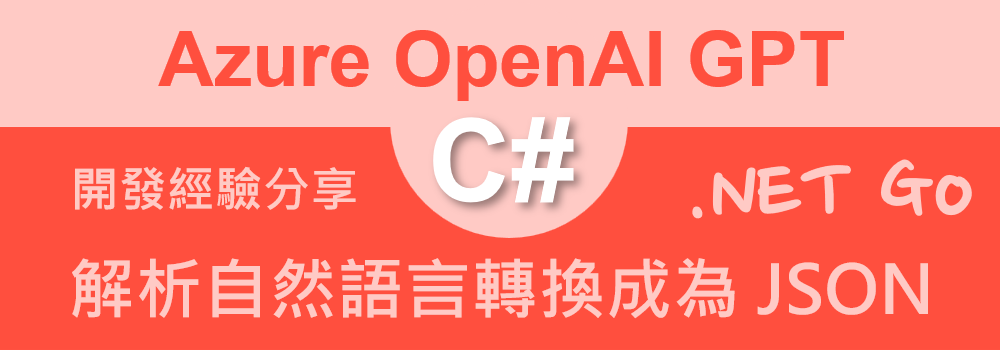

# Azure OpenAI AOAI 2.0 : 5 解析自然語言內容，轉換成為 JSON 格式



所謂的 NLP 自然語言處理(Natural Language Processing) 是一種機器學習技術，讓電腦能夠解譯、操縱及理解人類語言。在我們進行專案設計過程中，若可以剖析與理解自然語言背後的涵義，便可以將自然語言的輸入，視為對系統的一個指示或者命令，進而對這個 Prompt 透過 LLM 進行處理，得到我們所期望的指令或者操作條件，如此，程式便可以針對這樣具有結構化的數據，進行各種自動化的設計。

例如，當使用者想要查詢資料的時候，可以透過自然語言下達要查詢的條件，接著由 LLM 來產生出預先定義的 JSON 格式，這個 JSON 內容內將會有需要查詢的欄位名稱，運算方式(例如，等於、大於、小於、包含等等)，比對的值，接下來就可以將這個 JSON 物件送至後端 Web API 服務，以便取得資料庫內符合條件的紀錄，最後將這些紀錄渲染到網頁上。

在這篇文章將會來體驗這樣的技術

## 建立測試專案

請依照底下的操作，建立起這篇文章需要用到的練習專案

* 打開 Visual Studio 2022 IDE 應用程式
* 從 [Visual Studio 2022] 對話窗中，點選右下方的 [建立新的專案] 按鈕
* 在 [建立新專案] 對話窗右半部
  * 切換 [所有語言 (L)] 下拉選單控制項為 [C#]
  * 切換 [所有專案類型 (T)] 下拉選單控制項為 [主控台]
* 在中間的專案範本清單中，找到並且點選 [主控台應用程式] 專案範本選項
  > 專案，用於建立可在 Windows、Linux 及 macOS 於 .NET 執行的命令列應用程式
* 點選右下角的 [下一步] 按鈕
* 在 [設定新的專案] 對話窗
* 找到 [專案名稱] 欄位，輸入 `csGptNlpToJson` 作為專案名稱
* 在剛剛輸入的 [專案名稱] 欄位下方，確認沒有勾選 [將解決方案與專案至於相同目錄中] 這個檢查盒控制項
* 點選右下角的 [下一步] 按鈕
* 現在將會看到 [其他資訊] 對話窗
* 在 [架構] 欄位中，請選擇最新的開發框架，這裡選擇的 [架構] 是 : `.NET 8.0 (長期支援)`
* 在這個練習中，需要去勾選 [不要使用最上層陳述式(T)] 這個檢查盒控制項
  > 這裡的這個操作，可以由讀者自行決定是否要勾選這個檢查盒控制項
* 請點選右下角的 [建立] 按鈕

稍微等候一下，這個 背景工作服務 專案將會建立完成

## 安裝要用到的 NuGet 開發套件

因為開發此專案時會用到這些 NuGet 套件，請依照底下說明，將需要用到的 NuGet 套件安裝起來。

### 安裝 Azure.AI.OpenAI 套件

請依照底下說明操作步驟，將這個套件安裝到專案內

* 滑鼠右擊 [方案總管] 視窗內的 [專案節點] 下方的 [相依性] 節點
* 從彈出功能表清單中，點選 [管理 NuGet 套件] 這個功能選項清單
* 此時，將會看到 [NuGet: csGptNlpToJson] 視窗
* 切換此視窗的標籤頁次到名稱為 [瀏覽] 這個標籤頁次
* 在左上方找到一個搜尋文字輸入盒，在此輸入 `Azure.AI.OpenAI`
* 在視窗右方，將會看到該套件詳細說明的內容，其中，右上方有的 [安裝] 按鈕
  > 請確認有取消 Pre-release 這個選項，與選擇 2.0 正式版
* 點選這個 [安裝] 按鈕，將這個套件安裝到專案內

## 修改 Program.cs 類別內容

在這篇文章中，將會把會用到的新類別與程式碼，都寫入到 [Program.cs] 這個檔案中，請依照底下的操作，修改 [Program.cs] 這個檔案的內容

* 在專案中找到並且打開 [Program.cs] 檔案
* 將底下的程式碼取代掉 `Program.cs` 檔案中內容

```csharp
using Azure.AI.OpenAI;
using OpenAI.Chat;

namespace csGptNlpToJson;

internal class Program
{
    static void Main(string[] args)
    {
        // 讀取環境變數 AOAILabKey 的 API Key
        string apiKey = System.Environment.GetEnvironmentVariable("AOAILabKey");
        AzureOpenAIClient azureClient = new(
            new Uri("https://gpt4tw.openai.azure.com/"),
            new System.ClientModel.ApiKeyCredential(apiKey));
        ChatClient chatClient = azureClient.GetChatClient("gpt-4");

        PromptToJson(chatClient);
    }


    private static void PromptToJson(ChatClient chatClient)
    {
        #region 將自然語言轉乘 JSON
        string json = File.ReadAllText("SearchCondition.json");
        List<ChatMessage> prompts;
        ChatCompletion completion;
        string userPrompt1 = "'''就醫時間為 2020-2022 年之間，具有糖尿病診斷且為門診就醫的搜尋條件'''";
        string userPrompt2 = "請將上述需求，使用底下 JSON 格式來表達，只需要生成 JSON，" +
            "不需要其他說明";
        string userPrompt3 = $"```json\n{json}\n```";
        prompts = new()
        {
            UserChatMessage.CreateUserMessage(userPrompt1),
            UserChatMessage.CreateUserMessage(userPrompt2),
            UserChatMessage.CreateUserMessage(userPrompt3),
        };
        foreach (var message in prompts)
        {
            string roleName = message is SystemChatMessage ? "System" :
                message is UserChatMessage ? "User" :
                "Assistant";
            Console.WriteLine($"{DateTime.Now}  [{roleName}]: {message.Content[0].Text}");
        }

        completion = chatClient.CompleteChat(prompts);
        Console.WriteLine($"{DateTime.Now}  [Assistant]");
        foreach (var message in completion.Content)
        {
            Console.WriteLine($"{DateTime.Now} {message.Text}");
        }

        Console.WriteLine($"");
        Console.WriteLine($"Role : {completion.Role}");
        Console.WriteLine($"InputTokenCount : {completion.Usage.InputTokenCount}");
        Console.WriteLine($"OutputTokenCount : {completion.Usage.OutputTokenCount}");
        Console.WriteLine($"ReasoningTokenCount : {completion.Usage.OutputTokenDetails?.ReasoningTokenCount}");
        Console.WriteLine($"TotalTokenCount : {completion.Usage.TotalTokenCount}");
        Console.WriteLine($"");
        Console.WriteLine($"");
        #endregion
    }
}
```

在 [Main] 方法內，同樣的會透過環境變數來取的需要的授權金鑰，接著建立 AzureOpenAIClient 這個類別的物件，並且取得 ChatClient 這個類別的物件，接著呼叫 `PromptToJson` 這個方法。

接著，設計一個 [PromptToJson] 方法，這個方法將會透過 ChatClient 來完成將自然語言轉換成 JSON 的功能，這個方法內容如下：

在此方法內將會先讀取 [SearchCondition.json] 這個檔案內容，這裡使用了 `string json = File.ReadAllText("SearchCondition.json");` 敘述，其內容如下

```json
{
  // 醫療紀錄搜尋條件
  "BaseCondition": {
    "BeginDate": "", // 就醫紀錄搜尋開始時間
    "EndDate": "",  // 就醫紀錄搜尋結束時間
    "Department": "",      // 就醫紀錄搜尋科別 內科,心臟科
    "RecordType": ""       // 就醫紀錄搜尋類型 門診,急診,住院
  }
  "ICD10": [] // ICD10疾病碼 搜尋條件
  "Medicine": [] // 藥品名稱 搜尋條件
}
```

這個 JSON 物件內，定義了許多屬性，並且在該屬性後面，註解了該屬性的用途，接著期望讓 LLM 能夠理解這個 JSON 物件，並且將傳入的 Prompt 內容整合成為一個上下文 Context，透過一個這樣的組合 Prompt，以便產生出符合需求的 JSON 物件。

接下來將會把底下的 Prompt 內容與上面的 JSON 組合為一個新的 Prompt，接著送到 GPT 內

```plaintext
'''就醫時間為 2020-2022 年之間，具有糖尿病診斷且為門診就醫的搜尋條件'''
請將上述需求，使用底下 JSON 格式來表達，只需要生成 JSON，不需要其他說明
```

如此，CompletChat 方法將會得到底下的 JSON 物件，並且依據使用者所送入的提示詞進行理解，組合出最終的 JSON 物件，如下面所示的結果

```json
{
  "BaseCondition": {
    "BeginDate": "2020-01-01", // 就醫紀錄搜尋開始時間
    "EndDate": "2022-12-31",  // 就醫紀錄搜尋結束時間
    "Department": "",      // 就醫紀錄搜尋科別 內科,心臟科
    "RecordType": "門診"       // 就醫紀錄搜尋類型 門診,急診,住院
  },
  "ICD10": ["E10-E14"] // ICD10疾病碼 搜尋條件，E10-E14 為糖尿病相關子類別的範圍
  "Medicine": [] // 藥品名稱 搜尋條件
}
```

從這裡可以看到 GPT 的表現相當的優秀，能夠理解使用者的需求，並且將這個需求轉換成為 JSON 格式，這樣的功能將會在未來的應用程式開發中，有著非常大的幫助。

## 執行測試專案
* 按下 `F5` 開始執行專案
* 將會看到輸出結果

```plaintext
2024/11/19 上午 08:57:56  [User]: '''就醫時間為 2020-2022 年之間，具有糖尿病診斷且為門診就醫的搜尋條件'''
2024/11/19 上午 08:57:56  [User]: 請將上述需求，使用底下 JSON 格式來表達，只需要生成 JSON，不需要其他說明
2024/11/19 上午 08:57:56  [User]: ```json
{
  // 醫療紀錄搜尋條件
  "BaseCondition": {
    "BeginDate": "", // 就醫紀錄搜尋開始時間
    "EndDate": "",  // 就醫紀錄搜尋結束時間
    "Department": "",      // 就醫紀錄搜尋科別 內科,心臟科
    "RecordType": ""       // 就醫紀錄搜尋類型 門診,急診,住院
  }
  "ICD10": [] // ICD10疾病碼 搜尋條件
  "Medicine": [] // 藥品名稱 搜尋條件
}
```
2024/11/19 上午 08:57:59  [Assistant]
2024/11/19 上午 08:57:59 ```json
{
  "SearchCriteria": {
    "MedicalRecords": {
      "Diagnosis": "Diabetes",
      "Type": "Outpatient",
      "DateRange": {
        "Start": "2020-01-01",
        "End": "2022-12-31"
      }
    }
  }
}
```

Role : Assistant
InputTokenCount : 312
OutputTokenCount : 71
ReasoningTokenCount :
TotalTokenCount : 383
```


