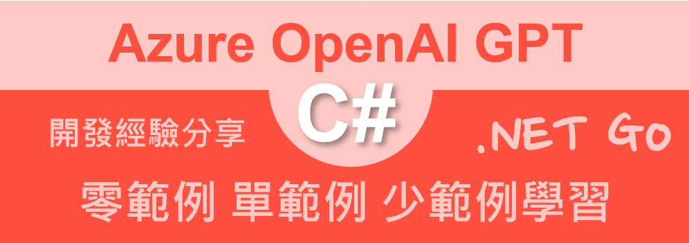

# Azure OpenAI AOAI 2.0 : 4 零範例學習 單範例學習 少範例學習



在使用 ChatGPT 的時候，通常就是將文字提示詞送入到 Azure OpenAI LLM 大語言模型內，然後等待大語言模型生成出 Completion 完成內容，可是，如何能夠讓大語言模型生成出更符合預期的內容呢？這時候，就可以透過底下的三種提示方法來達到目的：

這三種提示方法（Zero-Shot, One-Shot, Few-Shot）在ChatGPT的應用中扮演著重要的價值，因為它們提供了不同的指導程度，使模型能夠更靈活和有效地應對各種問題和需求。以下是它們在ChatGPT中的價值：

### 1. **Zero-Shot Prompt：擴大應用範圍，增加靈活性**
   - **解釋**：這種方式就是在不給模型任何範例的情況下，直接讓它回答問題。也就是說，模型必須完全靠自己去「猜」出答案。
   - **價值**：Zero-Shot 提示對於快速回應多樣的問題非常有用，尤其是當用戶提出的問題沒有明確範例時。它讓模型可以在無需範例的情況下提供回應，極大地增加了ChatGPT的靈活性。
   - **應用**：Zero-Shot 的能力讓ChatGPT能應對大量未知問題，例如，回答日常生活知識、百科問題或即時的創意問題。即使用戶並未提供具體的例子或格式，模型也能提供合理的答案。
   - **例子**：想像你問一個從未聽過西班牙語的人：「請用西班牙語說‘你好’。」他可能完全不會，但GPT能夠依靠自己的知識來回答「Hola」。

### 2. **One-Shot Prompt：提供範例，增強準確性**
   - **解釋**：這種方式是在問題之前給模型提供一個範例，讓它知道你期望什麼樣的答案。這樣模型就有一個參考，可以用這個例子來推測後續的答案。
   - **價值**：One-Shot 提示在特定任務中增強模型的準確性。當用戶提供一個範例時，模型更能理解預期的答案格式或風格，這在需要特定表達或風格的回答中尤其有幫助。
   - **應用**：One-Shot 提示對於需要某種格式的工作（如撰寫電郵、簡歷建議、固定格式的報告等）非常有效。用戶可以先提供一個範例，讓模型參照該格式進行回答，使答案更加符合用戶期望。
   - **例子**：比如你告訴GPT：「如果我說‘英語的‘你好’是Hello’，那麼用法語怎麼說？」GPT有了這個範例（Hello是‘你好’），就能推測法語的‘你好’是Bonjour。

### 3. **Few-Shot Prompt：多重範例，提升模型的應答一致性**
   - **解釋**：這種方式會在問題之前給模型提供幾個範例，而不只是一個。通過多個範例，模型能更準確地了解你的需求和期望的答案格式。
   - **價值**：Few-Shot 提示通過多個範例提供了更多背景，讓模型能夠更一致且準確地回應複雜或專業的任務。多個範例使模型更清楚地了解問題背景或答案的風格。
   - **應用**：Few-Shot 提示適合於需要一致性和高度專業知識的任務，例如醫療問診、技術支援、或是教育領域的內容建議。通過提供多個例子，模型能在多個回應中保持一致性，避免答案的風格或細節出現偏差。
   - **例子**：假如你說：「英語的‘你好’是Hello，西班牙語的‘你好’是Hola，那麼用日語怎麼說？」GPT從多個語言範例中，能更精確地回答「こんにちは」（日語的‘你好’），因為有了這些範例，它可以更好地推測你想要的答案。

### **綜合價值：因應不同需求，提升用戶體驗**
這三種提示方法讓ChatGPT可以根據用戶的需求調整回答方式。Zero-Shot 提供了靈活性和快速應答能力；One-Shot 增強了特定格式的準確性；Few-Shot 則為需要連貫性和專業性的任務提供了穩定的結果。這種靈活的提示應用，能夠讓ChatGPT在各種場景中為用戶帶來更好的體驗，從而有效提升應用價值。

接下來將會透過 Azure.AI.OpenAI 套件，來實作這三種提示方法的應用，讓 ChatGPT 能夠更好的回答問題。

## 建立測試專案

請依照底下的操作，建立起這篇文章需要用到的練習專案

* 打開 Visual Studio 2022 IDE 應用程式
* 從 [Visual Studio 2022] 對話窗中，點選右下方的 [建立新的專案] 按鈕
* 在 [建立新專案] 對話窗右半部
  * 切換 [所有語言 (L)] 下拉選單控制項為 [C#]
  * 切換 [所有專案類型 (T)] 下拉選單控制項為 [主控台]
* 在中間的專案範本清單中，找到並且點選 [主控台應用程式] 專案範本選項
  > 專案，用於建立可在 Windows、Linux 及 macOS 於 .NET 執行的命令列應用程式
* 點選右下角的 [下一步] 按鈕
* 在 [設定新的專案] 對話窗
* 找到 [專案名稱] 欄位，輸入 `csZeroOneFewShot` 作為專案名稱
* 在剛剛輸入的 [專案名稱] 欄位下方，確認沒有勾選 [將解決方案與專案至於相同目錄中] 這個檢查盒控制項
* 點選右下角的 [下一步] 按鈕
* 現在將會看到 [其他資訊] 對話窗
* 在 [架構] 欄位中，請選擇最新的開發框架，這裡選擇的 [架構] 是 : `.NET 8.0 (長期支援)`
* 在這個練習中，需要去勾選 [不要使用最上層陳述式(T)] 這個檢查盒控制項
  > 這裡的這個操作，可以由讀者自行決定是否要勾選這個檢查盒控制項
* 請點選右下角的 [建立] 按鈕

稍微等候一下，這個 背景工作服務 專案將會建立完成

## 安裝要用到的 NuGet 開發套件

因為開發此專案時會用到這些 NuGet 套件，請依照底下說明，將需要用到的 NuGet 套件安裝起來。

### 安裝 Azure.AI.OpenAI 套件

請依照底下說明操作步驟，將這個套件安裝到專案內

* 滑鼠右擊 [方案總管] 視窗內的 [專案節點] 下方的 [相依性] 節點
* 從彈出功能表清單中，點選 [管理 NuGet 套件] 這個功能選項清單
* 此時，將會看到 [NuGet: csZeroOneFewShot] 視窗
* 切換此視窗的標籤頁次到名稱為 [瀏覽] 這個標籤頁次
* 在左上方找到一個搜尋文字輸入盒，在此輸入 `Azure.AI.OpenAI`
* 在視窗右方，將會看到該套件詳細說明的內容，其中，右上方有的 [安裝] 按鈕
  > 請確認有取消 Pre-release 這個選項，與選擇 2.0 正式版
* 點選這個 [安裝] 按鈕，將這個套件安裝到專案內

## 修改 Program.cs 類別內容

在這篇文章中，將會把會用到的新類別與程式碼，都寫入到 [Program.cs] 這個檔案中，請依照底下的操作，修改 [Program.cs] 這個檔案的內容

* 在專案中找到並且打開 [Program.cs] 檔案
* 將底下的程式碼取代掉 `Program.cs` 檔案中內容

由於取得環境變數內的 API Key 的做法與建立 AzureOpenAIClient 物件的方式，已經在前面的文章中有所說明，這裡就不再贅述。

```csharp
using Azure.AI.OpenAI;
using OpenAI.Chat;

namespace csZeroOneFewShot;

internal class Program
{
    static void Main(string[] args)
    {
        // 讀取環境變數 AOAILabKey 的 API Key
        string apiKey = System.Environment.GetEnvironmentVariable("AOAILabKey");
        AzureOpenAIClient azureClient = new(
            new Uri("https://gpt4tw.openai.azure.com/"),
            new System.ClientModel.ApiKeyCredential(apiKey));
        ChatClient chatClient = azureClient.GetChatClient("gpt-4");

        ZeroShot(chatClient, "請判斷以下產品評論的情感是正面還是負面：'這款產品的質量非常糟糕，我絕對不會再買。'");
        OneShot(chatClient, "這款產品的質量非常糟糕，我絕對不會再買。");
        FewShot(chatClient, "這款產品的質量非常糟糕，我絕對不會再買。");
        FewShot(chatClient, "中午吃蛋包飯");
    }


    private static void ZeroShot(ChatClient chatClient, string promptText)
    {
        #region zero-shot
        string userPrompt;
        List<ChatMessage> prompts;
        ChatCompletion completion;
        string assistantPrompt;
        Console.WriteLine("Zero-Shot");
        Console.WriteLine(new string('-', 40));
        string userPrompt1 = "請判斷以下產品評論的情感是正面還是負面：'這款產品的質量非常糟糕，我絕對不會再買。'";
        userPrompt = $"{promptText}";
        prompts = new()
        {
            UserChatMessage.CreateUserMessage(userPrompt),
        };
        foreach (var message in prompts)
        {
            string roleName = message is SystemChatMessage ? "System" :
                message is UserChatMessage ? "User" :
                "Assistant";
            Console.WriteLine($"{DateTime.Now}  [{roleName}]: {message.Content[0].Text}");
        }

        completion = chatClient.CompleteChat(prompts);
        Console.WriteLine($"{DateTime.Now}  [Assistant]");
        foreach (var message in completion.Content)
        {
            Console.WriteLine($"{DateTime.Now} {message.Text}");
        }

        Console.WriteLine($"");
        Console.WriteLine($"Role : {completion.Role}");
        Console.WriteLine($"InputTokenCount : {completion.Usage.InputTokenCount}");
        Console.WriteLine($"OutputTokenCount : {completion.Usage.OutputTokenCount}");
        Console.WriteLine($"ReasoningTokenCount : {completion.Usage.OutputTokenDetails?.ReasoningTokenCount}");
        Console.WriteLine($"TotalTokenCount : {completion.Usage.TotalTokenCount}");
        Console.WriteLine($"");
        Console.WriteLine($"");
        #endregion
    }
 
    private static void OneShot(ChatClient chatClient, string promptText)
    {
        #region one-shot
        string userPrompt;
        ChatCompletion completion;
        string assistantPrompt;
        userPrompt = "請判斷以下產品評論的情感是正面還是負面：'這款產品真的很棒，我非常滿意！'";
        assistantPrompt = "情感：正面";
        string userPrompt1 = $"{promptText}";

        Console.WriteLine("One-Shot");
        Console.WriteLine(new string('-', 40));
        List<ChatMessage> promptsOneShot = new()
        {
            UserChatMessage.CreateUserMessage(userPrompt),
            UserChatMessage.CreateAssistantMessage(assistantPrompt),
            UserChatMessage.CreateUserMessage(userPrompt1),
        };

        foreach (var message in promptsOneShot)
        {
            string roleName = message is SystemChatMessage ? "System" :
                message is UserChatMessage ? "User" :
                "Assistant";
            Console.WriteLine($"{DateTime.Now}  [{roleName}]: {message.Content[0].Text}");
        }

        ChatCompletion completionOneShot = chatClient.CompleteChat(promptsOneShot);

        Console.WriteLine($"{DateTime.Now}  [Assistant]");
        foreach (var message in completionOneShot.Content)
        {
            Console.WriteLine($"{DateTime.Now} {message.Text}");
        }

        Console.WriteLine($"");
        Console.WriteLine($"Role : {completionOneShot.Role}");
        Console.WriteLine($"InputTokenCount : {completionOneShot.Usage.InputTokenCount}");
        Console.WriteLine($"OutputTokenCount : {completionOneShot.Usage.OutputTokenCount}");
        Console.WriteLine($"ReasoningTokenCount : {completionOneShot.Usage.OutputTokenDetails?.ReasoningTokenCount}");
        Console.WriteLine($"TotalTokenCount : {completionOneShot.Usage.TotalTokenCount}");
        Console.WriteLine($"");
        Console.WriteLine($"");
        #endregion
    }

    private static void FewShot(ChatClient chatClient, string promptText)
    {
        #region few-shot
        string userPrompt;
        List<ChatMessage> prompts;
        ChatCompletion completion;
        string assistantPrompt;
        string systemPrompt = "需要分析傳入文字的情感，並且只輸出:正面、負面、不知道，不需要其他多餘內容";
        userPrompt = "請判斷以下產品評論的情感是正面還是負面：'這款產品真的很棒，我非常滿意！'";
        assistantPrompt = "情感：正面";
        string userPrompt2 = "包裝很爛，產品也有問題。";
        string assistantPrompt2 = "情感：正面";
        string userPrompt3 = "只需要回答:［正面］、［負面］、［不知道］，" +
            "這三個文字的其中一個，不需要其他多餘內容或者做說明，" +
            $"問題:'''{promptText}'''" +
            "";

        Console.WriteLine("Few-Shot");
        Console.WriteLine(new string('-', 40));
        List<ChatMessage> promptsFewShot = new()
        {
            //UserChatMessage.CreateSystemMessage(systemPrompt),
            UserChatMessage.CreateUserMessage(userPrompt),
            UserChatMessage.CreateAssistantMessage(assistantPrompt),
            UserChatMessage.CreateUserMessage(userPrompt2),
            UserChatMessage.CreateAssistantMessage(assistantPrompt2),
            UserChatMessage.CreateUserMessage(userPrompt3),
        };

        foreach (var message in promptsFewShot)
        {
            string roleName = message is SystemChatMessage ? "System" :
                message is UserChatMessage ? "User" :
                "Assistant";
            Console.WriteLine($"{DateTime.Now}  [{roleName}]: {message.Content[0].Text}");
        }

        ChatCompletion completionFewShot = chatClient.CompleteChat(promptsFewShot);

        Console.WriteLine($"{DateTime.Now}  [Assistant]");
        foreach (var message in completionFewShot.Content)
        {
            Console.WriteLine($"{DateTime.Now} {message.Text}");
        }

        Console.WriteLine($"");
        Console.WriteLine($"Role : {completionFewShot.Role}");
        Console.WriteLine($"InputTokenCount : {completionFewShot.Usage.InputTokenCount}");
        Console.WriteLine($"OutputTokenCount : {completionFewShot.Usage.OutputTokenCount}");
        Console.WriteLine($"ReasoningTokenCount : {completionFewShot.Usage.OutputTokenDetails?.ReasoningTokenCount}");
        Console.WriteLine($"TotalTokenCount : {completionFewShot.Usage.TotalTokenCount}");
        Console.WriteLine($"");
        Console.WriteLine($"");
        #endregion
    }
}
```

這裡的程式碼將會設計出三個方法 ZeroShot, OneShot, FewShot，分別代表了三種提示方法的應用，將會分別傳入不同的提示文字，並且透過 ChatClient 物件的 CompleteChat 方法，來取得 Completion 完成內容。

首先是 Zero-Shot，這裡只傳入一個提示文字，讓模型自行判斷回答，然後將 Completion 完成內容顯示出來。這裡送出的文字為

```plaintext
請判斷以下產品評論的情感是正面還是負面：'這款產品的質量非常糟糕，我絕對不會再買。
```

底下將會是 Zero-Shot 的回傳的 Completion 結果

```plaintext
這份產品評論的情感是負面的。評論中使用了"非常糟糕"和"絕對不會再買"這樣的詞語，表示消費者對產品 的不滿和負面情緒。
```

或者

```plaintext
 這條產品評論的情感是負面的。評論中提到「質量非常糟糕」並且強調「絕對不會再買」，這表示用戶對該 產品的體驗很不滿意。
```

原則上，Zero-Shot 的回答是不固定的，因為模型是自行判斷回答的，所以每次的回答可能會有所不同。

現在來看看 One-Shot 的回答，這裡會傳入兩個提示文字，第一個提示文字是正面的情感 `請判斷以下產品評論的情感是正面還是負面：'這款產品真的很棒，我非常滿意！'`，並且利用 Role 角色方式，說明說明 GPT 遇到這樣的題是文字，將會回傳 `情感：正面`，接著送出第二個提示文字是負面的情感 `這款產品的質量非常糟糕，我絕對不會再買。`，然後透過 ChatClient 物件的 CompleteChat 方法，來取得 Completion 完成內容。

此時將會得到 Completion 完成內容為 `情感：負面`，這樣就可以知道 GPT 回答的情感是負面。並且依據第一個提示文字的回答，來判斷第二個提示文字的回答。

```plaintext
[User]: 請判斷以下產品評論的情感是正面還是負面：'這款產品真的很棒，我非常滿意！'
[Assistant]: 情感：正面
[User]: 這款產品的質量非常糟糕，我絕對不會再買。
[Assistant]
情感：負面
```

最後是 Few-Shot 的回答，這裡會傳入三個提示文字，第一個提示文字是正面的情感 `請判斷以下產品評論的情感是正面還是負面：'這款產品真的很棒，我非常滿意！'`，並且利用 Role 角色方式，說明說明 GPT 遇到這樣的題是文字，將會回傳 `情感：正面`，接著送出第二個提示文字是負面的情感 `包裝很爛，產品也有問題。`，然後透過 ChatClient 物件的 CompleteChat 方法，來取得 Completion 完成內容。

這裡送出的 Prompt 是 `只需要回答:〔正面〕、〔負面〕、〔不知道〕，這三個文字的其中一個，不需要其他多餘內容或 者做說明，問題:'''這款產品的質量非常糟糕，我絕對不會再買。'''`，這樣就可以知道 GPT 回答的情感是負面。

```plaintext
[User]: 請判斷以下產品評論的情感是正面還是負面：'這款產品真的很棒，我非常滿意！'
[Assistant]: 情感：正面
[User]: 包裝很爛，產品也有問題。
[Assistant]: 情感：正面
[User]: 只需要回答:〔正面〕、〔負面〕、〔不知道〕，這三個文字的其中一個，不需要其他多餘內容或 者做說明，問題:'''這款產品的質量非常糟糕，我絕對不會再買。'''
[Assistant]
〔負面〕
```

若將送出的 Prompt 改成 `中午吃蛋包飯`，這樣就會得到回答 `不知道`。

不過，在這裡可看到得到的輸出 Completion 完成內容，得到的是 `不知道` 而不是 `[不知道]` ，因此，在此得到的答案可能無法固定，但是，是否能夠解決此一問題呢？大家可以思考一下。

```plaintext
[User]: 請判斷以下產品評論的情感是正面還是負面：'這款產品真的很棒，我非常滿意！'
[Assistant]: 情感：正面
[User]: 包裝很爛，產品也有問題。
[Assistant]: 情感：正面
[User]: 只需要回答:〔正面〕、〔負面〕、〔不知道〕，這三個文字的其中一個，不需要其他多餘內容或 者做說明，問題:'''中午吃蛋包飯'''
[Assistant]
不知道
```

```csharp
string userPrompt3 = "只需要回答:［正面］、［負面］、［不知道］，" +
    "這三個文字的其中一個，不需要其他多餘內容或者做說明，" +
    $"問題:'''{promptText}'''" +
    "";
```

改成

```csharp
string userPrompt3 = $"{promptText}";
```

將會得到底下的 Few-Shot 的回答，不過，這樣的答案可能無法固定，但是，是否能夠解決此一問題呢？大家可以思考一下。

```
[User]: 請判斷以下產品評論的情感是正面還是負面：'這款產品真的很棒，我非常滿意！'
[Assistant]: 情感：正面
[User]: 包裝很爛，產品也有問題。
[Assistant]: 情感：正面
[User]: 這款產品的質量非常糟糕，我絕對不會再買。
[Assistant]
情感：負面

[User]: 請判斷以下產品評論的情感是正面還是負面：'這款產品真的很棒，我非常滿意！'
[Assistant]: 情感：正面
[User]: 包裝很爛，產品也有問題。
[Assistant]: 情感：正面
[User]: 中午吃蛋包飯
[Assistant]
您的信息表述為一種簡單的陳述，而非一個情感表達的評論。因此，沒有提供足夠的情境或語境來判斷正面 或負面情感。如果您需要進行情感分析，請提供具有明確情感傾向的詳細評論。
```

