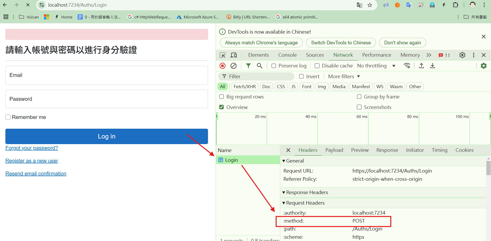
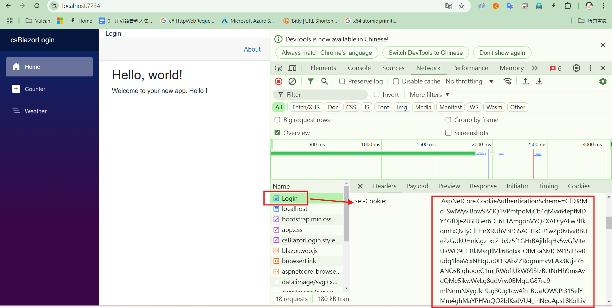

# .NET 8 Blazor Server Interactive 下需要進行 Cookie 身分驗證、登入設計教學


## 建立測試專案

請依照底下的操作，建立起這篇文章需要用到的練習專案

* 打開 Visual Studio 2022 IDE 應用程式
* 從 [Visual Studio 2022] 對話窗中，點選右下方的 [建立新的專案] 按鈕
* 在 [建立新專案] 對話窗右半部
  * 切換 [所有語言 (L)] 下拉選單控制項為 [C#]
  * 切換 [所有專案類型 (T)] 下拉選單控制項為 [Web]
* 在中間的專案範本清單中，找到並且點選 [Blazor Web App] 專案範本選項
  > A project template for creating a Blazor Web app that support both server-side rending and client interactivity. This template can be used for web apps with rich dynamic user interfaces (UIs)
* 點選右下角的 [下一步] 按鈕
* 在 [設定新的專案] 對話窗
* 找到 [專案名稱] 欄位，輸入 `csBlazorLogin` 作為專案名稱
* 在剛剛輸入的 [專案名稱] 欄位下方，確認沒有勾選 [將解決方案與專案至於相同目錄中] 這個檢查盒控制項
* 點選右下角的 [下一步] 按鈕
* 現在將會看到 [其他資訊] 對話窗
* 在 [架構] 欄位中，請選擇最新的開發框架，這裡選擇的 [架構] 是 : `.NET 8.0 (長期支援)`
* 在 [驗證類型] 欄位中，請選擇 [無] 
* 勾選 [針對 HTTPS 進行設定] 檢查盒欄位 
* 在 [Interactive render mode] 欄位中，請選擇 [Server] 
* 在 [Interactivity location] 欄位中，請選擇 [Global] 
* 勾選 [Include sample pages] 檢查盒欄位 
* 勾選 [Do not use top-level statements] 檢查盒欄位 
  > 這裡的這個操作，可以由讀者自行決定是否要勾選這個檢查盒控制項
* 不要勾選 [在 .NET Aspire 協調流程中登入] 檢查盒欄位 
* 請點選右下角的 [建立] 按鈕

稍微等候一下，這個 Blazor Web App 專案將會建立完成

## 修正 App.razor - 依據 URL 特徵來決定渲染模式

* 在 [專案節點] > [Components] 資料夾中，找到 `App.razor` 檔案
* 開啟 `App.razor` 檔案
* 這個檔案內容如下：

```razor
<!DOCTYPE html>
<html lang="en">

<head>
    <meta charset="utf-8" />
    <meta name="viewport" content="width=device-width, initial-scale=1.0" />
    <base href="/" />
    <link rel="stylesheet" href="bootstrap/bootstrap.min.css" />
    <link rel="stylesheet" href="app.css" />
    <link rel="stylesheet" href="BlazorApp1.styles.css" />
    <link rel="icon" type="image/png" href="favicon.png" />
    <HeadOutlet @rendermode="InteractiveServer" />
</head>

<body>
    <Routes @rendermode="InteractiveServer" />
    <script src="_framework/blazor.web.js"></script>
</body>

</html>
```

這個檔案是 Blazor 應用程序的主要 HTML 模板。這裡有幾個重要的元素：

```html
<HeadOutlet @rendermode="InteractiveServer" />
```

[HeadOutlet] 組件允許其他 Blazor 組件動態修改頁面的 [head] 部分。`@rendermode="InteractiveServer"` 表示這個組件使用 Server-Side 互動模式。

在 [body] 區段內，會有個 [Routes] 區塊

```html
<Routes @rendermode="InteractiveServer" />
```

[Routes] 組件負責處理應用程序的路由系統，決定顯示哪個頁面組件，在這裡有使用 [
@rendermode] 參數來指定要傳入的值為 [InteractiveServer]，這代表了要使用伺服器端互動模式。

從上述的 [App.razor] 檔案中，我們可以看到，這個應用程式是使用伺服器端互動模式來運作的。

因為，當使用者想要使用 Cookie 來儲存身分驗證後的資訊應用時候，這樣運作模式看樣子是無法符合需求的，因為，當要做這樣應用的時候，需要採用的是靜態 SSR 方式來設計。

為了解決此一問題，我們需要修改 `App.razor` 檔案，讓它可以依據 URL 的特徵來決定渲染模式。

現在，需要將 [App.razor] 檔案修改如下：

```html
@inject ILogger<App> Logger

<!DOCTYPE html>
<html lang="en">

<head>
    <meta charset="utf-8" />
    <meta name="viewport" content="width=device-width, initial-scale=1.0" />
    <base href="/" />
    <link rel="stylesheet" href="bootstrap/bootstrap.min.css" />
    <link rel="stylesheet" href="app.css" />
    <link rel="stylesheet" href="csBlazorLogin.styles.css" />
    <link rel="icon" type="image/png" href="favicon.png" />
    <HeadOutlet @rendermode="@RenderModeForPage()" />
</head>

<body>
    <Routes @rendermode="@RenderModeForPage()" />
    <script src="_framework/blazor.web.js"></script>
</body>

</html>

@code{
    [CascadingParameter]
    private HttpContext HttpContext { get; set; } = default!;

    private IComponentRenderMode? RenderModeForPage()
    {
        var foo = HttpContext.Request.Path.StartsWithSegments("/Auths")
      ? null : InteractiveServer;
      
      Logger.LogInformation($"Cookie : RenderModeForPage: {foo}");
        return foo;
    }
}
```

一開始在該檔案的最上方，將會使用 [@inject ILogger<App> Logger] 這個指令，來注入一個 ILogger 類型的 Logger 物件，這個物件將會用來記錄一些訊息，這裡使用這個程式碼的目的僅是為了要能夠做到除錯的目的。

在 [@code] 區塊內，使用了 `[CascadingParameter] 屬性`，這個 [CascadingParameter](https://learn.microsoft.com/zh-tw/aspnet/core/blazor/components/cascading-values-and-parameters?view=aspnetcore-9.0#cascadingparameter-attribute&WT.mc_id=DT-MVP-5002220) 表示了 串聯值和參數，這個屬性可以讓您將值從父組件傳遞到子組件，這裡使用這個屬性的目的是要取得 HttpContext 物件，這個物件是用來取得 HTTP 請求的相關資訊。

一旦取得了 [HttpContext] 物件之後，就可以透過其 Request 物件，接著取得與判斷此次連線請求的路徑，是否有符合特定條件的需求，在這裡的設計將會是，若連線的 URL 路徑開頭為 `/Auths` 這就表示了接下來的處理將不需要再採用互動式的SSR，而需要採用靜態 SSR 方式來做渲染，因為，在這個路徑下的頁面，需要進行使用者身分驗證的登入與登出運作處理。

這樣的設計，可以讓我們的 Blazor 應用程式，可以依據 URL 的特徵來決定渲染模式，這樣的設計，可以讓我們的應用程式更加的靈活，可以依據不同的需求，來採用不同的渲染模式。

接下來將會設計一個 [RenderModeForPage] 方法，這個方法將會根據上述的需求，來決定要使用的渲染模式，這個方法將會回傳一個 IComponentRenderMode 介面的物件，這個物件將會是用來決定要使用的渲染模式。

```csharp
    private IComponentRenderMode? RenderModeForPage()
    {
        var foo = HttpContext.Request.Path.StartsWithSegments("/Auths")
      ? null : InteractiveServer;
      
      Logger.LogInformation($"Cookie : RenderModeForPage: {foo}");
        return foo;
    }
```

上述程式碼說明了，使用 `HttpContext.Request.Path.StartsWithSegments("/Auths")` 這個方法，來判斷是否有符合 `/Auths` 這個路徑，如果有符合的話，就回傳 null (此時將會讓此頁面採用 靜態 SSR 渲染)，否則就回傳 InteractiveServer (此時將會讓此頁面採用 互動式 SSR 渲染)，這樣的設計，可以讓我們的 Blazor 應用程式，可以依據 URL 的特徵來決定渲染模式。

對於原先的 `<HeadOutlet @rendermode="InteractiveServer" />` 與 `<Routes @rendermode="InteractiveServer" />` 這兩個地方，現在已經改為使用 `@rendermode="@RenderModeForPage()"` 這樣的方式來設計，這樣的設計，可以讓我們的 Blazor 應用程式，可以依據 URL 的特徵來決定渲染模式。

## 建立使用者登入與登出的頁面

* 滑鼠右擊 [專案節點] > [Components] 資料夾
* 選擇 [加入] > [新增資料夾] 功能表選項
* 將此新資料夾命名為 [Auths]
* 滑鼠右擊 [Auths] 資料夾
* 選擇 [加入] > [Razor 元件] 功能表選項
* 將此新元件命名為 [Login.razor]
* 使用底下代碼替換掉掉這個檔案中的內容

```html
@page "/Auths/Login"

@using System.ComponentModel.DataAnnotations
@using Microsoft.AspNetCore.Authentication
@using Microsoft.AspNetCore.Authentication.Cookies
@using Microsoft.AspNetCore.Identity
@using System.Security.Claims
@using csBlazorLogin.Components.Layout

@layout EmptyLayout
@inject ILogger<Login> Logger

@inject NavigationManager NavigationManager

<PageTitle>身分驗證</PageTitle>

<div class="row">
    <div class="col-md-4">
        <section>
            <div class="alert alert-danger" role="alert">
                @errorMessage
            </div>

            <EditForm Model="Input" method="post" OnValidSubmit="LoginUser" FormName="login">
                <DataAnnotationsValidator />
                <h2>請輸入帳號與密碼以進行身分驗證</h2>
                <hr />
                <ValidationSummary class="text-danger" role="alert" />
                <div class="form-floating mb-3">
                    <InputText @bind-Value="Input.Email" class="form-control" autocomplete="username" aria-required="true" placeholder="name@example.com" />
                    <label for="email" class="form-label">Email</label>
                    <ValidationMessage For="() => Input.Email" class="text-danger" />
                </div>
                <div class="form-floating mb-3">
                    <InputText type="password" @bind-Value="Input.Password" class="form-control" autocomplete="current-password" aria-required="true" placeholder="password" />
                    <label for="password" class="form-label">Password</label>
                    <ValidationMessage For="() => Input.Password" class="text-danger" />
                </div>
                <div class="checkbox mb-3">
                    <label class="form-label">
                        <InputCheckbox @bind-Value="Input.RememberMe" class="darker-border-checkbox form-check-input" />
                        Remember me
                    </label>
                </div>
                <div>
                    <button type="submit" class="w-100 btn btn-lg btn-primary">Log in</button>
                </div>
                <div>
                    <p>
                        <a href="Account/ForgotPassword">Forgot your password?</a>
                    </p>
                    <p>
                        <a href="@(NavigationManager.GetUriWithQueryParameters("Account/Register", new Dictionary<string, object?> { ["ReturnUrl"] = ReturnUrl }))">Register as a new user</a>
                    </p>
                    <p>
                        <a href="Account/ResendEmailConfirmation">Resend email confirmation</a>
                    </p>
                </div>
            </EditForm>
        </section>
    </div>
</div>

@code {
    string errorMessage = string.Empty;

    [CascadingParameter]
    private HttpContext HttpContext { get; set; } = default!;

    [SupplyParameterFromForm]
    private InputModel Input { get; set; } = new();

    [SupplyParameterFromQuery]
    private string? ReturnUrl { get; set; }

    protected override async Task OnInitializedAsync()
    {
        if (HttpMethods.IsGet(HttpContext.Request.Method))
        {
            Logger.LogInformation("Cookie : Login: OnInitializedAsync Need SignOut");
            // Clear the existing external cookie to ensure a clean login process
            // await HttpContext.SignOutAsync("CookieAuthenticationScheme");
        }
        else
        {
            Logger.LogInformation("Cookie : Login: OnInitializedAsync No SignOut");
        }
    }

    protected override void OnAfterRender(bool firstRender)
    {
        base.OnAfterRender(firstRender);
        if (firstRender)
        {
            NavigationManager.NavigateTo("/Auths/Login", forceLoad: true);
        }
    }

    public async Task LoginUser()
    {

        #region 加入這個使用者需要用到的 宣告類型 Claim Type
        var claims = new List<Claim>
                {
                    new Claim(ClaimTypes.Role, "User"),
                    new Claim(ClaimTypes.NameIdentifier, Input.Email),
                };
        #endregion

        #region 建立 宣告式身分識別
        // ClaimsIdentity類別是宣告式身分識別的具體執行, 也就是宣告集合所描述的身分識別
        var claimsIdentity = new ClaimsIdentity(claims, CookieAuthenticationDefaults.AuthenticationScheme);
        #endregion

        #region 建立關於認證階段需要儲存的狀態
        string returnUrl = string.IsNullOrEmpty(ReturnUrl) ? "/" : ReturnUrl;
        var authProperties = new AuthenticationProperties
            {
                IsPersistent = true,
                RedirectUri = returnUrl,
            };
        #endregion

        #region 進行使用登入
        try
        {
            await HttpContext.SignInAsync(
                "CookieAuthenticationScheme",
            new ClaimsPrincipal(claimsIdentity),
            authProperties);
            // NavigationManager.NavigateTo("/weather", forceLoad:true);
        }
        catch (Exception ex)
        {
            var msg = ex.Message;
        }
        #endregion


    }

    private sealed class InputModel
    {
        // [Required]
        // [EmailAddress]
        public string Email { get; set; } = "";

        // [Required]
        // [DataType(DataType.Password)]
        public string Password { get; set; } = "";

        [Display(Name = "Remember me?")]
        public bool RememberMe { get; set; }
    }
}
```

在這個頁面，若使用者輸入完成帳號與密碼，點選 [Log in] 按鈕之後，將會觸發 [LoginUser] 方法，這個方法將會進行使用者的登入處理，這個方法將會進行使用者的身分驗證，並且進行使用者的登入處理。

不過，此時並不是採用 Client 端或者伺服器端的渲染，而是將使用者輸入的帳密，透過 HTTP POST 方法送至伺服器端，這樣的設計，如此，當使用者身分驗證成功之後，就可以將使用者身分資訊，透過 Cookie 的方式，傳送到用戶端的瀏覽器內。



從下圖中，可以看到伺服器端有透過 Cookie 來傳送相關的 Role & Claim 資訊給用戶端的瀏覽器內。



* 滑鼠右擊 [專案節點] > [Components] 資料夾
* 選擇 [加入] > [新增資料夾] 功能表選項
* 將此新資料夾命名為 [Auths]
* 滑鼠右擊 [Auths] 資料夾
* 選擇 [加入] > [Razor 元件] 功能表選項
* 將此新元件命名為 [Logout.razor]
* 使用底下代碼替換掉掉這個檔案中的內容

```html
@page "/Auths/Logout"

@using System.ComponentModel.DataAnnotations
@using Microsoft.AspNetCore.Authentication
@using Microsoft.AspNetCore.Authentication.Cookies
@using Microsoft.AspNetCore.Identity
@using System.Security.Claims
@using csBlazorLogin.Components.Layout

@layout EmptyLayout
@inject ILogger<Login> Logger

@inject NavigationManager NavigationManager

<PageTitle>登出</PageTitle>

@code {
    string errorMessage = string.Empty;

    [CascadingParameter]
    private HttpContext HttpContext { get; set; } = default!;

    protected override async Task OnInitializedAsync()
    {
        await HttpContext.SignOutAsync("CookieAuthenticationScheme");
        NavigationManager.NavigateTo("/Auths/Login", forceLoad:true);
    }
}
```

這個頁面邏輯就相當單純多了，一旦要顯示這個畫面的時候，就會立即進行使用者的登出處理，這裡使用了 `await HttpContext.SignOutAsync("CookieAuthenticationScheme");` 敘述，這樣的設計，可以讓使用者在登出之後，可以立即回到登入頁面。

## 修正 MainLayout.razor

* 找到 [專案節點] > [Components] > [Layout] 資料夾
* 開啟 `MainLayout.razor` 檔案
* 找到 `<main>` 標籤
* 在其下方加入底下標籤宣告

```html
<div @onclick="GoLoginPage" class="px-3">
    Login
</div>
```

* 在最下面加入底下的程式碼

```html

@code {
    private void GoLoginPage(MouseEventArgs e)
    {
        NavigationManager.NavigateTo("Auths/Login", true);
    }
}
```

一旦使用者點選了 [Login] 這個按鈕之後，就會立即導向到登入頁面，這樣的設計，可以讓使用者可以立即進行登入的操作。

## 修正 Program.cs

* 在 [專案節點] ，找到並且打開 `Program.cs` 檔案
* 找到 `.AddInteractiveServerComponents();` 這一行
* 在其下方加入底下的程式碼

```csharp
builder.Services.AddCascadingAuthenticationState();

builder.Services.AddAuthentication("CookieAuthenticationScheme")
.AddCookie("CookieAuthenticationScheme");
```

這樣的設計，可以讓我們的 Blazor 應用程式，可以透過 Cookie 來儲存使用者的身分驗證資訊，這樣的設計，可以讓我們的應用程式可以進行使用者的登入與登出操作。

這個 [AddCascadingAuthenticationState] 方法，將會註冊串聯驗證狀態服務，這樣的設計，可以讓我們的 Blazor 應用程式，可以透過串聯驗證狀態服務，來取得使用者的身分驗證資訊。

這個 [AddAuthentication] 與 [AddCookie] 方法，將會註冊 Cookie 驗證服務，這樣的設計，可以讓我們的 Blazor 應用程式，可以透過 Cookie 來儲存使用者的身分驗證資訊。
