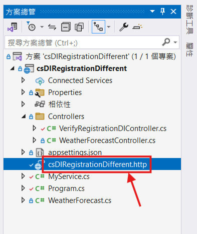
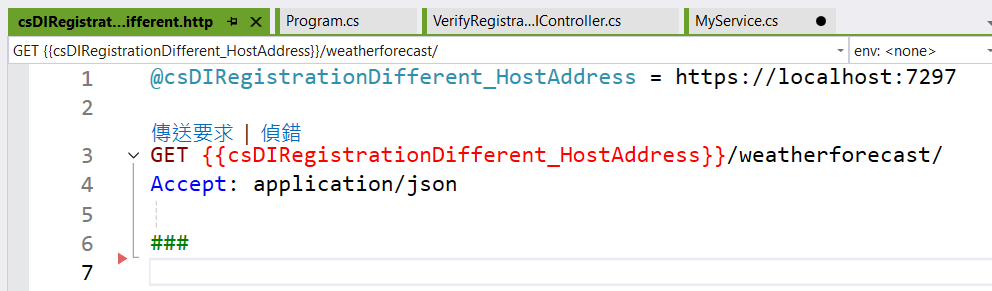
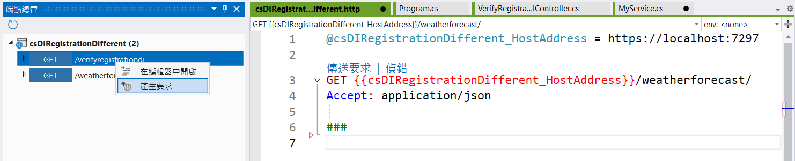
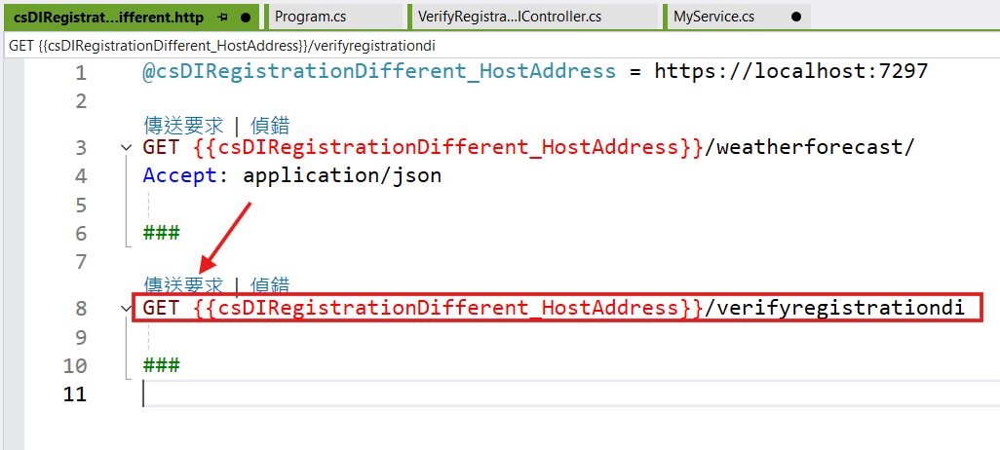
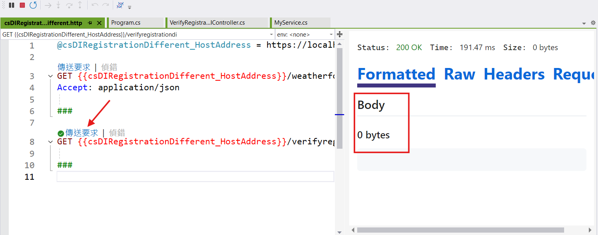

# 在 .NET9 的相依性注入三種方式的使用上差異


在這篇文章中，將會透過一個 ASP.NET Core 專案，建立一個 控制器 Controller，分別來進行不同相依性注入生命週期的表現，透過這篇文章，來瞭解透過不同方式來注入(建構式注入與服務定位器)或者取得不同生命週期(Transient、Scoped 和 Singleton)的物件，在實際使用上，會有甚麼差異。底下將會是預計要做的評估做法。

* 在 控制器內，使用建構式注入了 Transient、Scoped 和 Singleton 三個服務
* 在 控制器內，使用建構式注入了 TogetherMyService 這個服務
* 在 [TogetherMyService] 類別內，使用建構式注入了 Transient、Scoped 和 Singleton 三個服務
* 在 [TogetherMyService] 類別內，使用建構式注入了 IServiceProvider 服務定位器
* 在 [TogetherMyService] 類別內，使用服務定位器取得了 Transient、Scoped 和 Singleton 三個服務

## 建立測試專案

請依照底下的操作，建立起這篇文章需要用到的練習專案

* 打開 Visual Studio 2022 IDE 應用程式
* 從 [Visual Studio 2022] 對話窗中，點選右下方的 [建立新的專案] 按鈕
* 在 [建立新專案] 對話窗右半部
  * 切換 [所有語言 (L)] 下拉選單控制項為 [C#]
  * 切換 [所有專案類型 (T)] 下拉選單控制項為 [Web API]
* 在中間的專案範本清單中，找到並且點選 [ASP.NET Core Web API] 專案範本選項
  > 此專案範本可用於 ASP.NET Core 控制器或最小 API 建立 RESTful Web API，並可選擇性支援 OpenAPI 和驗證
* 點選右下角的 [下一步] 按鈕
* 在 [設定新的專案] 對話窗
* 找到 [專案名稱] 欄位，輸入 `csDIRegistrationDifferent` 作為專案名稱
* 在剛剛輸入的 [專案名稱] 欄位下方，確認沒有勾選 [將解決方案與專案至於相同目錄中] 這個檢查盒控制項
* 點選右下角的 [下一步] 按鈕
* 現在將會看到 [其他資訊] 對話窗
* 在 [架構] 欄位中，請選擇最新的開發框架，這裡選擇的 [架構] 是 : `.NET 9.0 (標準字詞支援)`
* 在 [驗證類型] 選擇無
* 在這個練習中，需要去勾選 [不要使用最上層陳述式(T)] 這個檢查盒控制項
  > 這裡的這個操作，可以由讀者自行決定是否要勾選這個檢查盒控制項
* 請點選右下角的 [建立] 按鈕

稍微等候一下，這個專案將會建立完成

## 建立一個要在控制器內注入的服務 TogetherMyService 類別

* 滑鼠右擊專案節點
* 選擇 [加入] > [類別]
* 在對話窗下方的 [名稱] 欄位內，輸入 [TogetherMyService] 作為類別名稱
* 點選 [新增] 按鈕
* 在 [TogetherMyService] 類別內，輸入底下的程式碼

```csharp
namespace csDIRegistrationDifferent
{
    public class MyService : ITransientMyService, ISingletonMyService, IScopedMyService
    {
        public int Value { get; set; }
        public DateTime CreateAt { get; set; }
        public MyService()
        {
            Value = new Random().Next(1000, 9999);
            CreateAt = DateTime.Now;
        }
    }


    public interface IBaseMyService
    {
        public int Value { get; set; }
        public DateTime CreateAt { get; set; }
    }

    public interface ISingletonMyService : IBaseMyService
    {
    }
    public interface IScopedMyService : ISingletonMyService
    {
    }

    public interface ITransientMyService : ISingletonMyService
    {
    }

    public class TogetherMyService
    {
        private readonly ITransientMyService transient;
        private readonly IScopedMyService scoped;
        private readonly ISingletonMyService singleton;
        private readonly IServiceProvider serviceProvider;
        private readonly ILogger<TogetherMyService> logger;

        public TogetherMyService(ITransientMyService transient,
            IScopedMyService scoped, ISingletonMyService singleton,
            IServiceProvider serviceProvider,
            ILogger<TogetherMyService> logger)
        {
            this.transient = transient;
            this.scoped = scoped;
            this.singleton = singleton;
            this.serviceProvider = serviceProvider;
            this.logger = logger;
        }

        public void Show()
        {
            var transientBy服務定位器 = serviceProvider.GetService<ITransientMyService>();
            var scopedBy服務定位器 = serviceProvider.GetService<IScopedMyService>();
            var singletonBy服務定位器 = serviceProvider.GetService<ISingletonMyService>();

            Console.WriteLine($"===  [From TogetherMyService ] ======================");
            Console.WriteLine($"TogetherMyService GetHashCode: {GetHashCode()}");
            Console.WriteLine($"=====================================================");
            Console.WriteLine($"Transient GetHashCode: {transient.GetHashCode()}");
            Console.WriteLine($"Transient Value: {transient.Value}");
            Console.WriteLine($"Transient服務定位器 Value: {transientBy服務定位器!.Value}");
            Console.WriteLine($"Transient Create Time: {transient.CreateAt}");
            Console.WriteLine($"---------------------------------");
            Console.WriteLine($"Scoped GetHashCode: {scoped.GetHashCode()}");
            Console.WriteLine($"Scoped Value: {scoped.Value}");
            Console.WriteLine($"Scoped服務定位器 Value: {scopedBy服務定位器!.Value}");
            Console.WriteLine($"Scoped Create Time: {scoped.CreateAt}");
            Console.WriteLine($"---------------------------------");
            Console.WriteLine($"Singleton GetHashCode: {singleton.GetHashCode()}");
            Console.WriteLine($"Singleton Value: {singleton.Value}");
            Console.WriteLine($"Singleto服務定位器n Value: {singletonBy服務定位器!.Value}");
            Console.WriteLine($"Singleton Create Time: {singleton.CreateAt}");
            Console.WriteLine($"");
            Console.WriteLine($"");
            Console.WriteLine($"");
        }
    }
}
```

在這個檔案中，將會建立一個 [IBaseMyService] 介面，這個介面有兩個屬性，分別是 [Value] 和 [CreateAt]，這兩個屬性都是可以讀寫的屬性。

```csharp
public interface IBaseMyService
{
    public int Value { get; set; }
    public DateTime CreateAt { get; set; }
}
```

接著，建立了三個介面 [ISingletonMyService]、[IScopedMyService] 和 [ITransientMyService]，這三個介面都繼承自 [IBaseMyService] 介面。最後，建立了一個 [MyService] 類別，這個類別實作了 [ISingletonMyService]、[IScopedMyService] 和 [ITransientMyService] 介面，並且在建構式中，初始化了 [Value] 和 [CreateAt] 屬性的值。

因此，有了 Transient、Scoped 和 Singleton 三個介面，就可以分別實作出相對應的服務，接著進行不同的生命週期的服務表現差異比較，在這裡的設計做法，這三個服務都是使用 [MyService] 這個類別實作的，這裡使用的語法為 `public class MyService : ITransientMyService, ISingletonMyService, IScopedMyService`。

除了會分別進行注入 Transient、Scoped 和 Singleton 三個服務外，注入一個 [TogetherMyService] 類別，並且在這個注入的物件內，再度同時注入 Transient、Scoped 和 Singleton 三個服務，並且在這個類別內，進行服務的取得，並且比較服務的取得方式，一個是透過建構式注入，另一個是透過服務定位器取得服務。

過服務定位器取得服務做法為，先透過建構式注入的方式，注入一個 [IServiceProvider] 服務定位器，接著透過這個服務定位器，取得 Transient、Scoped 和 Singleton 三個服務。其中在 .NET 框架內，[IServiceProvider] 這個介面是一個服務定位器，這個介面提供了一個方法 [GetService]，這個方法可以透過服務的型別，取得服務的實例。因此，在因此，在[TogetherMyService] 類別內，將會有透過服務定位器取得了 TransientBy服務定位器、ScopedBy服務定位器 和 SingletonBy服務定位器 三個服務與透過建構式入的 Transient、Scoped 和 Singleton 三個服務。

在 [TogetherMyService] 類別內，還設計了一個 [Show] 方法，這個方法將會列印出 Transient、Scoped 和 Singleton 三個採用建構式注入的服務的值，以及服務的建立時間，並且也會列印出 TransientBy服務定位器、ScopedBy服務定位器 和 SingletonBy服務定位器 三個採用服務定位器取的服務的值，這樣可以更清楚的看到服務的生命週期。

總結不同注入測試方法

* 控制器內，使用建構式注入了 Transient、Scoped 和 Singleton 三個服務
* 控制器內，使用建構式注入了 TogetherMyService 這個服務
* 在 [TogetherMyService] 類別內，使用建構式注入了 Transient、Scoped 和 Singleton 三個服務
* 在 [TogetherMyService] 類別內，使用建構式注入了 IServiceProvider 服務定位器
* 在 [TogetherMyService] 類別內，使用服務定位器取得了 Transient、Scoped 和 Singleton 三個服務

## 建立一個控制器

* 滑鼠右擊 [專案] > [Controllers] 節點
* 選擇 [加入] > [類別]
* 在對話窗下方的 [名稱] 欄位內，輸入 [VerifyRegistrationDIController] 作為類別名稱
* 點選 [新增] 按鈕
* 在 [VerifyRegistrationDIController] 類別內，輸入底下的程式碼

```csharp
using Microsoft.AspNetCore.Mvc;

namespace csDIRegistrationDifferent.Controllers;

[ApiController]
[Route("[controller]")]
public class VerifyRegistrationDIController : ControllerBase
{
    private readonly ILogger<VerifyRegistrationDIController> logger;
    private readonly TogetherMyService togetherMyService;
    private readonly ITransientMyService transient;
    private readonly IScopedMyService scoped;
    private readonly ISingletonMyService singleton;

    public VerifyRegistrationDIController(ILogger<VerifyRegistrationDIController> logger,
        TogetherMyService togetherMyService, ITransientMyService transient,
        IScopedMyService scoped, ISingletonMyService singleton)
    {
        this.logger = logger;
        this.togetherMyService = togetherMyService;
        this.transient = transient;
        this.scoped = scoped;
        this.singleton = singleton;
    }
    [HttpGet(Name = "GetVerifyRegistrationDI")]
    public void Get()
    {
        Console.WriteLine($"=== [From VerifyRegistrationDIController ] ======================");
        Console.WriteLine($"Transient Value: {transient.Value}");
        Console.WriteLine($"Scoped Value: {scoped.Value}");
        Console.WriteLine($"Singleton Value: {singleton.Value}");
        Console.WriteLine($"=================================================================");
        Console.WriteLine($"");
        Console.WriteLine($"");
        Console.WriteLine($"");
        togetherMyService.Show();
    }
}
```

在這個控制器 [VerifyRegistrationDIController] 內，使用建構式注入了 Transient、Scoped 和 Singleton 三個服務，並且也使用建構式注入了 TogetherMyService 這個服務，這樣就可以在這個控制器內，透過這些服務，來進行服務的操作。

對於這個 [Get()] 方法，這個方法將會列印出 Transient、Scoped 和 Singleton 三個服務的值，並且也會呼叫 [TogetherMyService] 類別內的 [Show()] 方法，這樣可以更清楚的看到服務的生命週期。

## 修改 Program.cs 類別內容

* 找到並且打開 [Program.cs] 這個檔案
* 使用底下程式碼替換掉這個檔案的內容

```csharp

namespace csDIRegistrationDifferent;

public class Program
{
    public static void Main(string[] args)
    {
        var builder = WebApplication.CreateBuilder(args);

        // Add services to the container.

        builder.Services.AddControllers();
        // Learn more about configuring OpenAPI at https://aka.ms/aspnet/openapi
        builder.Services.AddOpenApi();

        builder.Services.AddTransient<TogetherMyService>();
        builder.Services.AddTransient<ITransientMyService, MyService>();
        builder.Services.AddScoped<IScopedMyService, MyService>();
        builder.Services.AddSingleton<ISingletonMyService, MyService>();

        var app = builder.Build();

        // Configure the HTTP request pipeline.
        if (app.Environment.IsDevelopment())
        {
            app.MapOpenApi();
        }

        app.UseHttpsRedirection();

        app.UseAuthorization();


        app.MapControllers();

        app.Run();
    }
}
```

在這個 ASP.NET Core Web API 進入點內，將會底下程式碼，宣告不同類別的注入生命週期，以及使用不同介面(但是都會使用同一個具體實作類別) 宣告其要注入的生命週期。

```csharp
builder.Services.AddTransient<TogetherMyService>();
builder.Services.AddTransient<ITransientMyService, MyService>();
builder.Services.AddScoped<IScopedMyService, MyService>();
builder.Services.AddSingleton<ISingletonMyService, MyService>();
```

## 使用 HTTP 檔案來協助做 API 測試

* 在專案跟目錄下，找到並且打開 [csDIRegistrationDifferent.http] 這個檔案
  
* 此時在 VS2022 將會看到如下畫面

  

* 在這個檔案內，將會有一些 HTTP 請求的範例，這些範例將會用來測試 API 的功能
* 點選功能表 [檢視] > [其他視窗] > [端點總管]
* 滑鼠右擊 [verifyregistrationdi] 節點，接著點選 [產生要求] 項目
  
* 此時將會看到 [csDIRegistrationDifferent.http] 的視窗，列出了這個 HTTP 請求的結果
  

## 執行測試專案
* 按下 `F5` 開始執行專案
* 等候一下，當螢幕上開始顯示訊息時，表示專案已經開始執行
* 點選功能表 [檢視] > [其他視窗] > [端點總管]
* 在 [csDIRegistrationDifferent.http] 的視窗內找到 [verifyregistrationdi] 節點
* 點選該節點上方的 [傳送要求] 按鈕，此時，將會呼叫此 API 服務端點
  
* 當螢幕上顯示出了服務端點的回應結果，表示這個 API 服務已經成功執行
  

* 在輸出視窗內，將會看到如下的訊息

```plaintext
=== [From VerifyRegistrationDIController ] ======================
Transient Value: 6478
Scoped Value: 5987
Singleton Value: 4042
=================================================================


===  [From TogetherMyService ] ======================
TogetherMyService GetHashCode: 33771145
=====================================================
Transient GetHashCode: 41572837
Transient Value: 4203
Transient服務定位器 Value: 5286
Transient Create Time: 2025/1/13 下午 01:38:20
---------------------------------
Scoped GetHashCode: 61799993
Scoped Value: 5987
Scoped服務定位器 Value: 5987
Scoped Create Time: 2025/1/13 下午 01:38:20
---------------------------------
Singleton GetHashCode: 4898379
Singleton Value: 4042
Singleto服務定位器n Value: 4042
Singleton Create Time: 2025/1/13 下午 01:38:20
```
* 再次執行[verifyregistrationdi] 節點上方的 [傳送要求] 按鈕，此時，將會再次呼叫此 API 服務端點

* 在輸出視窗內，將會看到如下的訊息

```plaintext
=== [From VerifyRegistrationDIController ] ======================
Transient Value: 6446
Scoped Value: 4577
Singleton Value: 4042
=================================================================


===  [From TogetherMyService ] ======================
TogetherMyService GetHashCode: 3908833
=====================================================
Transient GetHashCode: 48180023
Transient Value: 4119
Transient服務定位器 Value: 8605
Transient Create Time: 2025/1/13 下午 01:41:06
---------------------------------
Scoped GetHashCode: 10267778
Scoped Value: 4577
Scoped服務定位器 Value: 4577
Scoped Create Time: 2025/1/13 下午 01:41:06
---------------------------------
Singleton GetHashCode: 4898379
Singleton Value: 4042
Singleto服務定位器n Value: 4042
Singleton Create Time: 2025/1/13 下午 01:38:20
```

* 現在來比較與說明這兩次的執行結果

根據輸出結果，我們可以清楚看到三種不同註冊模式的特性。

| 註冊模式 | GetHashCode 比較 | Value 值比較 | 創建時間 | 特性說明 |
|---------|-----------------|-------------|----------|----------|
| Transient | 兩次請求的 HashCode 不同:<br>41572837 → 48180023 | 每次值都不同:<br>6478 → 6446<br>4203 → 4119<br>5286 → 8605 | 每次請求都會重新建立:<br>01:38:20<br>01:41:06 | - 每次注入都是新實例<br>- 即使在同一個請求中也會創建新的實例<br>- 最不節省資源但隔離性最好 |
| Scoped | 兩次請求的 HashCode 不同:<br>61799993 → 10267778 | 同一請求中值相同，不同請求值不同:<br>5987 → 4577 | 每次請求都會重新建立:<br>01:38:20<br>01:41:06 | - 同一個請求中共用同一個實例<br>- 不同請求會創建新的實例<br>- 適合大多數業務場景 |
| Singleton | 兩次請求的 HashCode 相同:<br>4898379 → 4898379 | 所有請求值都相同:<br>4042 → 4042 | 只在第一次建立:<br>01:38:20 | - 整個應用程式只有一個實例<br>- 所有請求共用同一個實例<br>- 最節省資源但要注意線程安全 |

從這個比較可以看出：

1. Transient 服務每次注入都是全新的實例，適合無狀態且需要完全隔離的服務
2. Scoped 服務在同一個請求（Request）範圍內是相同實例，適合大多數業務場景
3. Singleton 服務在整個應用程式生命週期中只有一個實例，適合共用的工具類服務

需要注意的是，選擇哪種生命週期模式要根據實際業務需求來決定，同時要考慮到性能和線程安全的問題。


