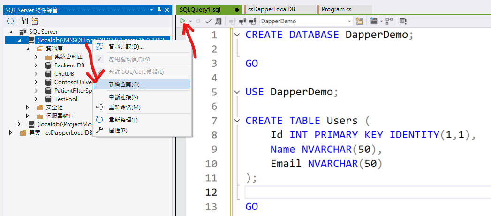
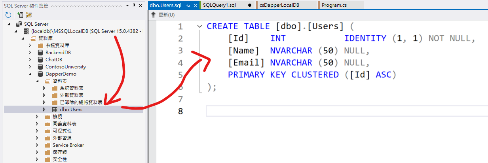

# 使用 Dapper 對 LocalDB 進行資料庫存取


在這裡將要探討與說明，如何透過 LocalDB 資料庫，可以對欄位中的 JSON 物件進行查詢與更新的操作。不過，在此之前，首先先來說明，如何在 C# 內使用 Dapper 這個 ORM 框架，來對 LocalDB 資料庫進行存取的操作。(由於我之前大多使用 EntityFramework Core + LINQ 來進行資料庫的存取，日常使用 Dapper 機會不大，因此，透過這篇文章來記錄下如何使用 Dapper 套件進行資料庫存取的作法)

Dapper 簡介

Dapper 是一個簡單的物件映射器，可以幫助我們將資料庫中的資料，映射到 C# 物件上，或是將 C# 物件映射到資料庫中的資料。Dapper 是一個高效率的 ORM 框架，它的效能比 EntityFramework Core 還要好，因為它是直接對資料庫進行操作，而不是透過 LINQ 這個中間層來進行操作。

Dapper 它是一個開源的專案，可以在 [GitHub](https://github.com/DapperLib/Dapper) 上找到它的原始碼。Dapper 是一個輕量級的 ORM 框架，這使得 Dapper 的學習曲線非常低，並且非常容易上手。

Dapper 提供了一系列的擴充方法，可以幫助我們對資料庫進行操作，例如：查詢資料、新增資料、更新資料、刪除資料等等。Dapper 的 API 設計非常簡單，並且非常直觀，我們可以很容易地使用它來對資料庫進行操作。

## 建立測試專案

請依照底下的操作，建立起這篇文章需要用到的練習專案

* 打開 Visual Studio 2022 IDE 應用程式
* 從 [Visual Studio 2022] 對話窗中，點選右下方的 [建立新的專案] 按鈕
* 在 [建立新專案] 對話窗右半部
  * 切換 [所有語言 (L)] 下拉選單控制項為 [C#]
  * 切換 [所有專案類型 (T)] 下拉選單控制項為 [主控台]
* 在中間的專案範本清單中，找到並且點選 [主控台應用程式] 專案範本選項
  > 專案，用於建立可在 Windows、Linux 及 macOS 於 .NET 執行的命令列應用程式
* 點選右下角的 [下一步] 按鈕
* 在 [設定新的專案] 對話窗
* 找到 [專案名稱] 欄位，輸入 `csDapperLocalDB` 作為專案名稱
* 在剛剛輸入的 [專案名稱] 欄位下方，確認沒有勾選 [將解決方案與專案至於相同目錄中] 這個檢查盒控制項
* 點選右下角的 [下一步] 按鈕
* 現在將會看到 [其他資訊] 對話窗
* 在 [架構] 欄位中，請選擇最新的開發框架，這裡選擇的 [架構] 是 : `.NET 8.0 (長期支援)`
* 在這個練習中，需要去勾選 [不要使用最上層陳述式(T)] 這個檢查盒控制項
  > 這裡的這個操作，可以由讀者自行決定是否要勾選這個檢查盒控制項
* 請點選右下角的 [建立] 按鈕

稍微等候一下，這個 背景工作服務 專案將會建立完成

## 建立 LocalDB 資料庫

在這個練習中，我們將會使用 LocalDB 這個資料庫，請依照底下的操作步驟，建立起這個 LocalDB 資料庫
* 切換到 [SQL Server 物件總管] 視窗
* 在 [SQL Server 物件總管] 視窗中，找到 [(localdb)\MSSQLLocalDB] 節點
* 滑鼠右鍵點選 [(localdb)\MSSQLLocalDB] 節點，從彈出的功能表清單中，選擇 [新增查詢] 選項
* 在 [SQLQuery1.sql] 視窗內，輸入底下 SQL 命令



```sql
CREATE DATABASE DapperDemo;

GO

USE DapperDemo;

CREATE TABLE Users (
    Id INT PRIMARY KEY IDENTITY(1,1),
    Name NVARCHAR(50),
    Email NVARCHAR(50)
);

GO
```

* 在 [SQLQuery1.sql] 視窗內，全部選取此 SQL 命令
* 找到綠色三角形，點選此圖示，執行這個 SQL 命令
* 此時在該視窗的下方，就會看到執行結果的訊息 : `命令已順利完成。`
* 滑鼠右擊 [(localdb)\MSSQLLocalDB] 節點
* 從彈出的功能表清單中，選擇 [重新整理] 選項
* 在 [SQL Server 物件總管] 視窗中，將會看到剛剛建立好的 `DapperDemo` 資料庫，並且該資料庫內將會有一個 `Users` 資料表



## 安裝要用到的 NuGet 開發套件

因為開發此專案時會用到這些 NuGet 套件，請依照底下說明，將需要用到的 NuGet 套件安裝起來。

### 安裝 Microsoft.Data.SqlClient 套件

請依照底下說明操作步驟，將這個套件安裝到專案內

* 滑鼠右擊 [方案總管] 視窗內的 [專案節點] 下方的 [相依性] 節點
* 從彈出功能表清單中，點選 [管理 NuGet 套件] 這個功能選項清單
* 此時，將會看到 [NuGet: csDapperLocalDB] 視窗
* 切換此視窗的標籤頁次到名稱為 [瀏覽] 這個標籤頁次
* 在左上方找到一個搜尋文字輸入盒，在此輸入 `Microsoft.Data.SqlClient`
* 在視窗右方，將會看到該套件詳細說明的內容，其中，右上方有的 [安裝] 按鈕
  > 請確認有取消 Pre-release 這個選項，與選擇 2.0 正式版
* 點選這個 [安裝] 按鈕，將這個套件安裝到專案內

### 安裝 Dapper 套件

請依照底下說明操作步驟，將這個套件安裝到專案內

* 滑鼠右擊 [方案總管] 視窗內的 [專案節點] 下方的 [相依性] 節點
* 從彈出功能表清單中，點選 [管理 NuGet 套件] 這個功能選項清單
* 此時，將會看到 [NuGet: csDapperLocalDB] 視窗
* 切換此視窗的標籤頁次到名稱為 [瀏覽] 這個標籤頁次
* 在左上方找到一個搜尋文字輸入盒，在此輸入 `Dapper`
* 在視窗右方，將會看到該套件詳細說明的內容，其中，右上方有的 [安裝] 按鈕
  > 請確認有取消 Pre-release 這個選項，與選擇 2.0 正式版
* 點選這個 [安裝] 按鈕，將這個套件安裝到專案內

## 修改 Program.cs 類別內容

在這篇文章中，將會把會用到的新類別與程式碼，都寫入到 [Program.cs] 這個檔案中，請依照底下的操作，修改 [Program.cs] 這個檔案的內容

* 在專案中找到並且打開 [Program.cs] 檔案
* 將底下的程式碼取代掉 `Program.cs` 檔案中內容

```csharp
using Dapper;
using Microsoft.Data.SqlClient;

namespace csDapperLocalDB;

class Program
{
    static void Main(string[] args)
    {
        string connectionString = @"Server=(localdb)\MSSQLLocalDB;Database=DapperDemo;Trusted_Connection=True;";

        using (var connection = new SqlConnection(connectionString))
        {
            connection.Open();

            // 新增資料
            string insertQuery = "INSERT INTO Users (Name, Email) VALUES (@Name, @Email)";
            var user = new { Name = "John Doe", Email = "john.doe@example.com" };
            connection.Execute(insertQuery, user);

            // 查詢資料
            string selectQuery = "SELECT * FROM Users";
            var users = connection.Query<User>(selectQuery);

            foreach (var u in users)
            {
                Console.WriteLine($"Id: {u.Id}, Name: {u.Name}, Email: {u.Email}");
            }
        }
    }
}

public class User
{
    public int Id { get; set; }
    public string Name { get; set; }
    public string Email { get; set; }
}
```

在這裡，將會使用強型別的方式來對資料庫進行操作，這裡定義了一個 `User` 類別，用來對應到資料庫中的 `Users` 資料表，該類別內會有三個屬性，分別對應到該資料表內的三個 Column。

在 `Main` 方法中，首先建立了一個 `connectionString` 字串，用來連接到 LocalDB 資料庫。然後，建立了一個 `SqlConnection` 物件，並且使用 `connection.Open()` 方法，打開資料庫連接。

接著，使用 `connection.Execute()` 方法，對資料庫進行新增資料的操作。然後，使用 `connection.Query()` 方法，對資料庫進行查詢資料的操作，並且將查詢結果顯示在主控台視窗內。在這裡將會使用 INSERT INTO 命令，將一筆資料新增到 `Users` 資料表內。

接著，然後使用 SELECT * FROM Users 命令，查詢 `Users` 資料表內的所有資料，並且將查詢結果顯示在主控台視窗內。

因此，當使用 Dapper 套件進行資料庫存取的時候，將會需要自行設計與撰寫 SQL 命令，並且使用 Dapper 提供的方法，來對資料庫進行操作。這與使用 LINQ 方法不同，不過，兩者之間都可以使用強型別的方式來對資料庫進行操作。

## 執行程式

* 按下 `F5` 鍵，開始執行這個程式
* 程式將會開始執行，並且在主控台視窗內，將會看到類似下圖的輸出結果

```plaintext
Id: 1, Name: John Doe, Email: john.doe@example.com
```
