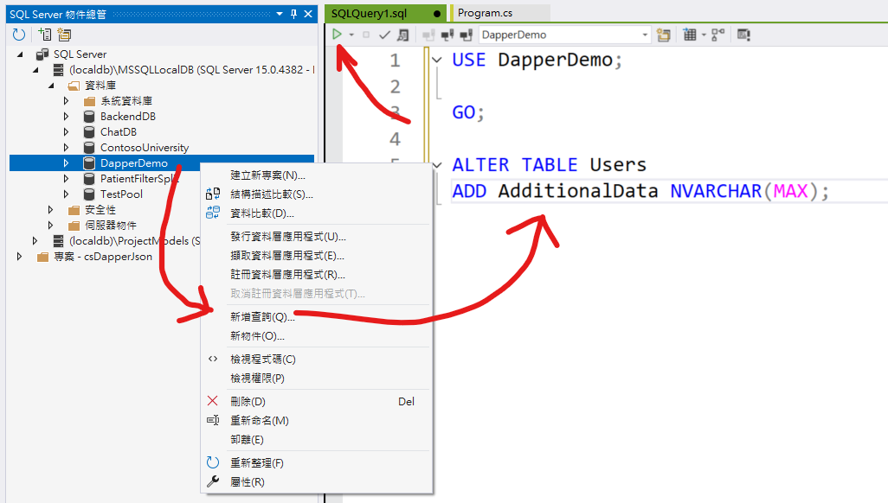
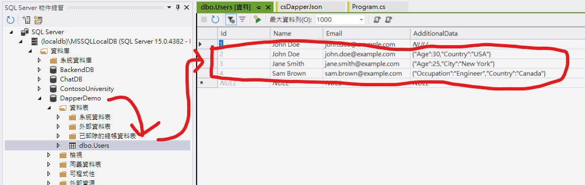

# 使用 Dapper 對 JSON 欄位進行資料庫存取


在上一篇文章中，[使用 Dapper 對 LocalDB 進行資料庫存取](https://csharpkh.blogspot.com/2025/03/csharp-Dapper-Data-SqlClient-localdb.html)，說明了如何在 C# 內透過 Dapper 來進行資料庫的存取，在這篇文章中，將要來實踐，把 JSON 物件儲存到資料庫內，並且透過 SQL Server 的 JSON_VALUE 函數，來查詢 JSON 物件內的屬性值。更多的資訊，可以參考 [SQL Server 中的 JSON 資料](https://learn.microsoft.com/zh-tw/sql/relational-databases/json/json-data-sql-server?view=sql-server-ver16&WT.mc_id=DT-MVP-5002220) 這篇文章。

SQL Server 2016 (13.x) 推出的 JSON 函數可讓您將 NoSQL 與關聯式概念結合在同一個資料庫中。 您可以將傳統關聯式資料行與包含採用 JSON 文字格式之文件的資料行結合在同一個資料表中、剖析並匯入關聯式結構中的 JSON 文件，或讓關聯式資料採用 JSON 文字格式。

您可使用 SQL Server 內建函式和運算子，以 JSON 文字執行下列作業：

* 剖析 JSON 文字，並讀取或修改值。
* 將 JSON 物件的陣列轉換成資料表格式。
* 在已轉換的 JSON 物件上執行任何 Transact SQL 查詢。
* 以 JSON 格式格式化 Transact-SQL 查詢的結果。

## 建立測試專案

請依照底下的操作，建立起這篇文章需要用到的練習專案

* 打開 Visual Studio 2022 IDE 應用程式
* 從 [Visual Studio 2022] 對話窗中，點選右下方的 [建立新的專案] 按鈕
* 在 [建立新專案] 對話窗右半部
  * 切換 [所有語言 (L)] 下拉選單控制項為 [C#]
  * 切換 [所有專案類型 (T)] 下拉選單控制項為 [主控台]
* 在中間的專案範本清單中，找到並且點選 [主控台應用程式] 專案範本選項
  > 專案，用於建立可在 Windows、Linux 及 macOS 於 .NET 執行的命令列應用程式
* 點選右下角的 [下一步] 按鈕
* 在 [設定新的專案] 對話窗
* 找到 [專案名稱] 欄位，輸入 `csDapperJson` 作為專案名稱
* 在剛剛輸入的 [專案名稱] 欄位下方，確認沒有勾選 [將解決方案與專案至於相同目錄中] 這個檢查盒控制項
* 點選右下角的 [下一步] 按鈕
* 現在將會看到 [其他資訊] 對話窗
* 在 [架構] 欄位中，請選擇最新的開發框架，這裡選擇的 [架構] 是 : `.NET 8.0 (長期支援)`
* 在這個練習中，需要去勾選 [不要使用最上層陳述式(T)] 這個檢查盒控制項
  > 這裡的這個操作，可以由讀者自行決定是否要勾選這個檢查盒控制項
* 請點選右下角的 [建立] 按鈕

稍微等候一下，這個 背景工作服務 專案將會建立完成

## 變更 LocalDB 資料庫內的資料表

在這篇文章中，將會把 JSON 物件，儲存到 RDBMS 的資料表內，因此，在這裡需要一個 [AdditionalData] 欄位，來儲存 JSON 物件的內容。請依照底下的操作步驟，變更 LocalDB 資料庫內的資料表

* 切換到 [SQL Server 物件總管] 視窗
* 在 [SQL Server 物件總管] 視窗中，找到 [(localdb)\MSSQLLocalDB] > [資料庫] > [DapperDemo] 節點
* 滑鼠右鍵點選 DapperDemo 節點，從彈出的功能表清單中，選擇 [新增查詢] 選項
* 在 [SQLQuery1.sql] 視窗內，輸入底下 SQL 命令



```sql
USE DapperDemo;

ALTER TABLE Users
ADD AdditionalData NVARCHAR(MAX);
```

* 在 [SQLQuery1.sql] 視窗內，全部選取此 SQL 命令
* 找到綠色三角形，點選此圖示，執行這個 SQL 命令
* 此時在該視窗的下方，就會看到執行結果的訊息 : `命令已順利完成。`
* 現在這個 [Users] 資料表已經新增了一個 [AdditionalData] 欄位

```sql
CREATE TABLE [dbo].[Users] (
    [Id]             INT            IDENTITY (1, 1) NOT NULL,
    [Name]           NVARCHAR (50)  NULL,
    [Email]          NVARCHAR (50)  NULL,
    [AdditionalData] NVARCHAR (MAX) NULL,
    PRIMARY KEY CLUSTERED ([Id] ASC)
);
```

## 安裝要用到的 NuGet 開發套件

因為開發此專案時會用到這些 NuGet 套件，請依照底下說明，將需要用到的 NuGet 套件安裝起來。

### 安裝 Microsoft.Data.SqlClient 套件

請依照底下說明操作步驟，將這個套件安裝到專案內

* 滑鼠右擊 [方案總管] 視窗內的 [專案節點] 下方的 [相依性] 節點
* 從彈出功能表清單中，點選 [管理 NuGet 套件] 這個功能選項清單
* 此時，將會看到 [NuGet: csDapperJson] 視窗
* 切換此視窗的標籤頁次到名稱為 [瀏覽] 這個標籤頁次
* 在左上方找到一個搜尋文字輸入盒，在此輸入 `Microsoft.Data.SqlClient`
* 在視窗右方，將會看到該套件詳細說明的內容，其中，右上方有的 [安裝] 按鈕
  > 請確認有取消 Pre-release 這個選項，與選擇 2.0 正式版
* 點選這個 [安裝] 按鈕，將這個套件安裝到專案內

### 安裝 Dapper 套件

請依照底下說明操作步驟，將這個套件安裝到專案內

* 滑鼠右擊 [方案總管] 視窗內的 [專案節點] 下方的 [相依性] 節點
* 從彈出功能表清單中，點選 [管理 NuGet 套件] 這個功能選項清單
* 此時，將會看到 [NuGet: csDapperJson] 視窗
* 切換此視窗的標籤頁次到名稱為 [瀏覽] 這個標籤頁次
* 在左上方找到一個搜尋文字輸入盒，在此輸入 `Dapper`
* 在視窗右方，將會看到該套件詳細說明的內容，其中，右上方有的 [安裝] 按鈕
  > 請確認有取消 Pre-release 這個選項，與選擇 2.0 正式版
* 點選這個 [安裝] 按鈕，將這個套件安裝到專案內

## 修改 Program.cs 類別內容

在這篇文章中，將會把會用到的新類別與程式碼，都寫入到 [Program.cs] 這個檔案中，請依照底下的操作，修改 [Program.cs] 這個檔案的內容

* 在專案中找到並且打開 [Program.cs] 檔案
* 將底下的程式碼取代掉 `Program.cs` 檔案中內容

```csharp
using Dapper;
using Microsoft.Data.SqlClient;

namespace csDapperJson;

class Program
{
    static void Main(string[] args)
    {
        string connectionString = @"Server=(localdb)\MSSQLLocalDB;Database=DapperDemo;Trusted_Connection=True;";

        using (var connection = new SqlConnection(connectionString))
        {
            connection.Open();

            // 多筆資料插入
            string insertQuery = @"
                    INSERT INTO Users (Name, Email, AdditionalData) 
                    VALUES (@Name, @Email, @AdditionalData)";

            var users = new List<dynamic>
                {
                    new { Name = "John Doe", Email = "john.doe@example.com", AdditionalData = "{\"Age\":30,\"Country\":\"USA\"}" },
                    new { Name = "Jane Smith", Email = "jane.smith@example.com", AdditionalData = "{\"Age\":25,\"City\":\"New York\"}" },
                    new { Name = "Sam Brown", Email = "sam.brown@example.com", AdditionalData = "{\"Occupation\":\"Engineer\",\"Country\":\"Canada\"}" }
                };

            connection.Execute(insertQuery, users);

            // 查詢資料，根據 Name 和 JSON 中的 Country 屬性
            string selectQuery = @"
                    SELECT * 
                    FROM Users 
                    WHERE Name = @Name AND JSON_VALUE(AdditionalData, '$.Country') = @Country";

            var result = connection.Query<User>(
                selectQuery, new { Name = "Sam Brown", Country = "Canada" });

            foreach (var u in result)
            {
                Console.WriteLine($"Id: {u.Id}, Name: {u.Name}, Email: {u.Email}, AdditionalData: {u.AdditionalData}");
            }
        }
    }
}

public class User
{
    public int Id { get; set; }
    public string Name { get; set; }
    public string Email { get; set; }
    public string AdditionalData { get; set; }
}
```

由於 [User] 資料表已經有所修改，因此，這裡也需要修改 [User] 類別的內容，在此將會在該類別內，新增一個 [AdditionalData] 屬性，用來儲存 JSON 物件的內容。

在 [Main] 方法內，這裡有兩個 SQL 命令，第一個是插入資料到 [Users] 資料表內，第二個是查詢資料，根據 [Name] 和 JSON 中的 [Country] 屬性值。

首先，建立一個 [SqlConnection] 物件，並且開啟資料庫連線，接著，透過 [Execute] 方法，將資料插入到 [Users] 資料表內，在這裡將會使用底下的 SQL 命令。

```sql
string insertQuery = @"
        INSERT INTO Users (Name, Email, AdditionalData) 
        VALUES (@Name, @Email, @AdditionalData)";
```

接著，由於在這裡將會一次新增多筆紀錄，因此，這裡使用了一個型別為 [List<dynamic>] 的 [users] 物件，來儲存這些資料，並且透過 [Execute] 方法，將這些資料插入到 [Users] 資料表內： `connection.Execute(insertQuery, users)`。

從下面截圖，將會看到實際的新資料已經存在於資料表內了。



現在要使用底下的 SQL 命令

```sql
string selectQuery = @"
        SELECT * 
        FROM Users 
        WHERE Name = @Name AND JSON_VALUE(AdditionalData, '$.Country') = @Country";
```

在這裡的 SQL 查詢命令，將會查詢 [Users] 資料表內的資料，根據 [Name] 和 JSON 中的 [Country] 屬性值，這裡使用了 [JSON_VALUE] 函數，來查詢 JSON 物件中的屬性值。從這裡的 Where 條件中，可以看到，這裡的 [Name] 是 `Sam Brown`，而且 JSON 物件中的 [Country] 屬性值是 `Canada`。

## 執行程式

* 按下 `F5` 鍵，開始執行這個程式
* 程式將會開始執行，並且在主控台視窗內，將會看到類似下圖的輸出結果

```plaintext
Id: 4, Name: Sam Brown, Email: sam.brown@example.com, AdditionalData: {"Occupation":"Engineer","Country":"Canada"}
```