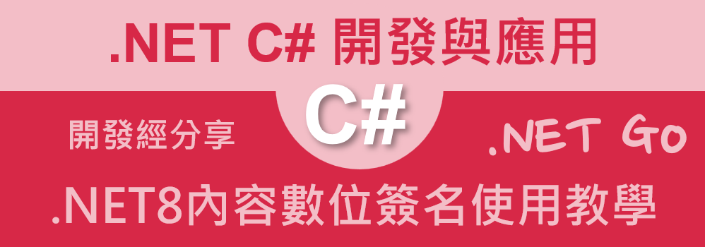

# .NET 8 / C# 內容數位簽名使用方式教學



在上一篇文章 (.NET 8 / C# 非對稱式 RSA 加解密使用教學)[https://csharpkh.blogspot.com/2025/02/csharp-Rsa-Asymertic-Encryption-Decrypt-plantext-Key.html] 中，我們介紹了如何使用非對稱式的 RSA 加解密方式，這一篇文章將會介紹如何使用內容數位簽名的方式，來確保資料的完整性。

這是一個非常普遍的應用，當製作好一份電子文件檔案、郵件，想要透過 USB 或者 網路傳送給其他人員的時候，收到該電子檔案或者郵件的人員，要如何相信這個電子檔案或者郵件是真的，沒有被篡改過呢？又或者在傳輸的過程中，因為網路上的問題，導致內容損毀？這時候，內容數位簽名就可以幫助我們解決這個問題。

基本的原理將會是透過私鑰對資料進行簽名，然後將簽名的結果與原始資料一起傳送給對方，對方再透過公鑰對簽名的結果進行驗證，如果驗證成功，就代表這份資料是真實的，沒有被篡改過。

在這篇文章中，我們將會使用 RSA 演算法來進行內容數位簽名的操作，這個範例將會模擬 Jim 與 Tom 兩個人員之間的通訊，Jim 與 Tom 會互相對彼此的訊息進行簽名與驗證。

## 建立測試專案

請依照底下的操作，建立起這篇文章需要用到的練習專案

* 打開 Visual Studio 2022 IDE 應用程式
* 從 [Visual Studio 2022] 對話窗中，點選右下方的 [建立新的專案] 按鈕
* 在 [建立新專案] 對話窗右半部
  * 切換 [所有語言 (L)] 下拉選單控制項為 [C#]
  * 切換 [所有專案類型 (T)] 下拉選單控制項為 [服務]
* 在中間的專案範本清單中，找到並且點選 [背景工作服務] 專案範本選項
  > 用於建立 Worker Service 的空白專案範本
* 點選右下角的 [下一步] 按鈕
* 在 [設定新的專案] 對話窗
* 找到 [專案名稱] 欄位，輸入 `csDigitalSignature` 作為專案名稱
* 在剛剛輸入的 [專案名稱] 欄位下方，確認沒有勾選 [將解決方案與專案至於相同目錄中] 這個檢查盒控制項
* 點選右下角的 [下一步] 按鈕
* 現在將會看到 [其他資訊] 對話窗
* 在 [架構] 欄位中，請選擇最新的開發框架，這裡選擇的 [架構] 是 : `.NET 8.0 (長期支援)`
* 在這個練習中，需要去勾選 [不要使用最上層陳述式(T)] 這個檢查盒控制項
  > 這裡的這個操作，可以由讀者自行決定是否要勾選這個檢查盒控制項
* 請點選右下角的 [建立] 按鈕

稍微等候一下，這個 背景工作服務 專案將會建立完成

## 修改 Program.cs 類別內容

在這篇文章中，將會把會用到的新類別與程式碼，都寫入到 [Program.cs] 這個檔案中，請依照底下的操作，修改 [Program.cs] 這個檔案的內容

* 在專案中找到並且打開 [Program.cs] 檔案
* 將底下的程式碼取代掉 `Program.cs` 檔案中內容

```csharp
using System.Security.Cryptography;
using System.Text;

namespace csDigitalSignature;

internal class Program
{
    static void Main(string[] args)
    {
        DigitalSignature digitalSignature = new DigitalSignature();
        Console.WriteLine("Generating keys for Jim...");
        RSA jimRsa = digitalSignature.GenerateKeys();
        string jimPublicKey = digitalSignature.GetPublicKey(jimRsa);
        string jimPrivateKey = digitalSignature.GetPrivateKey(jimRsa);

        Console.WriteLine("Generating keys for Tom...");
        RSA tomRsa = digitalSignature.GenerateKeys();
        string tomPublicKey = digitalSignature.GetPublicKey(tomRsa);
        string tomPrivateKey = digitalSignature.GetPrivateKey(tomRsa);

        while (true)
        {
            Console.WriteLine("\nChoose an option:");
            Console.WriteLine("1. Jim signs a message for Tom");
            Console.WriteLine("2. Tom signs a message for Jim");
            Console.WriteLine("3. Exit");

            string choice = Console.ReadLine();

            switch (choice)
            {
                case "1":
                    Console.Write("Jim, enter your message: ");
                    string jimMessage = Console.ReadLine();
                    string jimSignature = digitalSignature.Sign(jimPrivateKey, jimMessage);
                    Console.WriteLine("Jim's signature: " + jimSignature);
                    Console.WriteLine("Tom verifies the message:");
                    bool verifiedByTom = digitalSignature.Verify(jimPublicKey, jimMessage, jimSignature);
                    Console.WriteLine("Verification result: " + (verifiedByTom ? "Valid" : "Invalid"));

                    // 模擬訊息被篡改
                    Console.WriteLine("\nSimulating message tampering:");
                    string tamperedMessage = jimMessage + " (tampered)";
                    bool verifiedTamperedByTom = digitalSignature.Verify(jimPublicKey, tamperedMessage, jimSignature);
                    Console.WriteLine("Verification result for tampered message: " + (verifiedTamperedByTom ? "Valid" : "Invalid"));
                    break;
                case "2":
                    Console.Write("Tom, enter your message: ");
                    string tomMessage = Console.ReadLine();
                    string tomSignature = digitalSignature.Sign(tomPrivateKey, tomMessage);
                    Console.WriteLine("Tom's signature: " + tomSignature);
                    Console.WriteLine("Jim verifies the message:");
                    bool verifiedByJim = digitalSignature.Verify(tomPublicKey, tomMessage, tomSignature);
                    Console.WriteLine("Verification result: " + (verifiedByJim ? "Valid" : "Invalid"));

                    // 模擬訊息被篡改
                    Console.WriteLine("\nSimulating message tampering:");
                    string tamperedTomMessage = tomMessage + " (tampered)";
                    bool verifiedTamperedByJim = digitalSignature.Verify(tomPublicKey, tamperedTomMessage, tomSignature);
                    Console.WriteLine("Verification result for tampered message: " + (verifiedTamperedByJim ? "Valid" : "Invalid"));
                    break;
                case "3":
                    return;
                default:
                    Console.WriteLine("Invalid option. Please try again.");
                    break;
            }
        }
    }
}

public class DigitalSignature
{
    public RSA GenerateKeys()
    {
        return RSA.Create(2048); // 2048 位元的密鑰長度
    }

    public string GetPublicKey(RSA rsa)
    {
        return Convert.ToBase64String(rsa.ExportRSAPublicKey());
    }

    public string GetPrivateKey(RSA rsa)
    {
        return Convert.ToBase64String(rsa.ExportRSAPrivateKey());
    }

    public string Sign(string privateKey, string message)
    {
        using (RSA rsa = RSA.Create())
        {
            rsa.ImportRSAPrivateKey(Convert.FromBase64String(privateKey), out _);
            byte[] messageBytes = Encoding.UTF8.GetBytes(message);
            byte[] signatureBytes = rsa.SignData(messageBytes, HashAlgorithmName.SHA256, RSASignaturePadding.Pkcs1);
            return Convert.ToBase64String(signatureBytes);
        }
    }

    public bool Verify(string publicKey, string message, string signature)
    {
        using (RSA rsa = RSA.Create())
        {
            rsa.ImportRSAPublicKey(Convert.FromBase64String(publicKey), out _);
            byte[] messageBytes = Encoding.UTF8.GetBytes(message);
            byte[] signatureBytes = Convert.FromBase64String(signature);
            return rsa.VerifyData(messageBytes, signatureBytes, HashAlgorithmName.SHA256, RSASignaturePadding.Pkcs1);
        }
    }
}
```

首先，將會建立一個 [DigitalSignature] 類別，這個類別將會包含了所有的內容數位簽名的操作，包含了產生金鑰、取得公鑰、取得私鑰、簽名、驗證等等的操作。

在這個 [DigitalSignature] 類別內，將會有個 [GenerateKeys] 方法，這個方法將會用來產生 RSA 金鑰，並且設定金鑰的長度為 2048 位元。另外會有 [GetPublicKey] 與 [GetPrivateKey] 方法，這兩個方法將會用來取得公鑰與私鑰的 Base64 字串。這些方法將會在前一篇文章中有詳細的介紹過。

接下來將會是針對數位簽名應用下會使用的兩個方法，分別是：[Sign] & [Verify]。

在 [Sign] 方法中，首先會建立一個 [RSA] 物件，接著匯入個人私鑰，這是因為待會要使用私鑰進行電子內容的簽名。而在這個方法內，將會傳入兩個參數 [privateKey] 與 [message]，其中 [privateKey] 是私鑰的 Base64 字串，而 [message] 則是要進行簽名的訊息。接著將會將訊息轉換成位元組，並且使用 RSA 的 [SignData] 方法進行簽名，這裡使用的是 SHA256 的演算法，並且使用 PKCS1 的填充方式。最後將會回傳簽名的 Base64 字串。

有了 RSA 物件之後，首先會將要進行數位簽名的字串，轉換成為 byte 陣列，接著使用 RSA 物件內的 [SignData] 方法，將會對這個 byte 陣列進行簽名，並且使用 SHA256 的演算法，以及 PKCS1 的填充方式。最後將會回傳簽名的 Base64 字串。

對於 [Verify] 方法，將會傳入三個參數，分別是 [publicKey]、[message] 與 [signature]。其中 [publicKey] 是公鑰的 Base64 字串，[message] 是要進行驗證的訊息，而 [signature] 則是簽名的 Base64 字串。

在這個方法內，首先會建立一個 RSA 物件，並且匯入公鑰，這是因為待會要使用公鑰進行簽名的驗證。接著將會將訊息轉換成位元組，簽名也轉換成位元組，最後使用 RSA 的 [VerifyData] 方法，將會對這個訊息進行驗證，並且使用 SHA256 的演算法，以及 PKCS1 的填充方式。最後將會回傳驗證的結果。

## 執行測試專案
* 按下 `F5` 開始執行專案
* 將會看到輸出結果

首先看到了分別針對 Jim & Tom 產生了公鑰與私鑰，接著將會進入到選單模式，可以選擇 Jim 對 Tom 進行簽名，或者 Tom 對 Jim 進行簽名，或者退出程式。

在這個範例中，我們將會模擬 Jim 對 Tom 進行簽名，然後 Tom 對這個訊息進行驗證，接著將會模擬訊息被篡改的情況，看看驗證的結果。

```plaintext
Generating keys for Jim...
Generating keys for Tom...

Choose an option:
1. Jim signs a message for Tom
2. Tom signs a message for Jim
3. Exit
1
Jim, enter your message: Hello 123 abc 壹貳參
Jim's signature: GsKuOjiH/F1vb43U5IxQoZgwJ4cbrBzleWDRa4ehBm+W8Tg8wOawW0uzoRXztrNkgkPcbe8C6r2nBO5BHCTfPydHLiP3LmebkmNoOhNuwqkrBHNcSKL0R2DTSOIgWTJX609IPTFQWa+Lrpy21wYZm2FAuFcN8zV86rFFR7c1h9/shcd8bhQALRQ+mpI4rcZPuFOxPIqRBD9OwUDsgrQfM/sw/MhPCsZlltULa8qQ7j69MDE0ulpurIEQh47nymj9dQqxD+bPM/fx9U9vSzu9DyM3PjxrRgdRtaBHtIicBGF9nAPzao0tkLSRjzzhzAMVIEnHOUEGugRmw8MGTkwj6w==
Tom verifies the message:
Verification result: Valid

Simulating message tampering:
Verification result for tampered message: Invalid

Choose an option:
1. Jim signs a message for Tom
2. Tom signs a message for Jim
3. Exit
2
Tom, enter your message: Hello 123 abc 壹貳參
Tom's signature: PGeS9a18PWf5yJ3+HK2iRhxt1iLVE8/CktCwjxYFnAfa0N7Y8uvZuLGUbYuuVK8RND4UGxRVUHANzsQloJXrvyflIWtuEtJCZPqO6kMPm6uYoLG8/D5qBefyp6OM0twoGxIPKXtYhCeVlCE+fHFTUJhwS9GJ7f6JOXAQ8yH71O54MNRzU1eL2CAV2YAb6t7lg50i+mJQbA46v667aJqEIjRztsBLf8LwkGUgs0Pkp885o2aUoumwhx5qHFj6fLBVKnHShbII8B7D6t/p+duy7UrrNYLyr+I8J4Kds6X+ewWMxNCXjvV7++aWIPQmp8fwrZOebhtW7z/RCJydJryZJA==
Jim verifies the message:
Verification result: Valid

Simulating message tampering:
Verification result for tampered message: Invalid

Choose an option:
1. Jim signs a message for Tom
2. Tom signs a message for Jim
3. Exit
```


