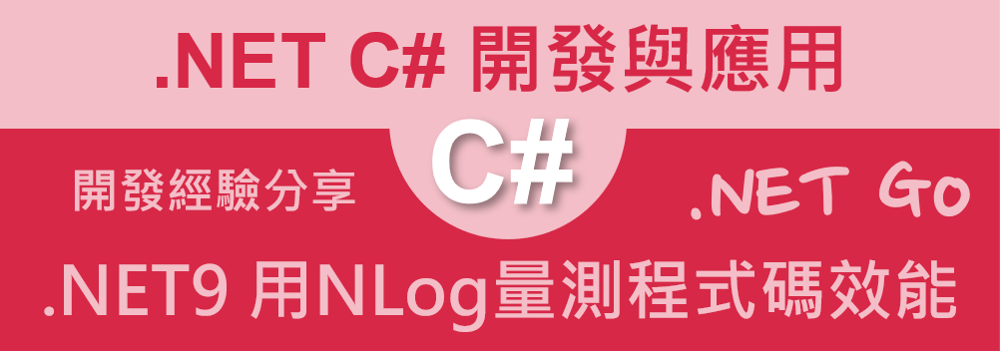

# 在 .NET9 Web API 專案使用NLog來量測程式碼效能



在上一篇文章 [在 .NET9 Web API 專案使用NLog教學與紀錄Trace Id](https://csharpkh.blogspot.com/2024/12/csharp-NET9-Web-API-NLog-TraceId-Exception.html)，有說明如何從無到有的在一個 ASP.NET Core 專案內，安裝與設定 NLog 這個套件，並且可以相系統運作資訊寫入到 Log 內。

在這篇文章中，將延續上篇文章中用到的專案，探討如何使用 NLog 來量測程式碼的效能，來記錄下每個方法的執行時間，並且將這些資訊寫入到 Log 內。

## 建立量測效能的類別

在這個專案中，我們將會建立一個類別 `PerformanceMonitor`，這個類別將會用來量測每個方法的執行時間，這個類別將會透過 NLog 來記錄下每個方法的執行時間。

在這個類別內，我們將會使用 `Stopwatch` 這個類別來量測每個方法的執行時間，這個類別是在 `System.Diagnostics` 命名空間內。

```csharp
using System.Diagnostics;

namespace csNlogTraceId;

public class PerformanceLogger : IDisposable
{
    private readonly Stopwatch _stopwatch;
    private readonly string _taskName;
    private readonly ILogger _logger;

    public PerformanceLogger(ILogger _logger, string taskName)
    {
        _taskName = taskName;
       this._logger = _logger;
        _stopwatch = Stopwatch.StartNew();
        _logger.LogInformation("{TaskName} 開始執行", _taskName);
    }

    public void Dispose()
    {
        _stopwatch.Stop();
        _logger.LogInformation("{TaskName} 結束執行, Execution time: {ElapsedMilliseconds} ms",
            _taskName, _stopwatch.ElapsedMilliseconds);
    }
}
```

在這個類別內，我們建立了一個建構式 `PerformanceLogger`，這個建構式接受兩個參數，一個是 `ILogger` 這個介面，另一個是 `taskName` 這個參數，這個參數將會用來記錄下這個方法的名稱。

這類別實作了 [IDisposable] 介面，這個介面內有一個方法 `Dispose`，這個方法將會在這個類別被釋放時，執行這個方法，這個方法將會停止 `Stopwatch` 這個類別的執行，並且記錄下這個方法的執行時間。

## 建立長時間運作的控制器 LongTaskController

在這個專案中，我們將會建立一個控制器 `LongTaskController`，這個控制器將會有一個方法 `Get`，這個方法將會模擬一個長時間運作的方法，這個方法將會在執行時，透過 `PerformanceLogger` 這個類別來量測這個方法的執行時間。

```csharp
using Microsoft.AspNetCore.Mvc;
using NLog;

namespace csNlogTraceId.Controllers;

[ApiController]
[Route("[controller]")]
public class LongTaskController : ControllerBase
{
    private readonly ILogger<LongTaskController> _logger;

    public LongTaskController(ILogger<LongTaskController> logger)
    {
        _logger = logger;
    }

    [HttpGet]
    public async Task Get()
    {
        _logger.LogInformation("進入到控制內做些一秒的工作");
        await Task.Delay(1000);
        using (var perfLogger = new PerformanceLogger(_logger, "量測程式碼範例"))
        {
            await Task.Delay(5000);
        }
    }
}
```

## 啟動並執行這個專案

* 在 Visual Studio 2022 IDE 中，按下 `F5` 鍵，或者是在功能表中選擇 [除錯] -> [開始偵錯]，來執行這個程式

當專案啟動之後，並沒有看到任何瀏覽器出現


開啟瀏覽器輸入 `https://localhost:7014/LongTask` 這個網址，這時，將會看到瀏覽器顯示程式碼區塊的執行效能的訊息


此時，在 Console 中，將會看到底下內容，顯示的呼叫這個 API 時候，所寫入的日誌內容


