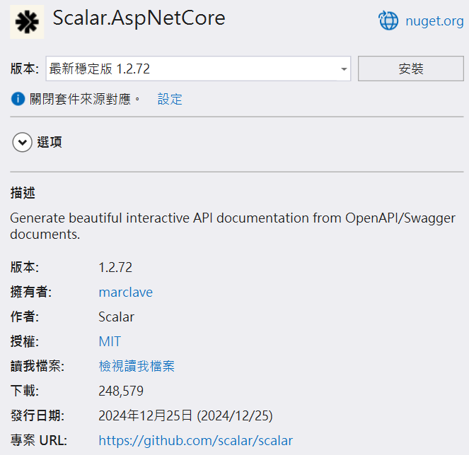
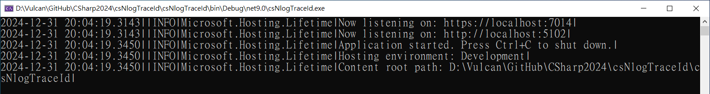
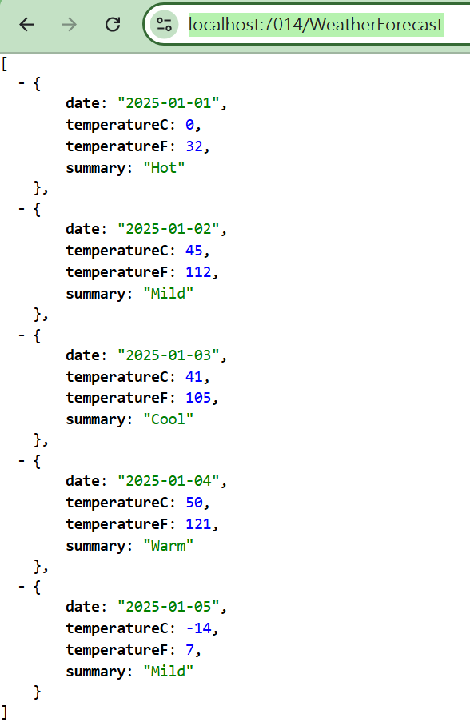
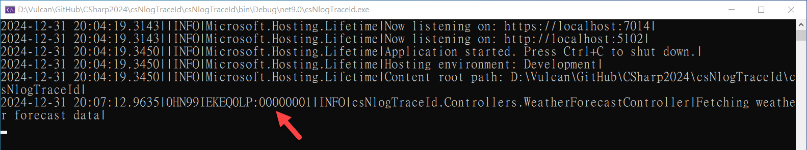
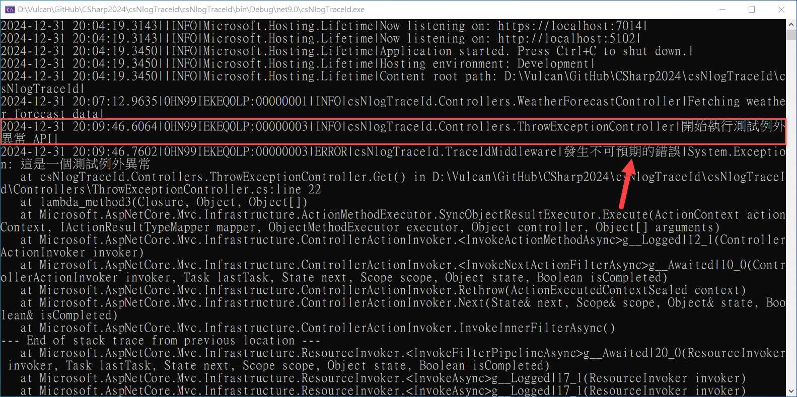

# 在 .NET9 Web API 專案使用NLog教學與紀錄Trace Id


在這篇文章中，我們將會建立起一個 .NET9 的 ASP.NET Core Web API 專案，並且說明如何安裝與設定和使用 NLog，由於這是一個 Web API 專案，所以，將會要透過 Trace Id 來記錄下每次 HTTP 請求的時候，與此次有關的 Log 有哪些，透過 NLog 來紀錄 Trace Id 與 Exception 的紀錄

## 建立測試專案

請依照底下的操作，建立起這篇文章需要用到的練習專案

* 打開 Visual Studio 2022 IDE 應用程式
* 從 [Visual Studio 2022] 對話窗中，點選右下方的 [建立新的專案] 按鈕
* 在 [建立新專案] 對話窗右半部
  * 切換 [所有語言 (L)] 下拉選單控制項為 [C#]
  * 切換 [所有專案類型 (T)] 下拉選單控制項為 [Web API]
* 在中間的專案範本清單中，找到並且點選 [ASP.NET Core Web API] 專案範本選項
  > 此專案範本可用於 ASP.NET Core 控制器或最小 API 建立 RESTful Web API，並可選擇性支援 OpenAPI 和驗證
* 點選右下角的 [下一步] 按鈕
* 在 [設定新的專案] 對話窗
* 找到 [專案名稱] 欄位，輸入 `csNlogTraceId` 作為專案名稱
* 在剛剛輸入的 [專案名稱] 欄位下方，確認沒有勾選 [將解決方案與專案至於相同目錄中] 這個檢查盒控制項
* 點選右下角的 [下一步] 按鈕
* 現在將會看到 [其他資訊] 對話窗
* 在 [架構] 欄位中，請選擇最新的開發框架，這裡選擇的 [架構] 是 : `.NET 9.0 (標準字詞支援)`
* 在 [驗證類型] 選擇無
* 在這個練習中，需要去勾選 [不要使用最上層陳述式(T)] 這個檢查盒控制項
  > 這裡的這個操作，可以由讀者自行決定是否要勾選這個檢查盒控制項
* 請點選右下角的 [建立] 按鈕

稍微等候一下，這個專案將會建立完成

## 安裝要用到的 NuGet 開發套件

因為開發此專案時會用到這些 NuGet 套件，請依照底下說明，將需要用到的 NuGet 套件安裝起來。

### 安裝 NLog.Web.AspNetCore 套件

請依照底下說明操作步驟，將這個套件安裝到專案內

* 滑鼠右擊 [方案總管] 視窗內的 [專案節點] 下方的 [相依性] 節點
* 從彈出功能表清單中，點選 [管理 NuGet 套件] 這個功能選項清單
* 此時，將會看到 [NuGet: csNlogTraceId] 視窗
* 切換此視窗的標籤頁次到名稱為 [瀏覽] 這個標籤頁次
* 在左上方找到一個搜尋文字輸入盒，在此輸入 `NLog.Web.AspNetCore`
* 在視窗右方，將會看到該套件詳細說明的內容，其中，右上方有的 [安裝] 按鈕
* 點選這個 [安裝] 按鈕，將這個套件安裝到專案內



## 建立一個中介軟體類別 TraceIdMiddleware

在這個專案中，我們將會建立一個中介軟體類別 TraceIdMiddleware，這個中介軟體類別將會用來記錄下每次 HTTP 請求的 Trace Id，這個值將會由 [HttpContext.TraceIdentifier] 來取得，這個 Trace Id 將會被 NLog 用來記錄下每次 HTTP 請求的 Log 訊息，而這裡將會透過了 NLog.MappedDiagnosticsLogicalContext 這個類別來設定 TraceId 的值。

在 [nlog.config] 內，若想要顯示 TraceId，可以透過 `${mdlc:TraceId}` 這個格式來取得 TraceId 的值

```csharp
namespace csNlogTraceId;

public class TraceIdMiddleware
{
    private readonly RequestDelegate _next;
    private readonly ILogger<TraceIdMiddleware> logger;

    public TraceIdMiddleware(RequestDelegate next,
        ILogger<TraceIdMiddleware> logger)
    {
        _next = next;
        this.logger = logger;
    }

    public async Task InvokeAsync(HttpContext context)
    {
        try
        {
            var traceId = context.TraceIdentifier;
            NLog.MappedDiagnosticsLogicalContext.Set("TraceId", traceId);
            await _next(context);
        }
        catch (Exception ex)
        {
            // 记录异常
            logger.LogError(ex, "發生不可預期的錯誤");
            // 将异常重新抛出
            //throw;
        }
    }
}
```

在 [InvokeAsync] 方法內，將會使用 try...catch 敘述將其捕捉起來，並且透過 NLog 來記錄下這個 Exception 的訊息，這樣，當發生 Exception 的時候，將會記錄下這個 Exception 的訊息，並且該 Exception 的訊息將會包含 TraceId 的值

## 修改 Program.cs 類別內容

* 找到並且打開 [Program.cs] 這個檔案
* 使用底下程式碼替換掉這個檔案的內容

```csharp
using NLog;
using NLog.Web;

namespace csNlogTraceId
{
    public class Program
    {
        public static void Main(string[] args)
        {
            var logger = NLogBuilder.ConfigureNLog("nlog.config").GetCurrentClassLogger();
            try
            {
                var builder = WebApplication.CreateBuilder(args);

                builder.Logging.ClearProviders();
                builder.Logging.SetMinimumLevel(Microsoft.Extensions.Logging.LogLevel.Trace);
                builder.Host.UseNLog();

                // Add services to the container.

                builder.Services.AddControllers();
                // Learn more about configuring OpenAPI at https://aka.ms/aspnet/openapi
                builder.Services.AddOpenApi();

                var app = builder.Build();

                app.UseMiddleware<TraceIdMiddleware>();
                
                // Configure the HTTP request pipeline.
                if (app.Environment.IsDevelopment())
                {
                    app.MapOpenApi();
                }

                app.UseHttpsRedirection();

                app.UseAuthorization();


                app.MapControllers();

                app.Run();
            }
            catch (Exception ex)
            {
                logger.Error(ex, "Stopped program because of an exception");
                throw;
            }
            finally
            {
                LogManager.Shutdown();
            }
        }
    }
}
```

這裡首先使用 [NLogBuilder.ConfigureNLog("nlog.config")] 來設定 NLog 的設定檔，接著，透過 [GetCurrentClassLogger()] 來取得 Logger 的實例，這樣，就可以透過這個 Logger 來記錄下 Log 訊息

接著，透過 [builder.Logging.ClearProviders()] 來清除掉原本的 Log 訊息提供者，接著，透過 [builder.Logging.SetMinimumLevel(Microsoft.Extensions.Logging.LogLevel.Trace)] 來設定最低的 Log 等級為 Trace，這樣，就可以記錄下所有的 Log 訊息

接著，透過 [builder.Host.UseNLog()] 來設定使用 NLog 來記錄 Log 訊息

接著，透過 [app.UseMiddleware<TraceIdMiddleware>()] 來設定使用 TraceIdMiddleware 這個中介軟體類別，這樣，每次 HTTP 請求的時候，將會記錄下 TraceId 的值

## 修改 nlog.config 內容

* 滑鼠右擊專案節點
* 從彈出的功能表清單中，點選 [新增項目] 功能選項
* 在 [新增項目] 對話窗中，點選對話窗左方的 [已安裝] > [C#] > [ASP.NET Core] > [資料]
* 在 [新增項目] 對話窗右方，找到 [XML 檔] 這個項目，並且點選它
* 在 [名稱] 欄位中，輸入 `nlog.config`
* 點選 [新增] 按鈕
* 使用底下的程式碼替換掉這個檔案的內容

```xml
<?xml version="1.0" encoding="utf-8" ?>
<nlog xmlns="http://www.nlog-project.org/schemas/NLog.xsd"
	  xmlns:xsi="http://www.w3.org/2001/XMLSchema-instance"
	  autoReload="true"
      throwConfigExceptions="true"
      internalLogLevel="Info"
      internalLogFile="internal-nlog.log">
	<!-- 日志级别：Trace < Debug < Info < Warn < Error < Fatal -->
	<targets>
		<!-- 文件输出目标 -->
		<target xsi:type="AsyncWrapper" name="File_async"
				overflowAction="Discard"
				queueLimit="500000"
				batchSize="500">
			<target name="file" xsi:type="File" fileName="logs/logfile-${shortdate}.log"
				layout="${longdate}|${mdlc:TraceId}|${level:uppercase=true}|${logger}|${message}|${exception:format=toString,StackTrace}" />
		</target>
		<!-- 控制台输出目标 -->
		<target xsi:type="AsyncWrapper" name="Console_async"
		overflowAction="Discard"
		queueLimit="500000"
		batchSize="500">
			<target name="console" xsi:type="Console"
				layout="${longdate}|${mdlc:TraceId}|${level:uppercase=true}|${logger}|${message}|${exception:format=toString,StackTrace}" />
		</target>
	</targets>

	<rules>
		<!-- Suppress output from Microsoft framework when non-critical -->
		<logger name="System.*" finalMinLevel="Warn" />
		<logger name="Microsoft.*" finalMinLevel="Warn" />
		<!-- Keep output from Microsoft.Hosting.Lifetime to console for fast startup detection -->
		<logger name="Microsoft.Hosting.Lifetime*" finalMinLevel="Info" writeTo="console_async" />
		<!-- 最低级别为 Info，输出到文件和控制台 -->
		<logger name="*" minlevel="Info" writeTo="file_async,console_async" />
	</rules>
</nlog>
```

這裡設定了兩個 Target，一個是 File_async，另一個是 Console_async，這樣，就可以將 Log 訊息同時輸出到檔案與 Console 上。

對於非同步的日誌寫入，這裡設定了 [AsyncWrapper] 這個 Target，這樣，就可以將 Log 訊息寫入到檔案與 Console 上，這樣，就可以提高 Log 訊息的寫入效能，這裡用到的參數有 [overflowAction] 這個參數，這個參數可以設定當 Log 訊息寫入的速度超過了設定的速度時，該如何處理，這裡設定為 [Discard]，這樣，當 Log 訊息寫入的速度超過了設定的速度時，將會捨棄掉這些 Log 訊息，這樣，就可以避免 Log 訊息寫入的速度過快，而導致系統的效能下降。對於 [queueLimit] 這個參數，這個參數可以設定 Log 訊息的佇列上限，這樣，就可以避免 Log 訊息寫入的速度過快，而導致系統的效能下降，這裡設定為 500000，這樣，就可以讓 Log 訊息的佇列上限為 500000，這樣，就可以避免 Log 訊息寫入的速度過快，而導致系統的效能下降。對於 [batchSize] 這個參數，這個參數可以設定 Log 訊息的批次寫入數量，這樣，就可以提高 Log 訊息的寫入效能，這裡設定為 500，這樣，就可以讓 Log 訊息的批次寫入數量為 500，這樣，就可以提高 Log 訊息的寫入效能。

對於 [layout] 這個參數，這個參數可以設定 Log 訊息的格式，這裡設定為 `${longdate}|${mdlc:TraceId}|${level:uppercase=true}|${logger}|${message}|${exception:format=toString,StackTrace}`，這樣，就可以讓 Log 訊息的格式為 `[日期時間]|TraceId|Log等級|Logger名稱|Log訊息|Exception訊息`，這樣，就可以讓 Log 訊息的格式更加清晰易讀。

在 [rules] 區段內，這裡設定了兩個 Logger，一個是 `System.*`，另一個是 `Microsoft.*`，這樣，就可以讓這兩個 Logger 的 Log 訊息等級最低為 Warn，這樣，就可以避免這兩個 Logger 的 Log 訊息過多，而導致系統的效能下降。對於 `Microsoft.Hosting.Lifetime*` 這個 Logger，這裡設定了 Log 訊息的等級最低為 Info，這樣，就可以讓這個 Logger 的 Log 訊息等級最低為 Info，這樣，就可以讓這個 Logger 的 Log 訊息在 Console 上顯示，這樣，就可以讓開發者在開發時，可以看到這個 Logger 的 Log 訊息，這樣，就可以讓開發者更加容易地了解這個 Logger 的 Log 訊息。對於 `*` 這個 Logger，這裡設定了 Log 訊息的等級最低為 Info，這樣，就可以讓這個 Logger 的 Log 訊息等級最低為 Info，這樣，就可以讓這個 Logger 的 Log 訊息在 Console 上顯示，這樣，就可以讓開發者在開發時，可以看到這個 Logger 的 Log 訊息，這樣，就可以讓開發者更加容易地了解這個 Logger 的 Log 訊息。

## 建立會拋出例外異常的控制器

* 在 [Controllers] 資料夾內，建立一個新的 C# 類別檔案，並且命名為 `ExceptionController.cs`
* 使用底下的程式碼替換掉這個檔案的內容

```csharp
using Microsoft.AspNetCore.Mvc;
using NLog;

namespace csNlogTraceId.Controllers;

[ApiController]
[Route("[controller]")]
public class ThrowExceptionController : ControllerBase
{
    private readonly ILogger<ThrowExceptionController> _logger;

    public ThrowExceptionController(ILogger<ThrowExceptionController> logger)
    {
        _logger = logger;
    }

    [HttpGet]
    public IEnumerable<WeatherForecast> Get()
    {
        _logger.LogInformation("開始執行測試例外異常 API");

        throw new Exception("這是一個測試例外異常");
    }
}
```

## 啟動並執行這個專案

* 在 Visual Studio 2022 IDE 中，按下 `F5` 鍵，或者是在功能表中選擇 [除錯] -> [開始偵錯]，來執行這個程式

當專案啟動之後，並沒有看到任何瀏覽器出現

這裡是專案一啟動之後，Console顯示的 Log 內容



開啟瀏覽器輸入 `https://localhost:7014/WeatherForecast` 這個網址，這時，將會看到瀏覽器顯示 天氣預報資訊 的訊息



此時，在 Console 中，將會看到底下內容，顯示的呼叫這個 API 時候，所寫入的日誌內容



開啟瀏覽器輸入 `https://localhost:7014/ThrowException` 這個網址，這時，這個 API 將會拋出例外異常到 Log 內


此時，在 Console 中，將會看到底下內容，顯示的呼叫這個 API 時候，所寫入的例外異常日誌內容




