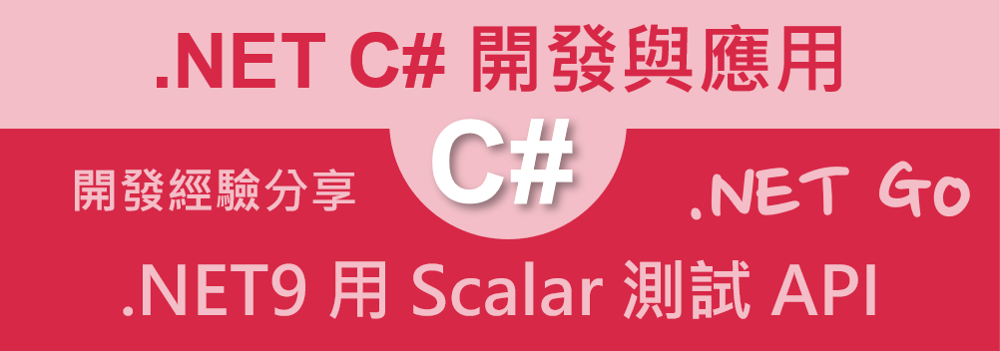
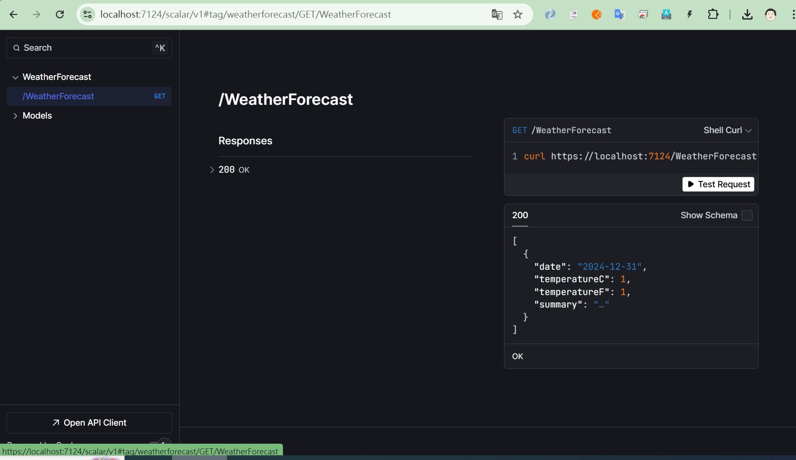

# 在 .NET9 Web API 專案使用 Scalar 測試 API



在 .NET 9 中，微軟已移除內建的 Swagger（Swashbuckle）支援，轉而推薦使用 Scalar 作為替代方案。 Scalar 是一個開源的 API 平台，提供現代化的 REST API 客戶端、精美的 API 文件，以及一流的 OpenAPI/Swagger 支援，適用於多種程式語言和平台。

在這篇文章中，我們將會透過 Curl 來測試 .NET9 Web API 專案，請依照底下的操作，建立起這篇文章需要用到的練習專案

## 建立測試專案

請依照底下的操作，建立起這篇文章需要用到的練習專案

* 打開 Visual Studio 2022 IDE 應用程式
* 從 [Visual Studio 2022] 對話窗中，點選右下方的 [建立新的專案] 按鈕
* 在 [建立新專案] 對話窗右半部
  * 切換 [所有語言 (L)] 下拉選單控制項為 [C#]
  * 切換 [所有專案類型 (T)] 下拉選單控制項為 [Web API]
* 在中間的專案範本清單中，找到並且點選 [ASP.NET Core Web API] 專案範本選項
  > 此專案範本可用於 ASP.NET Core 控制器或最小 API 建立 RESTful Web API，並可選擇性支援 OpenAPI 和驗證
* 點選右下角的 [下一步] 按鈕
* 在 [設定新的專案] 對話窗
* 找到 [專案名稱] 欄位，輸入 `csOpenApiScalar` 作為專案名稱
* 在剛剛輸入的 [專案名稱] 欄位下方，確認沒有勾選 [將解決方案與專案至於相同目錄中] 這個檢查盒控制項
* 點選右下角的 [下一步] 按鈕
* 現在將會看到 [其他資訊] 對話窗
* 在 [架構] 欄位中，請選擇最新的開發框架，這裡選擇的 [架構] 是 : `.NET 9.0 (標準字詞支援)`
* 在 [驗證類型] 選擇無
* 在這個練習中，需要去勾選 [不要使用最上層陳述式(T)] 這個檢查盒控制項
  > 這裡的這個操作，可以由讀者自行決定是否要勾選這個檢查盒控制項
* 請點選右下角的 [建立] 按鈕

稍微等候一下，這個專案將會建立完成

## 安裝要用到的 NuGet 開發套件

因為開發此專案時會用到這些 NuGet 套件，請依照底下說明，將需要用到的 NuGet 套件安裝起來。

### 安裝 Scalar.AspNetCore 套件

請依照底下說明操作步驟，將這個套件安裝到專案內

* 滑鼠右擊 [方案總管] 視窗內的 [專案節點] 下方的 [相依性] 節點
* 從彈出功能表清單中，點選 [管理 NuGet 套件] 這個功能選項清單
* 此時，將會看到 [NuGet: csOpenApiScalar] 視窗
* 切換此視窗的標籤頁次到名稱為 [瀏覽] 這個標籤頁次
* 在左上方找到一個搜尋文字輸入盒，在此輸入 `Scalar.AspNetCore`
* 在視窗右方，將會看到該套件詳細說明的內容，其中，右上方有的 [安裝] 按鈕
* 點選這個 [安裝] 按鈕，將這個套件安裝到專案內


## 修改 Program.cs 類別內容

* 找到並且打開 [Program.cs] 這個檔案
* 找到 [app.MapOpenApi();] 這行程式碼，在其下方加入底下的程式碼

```csharp
app.MapScalarApiReference(); // 預設路徑為 /scalar/v1
```

* 底下是完成後的程式碼

```csharp

namespace csOpenApiScalar
{
    public class Program
    {
        public static void Main(string[] args)
        {
            var builder = WebApplication.CreateBuilder(args);

            // Add services to the container.

            builder.Services.AddControllers();
            // Learn more about configuring OpenAPI at https://aka.ms/aspnet/openapi
            builder.Services.AddOpenApi();

            var app = builder.Build();

            // Configure the HTTP request pipeline.
            if (app.Environment.IsDevelopment())
            {
                app.MapOpenApi();
                app.MapScalarApiReference(); // 預設路徑為 /scalar/v1
            }

            app.UseHttpsRedirection();

            app.UseAuthorization();


            app.MapControllers();

            app.Run();
        }
    }
}
```


## 啟動並執行這個專案

* 在 Visual Studio 2022 IDE 中，按下 `F5` 鍵，或者是在功能表中選擇 [除錯] -> [開始偵錯]，來執行這個程式

當專案啟動之後，並沒有看到任何瀏覽器出現

開啟瀏覽器，輸入 `https://localhost:7124/scalar/v1` 這個網址，將會看到底下的畫面




