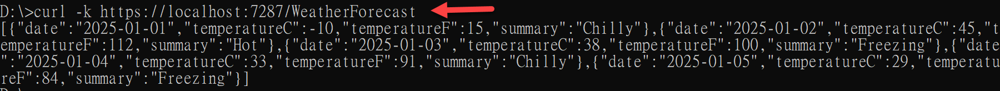

# 在 .NET9 Web API 專案使用 Curl 測試 API


Curl 是什麼？

Curl（全名為「Client URL」）是一個在指令列（command line）中使用的工具，可用於向指定的 URL 傳送或取得資料。它支援多種協定（如 HTTP、HTTPS、FTP、SFTP 等），常被用來進行 API 測試、下載檔案或進行資料傳輸等工作。在撰寫自動化腳本或測試程式時，Curl 也是非常常見且實用的工具。

在這篇文章中，我們將會透過 Curl 來測試 .NET9 Web API 專案，請依照底下的操作，建立起這篇文章需要用到的練習專案

## 建立測試專案

請依照底下的操作，建立起這篇文章需要用到的練習專案

* 打開 Visual Studio 2022 IDE 應用程式
* 從 [Visual Studio 2022] 對話窗中，點選右下方的 [建立新的專案] 按鈕
* 在 [建立新專案] 對話窗右半部
  * 切換 [所有語言 (L)] 下拉選單控制項為 [C#]
  * 切換 [所有專案類型 (T)] 下拉選單控制項為 [Web API]
* 在中間的專案範本清單中，找到並且點選 [ASP.NET Core Web API] 專案範本選項
  > 此專案範本可用於 ASP.NET Core 控制器或最小 API 建立 RESTful Web API，並可選擇性支援 OpenAPI 和驗證
* 點選右下角的 [下一步] 按鈕
* 在 [設定新的專案] 對話窗
* 找到 [專案名稱] 欄位，輸入 `csNET9OpenAPI` 作為專案名稱
* 在剛剛輸入的 [專案名稱] 欄位下方，確認沒有勾選 [將解決方案與專案至於相同目錄中] 這個檢查盒控制項
* 點選右下角的 [下一步] 按鈕
* 現在將會看到 [其他資訊] 對話窗
* 在 [架構] 欄位中，請選擇最新的開發框架，這裡選擇的 [架構] 是 : `.NET 9.0 (標準字詞支援)`
* 在 [驗證類型] 選擇無
* 在這個練習中，需要去勾選 [不要使用最上層陳述式(T)] 這個檢查盒控制項
  > 這裡的這個操作，可以由讀者自行決定是否要勾選這個檢查盒控制項
* 請點選右下角的 [建立] 按鈕

稍微等候一下，這個專案將會建立完成

## 下載 Curl 工具

* 打開瀏覽器，前往 [Curl 官方網站](https://curl.se/windows/)
* 點擊 [Curl for 64-bit]

* 打開這個下載的壓縮檔案
* 找到 [curl-8.11.1_2-win64-mingw.zip\curl-8.11.1_2-win64-mingw\bin] 資料夾
* 將這個資料夾中的 `curl.exe` 檔案複製到 `C:\Windows\System32` 資料夾中

## 啟動並執行這個專案

* 在 Visual Studio 2022 IDE 中，按下 `F5` 鍵，或者是在功能表中選擇 [除錯] -> [開始偵錯]，來執行這個程式

當專案啟動之後，並沒有看到任何瀏覽器出現

開啟 [命令提示字元] 視窗，輸入底下的指令，來測試這個 API

```shell
curl https://localhost:5001/weatherforecast
```

這個指令將會向 `https://localhost:5001/weatherforecast` 這個 URL 發送一個 GET 請求，並且取得回應結果



這樣就完成了透過 Curl 工具來測試 .NET9 Web API 專案的操作


