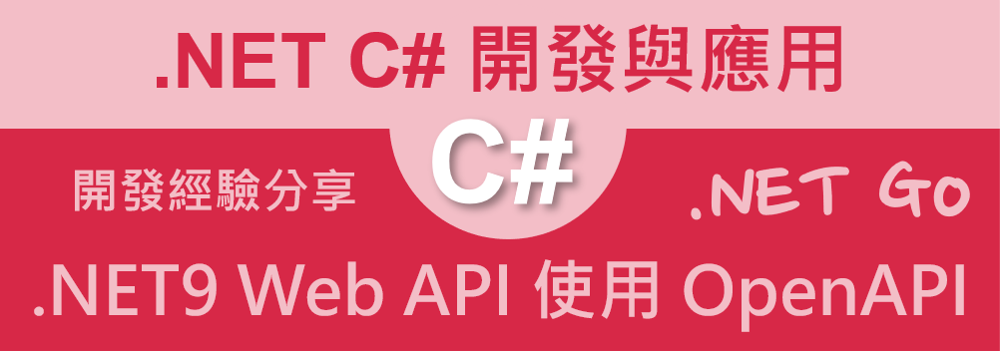
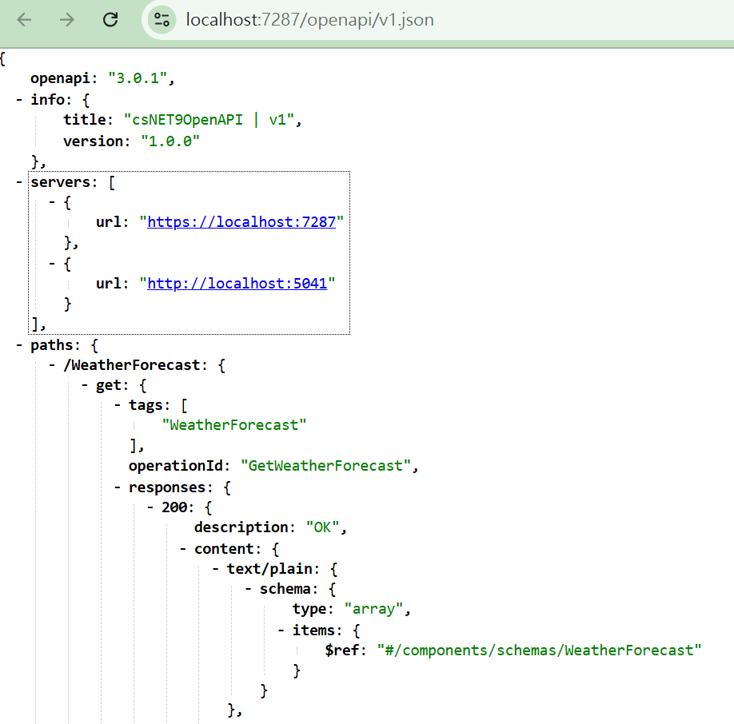
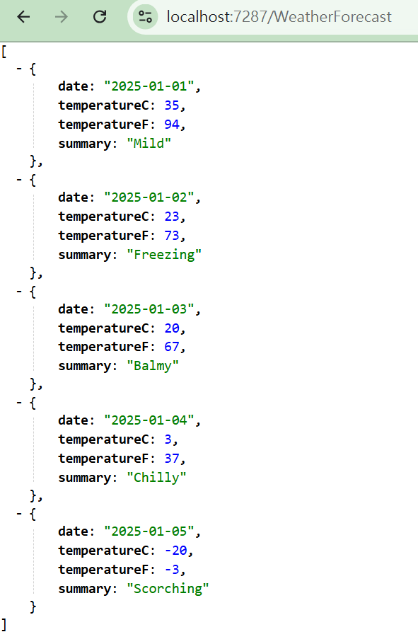

# 在 .NET9 Web API 專案使用 OpenAPI



雖然 NSwag 和 Swashbuckle 多年來都為社區提供了良好的服務，但最近這兩個庫的維護和更新都出現了下降。這導致每個新版本在這些庫中利用和/或支援框架新功能的能力出現滯後。

雖然 Swashbuckle 在 2024 年隨著該項目新維護者的宣布而有所復興，並且現在對 .NET 8 擁有一流的支持，但它仍然是一個開源項目，免費提供並由志工在業餘時間維護。由於這些限制，每年發布新的主要版本很難跟上 .NET 生態系統的變化步伐。相比之下，Microsoft 的 ASP.NET 團隊全職從事該框架的工作，因此可以投入時間來確保他們提供的庫隨著產品的發展而保持最新的功能和最佳實踐隨著時間的推移。

從高層次來看，新的 Microsoft.AspNetCore.OpenApi 套件具有與 NSwag 和 Swashbuckle 相同的基本功能。它在運行時為 ASP.NET Core 端點產生 OpenAPI 文件。端點的形狀，例如它們的方法、路徑、請求、回應、參數等都源自於應用程式的程式碼。

## 建立測試專案

請依照底下的操作，建立起這篇文章需要用到的練習專案

* 打開 Visual Studio 2022 IDE 應用程式
* 從 [Visual Studio 2022] 對話窗中，點選右下方的 [建立新的專案] 按鈕
* 在 [建立新專案] 對話窗右半部
  * 切換 [所有語言 (L)] 下拉選單控制項為 [C#]
  * 切換 [所有專案類型 (T)] 下拉選單控制項為 [Web API]
* 在中間的專案範本清單中，找到並且點選 [ASP.NET Core Web API] 專案範本選項
  > 此專案範本可用於 ASP.NET Core 控制器或最小 API 建立 RESTful Web API，並可選擇性支援 OpenAPI 和驗證
* 點選右下角的 [下一步] 按鈕
* 在 [設定新的專案] 對話窗
* 找到 [專案名稱] 欄位，輸入 `csNET9OpenAPI` 作為專案名稱
* 在剛剛輸入的 [專案名稱] 欄位下方，確認沒有勾選 [將解決方案與專案至於相同目錄中] 這個檢查盒控制項
* 點選右下角的 [下一步] 按鈕
* 現在將會看到 [其他資訊] 對話窗
* 在 [架構] 欄位中，請選擇最新的開發框架，這裡選擇的 [架構] 是 : `.NET 9.0 (標準字詞支援)`
* 在 [驗證類型] 選擇無
* 在這個練習中，需要去勾選 [不要使用最上層陳述式(T)] 這個檢查盒控制項
  > 這裡的這個操作，可以由讀者自行決定是否要勾選這個檢查盒控制項
* 請點選右下角的 [建立] 按鈕

稍微等候一下，這個專案將會建立完成

## 了解 OpenAPI 的設定

在 .NET8，將會 [Swashbuckle.AspNetCore] 套件來支援 OpenAPI 的功能

```xml
  <ItemGroup>
    <PackageReference Include="Swashbuckle.AspNetCore" Version="6.6.2" />
  </ItemGroup>
```

但是在 .NET9，將會使用 [Microsoft.AspNetCore.OpenApi] 套件來支援 OpenAPI 的功能

```xml
  <ItemGroup>
    <PackageReference Include="Microsoft.AspNetCore.OpenApi" Version="9.0.0" />
  </ItemGroup>
```

現在找到並且打開 [Program.cs] 檔案，將會看到如下程式碼

```csharp

namespace csNET9OpenAPI
{
    public class Program
    {
        public static void Main(string[] args)
        {
            var builder = WebApplication.CreateBuilder(args);

            // Add services to the container.

            builder.Services.AddControllers();
            // Learn more about configuring OpenAPI at https://aka.ms/aspnet/openapi
            builder.Services.AddOpenApi();

            var app = builder.Build();

            // Configure the HTTP request pipeline.
            if (app.Environment.IsDevelopment())
            {
                app.MapOpenApi();
            }

            app.UseHttpsRedirection();

            app.UseAuthorization();


            app.MapControllers();

            app.Run();
        }
    }
}
```

在這個程式碼中，我們可以看到 `builder.Services.AddOpenApi();` 這行程式碼，這行程式碼是用來註冊 OpenAPI 服務到 DI 容器中

而在 `if (app.Environment.IsDevelopment())` 這個條件式中，我們可以看到 `app.MapOpenApi();` 這行程式碼，這行程式碼是用來註冊 OpenAPI 中介軟體到 Middleware 管道中

現在來看看 OpenAPI 這個套件的表現

## 啟動並執行這個專案

* 在 Visual Studio 2022 IDE 中，按下 `F5` 鍵，或者是在功能表中選擇 [除錯] -> [開始偵錯]，來執行這個程式

當專案啟動之後，並沒有看到任何瀏覽器出現

現在打開瀏覽器，對於這個專案，需要輸入 `https://localhost:7287/openapi/v1.json` 這個服務端點，按下 `Enter` 鍵

這個服務端點將會回應一個 JSON 格式的 OpenAPI 文件，這個文件將會描述這個 Web API 的端點、方法、請求、回應等等，如下圖所示



* 開啟瀏覽器，輸入這個服務端點 `https://localhost:7180/WeatherForecast/`，按下 `Enter` 鍵

* 將會看到一個正常回應的 API 的回傳結果



## 修正專案啟動後，自動啟動 OpenAPI 文件

* 在專案的根目錄中，找到並且打開 [Properties/launchSettings.json] 檔案
* 這是現在的檔案內容

```json
{
  "$schema": "https://json.schemastore.org/launchsettings.json",
  "profiles": {
    "http": {
      "commandName": "Project",
      "dotnetRunMessages": true,
      "launchBrowser": false,
      "applicationUrl": "http://localhost:5041",
      "environmentVariables": {
        "ASPNETCORE_ENVIRONMENT": "Development"
      }
    },
    "https": {
      "commandName": "Project",
      "dotnetRunMessages": true,
      "launchBrowser": false,
      "applicationUrl": "https://localhost:7287;http://localhost:5041",
      "environmentVariables": {
        "ASPNETCORE_ENVIRONMENT": "Development"
      }
    }
  }
}
```

* 找到 "https" 這個 profile，並且將 `launchBrowser` 這個屬性的值改為 `true`，並且加入 `launchUrl` 這個屬性，這個屬性的值為 `https://localhost:7287/openapi/v1.json`

```json
{
  "$schema": "https://json.schemastore.org/launchsettings.json",
  "profiles": {
    "http": {
      "commandName": "Project",
      "dotnetRunMessages": true,
      "launchBrowser": false,
      "applicationUrl": "http://localhost:5041",
      "environmentVariables": {
        "ASPNETCORE_ENVIRONMENT": "Development"
      }
    },
    "https": {
      "commandName": "Project",
      "dotnetRunMessages": true,
      "launchBrowser": true,
      "launchUrl": "https://localhost:7287/openapi/v1.json",
      "applicationUrl": "https://localhost:7287;http://localhost:5041",
      "environmentVariables": {
        "ASPNETCORE_ENVIRONMENT": "Development"
      }
    }
  }
}
```
* 重新啟動這個專案
* 現在將會看到瀏覽器自動開啟 OpenAPI 文件