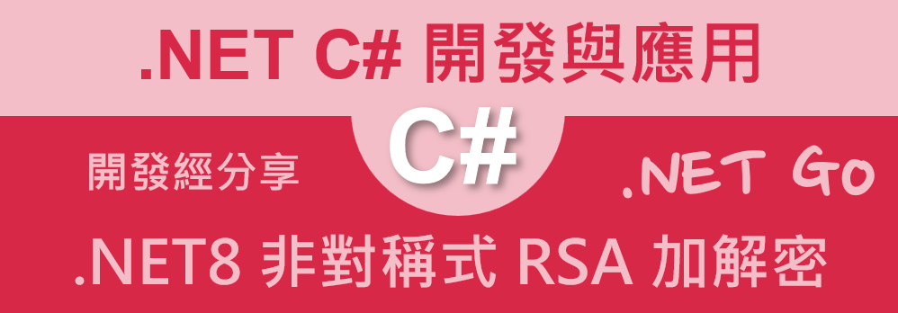

# .NET 8 / C# 非對稱式 RSA 加解密使用教學



在上一篇文章 (.NET 8 / C# 對稱式 AES 加解密使用教學
)[https://csharpkh.blogspot.com/2024/07/csharp-AES-Symertic-Encryption-Decrypt-plantext-Key.html] 中，我們介紹了如何使用 C# 來進行對稱式加解密的操作，透過對稱式加解密的操作，可以讓我們將資料進行加密處理，進而保護資料的安全性，而在這篇文章中，將會介紹如何使用 C# 來進行非對稱式加解密的操作，透過非對稱式加解密的操作，可以讓我們透過不同的金鑰來進行加解密的操作，這樣的加解密方式，可以讓我們更加的安全。

所謂的非對稱式加解密，是指加密與解密使用不同的金鑰，這樣的加解密方式，可以讓我們透過公開金鑰來進行加密，而私密金鑰來進行解密，這樣的加解密方式，可以讓我們更加的安全，因為即使有人取得了公開金鑰，也無法透過公開金鑰來進行解密的操作，這樣的加解密方式，可以讓我們更加的安全。而傳統上，當一名使用者創建了一組公開金鑰與私密金鑰之後，會將公開金鑰公開給其他人，而私密金鑰則是保留給自己，這樣的加解密方式，可以讓我們更加的安全。

在這篇文章中，將會 RSA 這個演算法作為公鑰與私鑰的計算依據，所謂的 RSA 演算法，是一種非對稱式加解密的演算法，透過 RSA 演算法，可以讓我們進行非對稱式加解密的操作，而在這篇文章中，將會介紹如何使用 C# 來進行 RSA 加解密的操作，透過這篇文章的學習，讀者將可以學會如何使用 C# 來進行 RSA 加解密的操作。

## 建立測試專案

請依照底下的操作，建立起這篇文章需要用到的練習專案

* 打開 Visual Studio 2022 IDE 應用程式
* 從 [Visual Studio 2022] 對話窗中，點選右下方的 [建立新的專案] 按鈕
* 在 [建立新專案] 對話窗右半部
  * 切換 [所有語言 (L)] 下拉選單控制項為 [C#]
  * 切換 [所有專案類型 (T)] 下拉選單控制項為 [服務]
* 在中間的專案範本清單中，找到並且點選 [背景工作服務] 專案範本選項
  > 用於建立 Worker Service 的空白專案範本
* 點選右下角的 [下一步] 按鈕
* 在 [設定新的專案] 對話窗
* 找到 [專案名稱] 欄位，輸入 `csAsymmetricEncryption` 作為專案名稱
* 在剛剛輸入的 [專案名稱] 欄位下方，確認沒有勾選 [將解決方案與專案至於相同目錄中] 這個檢查盒控制項
* 點選右下角的 [下一步] 按鈕
* 現在將會看到 [其他資訊] 對話窗
* 在 [架構] 欄位中，請選擇最新的開發框架，這裡選擇的 [架構] 是 : `.NET 8.0 (長期支援)`
* 在這個練習中，需要去勾選 [不要使用最上層陳述式(T)] 這個檢查盒控制項
  > 這裡的這個操作，可以由讀者自行決定是否要勾選這個檢查盒控制項
* 請點選右下角的 [建立] 按鈕

稍微等候一下，這個 背景工作服務 專案將會建立完成

## 修改 Program.cs 類別內容

在這篇文章中，將會把會用到的新類別與程式碼，都寫入到 [Program.cs] 這個檔案中，請依照底下的操作，修改 [Program.cs] 這個檔案的內容

* 在專案中找到並且打開 [Program.cs] 檔案
* 將底下的程式碼取代掉 `Program.cs` 檔案中內容

```csharp
using System.Security.Cryptography;
using System.Text;

namespace csAsymmetricEncryption;

internal class Program
{
    static void Main(string[] args)
    {
        RsaTool rsaTool = new();
        Console.WriteLine("Generating keys for Jim...");
        RSA jimRsa = rsaTool.GenerateKeys();
        string jimPublicKey = rsaTool.GetPublicKey(jimRsa);
        string jimPrivateKey = rsaTool.GetPrivateKey(jimRsa);
        Console.WriteLine($"Jim Public Key : {jimPublicKey}");
        Console.WriteLine($"");
        Console.WriteLine($"Jim Private Key : {jimPrivateKey}");
        Console.WriteLine($""); Console.WriteLine($"");

        Console.WriteLine("Generating keys for Bob...");
        RSA BobRsa = rsaTool.GenerateKeys();
        string BobPublicKey = rsaTool.GetPublicKey(BobRsa);
        string BobPrivateKey = rsaTool.GetPrivateKey(BobRsa);
        Console.WriteLine($"Bob Public Key : {BobPublicKey}");
        Console.WriteLine($"");
        Console.WriteLine($"Bob Private Key : {BobPrivateKey}");
        Console.WriteLine($""); Console.WriteLine($"");

        string plainText = "Hello, World!";
        Console.WriteLine($"Jim 準備要送出的未加密明碼文字 : {plainText}");
        string encryptedForBob = rsaTool.Encrypt(BobPublicKey, plainText);
        Console.WriteLine($"Jim 使用 Bob 公開金鑰 加密後的密文文字 : {encryptedForBob}");

        string decryptedByBob = rsaTool.Decrypt(BobPrivateKey, encryptedForBob);
        Console.WriteLine($"Bob 使用自己私鑰 進行解密後的明碼文字 : {decryptedByBob}");
        Console.WriteLine($""); Console.WriteLine($"");

        plainText = "Hello, World!";
        Console.WriteLine($"Bob 準備要送出的未加密明碼文字 : {plainText}");
        string encryptedForJim = rsaTool.Encrypt(jimPublicKey, plainText);
        Console.WriteLine($"Bob 使用 Jim 公開金鑰 加密後的密文文字 : {encryptedForJim}");

        string decryptedByJim = rsaTool.Decrypt(jimPrivateKey, encryptedForJim);
        Console.WriteLine($"Jim 使用自己私鑰 進行解密後的明碼文字 : {decryptedByJim}");
        Console.WriteLine($""); Console.WriteLine($"");


        plainText = "What happened to you?  你怎麼了? 123!";
        Console.WriteLine($"Bob 準備要送出的未加密明碼文字 : {plainText}");
        encryptedForJim = rsaTool.Encrypt(jimPublicKey, plainText);
        Console.WriteLine($"Bob 使用 Jim 公開金鑰 加密後的密文文字 : {encryptedForJim}");

        decryptedByJim = rsaTool.Decrypt(jimPrivateKey, encryptedForJim);
        Console.WriteLine($"Jim 使用自己私鑰 進行解密後的明碼文字 : {decryptedByJim}");
        Console.WriteLine($""); Console.WriteLine($"");
    }
}

public class RsaTool
{
    public RSA GenerateKeys()
    {
        RSA rsa = RSA.Create(2048); // 2048 位元的密鑰長度
        return rsa;
    }

    public string GetPublicKey(RSA rsa)
    {
        return Convert.ToBase64String(rsa.ExportRSAPublicKey());
    }

    public string GetPrivateKey(RSA rsa)
    {
        return Convert.ToBase64String(rsa.ExportRSAPrivateKey());
    }

    public string Encrypt(string publicKey, string plainText)
    {
        using (RSA rsa = RSA.Create())
        {
            rsa.ImportRSAPublicKey(Convert.FromBase64String(publicKey), out _);
            byte[] plainBytes = Encoding.UTF8.GetBytes(plainText);
            byte[] encryptedBytes = rsa.Encrypt(plainBytes, RSAEncryptionPadding.OaepSHA256);
            return Convert.ToBase64String(encryptedBytes);
        }
    }

    public string Decrypt(string privateKey, string cipherText)
    {
        using (RSA rsa = RSA.Create())
        {
            rsa.ImportRSAPrivateKey(Convert.FromBase64String(privateKey), out _);
            byte[] encryptedBytes = Convert.FromBase64String(cipherText);
            byte[] decryptedBytes = rsa.Decrypt(encryptedBytes, RSAEncryptionPadding.OaepSHA256);
            return Encoding.UTF8.GetString(decryptedBytes);
        }
    }
}
```

在上面的程式碼中，將會建立一個 [RsaTool] 這個類別，這個類別中，將會包含了一些 RSA 加解密的操作，這裡將會設計了這些方法：[GenerateKeys]、[GetPublicKey]、[GetPrivateKey]、[Encrypt]、[Decrypt]，透過這些方法，可以讓我們進行 RSA 加解密的操作。

對於 [GenerateKeys] 方法，這個方法將會用來產生 RSA 的公開金鑰與私密金鑰，這裡設定了金鑰的長度為 2048 位元，這樣的金鑰長度，可以讓我們進行安全的加解密操作。在這個方法內，先使用了 [RSA.Create] 這個方法來建立 RSA 物件，接著將這個 RSA 物件回傳給呼叫端，這個方法內將會傳入一個整數，代表金鑰的長度，在這個例子中，傳入的整數值為 2048，代表金鑰長度為 2048 bits。

對於 [GetPublicKey] 方法，這個方法將會用來取得 RSA 的公開金鑰，這個方法內，將會傳入一個 RSA 物件，這個方法內，將會使用 [ExportRSAPublicKey] 這個方法來取得 RSA 的公開金鑰，這個方法內，接著使用 [Convert.ToBase64String] 將 RSA 的公開金鑰轉換成 Base64 字串，並且回傳給呼叫端。

相對有取得公開金鑰的方法，也會有取得私鑰的方法 [GetPrivateKey] 方法，這個方法將會用來取得 RSA 的私密金鑰，這個方法內，將會傳入一個 RSA 物件，這個方法內，將會使用 [ExportRSAPrivateKey] 這個方法來取得 RSA 的私密金鑰，這個方法內，接著使用 [Convert.ToBase64String] 將 RSA 的私密金鑰轉換成 Base64 字串，並且回傳給呼叫端。

一旦擁有了公開金鑰與私人金鑰資訊，此時，就需要另外一對進行明碼作加密與解密的方法。第一個將會是 [Encrypt] 方法，這個方法將會用來進行 RSA 加密的操作，這個方法內，將會傳入兩個參數，第一個參數是公開金鑰，第二個參數是明碼文字，這個方法內，將會使用 [RSA.Create] 來建立 RSA 物件，接著使用 [ImportRSAPublicKey] 來匯入公開金鑰，接著將明碼文字轉換成位元組，並且使用 RSA 物件內的 [Encrypt] 方法來進行加密的操作，這個方法內，將會使用 [RSAEncryptionPadding.OaepSHA256] 來設定加密的填充方式，也就是使用 SHA256 hash 雜湊演算法處理，這樣的填充方式，可以讓我們進行安全的加密操作，最後將加密後的位元組轉換成 Base64 字串，並且回傳給呼叫端。

最後一個方法是 [Decrypt] 方法，這個方法將會用來進行 RSA 解密的操作，這個方法內，將會傳入兩個參數，第一個參數是私密金鑰，第二個參數是密文文字，這個方法內，將會使用 [RSA.Create] 來建立 RSA 物件，接著使用 [ImportRSAPrivateKey] 來匯入私密金鑰，接著將密文文字轉換成位元組，並且使用 RSA 物件內的 [Decrypt] 方法來進行解密的操作，這個方法內，將會使用 [RSAEncryptionPadding.OaepSHA256] 來設定解密的填充方式，也就是使用 SHA256 hash 雜湊演算法處理，這樣的填充方式，可以讓我們進行安全的解密操作，最後將解密後的位元組轉換成 UTF8 字串，並且回傳給呼叫端。

現在有了這個自訂的 [RsaTool] 類別，接著在 [Main] 方法中，將會進行一些測試的操作，這裡將會建立兩個 RSA 物件，分別代表 Jim 與 Bob，接著將會取得 Jim 與 Bob 的公開金鑰與私密金鑰，接著將會進行一些加解密的操作，這樣的操作，可以讓我們了解如何使用 RSA 進行加解密的操作。

這裡首先建立一個 [RsaTool] 物件，接著使用 [GenerateKeys] 方法來產生 RSA 金鑰，接著使用 [GetPublicKey] 與 [GetPrivateKey] 來取得公開金鑰與私密金鑰，接著將會進行一些加解密的操作，這樣的操作，可以讓我們了解如何使用 RSA 進行加解密的操作。 

## 執行測試專案
* 按下 `F5` 開始執行專案
* 將會看到輸出結果

```plaintext
Generating keys for Jim...
Jim Public Key : MIIBCgKCAQEAsindSPD+QaN1eNWrrgsdJNELgAc24/52k8xu0jsiP4s8HIdxiPCZP3wuHnOjxs8N3IzZdFaej8NssVXCKg42OAbQlM/JOQDj23yrhn+jffSWwF2QSVrk2ajqDJv+srqTOwZ7++Rs7I+wRQSoh/PkknPEdqSK3aG45KSj1VX+vMM6h1IDYJNdsxWAPgaeDT7zlfIkLltTULGwh+nbqqyX5YxkH2oDyz0zBxAGoO/b0yeDC7ftrB6Go5V1l+BtF5waj6EwZMVr/a5RyJluITQJRshtAFtATDIDPtzeOx/xF8oC4lzuWQqRybBJCgAMEqKZuFrOVfm3qXcYiQVmyEm8UQIDAQAB

Jim Private Key : MIIEowIBAAKCAQEAsindSPD+QaN1eNWrrgsdJNELgAc24/52k8xu0jsiP4s8HIdxiPCZP3wuHnOjxs8N3IzZdFaej8NssVXCKg42OAbQlM/JOQDj23yrhn+jffSWwF2QSVrk2ajqDJv+srqTOwZ7++Rs7I+wRQSoh/PkknPEdqSK3aG45KSj1VX+vMM6h1IDYJNdsxWAPgaeDT7zlfIkLltTULGwh+nbqqyX5YxkH2oDyz0zBxAGoO/b0yeDC7ftrB6Go5V1l+BtF5waj6EwZMVr/a5RyJluITQJRshtAFtATDIDPtzeOx/xF8oC4lzuWQqRybBJCgAMEqKZuFrOVfm3qXcYiQVmyEm8UQIDAQABAoIBADmrr4OS7tqUbMwmbiIyWsa2HEDfFPeMQRnqjNzkY1uqWFTryuaG6zRPoCYfTJ5oG5aOyT0NZNooaiClH+q5GvfbzNy+veYD0b4UhvlMi8GT0NCH+NKl53pFYS2fuTxlhI8QtEV/VXrlsCtHLL6FRjHZ43h8Hq9LUCxC1v2RjpnPFdIn1OU62zoMEy/u0gopHgGvDs47/KZIe5lFGgyW6ruLMHhUHUTkjdYRP4wtH8bW/nNhA7qhsjdvQ524UjL95UQ84e+DqPvxicnC6OKqwmq+wYxkc3AXbXm/PnyK4EkfMf0FYJ7BaZg/sMoZ8grVo1TSjY787H8X8HeuBmL3jBkCgYEA3/FOIth29ZdF7LAGZ4Jm42B9Tnubt6m5xTdxnTNTQQvbuaEBHKsbl4bYmDvT+8PFv9Drbex1+SjmSXk15kfBOBqEP0rhriYJ0qQQqJcezQRiYgYHLfN5K1gcThB52ymy8N6gYMv+UulASYpyPZAvo/Qk9lI+GZXwxszZRtFHYqsCgYEAy6rrlabvMkCmN92fQ1ihFO36048LEUhxLMV97IgWRrj89OI5oJEV0hxhjSyNblYcvrxvNC+tCBJIUgYlTWcuK9/ib7uTLEPJBCKSJwBr0ZawIkEXnZMqpSfJkAxqUUEACDzARihz5rczC2xn7+crFX+YjSdA+Dhl0JGwVes1PPMCgYApfj17CV6pTJkhLNBS939229b75r1If4MzPn2noe3oHHle4K0jEbUwE0Uol9VETdbjHqOwn2KQgvqAXJwXCe6MJaWhUI+WQ+gIBmwrwKxtUkWkYfeMlRM7a7z63eSmLgjAxo8ywDlkRWGq/qMCMygQmdkLZtuow/Zz71rG21n9twKBgDkBCtUlFxfinmNOhXANE3DPNwAVrkxVEVAtqpQUdt+ukSZdVzHIyem4BdnEmYVDVuJPzXQ2z+BNda53h+NFONgQ3sjVIFkoU8/zeSKvbH4KBhxgSaLR+QKmwzStNOivH7oufsZkNiRiLEhLPEAaXKW0w9bmILoY1u5siIVTwt/fAoGBALdcEliqw2uaztVQEri2B3whCcXmvPWIVSBUjZV59blzk6nTAU4dC4TsJz65CLy/xbUJ77o9in/oNAw9fId5o//OHc6GCMChgKGxD9kEP5cpNcS9jZV//Ph2+qkyzZ6egq7j2obdYJSYOyuI2LB3FTyW5I6vyqS4ktCiArpFcUmF


Generating keys for Bob...
Bob Public Key : MIIBCgKCAQEAqcfn2ko+EwHuQ+IxhfRQFLLmkEBNQi/VPk6Jp/KNyzyVI3v/oVj5WNs11o2WEf28pDWT/fYSShFxMi0g+29DvjLXWX17W1JosUk4fj5X+ktI5UdBUo0i2Rzh5sOmi9jIU9dMcKsXbMg8Paw2hSZZhyvvh7aD5+62bJ3cDO/bbNkddZ/wZxsWAalNuxhxQjwTGs9lwItTnHd4DnvVztIoGSSz8Yj+x/FVNNXM2kTGG/WOEC8E/lIq5/tjLQy6poj+COBmcusDEVVMfGatCq/hgSwaZVpuLVIHqUb03LQTiHv9WECITTTx9JFvUBTkNNYbarm2XEcCPgNMyCAinxqNAQIDAQAB

Bob Private Key : MIIEogIBAAKCAQEAqcfn2ko+EwHuQ+IxhfRQFLLmkEBNQi/VPk6Jp/KNyzyVI3v/oVj5WNs11o2WEf28pDWT/fYSShFxMi0g+29DvjLXWX17W1JosUk4fj5X+ktI5UdBUo0i2Rzh5sOmi9jIU9dMcKsXbMg8Paw2hSZZhyvvh7aD5+62bJ3cDO/bbNkddZ/wZxsWAalNuxhxQjwTGs9lwItTnHd4DnvVztIoGSSz8Yj+x/FVNNXM2kTGG/WOEC8E/lIq5/tjLQy6poj+COBmcusDEVVMfGatCq/hgSwaZVpuLVIHqUb03LQTiHv9WECITTTx9JFvUBTkNNYbarm2XEcCPgNMyCAinxqNAQIDAQABAoIBACpv0i8I0Z00pVaIajJ+T6ns0Z6KxATgKd/qB5RYF0MOgISfENVGhQTFvh5Dw5f5oTY2Qih/YjDrTSzqhMz0Ea2vzY4LxFKeNZbio2FCugDQ4oaUmepFZsl346snijB4XhI+xVeAHFnPbudHbVU4sbYMsFFuuGe3jhd2GbOOHH2HGwvf3VJVdpJ3ZDI12m+6O6WF0m3uOUciuc6ccMZRCfJ23Ei12QOMLtdueP1iatzlfrBhSIanwf9INHNaOTSzwMgNnzj1ls7XJbpZHVUwYPyQy3p6FZtQi9dVmeXULqLsbzEecN0WzXU6Qhvt2lnw7YCLh+NaMBRiCMrBGpNIMTUCgYEAy+swtdCouEsyP3mvcbj0YI0bIkb/JEh+BCgRGwYC3dxRp1MKFMOSf9FDh6rwQ/opq5HfnX6SG3Y9P5WcJiaFzSe7g6FpaAmTQglXBpU+0qPE9r3T9fHx+pYT7zDgCDQNelUn1San1MTUnq0bjuzz+SxqfTNE8J8wepmHyicxnBcCgYEA1SSu0MixlQ1XRh2fH3x0aydVlzp2nXuzTNc9Bxlbz8USNJYV/jO8RDZO5FdcwYeDOL7aimWhs2lE7vq+ievQaJCHflZ4l4ngUZhqB/jMXnFa8ugnP28d3Vlwi6BjMC28ajO4crVpJU//dmn+0Gp6o557mYH977LzTwFKo4HiVqcCgYAce5NoMeb/JvGz0AljdxQbUFpT5VrJ9J41cmtBPQu1dYqqNn0X/WE/HTmzf3rj49NiNZPoab96un8/nGQdKBBUYZJdhnQ0pfG9rZRMRRhrT5i5ZjZvCgZknAXYyRjhzHN9fNt9eFLE82FHcKKCyjIhwcR2DG06tuGMnllLMUJKrQKBgE7/U5OqbrcRxMEGBY4D8Joub/inAIOJ74CRXdsduPuezQqUff5DaonVnxPelVBdS3NiuVkGJhJ698OjR6+SqSG4P5/BqNxxi6RyWwotWoG+fbj99l36bxU1KxN1FI4sxWKPXNOXDSt5JPPcgUb50A6IlMLmfRm0N52WmvVTFHKNAoGAfVgP7t9UbLskjytOdRIaENlikXmis07tPnv0+ty6xVddvgrUpj5Zb9SaSS6xRuIt8lh4MRSWt4v0mjX40EbLyA2OlavpEMxWQXPVsnYgfthP0kBjY4lnpQ8pTsR9N8KdRPYvagmOraj+wfOo1LkX/4iyBVNiBu6RY797qNA6LVE=


Jim 準備要送出的未加密明碼文字 : Hello, World!
Jim 使用 Bob 公開金鑰 加密後的密文文字 : JAc1IiZbgJBBPzelCXYh5LeNtLLu8JPrkBnzlpvevh2keuGnZVPePDtoWiNkpnyJK2YI5Li+3c2WLMZlgCm2FpWchnlHRC8c3YkMklGxB9SEKpQG4olPAKCsbMT4wiVp5FdCrBCUU3fH5iDHFfi8fsqJc1KIqJmRQ99PVR+aRz8SylWVC4y3jibqS4/ifEB0Gnt2IN2KLxiF82eNGX2GPSnRhlc2elWUDkwsF75tSE8fky+B48lgyinA0L6lOYSnpdiyTy/uPSBhGB+MPv4sjgAS2DjBzdpmIT3oBNlIc1h5aPeU6GWCMa0SVD2K/qRK7XUguvvuxZFqd79lUDkgJg==
Bob 使用自己私鑰 進行解密後的明碼文字 : Hello, World!


Bob 準備要送出的未加密明碼文字 : Hello, World!
Bob 使用 Jim 公開金鑰 加密後的密文文字 : CG62dERTyEvme07n4ismMiNvYTXHdm657Es/0waDVNyRGq/r2GKT5hFQjj6OLeLZchqU7o7DEhumhVHiLAZzcJI78NvF9VLO4a94Nkivo/PKUjZ56O9vES31tKZsV8qGDYkjP5JAMWa/uXWYBzgPlscu388InGB4wfwmIPnodrLUDQ3aU+4RDFf2en8YuI/eD0baQQCaCy8JtP6W8edWJHViIRem86QppM83+qE22dno/tKj7Atx75flQQ76nefD+UULr8vydWGwGpui9qSJdrVu/BoSDI76YQj98G9psOa0OZTJAGPNAnIfgLcc0kv4EMCnxQ61UflkzadxaXxECg==
Jim 使用自己私鑰 進行解密後的明碼文字 : Hello, World!


Bob 準備要送出的未加密明碼文字 : What happened to you?  你怎麼了? 123!
Bob 使用 Jim 公開金鑰 加密後的密文文字 : B252Nt+sQIrT+N394AlUKpL4q5jCbgw30Rq+N387MqdWJXUQ/dYywSav5geTtjx+H7RTKDCqshaQb/RupflqwBRqewpZlG3nnGoT5nma+G7t7BKI9jEHAZBYvy/wPdrO4zvAfaHtoN315RMJKAitlKYYFUT5tRhkZOdu9CsbU27nUvqdmr3IpmBkV13XvnhRrtp6tLd2Wpf704zaW4v8/dTq+twV+BnhAoS9X1FJS4ljbGXtotTnd6NK0OqSMwqTEK49A8J1C/bcpRbzxq/Vp333BraePFig9qzVHCPhkCBcPJj0+QJiWBYTmp0w4V6UQaMDRteZC4LmV6Bc/NKHlQ==
Jim 使用自己私鑰 進行解密後的明碼文字 : What happened to you?  你怎麼了? 123!
```


