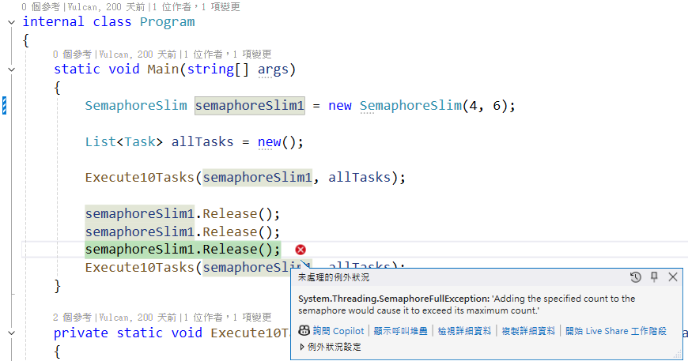

# 使用新執行緒，而不是透過執行緒集區執行緒完成非同步工作


當在進行多執行緒專案設計的時候，為了要能夠發揮最大硬體效能與執行效率，通常會使用多個執行緒來進行設計，這樣可以讓多個工作同時進行，而不是等待前一個工作完成後，再進行下一個工作。在 .NET 中，可以透過 `Task` 類別來建立新的執行緒，這樣可以讓多個工作同時進行，而不是等待前一個工作完成後，再進行下一個工作。

不過，有些時候，並不希望能夠使用大數量的多個執行緒來進行工作處理，這可能是因為硬體效能無法處理這樣需求，或者是有執行上的瓶頸在如 I/O 上，大量的使用執行緒反而會無法滿足專案的需求，因此，這裡需要有個方法來做到最多可以使用 N 個執行緒，若其中一個執行緒執行完畢後，便可以讓另外一個請求來取得執行緒繼續工作，限制執行緒的使用數量。

在 .NET / C# 中，面對這樣的需求，會有多個方式來處理，在這篇文章中，將會使用 `SemaphoreSlim` 類別來限制執行緒的使用數量，這樣可以讓多個工作同時進行，而不是等待前一個工作完成後，再進行下一個工作。

## 建立測試專案

請依照底下的操作，建立起這篇文章需要用到的練習專案

* 打開 Visual Studio 2022 IDE 應用程式
* 從 [Visual Studio 2022] 對話窗中，點選右下方的 [建立新的專案] 按鈕
* 在 [建立新專案] 對話窗右半部
  * 切換 [所有語言 (L)] 下拉選單控制項為 [C#]
  * 切換 [所有專案類型 (T)] 下拉選單控制項為 [主控台]
* 在中間的專案範本清單中，找到並且點選 [主控台應用程式] 專案範本選項
  > 專案，用於建立可在 Windows、Linux 及 macOS 於 .NET 執行的命令列應用程式
* 點選右下角的 [下一步] 按鈕
* 在 [設定新的專案] 對話窗
* 找到 [專案名稱] 欄位，輸入 `csSemaphoreSlimExcessiveRelease` 作為專案名稱
* 在剛剛輸入的 [專案名稱] 欄位下方，確認沒有勾選 [將解決方案與專案至於相同目錄中] 這個檢查盒控制項
* 點選右下角的 [下一步] 按鈕
* 現在將會看到 [其他資訊] 對話窗
* 在 [架構] 欄位中，請選擇最新的開發框架，這裡選擇的 [架構] 是 : `.NET 8.0 (長期支援)`
* 在這個練習中，需要去勾選 [不要使用最上層陳述式(T)] 這個檢查盒控制項
  > 這裡的這個操作，可以由讀者自行決定是否要勾選這個檢查盒控制項
* 請點選右下角的 [建立] 按鈕

稍微等候一下，這個 背景工作服務 專案將會建立完成

## 修改 Program.cs 類別內容

在這篇文章中，將會把會用到的新類別與程式碼，都寫入到 [Program.cs] 這個檔案中，請依照底下的操作，修改 [Program.cs] 這個檔案的內容

* 在專案中找到並且打開 [Program.cs] 檔案
* 將底下的程式碼取代掉 `Program.cs` 檔案中內容

```csharp
namespace csSemaphoreSlimExcessiveRelease;

internal class Program
{
    static void Main(string[] args)
    {
        SemaphoreSlim semaphoreSlim1 = new SemaphoreSlim(3, 6);

        List<Task> allTasks = new();

        Execute10Tasks(semaphoreSlim1, allTasks);

        semaphoreSlim1.Release();
        semaphoreSlim1.Release();
        semaphoreSlim1.Release();
        Execute10Tasks(semaphoreSlim1, allTasks);
    }

    private static void Execute10Tasks(SemaphoreSlim semaphoreSlim1, List<Task> allTasks)
    {
        allTasks.Clear();
        for (int i = 0; i < 10; i++)
        {
            int index = i;
            Console.WriteLine($"Index{index} " +
                $"semaphore 剩下 {semaphoreSlim1.CurrentCount}");

            semaphoreSlim1.Wait();
            var task = Task.Run(() =>
            {
                Console.WriteLine($"{DateTime.Now.TimeOfDay} 工作 {index} " +
                    $"獲得 semaphore({semaphoreSlim1.CurrentCount})");
                Thread.Sleep(3000);
                semaphoreSlim1.Release();
                Console.WriteLine($"{DateTime.Now.TimeOfDay} 工作 {index} " +
                    $"釋放 semaphore({semaphoreSlim1.CurrentCount})");
            });
            allTasks.Add(task);
        }

        Task.WaitAll(allTasks.ToArray());
        Console.WriteLine();
        Console.WriteLine();
        Console.WriteLine();
    }
}
```

在 [Main] 方法內，首先使用敘述 `SemaphoreSlim semaphoreSlim1 = new SemaphoreSlim(3, 6);` 來建立一個 `SemaphoreSlim` 類別的物件，這個物件會限制最多可以有 3 個執行緒可以同時執行，而最多可以有 6 個執行緒可以等待執行。對於這個 `SemaphoreSlim` 類別的建構子，有兩個參數，第一個參數是 `initialCount`，這個參數是指定初始的 semaphore 數量，第二個參數是 `maxCount`，這個參數是指定最大的 semaphore 數量。

而對於 [SemaphoreSlim] 物件的用法將會是有兩個主要的方法，一個是 `Wait` 方法，這個方法是用來等待 semaphore 的釋放，當 semaphore 數量為 0 時，這個方法會將目前的執行緒暫停，直到 semaphore 數量大於 0 時，才會繼續執行。另外一個方法是 `Release` 方法，這個方法是用來釋放 semaphore，當 semaphore 數量增加時，等待的執行緒將會繼續執行。該物件還會有個 [CurrentCount] 屬性，這個屬性是用來取得目前 semaphore 的數量。也就是說，若成功呼叫 [Wait] 方法，[CurrentCount] 屬性的值將會減少，若成功呼叫 [Release] 方法，[CurrentCount] 屬性的值將會增加。

接下來將會建立一個集合工作物件，型別為 `List<Task>`，這個集合工作物件將會用來存放所有的工作物件。接著呼叫 `Execute10Tasks` 方法，這個方法會執行 10 個工作，這個方法會接收兩個參數，第一個參數是 `SemaphoreSlim` 類別的物件，第二個參數是 `List<Task>` 集合工作物件。

當進入到 [Execute10Tasks] 方法內，首先會把 `allTasks` 集合工作物件清空，接著進入到迴圈內，這個迴圈會執行 10 次，每次迴圈都會執行一個工作(只要沒有超過限制的執行緒數量)。

在迴圈內，會先印出目前 semaphore 的數量，接著呼叫 `Wait` 方法，這個方法會等待 semaphore 還有有效的旗標數量，這個方法才算執行完畢，可以繼續往下執行，而在此時，semaphore 的 [CurrentCount] 將會減一，當 semaphore 的 [CurrentCount] 數量為 0 時，這個方法會將目前的執行緒暫停，直到 semaphore 數量大於 0 時，才會繼續執行。

接著呼叫 `Task.Run` 方法，這個方法會建立一個工作，這個工作會執行一個匿名方法，這個匿名方法會印出目前時間與工作索引，接著暫停 3 秒，最後呼叫 `Release` 方法，這個方法是用來釋放 semaphore，也就是當這個方法成功執行完成後，semaphore 的 [CurrentCount]將會加一，不過，一旦 semaphore 的 [CurrentCount] 數量抵達建構式中指定的 `maxCount` (這個參數是指定最大的 semaphore 數量)，若再次呼叫 [Release] 方法，將會造成 `System.Threading.SemaphoreFullException: 'Adding the specified count to the semaphore would cause it to exceed its maximum count.'` 例外異常拋出。

在下圖中，可以看到當建立 [SemaphoreSlim] 物件時候，建構子，第一個參數是 `initialCount`，這個參數是指定初始的 semaphore 數量，這裡宣告的4，代表初始的 semaphore 數量為 4。第二個參數是 `maxCount`，這個參數是指定最大的 semaphore 數量，這裡宣告的6，代表最大的 semaphore 數量為 6。所以，當 [Execute10Tasks] 執行完後，若執行到第三次的 `semaphoreSlim1.Release()`，需要將[CurrentCount] 數量加一，這樣將會造成超過最大可用的 semaphore 數量，這時候將會拋出 `System.Threading.SemaphoreFullException: 'Adding the specified count to the semaphore would cause it to exceed its maximum count.'` 例外異常拋出。



當 semaphore 數量增加時，等待的執行緒將會繼續執行。最後將這個工作加入到 `allTasks` 集合工作物件中。

## 執行程式

* 按下 `F5` 鍵，開始執行這個程式
* 程式將會開始執行，並且在主控台視窗內，將會看到類似下圖的輸出結果

從底下的執行結果可以看出

```plaintext
Index0 semaphore 剩下 3
Index1 semaphore 剩下 2
Index2 semaphore 剩下 1
Index3 semaphore 剩下 0
08:54:30.1628019 工作 2 獲得 semaphore(0)
08:54:30.1620930 工作 1 獲得 semaphore(0)
08:54:30.1628072 工作 0 獲得 semaphore(0)
08:54:33.1838500 工作 0 釋放 semaphore(2)
08:54:33.1838557 工作 1 釋放 semaphore(2)
08:54:33.1838680 工作 2 釋放 semaphore(2)
Index4 semaphore 剩下 2
08:54:33.1846819 工作 3 獲得 semaphore(2)
Index5 semaphore 剩下 1
08:54:33.1847788 工作 4 獲得 semaphore(1)
Index6 semaphore 剩下 0
08:54:33.1850070 工作 5 獲得 semaphore(0)
08:54:36.1931672 工作 3 釋放 semaphore(0)
08:54:36.1931882 工作 4 釋放 semaphore(1)
08:54:36.1932071 工作 5 釋放 semaphore(2)
Index7 semaphore 剩下 2
08:54:36.1936082 工作 6 獲得 semaphore(2)
Index8 semaphore 剩下 1
08:54:36.1938060 工作 7 獲得 semaphore(1)
Index9 semaphore 剩下 0
08:54:36.1938699 工作 8 獲得 semaphore(0)
08:54:39.2087783 工作 8 釋放 semaphore(2)
08:54:39.2087766 工作 6 釋放 semaphore(2)
08:54:39.2087766 工作 7 釋放 semaphore(2)
08:54:39.2092105 工作 9 獲得 semaphore(2)
08:54:42.2177655 工作 9 釋放 semaphore(3)


Index0 semaphore 剩下 6
Index1 semaphore 剩下 5
08:54:42.2186507 工作 0 獲得 semaphore(5)
Index2 semaphore 剩下 4
08:54:42.2187209 工作 1 獲得 semaphore(4)
Index3 semaphore 剩下 3
08:54:42.2188507 工作 2 獲得 semaphore(3)
Index4 semaphore 剩下 2
08:54:42.2189604 工作 3 獲得 semaphore(2)
Index5 semaphore 剩下 1
Index6 semaphore 剩下 0
08:54:42.2194051 工作 4 獲得 semaphore(0)
08:54:42.2266215 工作 5 獲得 semaphore(0)
08:54:45.2192551 工作 3 釋放 semaphore(3)
08:54:45.2192551 工作 2 釋放 semaphore(3)
Index7 semaphore 剩下 3
08:54:45.2192735 工作 0 釋放 semaphore(3)
08:54:45.2192551 工作 1 釋放 semaphore(3)
Index8 semaphore 剩下 2
08:54:45.2196008 工作 7 獲得 semaphore(2)
08:54:45.2197678 工作 8 獲得 semaphore(1)
Index9 semaphore 剩下 1
08:54:45.2196802 工作 6 獲得 semaphore(2)
08:54:45.2198453 工作 4 釋放 semaphore(2)
08:54:45.2236722 工作 9 獲得 semaphore(1)
08:54:45.2342956 工作 5 釋放 semaphore(2)
08:54:48.2335085 工作 7 釋放 semaphore(6)
08:54:48.2335037 工作 6 釋放 semaphore(6)
08:54:48.2335039 工作 8 釋放 semaphore(6)
08:54:48.2335037 工作 9 釋放 semaphore(6)
```