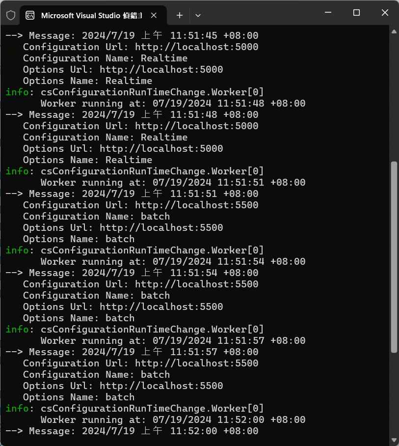

# 在執行時期能夠取得 appsettings.json 變更後的內容值


當在進行 ASP.NET Core 專案設計的時候，可以將系統運作的設定值，透過 `appsettings.json` 這個設定檔案來進行設定。然而，有時候我們需要在執行時期能夠取得 `appsettings.json` 變更後的內容值，這時候，如何能夠在不需要重新啟動該專案的目的下，取得這些變更後的內容值呢？

在這篇文章中，將會介紹採用一個 Generic Host 專案來進行說明，當透過 [IConfiguration] 與 [IOptionsMonitor] 這兩個介面來進行設定值的取得，一旦有任何設定值有所變更監聽，便可以立即使用到最新的設定值。

對於 [IConfiguration] 這介面，將會是透過弱型別的方式來取得設定值，而 [IOptions] 這介面則是透過強型別的方式來取得設定值，在這裡採用 [IOptionsMonitor] 這個介面，是因為它可以監聽設定值的變更，並且在設定值有所變更的時候，可以立即取得最新的設定值。

在底下的範例專案中，將會在繼承 [BackgroundService] 的 [Worker] 類別中，注入一個 [ISendMessage] 介面，並且會在這個專案內，實作一個 [SendConsoleMessage] 類別，這個類別將會注入 [IConfiguration] 與 [IOptionsMonitor] 這兩個物件，並且間斷性的取得 AppSettings.json 內的設定值，顯示在螢幕上；其中，會來變更 [appsettings.json] 檔案內的內容，並且進行存檔，接著看看螢幕輸出內容是否顯示最新的 [appsettings.json] 內容。

## 建立測試專案

請依照底下的操作，建立起這篇文章需要用到的練習專案

* 打開 Visual Studio 2022 IDE 應用程式
* 從 [Visual Studio 2022] 對話窗中，點選右下方的 [建立新的專案] 按鈕
* 在 [建立新專案] 對話窗右半部
  * 切換 [所有語言 (L)] 下拉選單控制項為 [C#]
  * 切換 [所有專案類型 (T)] 下拉選單控制項為 [服務]
* 在中間的專案範本清單中，找到並且點選 [背景工作服務] 專案範本選項
  > 用於建立 Worker Service 的空白專案範本
* 點選右下角的 [下一步] 按鈕
* 在 [設定新的專案] 對話窗
* 找到 [專案名稱] 欄位，輸入 `csConfigurationRunTimeChange` 作為專案名稱
* 在剛剛輸入的 [專案名稱] 欄位下方，確認沒有勾選 [將解決方案與專案至於相同目錄中] 這個檢查盒控制項
* 點選右下角的 [下一步] 按鈕
* 現在將會看到 [其他資訊] 對話窗
* 在 [架構] 欄位中，請選擇最新的開發框架，這裡選擇的 [架構] 是 : `.NET 8.0 (長期支援)`
* 在這個練習中，需要去勾選 [不要使用最上層陳述式(T)] 這個檢查盒控制項
  > 這裡的這個操作，可以由讀者自行決定是否要勾選這個檢查盒控制項
* 請點選右下角的 [建立] 按鈕

稍微等候一下，這個 背景工作服務 專案將會建立完成

一旦專案建立完成後，這個專案內將會有 [appsettings.json]、[Program.cs]、[Worker.cs] 這三個專案檔案，接著，請依照底下的操作，進行專案檔案的建立與修改。

## 修改 appsettings.json 檔案內容

* 在專案中找到並且打開 [appsettings.json] 檔案
* 將底下的 json 取代掉 `appsettings.json` 檔案中內容

```json
{
  "Logging": {
    "LogLevel": {
      "Default": "Information",
      "Microsoft.Hosting.Lifetime": "Information"
    }
  },
  "RealTime": {
    "Url": "http://localhost:5000",
    "Name": "Batch",
    "Key": "RealTimeKey"
  }
}
```

在這個 [appsettings.json] 檔案內容中，加入一個 `RealTime` 的區段，這個區段內有三個設定值，分別是 `Url`、`Name` 與 `Key` 這三個設定值，這三個設定值將會在後續的程式碼中，進行取得與顯示。

## 建立服務用到的介面與類別

* 滑鼠右擊專案節點，選擇 [加入] -> [類別]
* 當 [新增項目] 對話窗彈出後
  * 在 [名稱] 欄位中，輸入 `ISendMessage` 作為介面名稱
  * 在 [名稱] 欄位下方的 [類型] 下拉選單控制項中，選擇 [介面] 這個選項
  * 點選 [新增] 按鈕
* 將底下的程式碼取代掉 `ISendMessage` 這個介面檔案中內容

```csharp
namespace csConfigurationRunTimeChange;

public interface ISendMessage
{
    Task SendAsync(string message);
}
```

這個介面內容相當的簡單，在這個介面內僅有宣告一個需要實作的方法 [SendAsync]，這個方法將會接收一個字串參數，並且透過這個方法，將會將這個字串參數顯示在螢幕上。

* 滑鼠右擊專案節點，選擇 [加入] -> [類別]
* 當 [新增項目] 對話窗彈出後
  * 在 [名稱] 欄位中，輸入 `SendConsoleMessage` 作為類別名稱
  * 在 [名稱] 欄位下方的 [類型] 下拉選單控制項中，選擇 [類別] 這個選項
  * 點選 [新增] 按鈕
* 將底下的程式碼取代掉 `SendConsoleMessage` 這個類別檔案中內容
    
```csharp
using Microsoft.Extensions.Options;

namespace csConfigurationRunTimeChange;

public class SendConsoleMessage : ISendMessage
{
    private readonly IConfiguration configuration;
    private readonly IOptionsMonitor<RealTimeConfig> options;

    public SendConsoleMessage(IConfiguration configuration,
        IOptionsMonitor<RealTimeConfig> options)
    {
        this.configuration = configuration;
        this.options = options;
    }

    public async Task SendAsync(string message)
    {
        string valueUrlInConfiguration = configuration["RealTime:Url"];
        string valueNameInConfiguration = configuration["RealTime:Name"];
        string valueUrlInOptions = options.CurrentValue.Url;
        string valueNameInOptions = options.CurrentValue.Name;

        await Console.Out.WriteLineAsync(message);
        await Console.Out.WriteLineAsync($"   Configuration Url: {valueUrlInConfiguration}");
        await Console.Out.WriteLineAsync($"   Configuration Name: {valueNameInConfiguration}");
        await Console.Out.WriteLineAsync($"   Options Url: {valueUrlInOptions}");
        await Console.Out.WriteLineAsync($"   Options Name: {valueNameInOptions}");
    }
}
```

這個類別 [SendConsoleMessage] 將會需要實作 [ISendMessage] 介面，因此，在這裡將會需要設計 [SendAsync] 方法，這個方法將會接收一個字串參數，並且透過這個方法，將會將這個字串參數顯示在螢幕上，同時，這個方法內也會取得 [appsettings.json] 內的設定值，並且顯示在螢幕上。在這裡將會顯示出 RealTime 區段內的 Url 與 Name 這兩個設定值。

要了要能夠取得 [appsettings.json] 內的設定值，這裡將會注入 [IConfiguration] 與 [IOptionsMonitor] 這兩個物件，透過這兩個物件，可以取得 [appsettings.json] 內的設定值，其中，[IOptionsMonitor] 這個物件可以監聽設定值的變更，並且在設定值有所變更的時候，可以立即取得最新的設定值。

## 修改 Program.cs 類別內容

* 在專案中找到並且打開 [Program.cs] 檔案
* 將底下的程式碼取代掉 `Program.cs` 檔案中內容

```csharp
namespace csConfigurationRunTimeChange;

public class Program
{
    public static void Main(string[] args)
    {
        var builder = Host.CreateApplicationBuilder(args);
        builder.Services.AddHostedService<Worker>();
        builder.Services.AddSingleton<ISendMessage, SendConsoleMessage>();

        builder.Configuration
            .AddJsonFile("appsettings.json", optional: true, reloadOnChange: true)
            .AddEnvironmentVariables();

        builder.Services.Configure<RealTimeConfig>(builder.Configuration.GetSection("RealTime"));

        var host = builder.Build();
        host.Run();
    }
}
```

在這個程式碼中，透過 [Host.CreateApplicationBuilder] 這個方法，建立一個 [HostBuilder] 物件，並且在這個物件中，進行服務的註冊，這裡將會註冊 [Worker] 這個服務，同時，也會註冊 [ISendMessage] 這個介面，並且將 [SendConsoleMessage] 這個類別注入進去。不過，當要注入 [ISendMessage] 這個實作物件的時候，將會故意採用 Singleton 的方式進行注入。

為了要能夠達到監聽設定值的變更，這裡將會透過 [builder.Configuration.AddJsonFile] 這個方法，設定 [appsettings.json] 檔案的路徑，並且設定 [reloadOnChange] 這個參數為 `true`，這樣一來，當 [appsettings.json] 檔案有所變更的時候，便可以立即取得最新的設定值。而對於 [optional] 這個參數，optional 為 true：檔案為選擇性

最後，為了要能夠使用強型別的方式來取得設定值，這裡將會透過 [builder.Services.Configure<RealTimeConfig>(builder.Configuration.GetSection("RealTime"))] 這個方法，設定 [RealTimeConfig] 這個類別的設定值，這樣一來，便可以透過 [IOptionsMonitor] 這個物件，取得最新的設定值。

## 修改 Worker.cs 類別內容

* 在專案中找到並且打開 [Worker.cs] 檔案
* 將底下的程式碼取代掉 `Worker.cs` 檔案中內容

```csharp
namespace csConfigurationRunTimeChange;

public class Worker : BackgroundService
{
    private readonly ILogger<Worker> _logger;
    private readonly ISendMessage sendMessage;

    public Worker(ILogger<Worker> logger,
        ISendMessage sendMessage)
    {
        _logger = logger;
        this.sendMessage = sendMessage;
    }

    protected override async Task ExecuteAsync(CancellationToken stoppingToken)
    {
        while (!stoppingToken.IsCancellationRequested)
        {
            if (_logger.IsEnabled(LogLevel.Information))
            {
                _logger.LogInformation("Worker running at: {time}", DateTimeOffset.Now);
                await sendMessage.SendAsync($"--> Message: {DateTimeOffset.Now}");
            }
            await Task.Delay(3000, stoppingToken);
        }
    }
}
```

對於取代後的程式碼與之前的程式碼的差異在於，在建構式內將會注入 [ISendMessage] 這個介面，這樣一來，便可以透過這個介面，來呼叫 [SendAsync] 方法，並且將訊息顯示在螢幕上。

另外，在 [ExecuteAsync] 方法內，將會在迴圈內，每隔 3 秒鐘，便會執行一次 [sendMessage.SendAsync] 方法，並且將目前的時間顯示在螢幕上。

## 執行測試專案
* 按下 `F5` 開始執行專案
* 等候一下，當螢幕上開始顯示訊息時，表示專案已經開始執行
* 打開 `appsettings.json` 檔案，並且將 `Url` 與 `Name` 這兩個設定值進行變更
* 存檔後，觀察螢幕上的訊息是否有立即顯示最新的設定值




