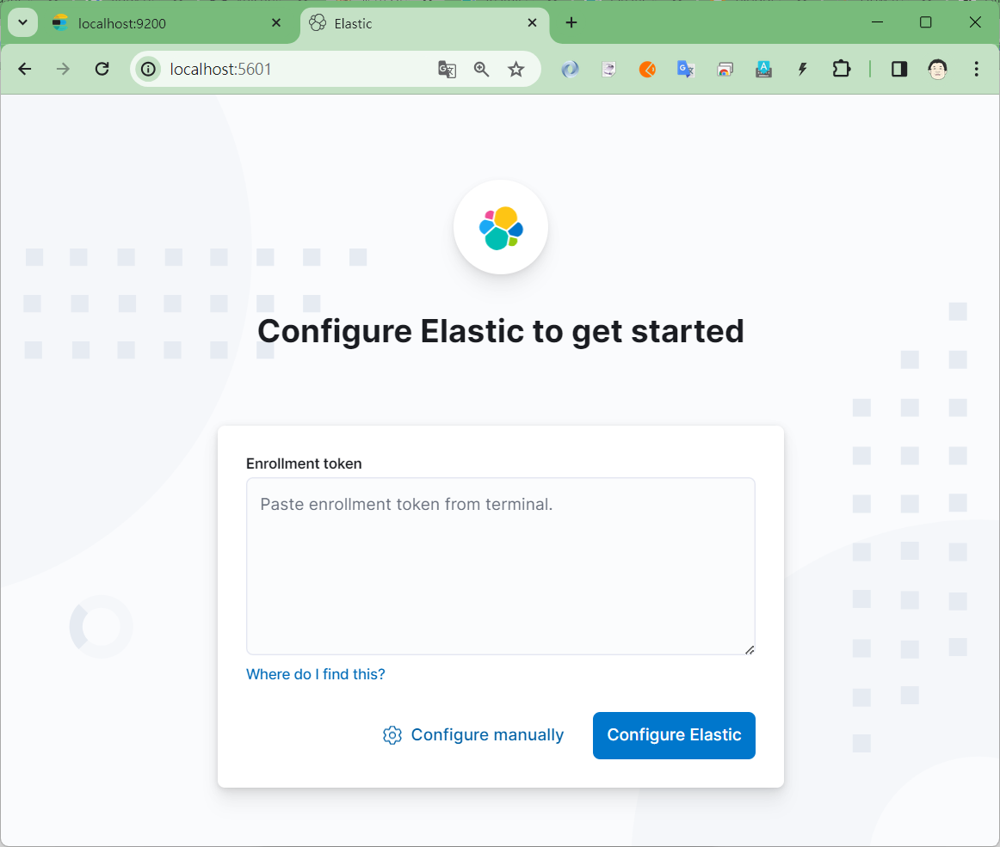

# Elasticsearch 系列 : 建立與使用 Docker 環境下的 Elasticsearch 與 Kibana

由於最近半年都在從事於 Elasticsearc 方面的專案開發，因為工作上的需要，因此將會把最近用於 Elasticsearc 相關開發技術與方法記錄下來，方便日後查詢，也讓更多人可以認識這個相當優異的工具，以及如何透過 C# 最到相關的應用。

底下為 2023 所撰寫的關於 Elasticsearch 的文章清單

* [Elasticsearch 系列 - 使用 C# 來新增文件記錄到 Elasticsearch 資料庫](https://csharpkh.blogspot.com/2023/12/Elasticsearch-Create-Document-Index-Mapping.html)
* [Elasticsearch 系列 - 使用 C# / Elasticsearch.Net 來新增文件記錄到 Elasticsearch 資料庫](https://csharpkh.blogspot.com/2023/12/Elasticsearch-Elasticsearch.Net-Create-Document-Index-Mapping.html)
* [Elasticsearch 系列 - 使用 C# / Elasticsearch.Net 來查詢 Elasticsearch 資料庫文件記錄](https://csharpkh.blogspot.com/2023/12/Elasticsearch-Elasticsearch.Net-Retrive-Query-Term-Size-ElasticsearchType-IdProperty.html)
* [Elasticsearch 系列 - 使用 C# / Elasticsearch.Net 來修改 Elasticsearch 資料庫文件記錄](https://csharpkh.blogspot.com/2023/12/Elasticsearch-Elasticsearch.Net-Update-doc-updateasync.html)
* [Elasticsearch 系列 - 使用 C# / Elasticsearch.Net 來刪除 Elasticsearch 資料庫文件記錄](https://csharpkh.blogspot.com/2023/12/Elasticsearch-Elasticsearch.Net-Delete-doc-deleteasync.html)

由於之前所寫的文章，都是採用安裝在一台後端伺服器上的 Elasticsearch 服務來進行開發，在這篇文章將會介紹如何透過 Docker 來建立 Elasticsearch 與 Kibana 的環境，讓開發者可以在本機端進行開發，並且可以透過 Kibana 來進行資料庫的管理。

## 建立 Elasticsearch 要用到的網路

在建立 Elasticsearch 與 Kibana 的 Docker 環境之前，我們需要先建立一個網路，讓 Elasticsearch 與 Kibana 這兩個容器可以透過這個網路來進行溝通。

請在命令提示字元中輸入以下指令

```shell
docker network create elastic
```

執行結果如下


使用底下指令來確認是否有建立成功

```shell
docker network ls
```


## 建立與啟動 Elasticsearch Container

接著我們需要建立 Elasticsearch 的 Docker Image，請在命令提示字元中輸入以下指令

```shell
docker pull docker.elastic.co/elasticsearch/elasticsearch:8.12.2
```

執行結果如下：


接著我們需要建立 Elasticsearch 的 Docker Container，請在命令提示字元中輸入以下指令

```shell
docker run -it --name elasticsearch --net elastic -p 9200:9200 -e "discovery.type=single-node" -e ELASTIC_PASSWORD=elastic docker.elastic.co/elasticsearch/elasticsearch:8.13.1
```

上述的指令中，使用了 `-e ELASTIC_PASSWORD=elastic` 來設定 Elasticsearch 的密碼，這個密碼是用來登入 Elasticsearch 的，請記得保留這個密碼，因為之後會用到。另外，使用了 `-e "discovery.type=single-node"` 來設定 Elasticsearch 的節點類型為單節點，這樣就可以讓 Elasticsearch 在單節點的環境下運行。

執行結果如下：


請在命令題是字元視窗內搜尋 [Enrollment token] 文字，就可以看到底下內容

```
ℹ️  Configure Kibana to use this cluster:
• Run Kibana and click the configuration link in the terminal when Kibana starts.
• Copy the following enrollment token and paste it into Kibana in your browser (valid for the next 30 minutes):
  eyJ2ZXIiOiI4LjEzLjEiLCJhZHIiOlsiMTcyLjE4LjAuMjo5MjAwIl0sImZnciI6ImUxYjUxZmZlYzkwMmZkYjcwNmM4Y2ZlYTgzMTZiOGUxZmU5NWFlNDAxNTU5MzczMTA1Y2U3Mzg3N2Q2Njc2MTciLCJrZXkiOiJ5aC1Fd0k0QlJDTTYtc3dueUJ3bTpTWlRJeEZBMFJXMmZ6eVBhUzlQOVJBIn0=
  ```

請將這段文字 `eyJ2ZXIiOiI4LjEzLjEiLCJhZHIiOlsiMTcyLjE4LjAuMjo5MjAwIl0sImZnciI6ImUxYjUxZmZlYzkwMmZkYjcwNmM4Y2ZlYTgzMTZiOGUxZmU5NWFlNDAxNTU5MzczMTA1Y2U3Mzg3N2Q2Njc2MTciLCJrZXkiOiJ5aC1Fd0k0QlJDTTYtc3dueUJ3bTpTWlRJeEZBMFJXMmZ6eVBhUzlQOVJBIn0=` 複製起來，因為之後會用到，這段文字稱之為 [Enrollment token]。

從執行結果中可以看到 Elasticsearch 已經成功的建立與啟動，並且可以看到底下內容：

接著我們可以透過瀏覽器來進行測試，請在瀏覽器中輸入以下網址

```shell
https://localhost:9200
```

執行結果如下：

首先，需要先輸入帳號與密碼，帳號為 elastic ，密碼為 elastic


完成後，點選登入按鈕，就會看到底下畫面


```json
{
name: "eee625dddc63",
cluster_name: "docker-cluster",
cluster_uuid: "wKpWcpE8R6q9Ipu_odjzrQ",
version: {
number: "8.13.1",
build_flavor: "default",
build_type: "docker",
build_hash: "9287f29bba5e270bd51d557b8daccb7d118ba247",
build_date: "2024-03-29T10:05:29.787251984Z",
build_snapshot: false,
lucene_version: "9.10.0",
minimum_wire_compatibility_version: "7.17.0",
minimum_index_compatibility_version: "7.0.0"
},
tagline: "You Know, for Search"
}
```

## 建立與啟動 Kibana Container

使用底下指令啟動 Kibana 的 Docker Image

```shell
docker pull docker.elastic.co/kibana/kibana:8.13.1
```

執行結果如下：


接著我們需要建立 Kibana 的 Docker Container，請在命令提示字元中輸入以下指令

```shell
docker run -it --name kibana --net elastic -p 5601:5601 docker.elastic.co/kibana/kibana:8.13.1
```

執行結果如下：


從上圖的輸出文字的最後面，可以看到 `Kibana has not been configured` 的訊息，這表示 Kibana 還沒有設定完成，所以，接著我們可以透過瀏覽器來進行測試，請在瀏覽器中輸入以下網址

```shell
http://localhost:5601
```

執行結果如下：



請在 [Enrollment token] 欄位中貼上剛剛複製下來的 [Enrollment token] 


請直接點選 [Configure Elastic] 按鈕，就會看到底下畫面


在這個畫面中，可以看到需要提供驗證碼，所以，現在切換到 Kibana 的命令提示字元視窗，將會看如下圖


最後一行的文字，將會是 `Your verification code is: \u001b[30m\u001b[106m 106 918 \u001b[49m\u001b[39m`，請將這段文字 `106 918` 複製起來，因為之後會用到，這段文字稱之為 [Verification code]。

將 [Verification code] 貼到瀏覽器上


完成後，點選 [Verify] 按鈕，就會看到底下畫面


等候 kibana 完成初始化設定之後，就會看到底下畫面

現在可以正常連上 kibana


請在 [Username] 欄位中輸入 `elastic`，在 [Password] 欄位中輸入 `elastic`，然後點選 [Log in] 按鈕，就可以看到底下畫面

 

在這個畫面中，點選 [Explore on my own] 按鈕，就可以看到底下畫面


## 其他說明

```shell
docker exec -it elasticsearch /usr/share/elasticsearch/bin/elasticsearch-create-enrollment-token -s kibana
```

上述的指令表示了透過 `elasticsearch-create-enrollment-token` 來建立一個 `enrollment token`，這個 `enrollment token` 是用來讓 Kibana 與 Elasticsearch 之間進行溝通的，而 `-s kibana` 表示了這個 `enrollment token` 是用來給 Kibana 使用的。


