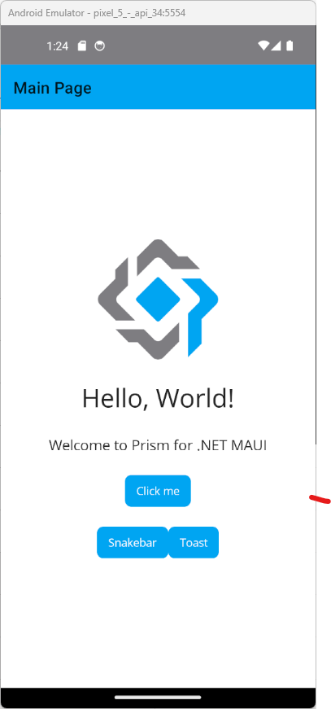
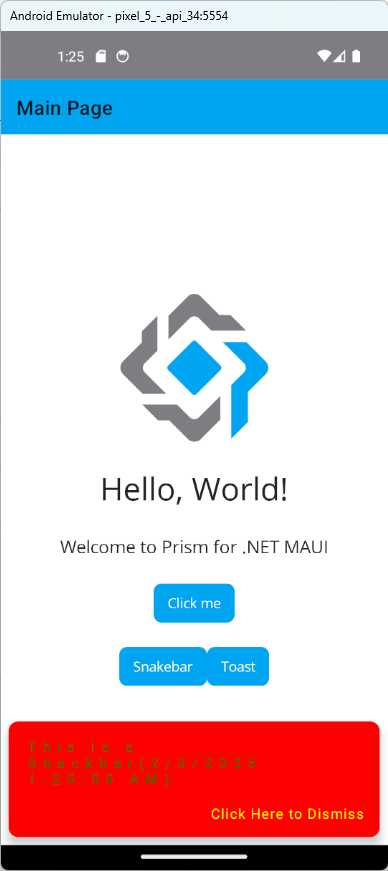
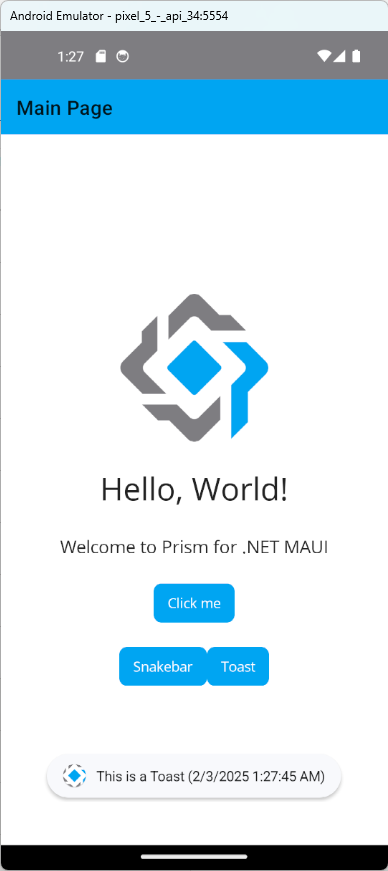

# .NET MAUI 在 MAUI 使用警示功能 - Snackbar 與 Toast 快顯通知

在進行 .NET MAUI App 開發的時候，我們會需要使用到一些警示功能，可以透過這些警示訊息告知使用者相關 App 正在處理工作的最新情況；在 .NET 多平臺應用程式 UI （.NET MAUI） 社群工具組檔 中，就有提供這兩個機制可以選擇： [Snackbar](https://learn.microsoft.com/zh-tw/dotnet/communitytoolkit/maui/alerts/snackbar?tabs=android&WT.mc_id=DT-MVP-5002220) 與 [Toast](https://learn.microsoft.com/zh-tw/dotnet/communitytoolkit/maui/alerts/toast?tabs=android&WT.mc_id=DT-MVP-5002220) 快顯通知。這兩個功能都是用來提醒使用者一些訊息，但是在使用上有些微的差異。

Snackbar是預設出現在畫面底部的計時警示。 它會在可設定的時間持續時間之後關閉。會 Snackbar 通知使用者應用程式已執行或將執行的進程。 它會暫時出現在畫面底部。

Toast 是出現在畫面底部的計時警示。 它會在可設定的時間持續時間之後自動關閉。它提供使用者關於小型警示中作業的簡單意見反應。

在這個範例中，我們將會使用這兩個功能來進行一個簡單的應用程式開發，讓使用者可以透過這兩個功能來進行一些簡單的操作。


## 建立採用 Prism 開發框架的 MAUI 專案

* 打開 Visual Studio 2022 IDE 應用程式
* 從 [Visual Studio 2022] 對話窗中，點選右下方的 [建立新的專案] 按鈕
* 在 [建立新專案] 對話窗右半部
  * 切換 [所有語言 (L)] 下拉選單控制項為 [C#]
  * 切換 [所有專案類型 (T)] 下拉選單控制項為 [MAUI]
* 在中間的專案範本清單中，找到並且點選 [Vulcan Custom Prism .NET MAUI App] 專案範本選項
  
  >若沒有看到這個專案範本，請參考 [使用 Vulcan.Maui.Template 專案範本來進行 MAUI for Prism 專案開發](https://csharpkh.blogspot.com/2023/01/Create-First-MAUI-Project-By-Vulcan-Template.html) 文章，進行安裝這個專案範本到 Visual Studio 2022 內
* 點選右下角的 [下一步] 按鈕
* 在 [設定新的專案] 對話窗
* 在 [專案名稱] 欄位內輸入 `mauiAlertSnackbarToast` 做為這個專案名稱
* 請點選右下角的 [建立] 按鈕
* 此時，將會建立一個可以用於 MAUI 開發的專案

## 修正 MainPage 之 View & ViewModel
* 打開 [Views] 資料夾下的 [MainPage.xaml] 檔案
* 使用底下標記宣告替換掉這個原有檔案內容

```xml
<?xml version="1.0" encoding="utf-8" ?>
<ContentPage xmlns="http://schemas.microsoft.com/dotnet/2021/maui"
             xmlns:x="http://schemas.microsoft.com/winfx/2009/xaml"
             Title="{Binding Title}"
             x:Class="mauiAlertSnackbarToast.Views.MainPage"
             xmlns:viewModel="clr-namespace:mauiAlertSnackbarToast.ViewModels"
             x:DataType="viewModel:MainPageViewModel">

    <ScrollView>
        <VerticalStackLayout
            Spacing="25"
            Padding="30,0"
            VerticalOptions="Center">

            <Image Source="prism.png"
             SemanticProperties.Description="Cute dot net bot waving hi to you!"
             HeightRequest="150"
             HorizontalOptions="Center" />

            <Label Text="Hello, World!"
             SemanticProperties.HeadingLevel="Level1"
             FontSize="32"
             HorizontalOptions="Center" />

            <Label Text="Welcome to Prism for .NET MAUI"
             SemanticProperties.HeadingLevel="Level2"
             SemanticProperties.Description="Welcome to Prism for dot net Multi platform App U I"
             FontSize="18"
             HorizontalOptions="Center" />

            <Button Text="{Binding Text}"
              SemanticProperties.Hint="Counts the number of times you click"
              Command="{Binding CountCommand}"
              HorizontalOptions="Center" />

            <HorizontalStackLayout HorizontalOptions="Center">
                <Button Text="Snakebar"
                  Command="{Binding ShowSnakebarCommand}"/>
                <Button Text="Toast"
                  Command="{Binding ShowToastCommand}"/>
            </HorizontalStackLayout>

        </VerticalStackLayout>
    </ScrollView>

</ContentPage>
```

在這個 [MainPage.xaml] 頁面的標記宣告中，我們新增了兩個按鈕，分別是 [Snakebar] 與 [Toast]，這兩個按鈕是用來觸發 ViewModel 內的 ShowSnakebarCommand 與 ShowToastCommand 這兩個命令。

* 打開 [ViewModels] 資料夾下的 MainPageViewModel.cs 檔案
* 使用底下程式碼替換掉這個原有檔案內容

```csharp
using CommunityToolkit.Maui.Core;
using CommunityToolkit.Mvvm.ComponentModel;
using CommunityToolkit.Mvvm.Input;
using System.Threading;
using CommunityToolkit.Maui.Alerts;

namespace mauiAlertSnackbarToast.ViewModels;

public partial class MainPageViewModel : ObservableObject, INavigatedAware
{
    #region Field Member
    private int _count;
    private readonly INavigationService navigationService;

    #endregion

    #region Property Member
    [ObservableProperty]
    string title = "Main Page";

    [ObservableProperty]
    string text = "Click me";
    #endregion

    #region Constructor
    public MainPageViewModel(INavigationService navigationService)
    {
        this.navigationService = navigationService;
    }
    #endregion

    #region Method Member
    #region Command Method
    [RelayCommand]
    async Task ShowSnakebar()
    {
        var snackbarOptions = new SnackbarOptions
        {
            BackgroundColor = Colors.Red,
            TextColor = Colors.Green,
            ActionButtonTextColor = Colors.Yellow,
            CornerRadius = new CornerRadius(10),
            Font = Microsoft.Maui.Font.SystemFontOfSize(14),
            ActionButtonFont = Microsoft.Maui.Font.SystemFontOfSize(14),
            CharacterSpacing = 0.5
        };

        string text = "This is a Snackbar" + $"({DateTime.Now})";
        string actionButtonText = "Click Here to Dismiss";
        TimeSpan duration = TimeSpan.FromSeconds(3);

        var snackbar = Snackbar.Make(text, null, actionButtonText, duration, snackbarOptions);

        await snackbar.Show();
    }

    [RelayCommand]
    async Task ShowToast()
    {
        string text = "This is a Toast "+$"({DateTime.Now})";
        ToastDuration duration = ToastDuration.Short;
        double fontSize = 14;

        var toast = Toast.Make(text, duration, fontSize);

        await toast.Show();
    }
    [RelayCommand]
    private void Count()
    {
        _count++;
        if (_count == 1)
            Text = "Clicked 1 time";
        else if (_count > 1)
            Text = $"Clicked {_count} times";
    }
    #endregion

    #region Navigation Event
    public void OnNavigatedFrom(INavigationParameters parameters)
    {
    }

    public void OnNavigatedTo(INavigationParameters parameters)
    {
    }
    #endregion

    #region Other Method
    #endregion
    #endregion
}
```

在這個 ViewModel 中，我們新增了兩個命令 ShowSnakebar 與 ShowToast，這兩個命令是用來觸發 Snackbar 與 Toast 的功能。

對於 `ShowSnakebar()` 方法，我們使用 `SnackbarOptions` 來設定 Snackbar 的外觀，並且透過 `Snackbar.Make()` 來建立 Snackbar 物件，最後透過 `Snackbar.Show()` 來顯示 Snackbar 訊息。

對於 `ShowToast()` 方法，我們使用 `ToastDuration` 來設定 Toast 的持續時間，並且透過 `Toast.Make()` 來建立 Toast 物件，最後透過 `Toast.Show()` 來顯示 Toast 訊息。

## 執行與確認結果

* 底下是在 Android 模擬器內執行的結果



* 此時，點選 [Snakebar] 按鈕，將會出現 Snakebar 訊息，如下圖所示



* 此時，點選 [Toast] 按鈕，將會出現 Toast 訊息，如下圖所示




