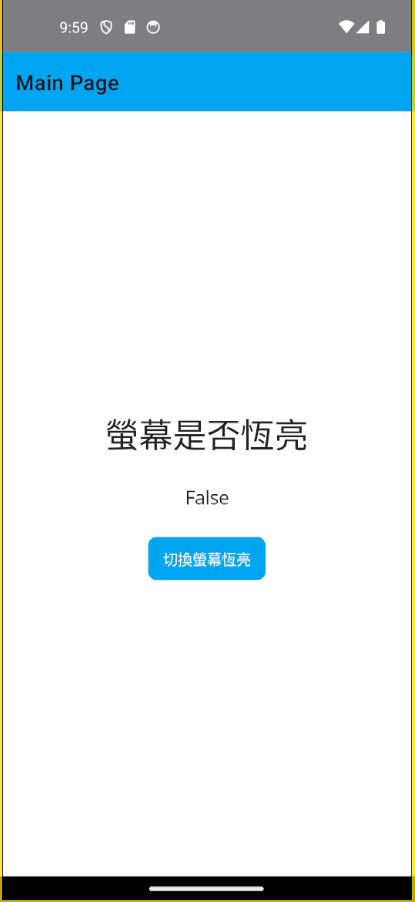
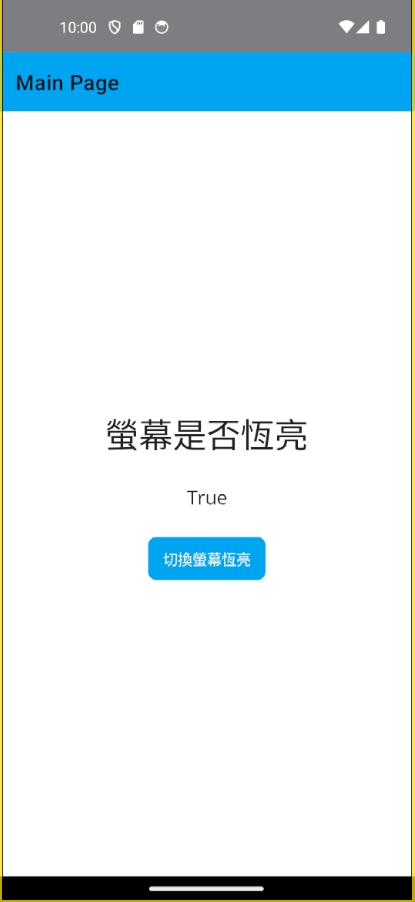

# .NET MAUI 螢幕持續恆亮


當在進行行動裝 App 開發的時候，有時候會需要讓裝置的螢幕持續恆亮，例如，正在進行大量檔案上傳或者下載、需要大量呼叫不同的遠端 Web API等等，不會因為裝置的自動關閉螢幕的時間有多少，而受到影響。這時候，就可以使用 .NET MAUI 內建的 [平台功能](https://learn.microsoft.com/zh-tw/dotnet/maui/platform-integration/?view=net-maui-9.0&WT.mc_id=DT-MVP-5002220) 內的 [裝置顯示資訊] 功能來做到控制螢幕是否要維持恆亮，此時，可以透過 `DeviceDisplay.Current.KeepScreenOn` 這個屬性來控制裝置的螢幕是否持續恆亮。

## 建立採用 Prism 開發框架的 MAUI 專案

* 打開 Visual Studio 2022 IDE 應用程式
* 從 [Visual Studio 2022] 對話窗中，點選右下方的 [建立新的專案] 按鈕
* 在 [建立新專案] 對話窗右半部
  * 切換 [所有語言 (L)] 下拉選單控制項為 [C#]
  * 切換 [所有專案類型 (T)] 下拉選單控制項為 [MAUI]
* 在中間的專案範本清單中，找到並且點選 [Vulcan Custom Prism .NET MAUI App] 專案範本選項
  
  >若沒有看到這個專案範本，請參考 [使用 Vulcan.Maui.Template 專案範本來進行 MAUI for Prism 專案開發](https://csharpkh.blogspot.com/2023/01/Create-First-MAUI-Project-By-Vulcan-Template.html) 文章，進行安裝這個專案範本到 Visual Studio 2022 內
* 點選右下角的 [下一步] 按鈕
* 在 [設定新的專案] 對話窗
* 在 [專案名稱] 欄位內輸入 `mauiSwitchScreenAlwaysOn` 做為這個專案名稱
* 請點選右下角的 [建立] 按鈕
* 此時，將會建立一個可以用於 MAUI 開發的專案

## 修正 MainPage 之 View & ViewModel & CodeBehind
* 打開 [Views] 資料夾下的 [MainPage.xaml] 檔案
* 使用底下標記宣告替換掉這個原有檔案內容

```xml
<?xml version="1.0" encoding="utf-8" ?>
<ContentPage xmlns="http://schemas.microsoft.com/dotnet/2021/maui"
             xmlns:x="http://schemas.microsoft.com/winfx/2009/xaml"
             Title="{Binding Title}"
             x:Class="mauiSwitchScreenAlwaysOn.Views.MainPage"
             xmlns:viewModel="clr-namespace:mauiSwitchScreenAlwaysOn.ViewModels"
             x:DataType="viewModel:MainPageViewModel">

  <ScrollView>
    <VerticalStackLayout
            Spacing="25"
            Padding="30,0"
            VerticalOptions="Center">

      <Label Text="螢幕是否恆亮"
             FontSize="32"
             HorizontalOptions="Center" />

      <Label Text="{Binding AlwaysScreenOn}"
             FontSize="18"
             HorizontalOptions="Center" />

            <Button Text="切換螢幕恆亮"
              Command="{Binding SwitchScreenAlwaysOnCommand}"
              HorizontalOptions="Center" />

    </VerticalStackLayout>
  </ScrollView>

</ContentPage>
```

在這裡的 XAML 宣告標記中，我們使用了 `Button` 控制項，並且設定了 `Command` 屬性為 `SwitchScreenAlwaysOnCommand` 這個命令，這個命令是在 ViewModel 內所定義的，當該按鈕被觸發之後，將會切換 [AlwaysScreenOn] 這個可綁定屬性質，接著，便會呼叫讓螢幕是否恆亮的 API。

* 打開 [ViewModels] 資料夾下的 MainPageViewModel.cs 檔案
* 使用底下程式碼替換掉這個原有檔案內容

```csharp
using CommunityToolkit.Mvvm.ComponentModel;
using CommunityToolkit.Mvvm.Input;

namespace mauiSwitchScreenAlwaysOn.ViewModels;

public partial class MainPageViewModel : ObservableObject, INavigatedAware
{
    #region Field Member
    private int _count;
    private readonly INavigationService navigationService;

    #endregion

    #region Property Member
    [ObservableProperty]
    string title = "Main Page";

    [ObservableProperty]
    string text = "Click me";

    [ObservableProperty]
    bool alwaysScreenOn = false;
    #endregion

    #region Constructor
    public MainPageViewModel(INavigationService navigationService)
    {
        this.navigationService = navigationService;
    }
    #endregion

    #region Method Member
    #region Command Method
    [RelayCommand]
    void SwitchScreenAlwaysOn()
    {
        AlwaysScreenOn = !AlwaysScreenOn;
        MainThread.BeginInvokeOnMainThread(() =>
        {
            DeviceDisplay.Current.KeepScreenOn = AlwaysScreenOn;
        });
        
    }
    #endregion

    #region Navigation Event
    public void OnNavigatedFrom(INavigationParameters parameters)
    {
    }

    public void OnNavigatedTo(INavigationParameters parameters)
    {
    }
    #endregion

    #region Other Method
    #endregion
    #endregion
}
```

在這裡的 ViewModel 內，我們定義了一個 `SwitchScreenAlwaysOn` 這個命令，當這個命令被觸發之後，將會切換 [AlwaysScreenOn] 這個可綁定屬性值，接著，便會呼叫 `DeviceDisplay.Current.KeepScreenOn = AlwaysScreenOn;` 讓螢幕是否恆亮的 API。這裡注意到的是，我們使用了 `MainThread.BeginInvokeOnMainThread` 這個方法，這是因為我們需要在主執行緒上執行這個 API。

## 執行與確認結果

* 底下是在 Android 模擬器內執行的結果



點選 [] 按鈕之後的結果將會是，裝置的螢幕將會維持恆亮，不會因為該裝置設定的自動關閉螢幕的時間有多少，而受到影響。



