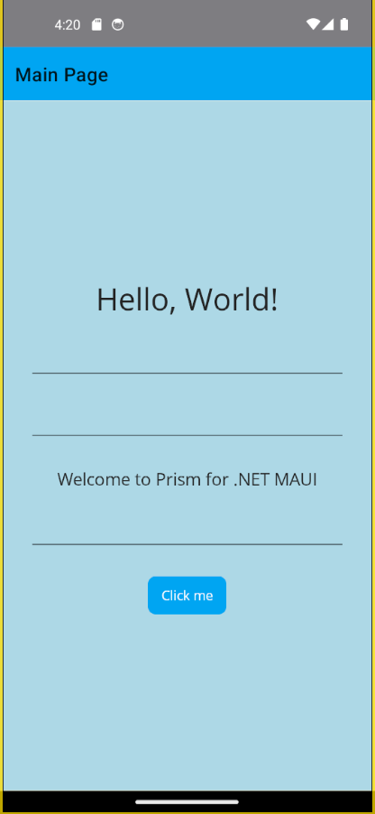
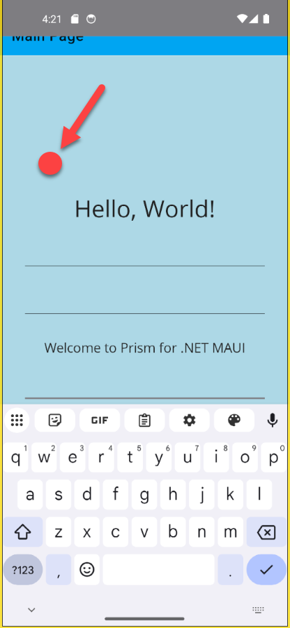

# .NET MAUI 軟體鍵盤的隱藏控制


當在進行 .NET MAUI 專案開發的時候，若使用者點選了 Entry 或者 Editor 控制項，軟體鍵盤會自動彈出來，這時候，若使用者點選了畫面上的其他地方，軟體鍵盤會自動隱藏。這個功能是由 .NET MAUI 內建的功能所提供的。但是，這樣的功能需要能夠同時在 Android & iOS 平台下能夠運作。這個範例將會示範如何透過程式碼來控制軟體鍵盤的隱藏。

想要控制軟體鍵盤可以自動的隱藏起來，這裡將會需要用到 [ContentPage.HideSoftInputOnTapped 屬性](https://learn.microsoft.com/zh-tw/dotnet/api/microsoft.maui.controls.contentpage.hidesoftinputontapped?view=net-maui-9.0&WT.mc_id=DT-MVP-5002220)。這個屬性是一個布林值，當這個屬性設定為 `true` 的時候，軟體鍵盤會自動隱藏起來。

## 建立採用 Prism 開發框架的 MAUI 專案

* 打開 Visual Studio 2022 IDE 應用程式
* 從 [Visual Studio 2022] 對話窗中，點選右下方的 [建立新的專案] 按鈕
* 在 [建立新專案] 對話窗右半部
  * 切換 [所有語言 (L)] 下拉選單控制項為 [C#]
  * 切換 [所有專案類型 (T)] 下拉選單控制項為 [MAUI]
* 在中間的專案範本清單中，找到並且點選 [Vulcan Custom Prism .NET MAUI App] 專案範本選項
  
  >若沒有看到這個專案範本，請參考 [使用 Vulcan.Maui.Template 專案範本來進行 MAUI for Prism 專案開發](https://csharpkh.blogspot.com/2023/01/Create-First-MAUI-Project-By-Vulcan-Template.html) 文章，進行安裝這個專案範本到 Visual Studio 2022 內
* 點選右下角的 [下一步] 按鈕
* 在 [設定新的專案] 對話窗
* 在 [專案名稱] 欄位內輸入 `mauiSoftKeyboardVisibility` 做為這個專案名稱
* 請點選右下角的 [建立] 按鈕
* 此時，將會建立一個可以用於 MAUI 開發的專案


## 修正 MainPage 之 View & ViewModel & CodeBehind
* 打開 [Views] 資料夾下的 [MainPage.xaml] 檔案
* 使用底下標記宣告替換掉這個原有檔案內容

```xml
<?xml version="1.0" encoding="utf-8" ?>
<ContentPage xmlns="http://schemas.microsoft.com/dotnet/2021/maui"
             xmlns:x="http://schemas.microsoft.com/winfx/2009/xaml"
             Title="{Binding Title}"
             x:Class="mauiSoftKeyboardVisibility.Views.MainPage"
             xmlns:viewModel="clr-namespace:mauiSoftKeyboardVisibility.ViewModels"
             x:DataType="viewModel:MainPageViewModel"
             >
    <Grid x:Name="ThisGrid" BackgroundColor="LightYellow">
        <Rectangle Fill="LightBlue" HorizontalOptions="Fill" VerticalOptions="Fill"
                    InputTransparent="True" >
            <Rectangle.GestureRecognizers>
                <TapGestureRecognizer Command="{Binding HiddenSoftKeyboardCommand}" />
            </Rectangle.GestureRecognizers>
        </Rectangle>
        <ScrollView>
            <VerticalStackLayout
            Spacing="25"
            Padding="30,0"
            VerticalOptions="Center">

                <Label Text="Hello, World!"
             SemanticProperties.HeadingLevel="Level1"
             FontSize="32"
             HorizontalOptions="Center" >
                    <Label.GestureRecognizers>
                        <TapGestureRecognizer Command="{Binding HiddenSoftKeyboardCommand}" />
                    </Label.GestureRecognizers>

                </Label>

                <Entry />

                <Entry />

                <Label Text="Welcome to Prism for .NET MAUI"
             SemanticProperties.HeadingLevel="Level2"
             SemanticProperties.Description="Welcome to Prism for dot net Multi platform App U I"
             FontSize="18"
             HorizontalOptions="Center" />

                <Entry />

                <Button Text="{Binding Text}"
              SemanticProperties.Hint="Counts the number of times you click"
              Command="{Binding CountCommand}"
              HorizontalOptions="Center" />

            </VerticalStackLayout>
        </ScrollView>
    </Grid>

</ContentPage>
```

在這個 [MainPage.xaml] 頁面的標記宣告中，在最底層宣告了一個 [Rectangle] 控制項，這個控制項的作用是當使用者點選了這個控制項的時候(也就是點選螢幕非文字輸入的其他地方，此時，就會觸發 [TapGestureRecognizer] 這個手勢操作，也就是會去執行 [HiddenSoftKeyboardCommand] 這個命令。

另外，在這個頁面上，也宣告了三個 Entry 控制項，讓使用者點選這些控制項之後，將會自動彈出軟體鍵盤出來。

* 打開 [Views] 資料夾下的 [MainPage.xaml.cs] 檔案
* 使用底下程式碼替換掉這個原有檔案內容

```csharp
using mauiSoftKeyboardVisibility.ViewModels;

namespace mauiSoftKeyboardVisibility.Views;

public partial class MainPage : ContentPage
{
    public MainPage()
    {
        InitializeComponent();

        this.Focused += (s, e) =>
        {
            this.HideSoftInputOnTapped = true;
        };
    }

    protected override void OnAppearing()
    {
        MainPageViewModel MainPageViewModel = this.BindingContext as MainPageViewModel;
        MainPageViewModel.HiddenSoftKeyboardHandle = HiddenSoftKeyboard;
        base.OnAppearing();
    }

    public void HiddenSoftKeyboard()
    {
        this.HideSoftInputOnTapped = true;
    }
}
```

在這個 [MainPage.xaml.cs] 檔案中，透過 `this.Focused` 事件，當這個頁面被 Focus 之後，就會將這個頁面的 [HideSoftInputOnTapped] 屬性設定為 `true`，使得軟體鍵盤就會自動隱藏起來。

接著，在 [OnAppearing] 方法中，透過 [BindingContext] 屬性來取得這個頁面的 ViewModel 物件，其型別為 [MainPageViewModel]，並且將這個 ViewModel 的 [HiddenSoftKeyboardHandle] 這個[Action<T> 代理人](https://learn.microsoft.com/zh-tw/dotnet/api/system.action-1?view=net-9.0&WT.mc_id=DT-MVP-5002220)物件 (封裝具有單一參數的方法，並且不會傳回值)，設定為這個頁面的 [HiddenSoftKeyboard] 方法。如此，便可以在 ViewModel 內，執行該 [ContentPage] 內 CodeBehind 內的程式碼了。

* 打開 [ViewModels] 資料夾下的 MainPageViewModel.cs 檔案
* 使用底下程式碼替換掉這個原有檔案內容

```csharp
using CommunityToolkit.Mvvm.ComponentModel;
using CommunityToolkit.Mvvm.Input;

namespace mauiSoftKeyboardVisibility.ViewModels;

public partial class MainPageViewModel : ObservableObject, INavigatedAware
{
    #region Field Member
    private int _count;
    private readonly INavigationService navigationService;
    public Action HiddenSoftKeyboardHandle { get; set; }
    #endregion

    #region Property Member
    [ObservableProperty]
    string title = "Main Page";

    [ObservableProperty]
    string text = "Click me";
    #endregion

    #region Constructor
    public MainPageViewModel(INavigationService navigationService)
    {
        this.navigationService = navigationService;
    }
    #endregion

    #region Method Member
    #region Command Method
    [RelayCommand]
    void HiddenSoftKeyboard()
    {
        HiddenSoftKeyboardHandle?.Invoke();
    }
    [RelayCommand]
    private void Count()
    {
        _count++;
        if (_count == 1)
            Text = "Clicked 1 time";
        else if (_count > 1)
            Text = $"Clicked {_count} times";
    }
    #endregion

    #region Navigation Event
    public void OnNavigatedFrom(INavigationParameters parameters)
    {
    }

    public void OnNavigatedTo(INavigationParameters parameters)
    {
    }
    #endregion

    #region Other Method
    #endregion
    #endregion
}
```

在這個 [MainPageViewModel.cs] 檔案中，宣告了一個 `Action` 類型的 `HiddenSoftKeyboardHandle` 屬性 (`public Action HiddenSoftKeyboardHandle { get; set; }`)，這個屬性是用來存放一個方法的參考，當這個方法被執行的時候，就會去執行這個方法。

這裡也設計一個 [RelayCommand] 類型的方法 `HiddenSoftKeyboard`，這個方法是用來執行這個 `HiddenSoftKeyboardHandle` 方法的。這樣，當這個方法被執行的時候，就會去執行這個 `HiddenSoftKeyboardHandle` 方法，這裡使用了 `HiddenSoftKeyboardHandle?.Invoke();` 這個敘述來執行委派實際的方法。

## 執行與確認結果

* 底下是在 Android 模擬器內執行的結果



此時，將會看到這個頁面上有三個 Entry 文字輸入盒控制項，請隨便點選一個文字輸入盒控制項，軟體鍵盤就會自動彈出來。



接著，點選螢幕上的其他地方，軟體鍵盤就會自動隱藏起來。


