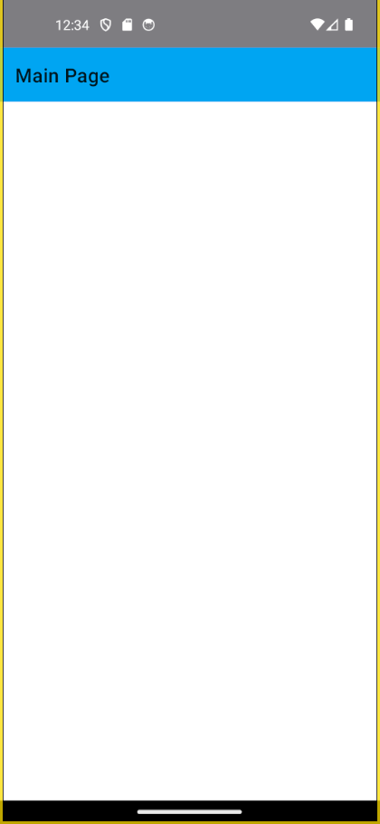
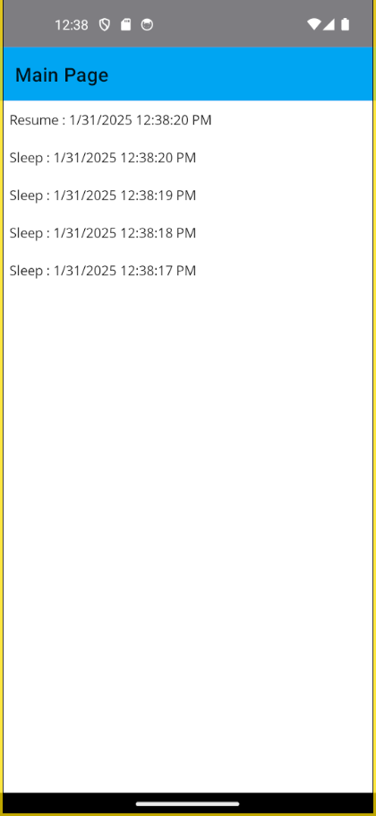

# .NET MAUI 偵測 App 是否進入到背景或休眠模式下


## 建立採用 Prism 開發框架的 MAUI 專案

* 打開 Visual Studio 2022 IDE 應用程式
* 從 [Visual Studio 2022] 對話窗中，點選右下方的 [建立新的專案] 按鈕
* 在 [建立新專案] 對話窗右半部
  * 切換 [所有語言 (L)] 下拉選單控制項為 [C#]
  * 切換 [所有專案類型 (T)] 下拉選單控制項為 [MAUI]
* 在中間的專案範本清單中，找到並且點選 [Vulcan Custom Prism .NET MAUI App] 專案範本選項
  
  >若沒有看到這個專案範本，請參考 [使用 Vulcan.Maui.Template 專案範本來進行 MAUI for Prism 專案開發](https://csharpkh.blogspot.com/2023/01/Create-First-MAUI-Project-By-Vulcan-Template.html) 文章，進行安裝這個專案範本到 Visual Studio 2022 內
* 點選右下角的 [下一步] 按鈕
* 在 [設定新的專案] 對話窗
* 在 [專案名稱] 欄位內輸入 `mauiSleepLifecycle` 做為這個專案名稱
* 請點選右下角的 [建立] 按鈕
* 此時，將會建立一個可以用於 MAUI 開發的專案

## 修正 MainPage 之 View & ViewModel
* 打開 [Views] 資料夾下的 [MainPage.xaml] 檔案
* 使用底下標記宣告替換掉這個原有檔案內容

```xml
<?xml version="1.0" encoding="utf-8" ?>
<ContentPage xmlns="http://schemas.microsoft.com/dotnet/2021/maui"
             xmlns:x="http://schemas.microsoft.com/winfx/2009/xaml"
             Title="{Binding Title}"
             x:Class="mauiSleepLifecycle.Views.MainPage"
             xmlns:viewModel="clr-namespace:mauiSleepLifecycle.ViewModels"
             x:DataType="viewModel:MainPageViewModel">

  <ScrollView>
        <CollectionView ItemsSource="{Binding Items}">
            <CollectionView.ItemTemplate>
                <DataTemplate>
                    <StackLayout Padding="10">
                        <Label Text="{Binding .}" />
                    </StackLayout>
                </DataTemplate>
            </CollectionView.ItemTemplate>
        </CollectionView>
    </ScrollView>

</ContentPage>
```

在這裡的 XAML 宣告標記中，我們使用了 CollectionView 來顯示一個清單，這個清單的內容是透過 ViewModel 的 Items 這個屬性來提供的。這裡將會顯示該裝置進入到休眠狀態與醒來的時間點。

* 打開 [ViewModels] 資料夾下的 MainPageViewModel.cs 檔案
* 使用底下程式碼替換掉這個原有檔案內容

```csharp
using CommunityToolkit.Mvvm.ComponentModel;
using CommunityToolkit.Mvvm.Input;
using Microsoft.Extensions.Logging;
using System.Collections.ObjectModel;

namespace mauiSleepLifecycle.ViewModels;

public partial class MainPageViewModel : ObservableObject, INavigatedAware, IApplicationLifecycleAware
{
    #region Field Member
    private int _count;
    private readonly INavigationService navigationService;
    private readonly ILogger<MainPageViewModel> logger;
    CancellationTokenSource cts;
    #endregion

    #region Property Member
    [ObservableProperty]
    string title = "Main Page";

    [ObservableProperty]
    string text = "Click me";

    [ObservableProperty]
    ObservableCollection<string> items = new ObservableCollection<string>();

    List<string> executionLogs = new List<string>();
    #endregion

    #region Constructor
    public MainPageViewModel(INavigationService navigationService,
        ILogger<MainPageViewModel> logger)
    {
        this.navigationService = navigationService;
        this.logger = logger;
    }
    #endregion

    #region Method Member
    #region Command Method
    [RelayCommand]
    private void Count()
    {
        _count++;
        if (_count == 1)
            Text = "Clicked 1 time";
        else if (_count > 1)
            Text = $"Clicked {_count} times";
    }
    #endregion

    #region Navigation Event
    public void OnNavigatedFrom(INavigationParameters parameters)
    {
    }

    public void OnNavigatedTo(INavigationParameters parameters)
    {
    }

    public void OnResume()
    {
        cts?.Cancel();
        executionLogs.Insert(0, $"Resume : {DateTime.Now.ToString()}");
        logger.LogInformation($"Resume : {DateTime.Now.ToString()}");
        Items.Clear();
        foreach (var log in executionLogs)
        {
            Items.Add(log);
        }
    }

    public async void OnSleep()
    {
        executionLogs.Clear();
        cts = new CancellationTokenSource();
        try
        {
            while (!cts.IsCancellationRequested)
            {
                executionLogs.Insert(0, $"Sleep : {DateTime.Now.ToString()}");
                logger.LogInformation($"Sleep : {DateTime.Now.ToString()}");
                await Task.Delay(1000, cts.Token);
            }
        }
        catch (Exception)
        {
        }
    }
    #endregion

    #region Other Method
    #endregion
    #endregion
}
```

在這個 ViewModel 中，實作的 [IApplicationLifecycleAware] 介面，並且在這個介面的方法中，分別實作了 [OnResume] 與 [OnSleep] 方法。這兩個方法將會在裝置進入到背景或休眠模式下時，被呼叫執行。透過這樣的設計，只有在這個頁面存在的時候，我們可以在這兩個方法中，進行一些必要的處理，例如：在進入到休眠模式下時，我們可以進行一些必要的資料儲存，或者是在進入到背景模式下時，我們可以進行一些必要的資料清理。

在 [OnSleep] 方法中，我們使用了一個 CancellationTokenSource 來控制一個無窮迴圈，這個無窮迴圈將會在這個裝置進入到休眠模式下時，持續執行。這個無窮迴圈的目的是為了讓我們可以在這個裝置進入到休眠模式下時，可以持續的紀錄這個裝置進入到休眠模式下的時間點。

在 [OnResume] 方法中，我們將會清除掉之前紀錄的時間點，並且將這些時間點重新顯示在這個頁面上。

## 執行與確認結果

* 底下是在 Android 模擬器內執行的結果



點擊模擬器上的 [電源] 按鈕，此時將會觸發這個正在執行中的應用程式進入到背景模式下，並且進入到休眠模式下。



等候一兩秒之後，再次點選模擬器上的 [電源] 按鈕，此時將會觸發這個正在執行中的應用程式進入到醒來模式下。

