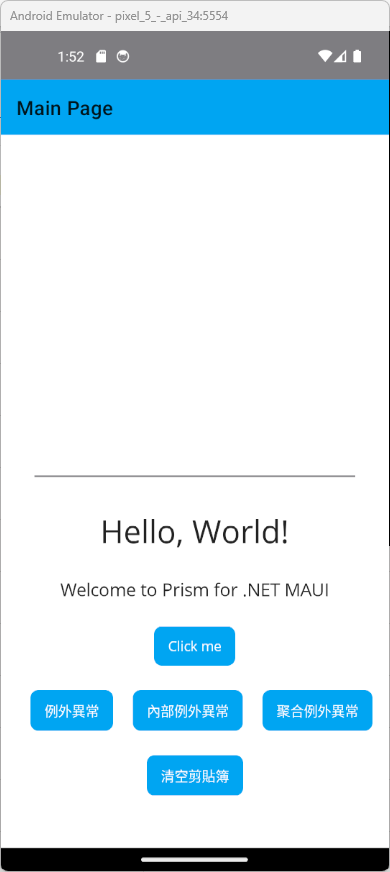
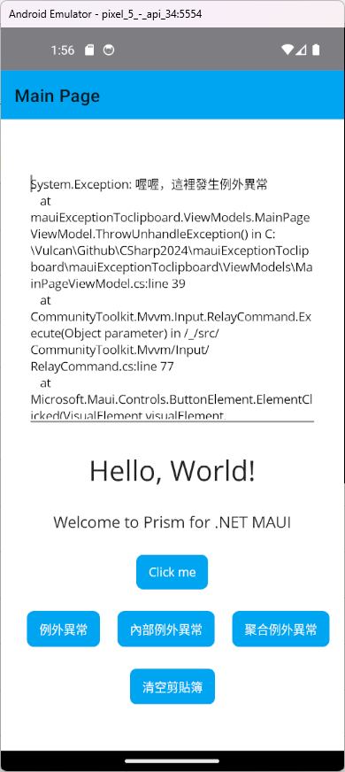

# .NET MAUI MAUI 捕捉到無法預期例外異常，並將其寫入剪貼簿


對於開發出來的軟體程式，在執行時期會有可能遭遇到不同的例外異常，這些例外異常可能是由於程式碼的錯誼、資料的錯誤、或是外部環境的問題所導致。而在傳統的桌機應用程式或者Web應用程式，面對到這樣的問題，可以透過 C# 內的 try-catch-finally 來進行例外異常的處理。

當捕說到例外異常物件後，便可以將該例外異常物件的資訊內容，寫入到當時執行主機上的檔案、資料庫、或是透過網路傳送到遠端的伺服器上。這樣的做法，可以讓開發者在程式發生問題時，可以透過這些例外異常的資訊內容，來進行問題的追蹤與解決。

面對這樣技術可能會在行動裝置類型的應用程式開發上遇到困境，這是因為若行動裝置遇到閃退的問題，雖然應用程式可以將例外異常資訊寫入到檔案或者透過網路傳送到遠端主機上，但是，若該應用程式一啟動就產生閃退問題，此時，根本沒有機會透過應用程式顯示出例外異常的 Log 資訊，更不用說透過其他工具將 Log 檔案將讀取出來；透過網路將 Log 寫到遠端主機也會面臨到因為行動網路的問題，導致無法將當時例外異常資訊寫入到遠端主機上。

若開發者無法透過有效的方式取得當時發生例外異常的資訊，便會很難判斷出真正發生原因的問題在哪裡，進行能夠在短時間內快速解決問題，這樣的問題將會對應用程式的品質與使用者的體驗造成很大的影響。

在 .NET MAUI 應用程式開發上，若要解決這樣的問題，可以透過將例外異常的資訊內容寫入到剪貼簿上，這樣的做法可以讓使用者在應用程式閃退時，可以透過手機的剪貼簿功能，將例外異常的資訊內容複製到其他地方，進行問題的追蹤與解決。例如，將這些例外異常詳細記錄，貼到電子郵件內，寄送給開發人員或者可以透過聊天軟體傳送給開發人員。

在這篇文章中，將會介紹如何在 .NET MAUI 應用程式開發上，透過 Prism 開發框架，來捕捉到無法預期的例外異常，並將其寫入到剪貼簿上，讓使用者可以透過手機的剪貼簿功能，將例外異常的資訊內容複製到其他地方，進行問題的追蹤與解決。

## 建立採用 Prism 開發框架的 MAUI 專案

* 打開 Visual Studio 2022 IDE 應用程式
* 從 [Visual Studio 2022] 對話窗中，點選右下方的 [建立新的專案] 按鈕
* 在 [建立新專案] 對話窗右半部
  * 切換 [所有語言 (L)] 下拉選單控制項為 [C#]
  * 切換 [所有專案類型 (T)] 下拉選單控制項為 [MAUI]
* 在中間的專案範本清單中，找到並且點選 [Vulcan Custom Prism .NET MAUI App] 專案範本選項
  
  >若沒有看到這個專案範本，請參考 [使用 Vulcan.Maui.Template 專案範本來進行 MAUI for Prism 專案開發](https://csharpkh.blogspot.com/2023/01/Create-First-MAUI-Project-By-Vulcan-Template.html) 文章，進行安裝這個專案範本到 Visual Studio 2022 內
* 點選右下角的 [下一步] 按鈕
* 在 [設定新的專案] 對話窗
* 在 [專案名稱] 欄位內輸入 `mauiExceptionToclipboard` 做為這個專案名稱
* 請點選右下角的 [建立] 按鈕
* 此時，將會建立一個可以用於 MAUI 開發的專案

## 修正 MainPage 之 View & ViewModel
* 打開 [Views] 資料夾下的 [MainPage.xaml] 檔案
* 使用底下標記宣告替換掉這個原有檔案內容

```xml
<?xml version="1.0" encoding="utf-8" ?>
<ContentPage xmlns="http://schemas.microsoft.com/dotnet/2021/maui"
             xmlns:x="http://schemas.microsoft.com/winfx/2009/xaml"
             Title="{Binding Title}"
             x:Class="mauiExceptionToclipboard.Views.MainPage"
             xmlns:viewModel="clr-namespace:mauiExceptionToclipboard.ViewModels"
             x:DataType="viewModel:MainPageViewModel">

    <ScrollView>
        <VerticalStackLayout
            Spacing="25"
            Padding="30,0"
            VerticalOptions="Center">

            <Editor HeightRequest="300"/>
            
            <Label Text="Hello, World!"
             SemanticProperties.HeadingLevel="Level1"
             FontSize="32"
             HorizontalOptions="Center" />

            <Label Text="Welcome to Prism for .NET MAUI"
             SemanticProperties.HeadingLevel="Level2"
             SemanticProperties.Description="Welcome to Prism for dot net Multi platform App U I"
             FontSize="18"
             HorizontalOptions="Center" />

            <Button Text="{Binding Text}"
              SemanticProperties.Hint="Counts the number of times you click"
              Command="{Binding CountCommand}"
              HorizontalOptions="Center" />

            <HorizontalStackLayout Spacing="20" HorizontalOptions="Center">
                <Button Text="例外異常" Command="{Binding ThrowUnhandleExceptionCommand}"/>
                <Button Text="內部例外異常" Command="{Binding ThrowUnhandleInnerExceptionCommand}"/>
                <Button Text="聚合例外異常" Command="{Binding ThrowUnhandleAggregateExceptionCommand}"/>
            </HorizontalStackLayout>

            <HorizontalStackLayout Spacing="20" HorizontalOptions="Center">
                <Button Text="清空剪貼簿" Command="{Binding CleanClipboardCommand}"/>
            </HorizontalStackLayout>

        </VerticalStackLayout>
    </ScrollView>

</ContentPage>
```

在這個頁面的標記宣告中，設計了四個按鈕，分別是用來觸發不同類型例外異常的按鈕，以及用來清空剪貼簿的按鈕。

另外，這裡也使用了 Editor 控制項，這個控制項是用來讓使用者可以將剪貼簿內的例外異常文字內容，貼到這個 Editor 控制項內，這樣可以讓使用者在發生例外異常時，可以將這些文字內容複製到剪貼簿上，進行問題的追蹤與解決。

* 打開 [ViewModels] 資料夾下的 MainPageViewModel.cs 檔案
* 使用底下程式碼替換掉這個原有檔案內容

```csharp
using CommunityToolkit.Mvvm.ComponentModel;
using CommunityToolkit.Mvvm.Input;

namespace mauiExceptionToclipboard.ViewModels;

public partial class MainPageViewModel : ObservableObject, INavigatedAware
{
    #region Field Member
    private int _count;
    private readonly INavigationService navigationService;

    #endregion

    #region Property Member
    [ObservableProperty]
    string title = "Main Page";

    [ObservableProperty]
    string text = "Click me";
    #endregion

    #region Constructor
    public MainPageViewModel(INavigationService navigationService)
    {
        this.navigationService = navigationService;
    }
    #endregion

    #region Method Member
    #region Command Method
    [RelayCommand]
    async Task CleanClipboard()
    {
        await Clipboard.Default.SetTextAsync(null);
    }
    [RelayCommand]
    void ThrowUnhandleException()
    {
        throw new Exception("喔喔，這裡發生例外異常");
    }

    [RelayCommand]
    void ThrowUnhandleAggregateException()
    {
        var exceptions = new List<Exception>();

        exceptions.Add(new ArgumentException("Argument Exception Message"));
        exceptions.Add(new NullReferenceException("Null Reference Exception Message"));

        throw new AggregateException("Aggregate Exception Message", exceptions);
    }

    [RelayCommand]
    void ThrowUnhandleInnerException()
    {
        try
        {
            throw new Exception("喔喔，這裡發生例外異常");
        }

        catch (ArgumentException e)
        {
            //make sure this path does not exist
            if (File.Exists("file://Bigsky//log.txt%22)%20==%20false") == false)
            {
                throw new FileNotFoundException("File Not found when trying to write argument exception to the file", e);
            }
        }
    }

    [RelayCommand]
    private void Count()
    {
        _count++;
        if (_count == 1)
            Text = "Clicked 1 time";
        else if (_count > 1)
            Text = $"Clicked {_count} times";
    }
    #endregion

    #region Navigation Event
    public void OnNavigatedFrom(INavigationParameters parameters)
    {
    }

    public void OnNavigatedTo(INavigationParameters parameters)
    {
    }
    #endregion

    #region Other Method
    #endregion
    #endregion
}
```

在這個 ViewModel 類別中，設計了四個按鈕的 Command 方法，分別是用來觸發不同類型例外異常的按鈕，以及用來清空剪貼簿的按鈕。

對於 [CleanClipboard()] 這個命令方法，將會使用 .NET MAUI 提供的 [平台功能](https://learn.microsoft.com/zh-tw/dotnet/maui/platform-integration/?view=net-maui-9.0&WT.mc_id=DT-MVP-5002220) 的 Clipboard 類別，來清空剪貼簿內的文字內容。這裡將會執行 `await Clipboard.Default.SetTextAsync(null);` 這行程式碼，來清空剪貼簿內的文字內容。

對於 [ThrowUnhandleException()] 這個命令方法，將會使用 `throw new Exception("喔喔，這裡發生例外異常");` 這行程式碼，來觸發一個例外異常。

對於 [ThrowUnhandleAggregateException()] 這個命令方法，將會使用 `throw new AggregateException("Aggregate Exception Message", exceptions);` 這行程式碼，來觸發一個聚合例外異常。

對於 [ThrowUnhandleInnerException()] 這個命令方法，將會使用 `throw new Exception("喔喔，這裡發生例外異常");` 這行程式碼，來觸發一個例外異常，並且在 catch 區塊內，再次觸發一個內部例外異常。

## 執行與確認結果

* 底下是在 Android 模擬器內執行的結果



現在可以點選 [例外異常] 按鈕，來觸發一個例外異常，這個例外異常將會被 Prism 捕捉到，並且將例外異常的資訊內容寫入到剪貼簿上。

不過此時，該 App 也因為這個例外異常產生了閃退問題，所以無法透過 App 來查看這個例外異常的資訊內容。

再次重新啟動該 App，並且將剪貼簿內的文字內容，貼到 Editor 控制項內，來查看這個例外異常的資訊內容。



底下將會是這個例外異常的資訊內容

```plaintext
System.Exception: 喔喔，這裡發生例外異常
   at mauiExceptionToclipboard.ViewModels.MainPageViewModel.ThrowUnhandleException() in C:\Vulcan\Github\CSharp2024\mauiExceptionToclipboard\mauiExceptionToclipboard\ViewModels\MainPageViewModel.cs:line 39
   at CommunityToolkit.Mvvm.Input.RelayCommand.Execute(Object parameter) in /_/src/CommunityToolkit.Mvvm/Input/RelayCommand.cs:line 77
   at Microsoft.Maui.Controls.ButtonElement.ElementClicked(VisualElement visualElement, IButtonElement ButtonElementManager) in /_/src/Controls/src/Core/Button/ButtonElement.cs:line 39
   at Microsoft.Maui.Controls.Button.SendClicked() in /_/src/Controls/src/Core/Button/Button.cs:line 250
   at Microsoft.Maui.Controls.Button.Microsoft.Maui.IButton.Clicked() in /_/src/Controls/src/Core/Button/Button.cs:line 484
   at Microsoft.Maui.Handlers.ButtonHandler.OnClick(IButton button, View v) in /_/src/Core/src/Handlers/Button/ButtonHandler.Android.cs:line 151
   at Microsoft.Maui.Handlers.ButtonHandler.ButtonClickListener.OnClick(View v) in /_/src/Core/src/Handlers/Button/ButtonHandler.Android.cs:line 172
   at Android.Views.View.IOnClickListenerInvoker.n_OnClick_Landroid_view_View_(IntPtr jnienv, IntPtr native__this, IntPtr native_v) in /Users/runner/work/1/s/xamarin-android/src/Mono.Android/obj/Release/net8.0/android-34/mcw/Android.Views.View.cs:line 2374
   at Android.Runtime.JNINativeWrapper.Wrap_JniMarshal_PPL_V(_JniMarshal_PPL_V callback, IntPtr jnienv, IntPtr klazz, IntPtr p0) in /Users/runner/work/1/s/xamarin-android/src/Mono.Android/Android.Runtime/JNINativeWrapper.g.cs:line 121
```
