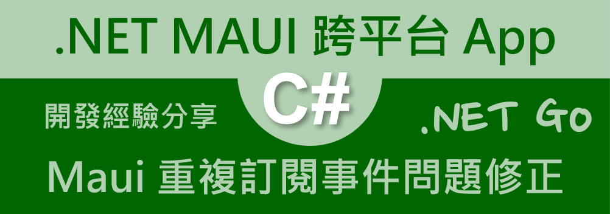
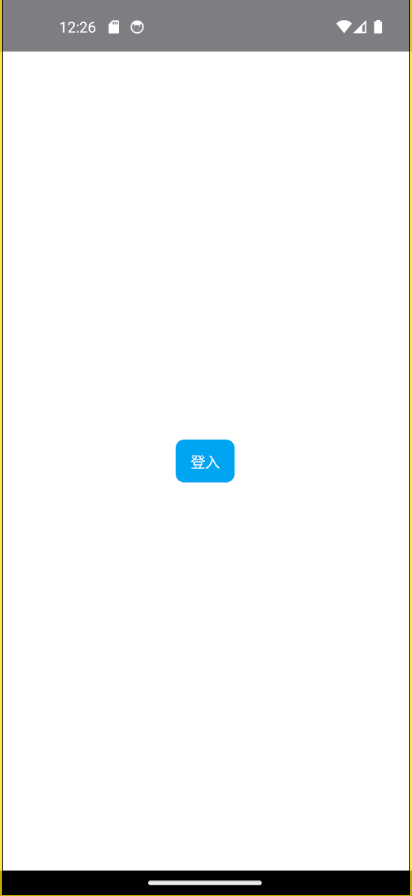
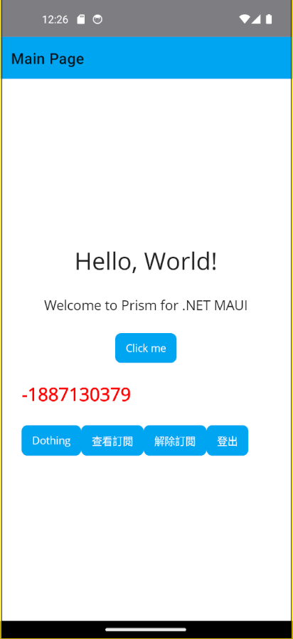
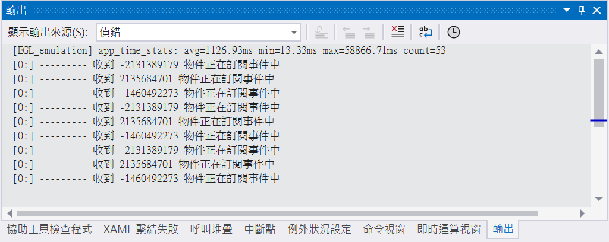
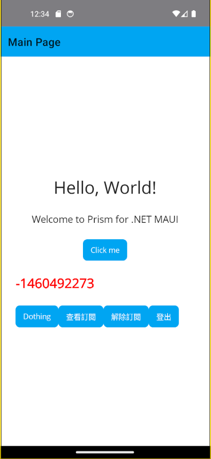

# Maui 重複訂閱事件的問題修正做法



在進行 .NET MAUI 專案開發的時候，經常會使用到 [MVVM 工具組 communitytoolkit](https://learn.microsoft.com/zh-tw/dotnet/communitytoolkit/mvvm/?WT.mc_id=DT-MVP-5002220) 的 [信使 messenger](https://learn.microsoft.com/zh-tw/dotnet/communitytoolkit/mvvm/messenger?WT.mc_id=DT-MVP-5002220) 功能，用來做到可用來在不同對象之間交換訊息。 這很適合用來分離應用程式的不同模組，而不需要保留所參考類型的強式參考。

當進入一個頁面 View 時，會註冊一個事件，當離開這個頁面 View 時，會解除這個事件的註冊。這樣的做法，可以避免事件的重複訂閱問題。若沒有這樣做，將會造成重複訂閱事件現象，這樣的問題，將會導致事件的處理方法被多次呼叫。

當要進行訂閱一個事件的時候，將會使用 [WeakReferenceMessenger.Default.Register] 這個方法，當要解除訂閱一個事件的時候，將會使用 [WeakReferenceMessenger.Default.Unregister] 這個方法。這兩個方法，都是用來註冊與解除註冊事件的。

若要針對已經訂閱的事件，進行觸法與執行，將會使用 [WeakReferenceMessenger.Default.Send] 這個方法。這個方法，是用來觸發與執行已經訂閱的事件。

為避免重複訂閱事件的問題發生，除了上述的做法之外，還可以使用 [GetHashCode] 這個方法，來取得物件的雜湊碼。這個雜湊碼，可以用來判斷是否為同一個物件。若是同一個物件，將不會重複訂閱事件，若不是同一個物件，將會重複訂閱事件。在這篇文章中，將會展示出因為設計不良，導致重複訂閱事件的問題，以及如何使用 [GetHashCode] 這個方法，來避免這個問題的發生。

## 建立採用 Prism 開發框架的 MAUI 專案

* 打開 Visual Studio 2022 IDE 應用程式
* 從 [Visual Studio 2022] 對話窗中，點選右下方的 [建立新的專案] 按鈕
* 在 [建立新專案] 對話窗右半部
  * 切換 [所有語言 (L)] 下拉選單控制項為 [C#]
  * 切換 [所有專案類型 (T)] 下拉選單控制項為 [MAUI]
* 在中間的專案範本清單中，找到並且點選 [Vulcan Custom Prism .NET MAUI App] 專案範本選項
  
  >若沒有看到這個專案範本，請參考 [使用 Vulcan.Maui.Template 專案範本來進行 MAUI for Prism 專案開發](https://csharpkh.blogspot.com/2023/01/Create-First-MAUI-Project-By-Vulcan-Template.html) 文章，進行安裝這個專案範本到 Visual Studio 2022 內
* 點選右下角的 [下一步] 按鈕
* 在 [設定新的專案] 對話窗
* 在 [專案名稱] 欄位內輸入 `mauiMessengerCommunication` 做為這個專案名稱
* 請點選右下角的 [建立] 按鈕
* 此時，將會建立一個可以用於 MAUI 開發的專案

## 建立 AskUnsubscripingRequest / AskUnsubscripingResponse 類別

為了要能夠使用到 [MVVM 工具組 communitytoolkit](https://learn.microsoft.com/zh-tw/dotnet/communitytoolkit/mvvm/?WT.mc_id=DT-MVP-5002220) 的 [信使 messenger](https://learn.microsoft.com/zh-tw/dotnet/communitytoolkit/mvvm/messenger?WT.mc_id=DT-MVP-5002220) 功能，這裡需要先設計這些事件要能夠訂閱與回應的類別，才能夠讓 MVVM 工具組的 Messenger 功能正常運作。通常來說，除了訂閱時候會設計一個 xxxRequest 的事件，還會設計一個 xxxResponse 的事件，這樣才能夠讓訂閱者知道事件的回應結果。

底下的兩個類別，將會用於註冊與請求要將重複的訂閱事件移除，只保持最後訂閱的事件即可。這樣的設計，可以避免事件的重複訂閱問題。

* 滑鼠右擊這個專案節點，也就是 [mauiMessengerCommunication] 名稱
* 從右鍵選單中，選擇 [新增資料夾] 選單指令
* 請在資料夾名稱欄位內輸入 `Events` 這個名稱
* 滑鼠右擊 [Events] 這個資料夾
* 從右鍵選單中，選擇 [新增類別] 選單指令
* 請在類別名稱欄位內輸入 `AskUnsubscripingRequest` 這個名稱
* 底下是完成後的 AskUnsubscripingRequest 類別內容

```csharp
namespace mauiMessengerCommunication.Events;

public class AskUnsubscripingRequest
{
    public int HashCode { get; set; }
}
```

設計這類事件的請求與回應類別，可以使用簡單的 POCO 類別即可，將所需要乘載的訊息設計成為屬性即可。這樣的設計，可以讓這些事件的訊息，可以被正確的傳遞與處理。

* 滑鼠右擊 [Events] 這個資料夾
* 從右鍵選單中，選擇 [新增類別] 選單指令
* 請在類別名稱欄位內輸入 `AskUnsubscripingResponse` 這個名稱
* 底下是完成後的 AskUnsubscripingResponse 類別內容

```csharp
namespace mauiMessengerCommunication.Events;

public class AskUnsubscripingResponse
{
    public int HashCode { get; set; }
    public bool IsUnsubscriping { get; set; }
}
```

## 建立 CheckSubscripingRequest / CheckSubscripingResponse 類別

這裡的事件類別，將會用於送出一個訊息給所有已經訂閱該事件擁有者，將並且將訊息顯示在 VS2022 除錯視窗內，透過觀察除錯事窗內的輸出內容，便可以知道該事件已經被訂閱幾次了。

* 滑鼠右擊這個專案節點，也就是 [mauiMessengerCommunication] 名稱
* 從右鍵選單中，選擇 [新增資料夾] 選單指令
* 請在資料夾名稱欄位內輸入 `Events` 這個名稱
* 滑鼠右擊 [Events] 這個資料夾
* 從右鍵選單中，選擇 [新增類別] 選單指令
* 請在類別名稱欄位內輸入 `CheckSubscripingRequest` 這個名稱
* 底下是完成後的 CheckSubscripingRequest 類別內容

```csharp
namespace mauiMessengerCommunication.Events;

public class CheckSubscripingRequest
{
}
```

* 滑鼠右擊 [Events] 這個資料夾
* 從右鍵選單中，選擇 [新增類別] 選單指令
* 請在類別名稱欄位內輸入 `CheckSubscripingResponse` 這個名稱
* 底下是完成後的 CheckSubscripingResponse 類別內容

```csharp
namespace mauiMessengerCommunication.Events;

public class CheckSubscripingResponse
{
    public int HashCode { get; set; }
}
```

## 建立 DoNothingRequest / DoNothingResponse 類別

這裡的事件類別將會如同上述事件類別相同。

* 滑鼠右擊這個專案節點，也就是 [mauiMessengerCommunication] 名稱
* 從右鍵選單中，選擇 [新增資料夾] 選單指令
* 請在資料夾名稱欄位內輸入 `Events` 這個名稱
* 滑鼠右擊 [Events] 這個資料夾
* 從右鍵選單中，選擇 [新增類別] 選單指令
* 請在類別名稱欄位內輸入 `DoNothingRequest` 這個名稱
* 底下是完成後的 DoNothingRequest 類別內容

```csharp
namespace mauiMessengerCommunication.Events;

public class DoNothingRequest
{
}
```

* 滑鼠右擊 [Events] 這個資料夾
* 從右鍵選單中，選擇 [新增類別] 選單指令
* 請在類別名稱欄位內輸入 `DoNothingResponse` 這個名稱
* 底下是完成後的 DoNothingResponse 類別內容

```csharp
namespace mauiMessengerCommunication.Events
{
    public class DoNothingResponse
    {
        public int HashCode { get; set; }
    }
}
```

## 修正 MainPage 之 View & ViewModel
* 打開 [Views] 資料夾下的 MainPage.xaml 檔案
* 使用底下標記宣告替換掉這個原有檔案內容

```xml
<?xml version="1.0" encoding="utf-8" ?>
<ContentPage xmlns="http://schemas.microsoft.com/dotnet/2021/maui"
             xmlns:x="http://schemas.microsoft.com/winfx/2009/xaml"
             Title="{Binding Title}"
             x:Class="mauiMessengerCommunication.Views.MainPage"
             xmlns:viewModel="clr-namespace:mauiMessengerCommunication.ViewModels"
             x:DataType="viewModel:MainPageViewModel">

    <ScrollView>
        <VerticalStackLayout
            Spacing="25"
            Padding="30,0"
            VerticalOptions="Center">

            <Label Text="Hello, World!"
             SemanticProperties.HeadingLevel="Level1"
             FontSize="32"
             HorizontalOptions="Center" />

            <Label Text="Welcome to Prism for .NET MAUI"
             SemanticProperties.HeadingLevel="Level2"
             SemanticProperties.Description="Welcome to Prism for dot net Multi platform App U I"
             FontSize="18"
             HorizontalOptions="Center" />

            <Button Text="{Binding Text}"
              SemanticProperties.Hint="Counts the number of times you click"
              Command="{Binding CountCommand}"
              HorizontalOptions="Center" />

            <Label Text="{Binding CurrentHashCode}"
                   FontSize="24"
                   TextColor="Red"
                   FontAttributes="Bold"/>

            <HorizontalStackLayout>
                <Button Text="Dothing" Command="{Binding DoNothingCommand}"/>
                <Button Text="查看訂閱" Command="{Binding CheckSubscriptionTimesCommand}"/>
                <Button Text="解除訂閱" Command="{Binding AskUnsubscriptionCommand}"/>
                <Button Text="登出" Command="{Binding LogoutCommand}"/>
            </HorizontalStackLayout>

        </VerticalStackLayout>
    </ScrollView>

</ContentPage>
```

在這個頁面，將會設計四個按鈕，分別是 Dothing、查看訂閱、解除訂閱、登出。這些按鈕，將會用來觸發事件，並且透過 MVVM 工具組的 Messenger 功能，來處理這些事件。

* 打開 [ViewModels] 資料夾下的 MainPageViewModel.cs 檔案
* 使用底下程式碼替換掉這個原有檔案內容

```csharp
using CommunityToolkit.Mvvm.ComponentModel;
using CommunityToolkit.Mvvm.Input;
using CommunityToolkit.Mvvm.Messaging;
using mauiMessengerCommunication.Events;
using System.Diagnostics;

namespace mauiMessengerCommunication.ViewModels;

public partial class MainPageViewModel : ObservableObject, INavigatedAware
{
    #region Field Member
    private int _count;
    private readonly INavigationService navigationService;
    CheckSubscripingRequest checkSubscripingRequest = new();
    #endregion

    #region Property Member
    [ObservableProperty]
    string title = "Main Page";

    [ObservableProperty]
    string text = "Click me";

    [ObservableProperty]
    int currentHashCode;

    #endregion

    #region Constructor
    public MainPageViewModel(INavigationService navigationService)
    {
        this.navigationService = navigationService;
        CurrentHashCode = this.GetHashCode();
    }
    #endregion

    #region Method Member
    #region Command Method
    [RelayCommand]
    void CheckSubscriptionTimes()
    {
        WeakReferenceMessenger.Default.Send<CheckSubscripingRequest>(checkSubscripingRequest);
    }
    [RelayCommand]
    void DoNothing()
    {
        WeakReferenceMessenger.Default.Send<DoNothingRequest>();
    }
    [RelayCommand]
    void Logout()
    {
        navigationService.NavigateAsync("/MyFirstPage");
    }
    [RelayCommand]
    void AskUnsubscription()
    {
        WeakReferenceMessenger.Default.Send<AskUnsubscripingRequest>(new AskUnsubscripingRequest()
        {
             HashCode = this.GetHashCode()
        });
    }
    [RelayCommand]
    private void Count()
    {
        _count++;
        if (_count == 1)
            Text = "Clicked 1 time";
        else if (_count > 1)
            Text = $"Clicked {_count} times";
    }

    #endregion

    #region Navigation Event
    public void OnNavigatedFrom(INavigationParameters parameters)
    {
    }

    public void OnNavigatedTo(INavigationParameters parameters)
    {
        WeakReferenceMessenger.Default
            .Register<DoNothingRequest>(this, (sender, message) =>
            {
                Debug.WriteLine($"--------- 收到 DoNothingRequest {this.GetHashCode()} 訂閱事件");
            });

        WeakReferenceMessenger.Default
            .Register<CheckSubscripingRequest>(this, (sender, MessageHandler) =>
        {
            var hashCodeSender = sender.GetHashCode();
            var hashCode = this.GetHashCode();
            WeakReferenceMessenger.Default.Send(new CheckSubscripingResponse { HashCode = hashCode });
        });

        WeakReferenceMessenger.Default
            .Register<CheckSubscripingResponse>(this, (sender, message) =>
            {
                Debug.WriteLine($"--------- 收到 {this.GetHashCode()} 物件正在訂閱事件中");
            });

        WeakReferenceMessenger.Default.Register<AskUnsubscripingRequest>(this, (sender, message) =>
        {
            var hashCodeSender = sender.GetHashCode();
            var hashCode = this.GetHashCode();
            if (hashCode != message.HashCode)
            {
                Debug.WriteLine($"準備要解除 {hashCodeSender} 的 DoNothing 事件訂閱");
                WeakReferenceMessenger.Default.Unregister<DoNothingRequest>(this);
            }
        });
    }
    #endregion

    #region Other Method
    #endregion
    #endregion
}
```

在這個 ViewModel 內，設計了四個按鈕的事件處理方法，分別是 Dothing、查看訂閱、解除訂閱、登出。這些按鈕的事件處理方法，將會透過 MVVM 工具組的 Messenger 功能，來處理這些事件。

當用戶進入到這個頁面之後，將會觸發 OnNavigatedTo 這個方法，這個方法內，將會註冊 DoNothingRequest、CheckSubscripingRequest、CheckSubscripingResponse、AskUnsubscripingRequest 這四個事件。這樣的設計，可以讓這些事件在用戶進入這個頁面時，可以正確的被訂閱。

但是，這樣的設計也會產生了其他問題，那就是沒有在來開這個頁面之前，將這些事件解除訂閱，將會造成事件重複訂閱的問題。這樣的問題，將會導致事件的處理方法被多次呼叫。

在 [Dothing] 這個按鈕命令委派方法內，將會觸發 DoNothingRequest 這個事件 [WeakReferenceMessenger.Default.Send<DoNothingRequest>();]，這個事件將會被訂閱者收到，並且在除錯視窗內顯示出來，這裡將會觸發 `Debug.WriteLine($"--------- 收到 DoNothingRequest {this.GetHashCode()} 訂閱事件");` 這個敘述。

在 [查看訂閱] 這個按鈕命令委派方法內，將會觸發 CheckSubscripingRequest 這個事件 [WeakReferenceMessenger.Default.Send<CheckSubscripingRequest>(checkSubscripingRequest);]，當這個查看訂閱的事件被觸發之後，所有的訂閱者將會執行底下程式碼，首先，將會取得觸發訂閱者與現在被執行訂閱者的雜湊碼，然後，將會觸發 CheckSubscripingResponse 這個事件 [WeakReferenceMessenger.Default.Send(new CheckSubscripingResponse { HashCode = hashCode });]，這個事件將會被訂閱者收到，並且在除錯視窗內顯示出來，這裡將會觸發 `Debug.WriteLine($"--------- 收到 {this.GetHashCode()} 物件正在訂閱事件中");` 這個敘述。

```csharp
var hashCodeSender = sender.GetHashCode();
var hashCode = this.GetHashCode();
WeakReferenceMessenger.Default.Send(new CheckSubscripingResponse { HashCode = hashCode });
```

在 [解除訂閱] 這個按鈕命令委派方法內，將會觸發 AskUnsubscripingRequest 這個事件 [WeakReferenceMessenger.Default.Unregister<DoNothingRequest>(this);]，這將會造成對於不論之前有訂閱過多少次的 [DoNothingRequest] 事件，經過這樣執行之後，就只會保留最後一次的事件訂閱，並且在除錯視窗內顯示出來，這裡將會觸發 `Debug.WriteLine($"準備要解除 {hashCodeSender} 的 DoNothing 事件訂閱");` 這個敘述。

在 [登出] 這個按鈕命令委派方法內，將會觸發 Logout 這個事件 [navigationService.NavigateAsync("/MyFirstPage");]，這個事件將會導航到 MyFirstPage 這個頁面。這樣的目的是可以讓使用者再度重複進入到這個頁面，透過 [OnNavigatedTo] 這個方法，來重新訂閱事件，造成重複事件訂閱的現象。

```csharp
var hashCodeSender = sender.GetHashCode();
var hashCode = this.GetHashCode();
if (hashCode != message.HashCode)
{
    Debug.WriteLine($"準備要解除 {hashCodeSender} 的 DoNothing 事件訂閱");
    WeakReferenceMessenger.Default.Unregister<DoNothingRequest>(this);
}
```

## 建立 MyFirstPage 之 View & ViewModel

接下來要來設計一個App啟動之後，要顯示的頁面

* 滑鼠右擊這個專案節點，也就是 [mauiMessengerCommunication] 名稱
* 從右鍵選單中，選擇 [開啟終端機] 選單指令
* 請在命令提示字元視窗內輸入 `dotnet new MVVMItem --namespace mauiMessengerCommunication --view-name MyFirstPage` 

### 修正 MyFirstPage 之 View & ViewModel

* 因為剛剛建立的 View & ViewModel 都是使用 ContentPage 這種類型，所以，需要修正這兩個檔案的內容，讓它們都改為使用 NavigationPage 這種類型
* 在 [Views] 資料夾下，找到並且打開 MyFirstPage.xaml 檔案
* 底下是完成後的 MyFirstPage.xaml 檔案內容

```xml
<?xml version="1.0" encoding="utf-8" ?>
<ContentPage xmlns="http://schemas.microsoft.com/dotnet/2021/maui"
             xmlns:x="http://schemas.microsoft.com/winfx/2009/xaml"
             xmlns:viewModels="clr-namespace:mauiMessengerCommunication.ViewModels"
             Title="Page Title"
             x:Class="mauiMessengerCommunication.Views.MyFirstPage"
             x:DataType="viewModels:MyFirstPageViewModel">

    <Grid>
        <Button Text="登入"
                Command="{Binding LoginCommand}"
                HorizontalOptions="Center" VerticalOptions="Center" />
    </Grid>

</ContentPage>
```

這個頁面只有一個按鈕，當用戶點擊這個按鈕時，將會觸發 LoginCommand 這個命令委派方法。

* 在 [ViewModels] 資料夾下，找到並且打開 MyFirstPageViewModel.cs 檔案
* 底下是完成後的 MyFirstPageViewModel.cs 檔案內容

```csharp
using CommunityToolkit.Mvvm.ComponentModel;
using CommunityToolkit.Mvvm.Input;

namespace mauiMessengerCommunication.ViewModels;

public partial class MyFirstPageViewModel : ObservableObject, INavigatedAware
{
    #region Field Member
    private readonly INavigationService navigationService;
    #endregion

    #region Property Member
    #endregion

    #region Constructor
    public MyFirstPageViewModel(INavigationService navigationService)
    {
        this.navigationService = navigationService;
    }
    #endregion

    #region Method Member
    #region Command Method
    [RelayCommand]
    async Task Login()
    {
        var naviResult = await navigationService.NavigateAsync("/NavigationPage/MainPage");
    }
    #endregion

    #region Navigation Event
    public void OnNavigatedFrom(INavigationParameters parameters)
    {
    }

    public void OnNavigatedTo(INavigationParameters parameters)
    {
    }
    #endregion

    #region Other Method
    #endregion
    #endregion
}
```

這個 ViewModel 內容，只有一個 LoginCommand 這個命令委派方法，當用戶點擊這個按鈕時，將會觸發這個命令委派方法，這個方法內容，將會導航到 MainPage 這個頁面。這樣的設計將會讓用戶可以進入到 MainPage 這個頁面之後，將會讓相關事件會在 OnNavigatedTo 這個方法內被訂閱。若使用者回到這個頁面之後，便可以重新再次進入到 MainPage 頁面，如此，將又會造成事件被重複訂閱。

### 對 DI 容器註冊 MyFirstPage 之 View & ViewModel

* 打開 [MauiProgram.cs] 檔案
* 找到 `container.RegisterForNavigation<MainPage, MainPageViewModel>();` 這行程式碼
* 在這行程式碼上加入這一行 `container.RegisterForNavigation<MyFirstPage, MyFirstPageViewModel>();`
* 找到 `.NavigateAsync` 這行程式碼
* 將這個方法改為 `.NavigateAsync("/MyFirstPage");`，這表示了，當這個應用程式啟動時，將會導航到 MyFirstPage 這個頁面

## 執行與確認結果

* 底下是在 Android 模擬器內執行的結果
  
* 點擊 [登入] 按鈕
  
* 在 [Main Page] 頁面內，點擊 [登出] 按鈕
* 在 [My First Page] 頁面內，點擊 [登入] 按鈕
* 在 [Main Page] 頁面內，點擊 [登出] 按鈕
* 在 [My First Page] 頁面內，點擊 [登入] 按鈕
* 在 [Main Page] 頁面內，點擊 [登出] 按鈕
* 在 [My First Page] 頁面內，點擊 [登入] 按鈕
* 在 [Main Page] 頁面內，點擊 [查看訂閱] 按鈕
* 此時在 VS2022 輸出視窗內將會有底下內容

  

```plaintext
[0:] --------- 收到 -2131389179 物件正在訂閱事件中
[0:] --------- 收到 2135684701 物件正在訂閱事件中
[0:] --------- 收到 -1460492273 物件正在訂閱事件中
[0:] --------- 收到 -2131389179 物件正在訂閱事件中
[0:] --------- 收到 2135684701 物件正在訂閱事件中
[0:] --------- 收到 -1460492273 物件正在訂閱事件中
[0:] --------- 收到 -2131389179 物件正在訂閱事件中
[0:] --------- 收到 2135684701 物件正在訂閱事件中
[0:] --------- 收到 -1460492273 物件正在訂閱事件中
```

這表示了，當重複進入到 Main Page 之後，造成了重複訂閱事件的問題，也就會在此看到有多個事件被同時觸發的問題

* 點選 [Dothing] 按鈕，將會看到底下的輸出內容

```plaintext
[0:] --------- 收到 DoNothingRequest -2131389179 訂閱事件
[0:] --------- 收到 DoNothingRequest 2135684701 訂閱事件
[0:] --------- 收到 DoNothingRequest -1460492273 訂閱事件
```

* 點選 [解除訂閱] 按鈕，將會看到底下的輸出內容

```plaintext
[0:] 準備要解除 -2131389179 的 DoNothing 事件訂閱
[0:] 準備要解除 2135684701 的 DoNothing 事件訂閱
```

在這裡看到只有兩個 Dothing 重複訂閱事件被解除訂閱了，這是因為，當前顯示的頁面也有訂閱該事件，而其 ViewModel 的 HashCode 為 -1460492273，所以，只有之前被登出的頁面這兩個事件被解除訂閱了。



* 現在，再度點選 [Dothing] 按鈕，此時在輸出視窗內，將會看到底下的輸出內容

```plaintext
[0:] --------- 收到 DoNothingRequest -1460492273 訂閱事件
```

經過了解除訂閱處理作法，現在對於 Dothing 這個事件，將僅會有一個事件訂閱者，也就是當前頁面。

## 結論

在這篇文章中，展示了如何使用 [WeakReferenceMessenger.Default.Register]、[WeakReferenceMessenger.Default.Unregister]、[WeakReferenceMessenger.Default.Send] 這三個方法，來註冊、解除註冊、觸發事件。這樣的設計，可以避免事件的重複訂閱問題。這樣的問題，將會導致事件的處理方法被多次呼叫。透過這樣的設計，可以讓事件的處理方法，只會被正確的呼叫一次。

