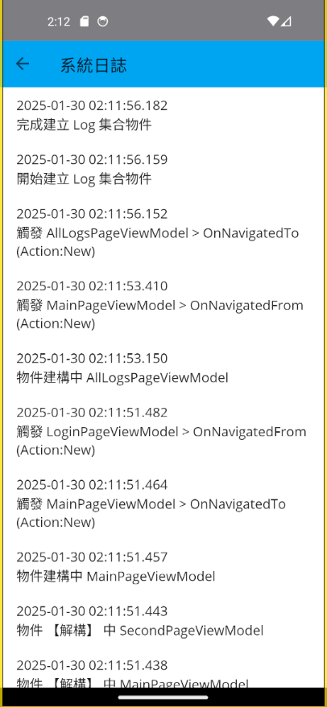

# 觀察 MAIU for Prism 的導航事件觸發時機


## 建立採用 Prism 開發框架的 MAUI 專案

* 打開 Visual Studio 2022 IDE 應用程式
* 從 [Visual Studio 2022] 對話窗中，點選右下方的 [建立新的專案] 按鈕
* 在 [建立新專案] 對話窗右半部
  * 切換 [所有語言 (L)] 下拉選單控制項為 [C#]
  * 切換 [所有專案類型 (T)] 下拉選單控制項為 [MAUI]
* 在中間的專案範本清單中，找到並且點選 [Vulcan Custom Prism .NET MAUI App] 專案範本選項
  
  >若沒有看到這個專案範本，請參考 [使用 Vulcan.Maui.Template 專案範本來進行 MAUI for Prism 專案開發](https://csharpkh.blogspot.com/2023/01/Create-First-MAUI-Project-By-Vulcan-Template.html) 文章，進行安裝這個專案範本到 Visual Studio 2022 內
* 點選右下角的 [下一步] 按鈕
* 在 [設定新的專案] 對話窗
* 在 [專案名稱] 欄位內輸入 `mauiPrismNavigationEventWatch` 做為這個專案名稱
* 請點選右下角的 [建立] 按鈕
* 此時，將會建立一個可以用於 MAUI 開發的專案

## 建立儲存事件狀態的 MessageItem 類別

* 滑鼠右擊這個專案節點，也就是 [mauiPrismNavigationEventWatch] 名稱
* 從右鍵選單中，選擇 [新增資料夾] 選單指令
* 請在資料夾名稱欄位內輸入 `Models` 這個名稱
* 滑鼠右擊 [Models] 這個資料夾
* 從右鍵選單中，選擇 [新增類別] 選單指令
* 請在類別名稱欄位內輸入 `MessageItem` 這個名稱
* 底下是完成後的 MessageItem 類別內容

```csharp
namespace mauiPrismNavigationEventCycle.Models;

public class MessageItem
{
    public string Message { get; set; }
}
```

## 建立記錄下事件發生的 CurrentLogSnapshotService 服務
* 滑鼠右擊這個專案節點，也就是 [mauiPrismNavigationEventWatch] 名稱
* 從右鍵選單中，選擇 [新增資料夾] 選單指令
* 請在資料夾名稱欄位內輸入 `Services` 這個名稱
* 滑鼠右擊 [Services] 這個資料夾
* 從右鍵選單中，選擇 [新增類別] 選單指令
* 請在類別名稱欄位內輸入 `CurrentLogSnapshotService` 這個名稱
* 底下是完成後的 CurrentLogSnapshotService 類別內容

```csharp
namespace mauiPrismNavigationEventCycle.Services;

public class CurrentLogSnapshotService
{
    public List<string> CurrentLogs { get; set; }

    object lockObject = new object();
    int keepLogsCount = 2000;
    public CurrentLogSnapshotService()
    {
        CurrentLogs = new List<string>();
    }

    public void AddLog(string log, Action<string> logHandler)
    {
        lock (lockObject)
        {
            log = MakeLogMessage(log);
            CurrentLogs.Insert(0, log);
            logHandler?.Invoke(log);

            if (CurrentLogs.Count > keepLogsCount)
            {
                var needRemoveItems = CurrentLogs.Count - keepLogsCount;
                for (int i = 0; i < needRemoveItems; i++)
                {
                    CurrentLogs.Remove(CurrentLogs.Last());
                }
            }
        }

    }

    string MakeLogMessage(string log)
    {
        return $"{DateTime.Now.ToString("yyyy-MM-dd HH:mm:ss.fff")}{Environment.NewLine}{log}";
    }
}
```

在這個類別中，將會有兩個方法，一個是 `AddLog` 方法，另一個是 `MakeLogMessage` 方法，這兩個方法的功能如下：

* `AddLog` 方法：這個方法是用來將事件發生的訊息，加入到 `CurrentLogs` 這個 List<string> 類型的屬性內，並且，這個方法會將這個訊息，透過 `logHandler` 這個 Action<string> 委派，傳遞給外部的事件處理方法
* 這裡透過了 [lock] 敘述，來保護 `CurrentLogs` 這個 List<string> 類型的屬性，避免多執行緒同時存取這個屬性，造成資料競爭的問題
* `MakeLogMessage` 方法：這個方法是用來將事件發生的訊息，加上日期時間字串，並且，加上換行字元，這樣，就可以讓這個訊息，可以在 Console 視窗內，有更好的顯示效果

## 註冊這個 CurrentLogSnapshotService 服務
* 打開 [MauiProgram.cs] 檔案
* 在這個檔案內，找到 `builder.Services.AddSingleton<MainPageViewModel>();` 這行程式碼
* 在這行程式碼的上面，加入這一行 `builder.Services.AddSingleton<CurrentLogSnapshotService>();`

## 建立 LoginPage 之 View & ViewModel

* 滑鼠右擊這個專案節點，也就是 [mauiPrismNavigationEventWatch] 名稱
* 從右鍵選單中，選擇 [開啟終端機] 選單指令
* 請在命令提示字元視窗內輸入 `dotnet new MVVMItem --namespace mauiPrismNavigationEventWatch --view-name LoginPage` 

  >這個命令將會在這個專案內的 Views 資料夾內產生 LoginPage.xaml / LoginPage.xaml.cs 這個 View 檔案
  >
  >另外，會在 ViewModels 資料夾內，產生 LoginPageViewModel.cs 這個 ViewModel 檔案
  >
  >這兩個 View 與 ViewModel 檔案，都已經有預設一些內容在裡面

### 修正 LoginPage 之 View & ViewModel

* 因為剛剛建立的 View & ViewModel 都是使用 ContentPage 這種類型，所以，需要修正這兩個檔案的內容，讓它們都改為使用 NavigationPage 這種類型
* 在 [Views] 資料夾下，找到並且打開 NaviPage.xaml 檔案
* 底下是完成後的 NaviPage.xaml 檔案內容

```xml
<?xml version="1.0" encoding="utf-8" ?>
<ContentPage xmlns="http://schemas.microsoft.com/dotnet/2021/maui"
             xmlns:x="http://schemas.microsoft.com/winfx/2009/xaml"
             xmlns:viewModels="clr-namespace:mauiPrismNavigationEventCycle.ViewModels"
             Title="登入"
             x:Class="mauiPrismNavigationEventCycle.Views.LoginPage"
             x:DataType="viewModels:LoginPageViewModel"
             NavigationPage.HasNavigationBar="False"
             BackgroundColor="HotPink">

    <Grid>
        <Button Text="身分驗證" 
                Command="{Binding LoginCommand}"
                VerticalOptions="Center" HorizontalOptions="Center"/>
    </Grid>

</ContentPage>
```

在這個 xaml 檔案中，將會描述了該頁面下，僅會有一個按鈕，透過 data binding 機制，將這個按鈕的 Command 屬性，綁定到 LoginPageViewModel 這個 ViewModel 內的 LoginCommand 這個 ICommand 類型的屬性上

* 在 [ViewModels] 資料夾下，找到並且打開 NaviPageViewModel.cs 檔案
* 底下是完成後的 NaviPageViewModel.cs 檔案內容

```csharp
using CommunityToolkit.Mvvm.ComponentModel;
using CommunityToolkit.Mvvm.Input;
using mauiPrismNavigationEventCycle.Services;
using Microsoft.Extensions.Logging;

namespace mauiPrismNavigationEventCycle.ViewModels;

public partial class LoginPageViewModel : ObservableObject, INavigatedAware
{
    #region Field Member
    #endregion

    #region Property Member
    private readonly INavigationService navigationService;
    private readonly ILogger<LoginPageViewModel> logger;
    private readonly CurrentLogSnapshotService currentLogSnapshotService;
    #endregion

    #region Constructor
    public LoginPageViewModel(INavigationService navigationService,
        ILogger<LoginPageViewModel> logger, 
        CurrentLogSnapshotService currentLogSnapshotService)
    {
        this.navigationService = navigationService;
        this.logger = logger;
        this.currentLogSnapshotService = currentLogSnapshotService;

        var message = $"物件建構中 {this.GetType().Name}";
        currentLogSnapshotService.AddLog($"{message}", message =>
        {
            logger.LogInformation(message);
        });
    }

    ~LoginPageViewModel()
    {
        var message = $"物件 【解構】 中 {this.GetType().Name}";
        currentLogSnapshotService.AddLog($"{message}", message =>
        {
            logger.LogInformation(message);
        });
    }
    #endregion

    #region Method Member
    #region Command Method
    [RelayCommand]
    private async Task LoginAsync()
    {
        var naviResult = await navigationService.NavigateAsync("/NavigationPage/MainPage");
    }
    #endregion

    #region Navigation Event
    public void OnNavigatedFrom(INavigationParameters parameters)
    {
        var message = $"觸發 {this.GetType().Name} > {nameof(OnNavigatedFrom)} " +
            $"(Action:{parameters.GetNavigationMode().ToString()})";
        currentLogSnapshotService.AddLog($"{message}", message=>
        {
            logger.LogInformation(message);
        });
    }

    public void OnNavigatedTo(INavigationParameters parameters)
    {
        var message = $"觸發 {this.GetType().Name} > {nameof(OnNavigatedTo)} " +
            $"(Action:{parameters.GetNavigationMode().ToString()})";
        currentLogSnapshotService.AddLog($"{message}", message =>
        {
            logger.LogInformation(message);
        });
    }
    #endregion

    #region Other Method
    #endregion
    #endregion
}
```

在這個 ViewModel 檔案中，將會有以下幾個部分的內容：
* LoginAsync 方法：這個方法是用來處理按鈕的 Command 屬性，當按鈕被按下時，這個方法將會觸發這個 ViewModel 的 LoginAsync 方法，這個方法內，將會透過 `navigationService` 這個 INavigationService 服務，來導航到 MainPage 這個頁面
* Constructor 方法：這個方法是用來初始化這個 ViewModel 的物件，這個方法內，將會透過 `currentLogSnapshotService` 這個 CurrentLogSnapshotService 服務，來記錄這個事件發生的訊息
* Destructor 方法：這個方法是用來釋放這個 ViewModel 的物件，這個方法內，將會透過 `currentLogSnapshotService` 這個 CurrentLogSnapshotService 服務，來記錄這個事件發生的訊息
* OnNavigatedFrom 方法：這個方法是用來處理當這個 ViewModel 從頁面上移除時，所要觸發的事件，這個方法內，將會透過 `currentLogSnapshotService` 這個 CurrentLogSnapshotService 服務，來記錄這個事件發生的訊息
* OnNavigatedTo 方法：這個方法是用來處理當這個 ViewModel 被加入到頁面上時，所要觸發的事件，這個方法內，將會透過 `currentLogSnapshotService` 這個 CurrentLogSnapshotService 服務，來記錄這個事件發生的訊息

### 對 DI 容器註冊 LoginPage 之 View & ViewModel

* 打開 [MauiProgram.cs] 檔案
* 找到 `container.RegisterForNavigation<MainPage, MainPageViewModel>();` 這行程式碼
* 在這行程式碼上加入這一行 `container.RegisterForNavigation<LoginPage, LoginPageViewModel>();`
* 找到 `.NavigateAsync` 這行程式碼
* 將這個方法改為 `.NavigateAsync("/LoginPage");`，這表示了，當這個應用程式啟動時，將會導航到 LoginPage 這個頁面

## 建立 MainPage 之 View & ViewModel

* 滑鼠右擊這個專案節點，也就是 [mauiPrismNavigationEventWatch] 名稱
* 從右鍵選單中，選擇 [開啟終端機] 選單指令
* 請在命令提示字元視窗內輸入 `dotnet new MVVMItem --namespace mauiPrismNavigationEventWatch --view-name MainPage` 

### 修正 MainPage 之 View & ViewModel

* 因為剛剛建立的 View & ViewModel 都是使用 ContentPage 這種類型，所以，需要修正這兩個檔案的內容，讓它們都改為使用 NavigationPage 這種類型
* 在 [Views] 資料夾下，找到並且打開 NaviPage.xaml 檔案
* 底下是完成後的 NaviPage.xaml 檔案內容

```xml
<?xml version="1.0" encoding="utf-8" ?>
<ContentPage xmlns="http://schemas.microsoft.com/dotnet/2021/maui"
             xmlns:x="http://schemas.microsoft.com/winfx/2009/xaml"
             Title="首頁"
             x:Class="mauiPrismNavigationEventCycle.Views.MainPage"
             xmlns:viewModel="clr-namespace:mauiPrismNavigationEventCycle.ViewModels"
             x:DataType="viewModel:MainPageViewModel">

    <ScrollView>
        <VerticalStackLayout
            Spacing="25"
            Padding="30,0"
            VerticalOptions="Center">

            <Image Source="prism.png"
             SemanticProperties.Description="Cute dot net bot waving hi to you!"
             HeightRequest="150"
             HorizontalOptions="Center" />

            <Label Text="Hello, World!"
             SemanticProperties.HeadingLevel="Level1"
             FontSize="32"
             HorizontalOptions="Center" />

            <Label Text="Welcome to Prism for .NET MAUI"
             SemanticProperties.HeadingLevel="Level2"
             SemanticProperties.Description="Welcome to Prism for dot net Multi platform App U I"
             FontSize="18"
             HorizontalOptions="Center" />

            <Button Text="{Binding Text}"
              SemanticProperties.Hint="Counts the number of times you click"
              Command="{Binding CountCommand}"
              HorizontalOptions="Center" />

            <HorizontalStackLayout
                VerticalOptions="Center" HorizontalOptions="Center">
                <Button Text="進入第二頁" 
                Command="{Binding GoToSecondPageCommand}"/>
                <Button Text="登出" 
                Command="{Binding LogoutCommand}"/>
                <Button Text="查看日誌" 
                Command="{Binding GoToAllLogsPageCommand}"/>
            </HorizontalStackLayout>
        </VerticalStackLayout>
    </ScrollView>

</ContentPage>
```

* 在這裡將會主要加入了 [HorizontalStackLayout] 這個區段
* 在這個區段內，將會有三個按鈕，分別是進入第二頁、登出、查看日誌
* 透過 data binding 機制，將這三個按鈕的 Command 屬性，綁定到 MainPageViewModel 這個 ViewModel 內的 GoToSecondPageCommand、LogoutCommand、GoToAllLogsPageCommand 這三個 ICommand 類型的屬性上

* 在 [ViewModels] 資料夾下，找到並且打開 NaviPageViewModel.cs 檔案
* 底下是完成後的 NaviPageViewModel.cs 檔案內容

```csharp
using CommunityToolkit.Mvvm.ComponentModel;
using CommunityToolkit.Mvvm.Input;
using mauiPrismNavigationEventCycle.Services;
using Microsoft.Extensions.Logging;

namespace mauiPrismNavigationEventCycle.ViewModels;

public partial class MainPageViewModel : ObservableObject, INavigatedAware
{
    #region Field Member
    private int _count;
    private readonly INavigationService navigationService;
    private readonly ILogger<LoginPageViewModel> logger;
    private readonly CurrentLogSnapshotService currentLogSnapshotService;
    [ObservableProperty]
    string title = "Main Page";

    [ObservableProperty]
    string text = "Click me";
    #endregion

    #region Property Member
    #endregion

    #region Constructor
    public MainPageViewModel(INavigationService navigationService,
        ILogger<LoginPageViewModel> logger,
        CurrentLogSnapshotService currentLogSnapshotService)
    {
        this.navigationService = navigationService;
        this.logger = logger;
        this.currentLogSnapshotService = currentLogSnapshotService;

        var message = $"物件建構中 {this.GetType().Name}";
        currentLogSnapshotService.AddLog($"{message}", message =>
        {
            logger.LogInformation(message);
        });
    }

    ~MainPageViewModel()
    {
        var message = $"物件 【解構】 中 {this.GetType().Name}";
        currentLogSnapshotService.AddLog($"{message}", message =>
        {
            logger.LogInformation(message);
        });
    }
    #endregion

    #region Method Member
    #region Command Method
    [RelayCommand]
    private void Count()
    {
        _count++;
        if (_count == 1)
            Text = "Clicked 1 time";
        else if (_count > 1)
            Text = $"Clicked {_count} times";
    }

    [RelayCommand]
    private async Task GoToSecondPageAsync()
    {
        var naviResult = await navigationService.NavigateAsync("SecondPage");
    }
    [RelayCommand]
    private async Task GoToAllLogsPageAsync()
    {
        var naviResult = await navigationService.NavigateAsync("AllLogsPage");
    }
    [RelayCommand]
    private async Task LogoutAsync()
    {
        var naviResult = await navigationService.NavigateAsync("/LoginPage");
    }
    #endregion

    #region Navigation Event
    public void OnNavigatedFrom(INavigationParameters parameters)
    {
        var message = $"觸發 {this.GetType().Name} > {nameof(OnNavigatedFrom)} " +
            $"(Action:{parameters.GetNavigationMode().ToString()})";
        currentLogSnapshotService.AddLog($"{message}", message =>
        {
            logger.LogInformation(message);
        });
    }

    public void OnNavigatedTo(INavigationParameters parameters)
    {
        var message = $"觸發 {this.GetType().Name} > {nameof(OnNavigatedTo)} " +
            $"(Action:{parameters.GetNavigationMode().ToString()})";
        currentLogSnapshotService.AddLog($"{message}", message =>
        {
            logger.LogInformation(message);
        });
    }
    #endregion

    #region Other Method
    #endregion
    #endregion
}
```

* 在這個 ViewModel 檔案中，將會有以下幾個部分的內容：
* GoToSecondPageAsync 方法：這個方法是用來處理按鈕的 Command 屬性，當按鈕被按下時，這個方法將會觸發這個 ViewModel 的 GoToSecondPageAsync 方法，這個方法內，將會透過 `navigationService` 這個 INavigationService 服務，來導航到 SecondPage 這個頁面
* GoToAllLogsPageAsync 方法：這個方法是用來處理按鈕的 Command 屬性，當按鈕被按下時，這個方法將會觸發這個 ViewModel 的 GoToAllLogsPageAsync 方法，這個方法內，將會透過 `navigationService` 這個 INavigationService 服務，來導航到 AllLogsPage 這個頁面
* LogoutAsync 方法：這個方法是用來處理按鈕的 Command 屬性，當按鈕被按下時，這個方法將會觸發這個 ViewModel 的 LogoutAsync 方法，這個方法內，將會透過 `navigationService` 這個 INavigationService 服務，來導航到 LoginPage 這個頁面
* Constructor 方法：這個方法是用來初始化這個 ViewModel 的物件，這個方法內，將會透過 `currentLogSnapshotService` 這個 CurrentLogSnapshotService 服務，來記錄這個事件發生的訊息
* Destructor 方法：這個方法是用來釋放這個 ViewModel 的物件，這個方法內，將會透過 `currentLogSnapshotService` 這個 CurrentLogSnapshotService 服務，來記錄這個事件發生的訊息
* OnNavigatedFrom 方法：這個方法是用來處理當這個 ViewModel 從頁面上移除時，所要觸發的事件，這個方法內，將會透過 `currentLogSnapshotService` 這個 CurrentLogSnapshotService 服務，來記錄這個事件發生的訊息
* OnNavigatedTo 方法：這個方法是用來處理當這個 ViewModel 被加入到頁面上時，所要觸發的事件，這個方法內，將會透過 `currentLogSnapshotService` 這個 CurrentLogSnapshotService 服務，來記錄這個事件發生的訊息

### 對 DI 容器註冊 MainPage 之 View & ViewModel

* 打開 [MauiProgram.cs] 檔案
* 找到 `container.RegisterForNavigation<MainPage, MainPageViewModel>();` 這行程式碼
* 在這行程式碼上加入這一行 `container.RegisterForNavigation<MainPage, MainPageViewModel>();`

## 建立 SecondPage 之 View & ViewModel

* 滑鼠右擊這個專案節點，也就是 [mauiPrismNavigationEventWatch] 名稱
* 從右鍵選單中，選擇 [開啟終端機] 選單指令
* 請在命令提示字元視窗內輸入 `dotnet new MVVMItem --namespace mauiPrismNavigationEventWatch --view-name SecondPage` 

### 修正 SecondPage 之 View & ViewModel

* 因為剛剛建立的 View & ViewModel 都是使用 ContentPage 這種類型，所以，需要修正這兩個檔案的內容，讓它們都改為使用 NavigationPage 這種類型
* 在 [Views] 資料夾下，找到並且打開 NaviPage.xaml 檔案
* 底下是完成後的 NaviPage.xaml 檔案內容

```xml
<?xml version="1.0" encoding="utf-8" ?>
<ContentPage xmlns="http://schemas.microsoft.com/dotnet/2021/maui"
             xmlns:x="http://schemas.microsoft.com/winfx/2009/xaml"
             xmlns:viewModels="clr-namespace:mauiPrismNavigationEventCycle.ViewModels"
             Title="第二個頁面"
             x:Class="mauiPrismNavigationEventCycle.Views.SecondPage"
             x:DataType="viewModels:SecondPageViewModel"
             BackgroundColor="LightYellow">

  <Grid>
        <HorizontalStackLayout
                VerticalOptions="Center" HorizontalOptions="Center">
            <Button Text="返回 Back" 
                Command="{Binding GoBackCommand}"/>
            <Button Text="導航進首頁 Back" 
                Command="{Binding GoHomeCommand}"/>
        </HorizontalStackLayout>
    </Grid>

</ContentPage>
```

在這個 xaml 檔案中，將會描述了該頁面下，僅會有一個按鈕，透過 data binding 機制，將這個按鈕的 Command 屬性，綁定到 SecondPageViewModel 這個 ViewModel 內的 GoBackCommand、GoHomeCommand 這兩個 ICommand 類型的屬性上

* 在 [ViewModels] 資料夾下，找到並且打開 NaviPageViewModel.cs 檔案
* 底下是完成後的 NaviPageViewModel.cs 檔案內容

```csharp
using CommunityToolkit.Mvvm.ComponentModel;
using CommunityToolkit.Mvvm.Input;
using mauiPrismNavigationEventCycle.Services;
using Microsoft.Extensions.Logging;

namespace mauiPrismNavigationEventCycle.ViewModels;

public partial class SecondPageViewModel : ObservableObject, INavigatedAware
{
    #region Field Member
    #endregion

    #region Property Member
    private readonly INavigationService navigationService;
    private readonly ILogger<LoginPageViewModel> logger;
    private readonly CurrentLogSnapshotService currentLogSnapshotService;
    #endregion

    #region Constructor
    public SecondPageViewModel(INavigationService navigationService,
        ILogger<LoginPageViewModel> logger,
        CurrentLogSnapshotService currentLogSnapshotService)
    {
        this.navigationService = navigationService;
        this.logger = logger;
        this.currentLogSnapshotService = currentLogSnapshotService;

        var message = $"物件建構中 {this.GetType().Name}";
        currentLogSnapshotService.AddLog($"{message}", message =>
        {
            logger.LogInformation(message);
        });
    }

    ~SecondPageViewModel()
    {
        var message = $"物件 【解構】 中 {this.GetType().Name}";
        currentLogSnapshotService.AddLog($"{message}", message =>
        {
            logger.LogInformation(message);
        });
    }
    #endregion

    #region Method Member
    #region Command Method
    [RelayCommand]
    private async Task GoBackAsync()
    {
        var naviResult = await navigationService.GoBackAsync();
    }
    [RelayCommand]
    private async Task GoHomeAsync()
    {
        var naviResult = await navigationService.NavigateAsync("/NavigationPage/MainPage");
    }
    #endregion

    #region Navigation Event
    public void OnNavigatedFrom(INavigationParameters parameters)
    {
        var message = $"觸發 {this.GetType().Name} > {nameof(OnNavigatedFrom)} " +
            $"(Action:{parameters.GetNavigationMode().ToString()})";
        currentLogSnapshotService.AddLog($"{message}", message =>
        {
            logger.LogInformation(message);
        });
    }

    public void OnNavigatedTo(INavigationParameters parameters)
    {
        var message = $"觸發 {this.GetType().Name} > {nameof(OnNavigatedTo)} " +
            $"(Action:{parameters.GetNavigationMode().ToString()})";
        currentLogSnapshotService.AddLog($"{message}", message =>
        {
            logger.LogInformation(message);
        });
    }
    #endregion

    #region Other Method
    #endregion
    #endregion
}
```

在這個 ViewModel 檔案中，將會有以下幾個部分的內容：
* GoBackAsync 方法：這個方法是用來處理按鈕的 Command 屬性，當按鈕被按下時，這個方法將會觸發這個 ViewModel 的 GoBackAsync 方法，這個方法內，將會透過 `navigationService` 這個 INavigationService 服務，來導航到上一個頁面
* GoHomeAsync 方法：這個方法是用來處理按鈕的 Command 屬性，當按鈕被按下時，這個方法將會觸發這個 ViewModel 的 GoHomeAsync 方法，這個方法內，將會透過 `navigationService` 這個 INavigationService 服務，來導航到 MainPage 這個頁面
* Constructor 方法：這個方法是用來初始化這個 ViewModel 的物件，這個方法內，將會透過 `currentLogSnapshotService` 這個 CurrentLogSnapshotService 服務，來記錄這個事件發生的訊息
* Destructor 方法：這個方法是用來釋放這個 ViewModel 的物件，這個方法內，將會透過 `currentLogSnapshotService` 這個 CurrentLogSnapshotService 服務，來記錄這個事件發生的訊息
* OnNavigatedFrom 方法：這個方法是用來處理當這個 ViewModel 從頁面上移除時，所要觸發的事件，這個方法內，將會透過 `currentLogSnapshotService` 這個 CurrentLogSnapshotService 服務，來記錄這個事件發生的訊息
* OnNavigatedTo 方法：這個方法是用來處理當這個 ViewModel 被加入到頁面上時，所要觸發的事件，這個方法內，將會透過 `currentLogSnapshotService` 這個 CurrentLogSnapshotService 服務，來記錄這個事件發生的訊息

### 對 DI 容器註冊 SecondPage 之 View & ViewModel

* 打開 [MauiProgram.cs] 檔案
* 找到 `container.RegisterForNavigation<MainPage, MainPageViewModel>();` 這行程式碼
* 在這行程式碼上加入這一行 `container.RegisterForNavigation<SecondPage, SecondPageViewModel>();`

## 建立 AllLogsPage 之 View & ViewModel

* 滑鼠右擊這個專案節點，也就是 [mauiPrismNavigationEventWatch] 名稱
* 從右鍵選單中，選擇 [開啟終端機] 選單指令
* 請在命令提示字元視窗內輸入 `dotnet new MVVMItem --namespace mauiPrismNavigationEventWatch --view-name AllLogsPage` 

### 修正 AllLogsPage 之 View & ViewModel

* 因為剛剛建立的 View & ViewModel 都是使用 ContentPage 這種類型，所以，需要修正這兩個檔案的內容，讓它們都改為使用 NavigationPage 這種類型
* 在 [Views] 資料夾下，找到並且打開 NaviPage.xaml 檔案
* 底下是完成後的 NaviPage.xaml 檔案內容

```xml
<?xml version="1.0" encoding="utf-8" ?>
<ContentPage xmlns="http://schemas.microsoft.com/dotnet/2021/maui"
             xmlns:x="http://schemas.microsoft.com/winfx/2009/xaml"
             xmlns:viewModels="clr-namespace:mauiPrismNavigationEventCycle.ViewModels"
             xmlns:model="clr-namespace:mauiPrismNavigationEventCycle.Models"
             Title="系統日誌"
             x:Class="mauiPrismNavigationEventCycle.Views.AllLogsPage"
             x:DataType="viewModels:AllLogsPageViewModel">

    <Grid>
        <CollectionView ItemsSource="{Binding MessageItems}" >
            <CollectionView.ItemTemplate>
                <DataTemplate x:DataType="model:MessageItem">
                    <VerticalStackLayout>
                        <Label Text="{Binding Message}"
                               FontSize="16"
                               LineBreakMode="WordWrap"
                               Margin="20,10"/>
                    </VerticalStackLayout>
                </DataTemplate>
            </CollectionView.ItemTemplate>
        </CollectionView>
    </Grid>

</ContentPage>
```

在這個頁面，使用了一個 [CollectionView] 控制項，這個控制項內，使用了一個 [DataTemplate] 控制項，這個控制項內，使用了一個 [VerticalStackLayout] 控制項，這個控制項內，使用了一個 [Label] 控制項，這個控制項內，透過 data binding 機制，將這個 Label 控制項的 Text 屬性，綁定到 AllLogsPageViewModel 這個 ViewModel 內的 MessageItems 這個 ObservableCollection<MessageItem> 類型的屬性上，也就是要將所有事件訊息，顯示在這個頁面上

* 在 [ViewModels] 資料夾下，找到並且打開 NaviPageViewModel.cs 檔案
* 底下是完成後的 NaviPageViewModel.cs 檔案內容

```csharp
using Android.Util;
using CommunityToolkit.Mvvm.ComponentModel;
using CommunityToolkit.Mvvm.Input;
using mauiPrismNavigationEventCycle.Models;
using mauiPrismNavigationEventCycle.Services;
using Microsoft.Extensions.Logging;
using System.Collections.ObjectModel;

namespace mauiPrismNavigationEventCycle.ViewModels;

public partial class AllLogsPageViewModel : ObservableObject, INavigatedAware
{
    #region Field Member
    #endregion

    #region Property Member
    private readonly INavigationService navigationService;
    private readonly ILogger<LoginPageViewModel> logger;
    private readonly CurrentLogSnapshotService currentLogSnapshotService;

    [ObservableProperty]
    ObservableCollection<MessageItem> messageItems = new ObservableCollection<MessageItem>();
    #endregion

    #region Constructor
    public AllLogsPageViewModel(INavigationService navigationService,
        ILogger<LoginPageViewModel> logger,
        CurrentLogSnapshotService currentLogSnapshotService)
    {
        this.navigationService = navigationService;
        this.logger = logger;
        this.currentLogSnapshotService = currentLogSnapshotService;

        var message = $"物件建構中 {this.GetType().Name}";
        currentLogSnapshotService.AddLog($"{message}", message =>
        {
            logger.LogInformation(message);
        });
    }

    ~AllLogsPageViewModel()
    {
        var message = $"物件 【解構】 中 {this.GetType().Name}";
        currentLogSnapshotService.AddLog($"{message}", message =>
        {
            logger.LogInformation(message);
        });
    }
    #endregion

    #region Method Member
    #region Command Method
    #endregion

    #region Navigation Event
    public void OnNavigatedFrom(INavigationParameters parameters)
    {
        var message = $"觸發 {this.GetType().Name} > {nameof(OnNavigatedFrom)} " +
            $"(Action:{parameters.GetNavigationMode().ToString()})";
        currentLogSnapshotService.AddLog($"{message}", message =>
        {
            logger.LogInformation(message);
        });
    }

    public void OnNavigatedTo(INavigationParameters parameters)
    {
        var message = $"觸發 {this.GetType().Name} > {nameof(OnNavigatedTo)} " +
            $"(Action:{parameters.GetNavigationMode().ToString()})";
        currentLogSnapshotService.AddLog($"{message}", message =>
        {
            logger.LogInformation(message);
        });

        message = $"開始建立 Log 集合物件";
        currentLogSnapshotService.AddLog($"{message}", message =>
        {
            logger.LogInformation(message);
        });

        List<MessageItem> items = new List<MessageItem>();
        foreach (var item in currentLogSnapshotService.CurrentLogs)
        {
            var log = new MessageItem()
            {
                Message = item
            };
            //items.Add(log);
            MessageItems.Add(log);
        }
        //MessageItems = new ObservableCollection<MessageItem>(items);
        message = $"完成建立 Log 集合物件";
        currentLogSnapshotService.AddLog($"{message}", message =>
        {
            logger.LogInformation(message);
        });
        var foo = $"{DateTime.Now.ToString("yyyy-MM-dd HH:mm:ss.fff")}{Environment.NewLine}{message}";
        MessageItems.Insert(0, new MessageItem()
        {
            Message = foo
        });
    }
    #endregion

    #region Other Method
    #endregion
    #endregion
}
```

在這個 ViewModel 檔案中，將會有以下幾個部分的內容：
* OnNavigatedTo 方法：這個方法是用來處理當這個 ViewModel 被加入到頁面上時，所要觸發的事件，這個方法內，將會透過 `currentLogSnapshotService` 這個 CurrentLogSnapshotService 服務，來記錄這個事件發生的訊息
* OnNavigatedTo 方法：這個方法是用來處理當這個 ViewModel 被加入到頁面上時，所要觸發的事件，這個方法內，將會透過 `currentLogSnapshotService` 這個 CurrentLogSnapshotService 服務，來記錄這個事件發生的訊息，並且將所有的事件訊息，加入到 MessageItems 這個 ObservableCollection<MessageItem> 類型的屬性上
* Constructor 方法：這個方法是用來初始化這個 ViewModel 的物件，這個方法內，將會透過 `currentLogSnapshotService` 這個 CurrentLogSnapshotService 服務，來記錄這個事件發生的訊息
* Destructor 方法：這個方法是用來釋放這個 ViewModel 的物件，這個方法內，將會透過 `currentLogSnapshotService` 這個 CurrentLogSnapshotService 服務，來記錄這個事件發生的訊息

## 執行與確認結果

* 底下是在 Android 模擬器內執行的結果
  
* 點選這個 App 啟動所顯示第一個頁面上的 [身分驗證] 按鈕
* 點選這個按鈕後，將會導航到第二個頁面上
  
* 點選這個頁面上的 [進入第二頁面] 按鈕
* 點選這個按鈕後，將會導航到第二個頁面上
  
* 點選這個頁面上的 [返回 Back] 按鈕
* 點選這個按鈕後，將會導航到上一個頁面上
  
* 點選這個頁面上的 [登出] 按鈕
* 點選這個按鈕後，將會導航到登入頁面上
* 在此頁面上點選 [身分驗證] 按鈕，將會導航到第二個頁面上
* 點選這個頁面上的 [查看日誌] 按鈕
* 點選這個按鈕後，將會導航到日誌頁面上
  
  
  
* 以下是執行結果且關於個觸發生命週期事件的執行時間點

```plaintext
2025-01-30 02:11:56.182
完成建立 Log 集合物件

2025-01-30 02:11:56.159
開始建立 Log 集合物件

2025-01-30 02:11:56.152
觸發 AllLogsPageViewModel > OnNavigatedTo (Action:New)

2025-01-30 02:11:53.410
觸發 MainPageViewModel > OnNavigatedFrom (Action:New)

2025-01-30 02:11:53.150
物件建構中 AllLogsPageViewModel

2025-01-30 02:11:51.482
觸發 LoginPageViewModel > OnNavigatedFrom (Action:New)

2025-01-30 02:11:51.464
觸發 MainPageViewModel > OnNavigatedTo (Action:New)

2025-01-30 02:11:51.457
物件建構中 MainPageViewModel

2025-01-30 02:11:51.443
物件【解構】中 SecondPageViewModel

2025-01-30 02:11:51.438
物件【解構】中 MainPageViewModel

2025-01-30 02:11:49.912
觸發 LoginPageViewModel > OnNavigatedTo (Action:New)

2025-01-30 02:11:49.907
觸發 MainPageViewModel > OnNavigatedFrom (Action:New)

2025-01-30 02:11:49.882
物件建構中 LoginPageViewModel

2025-01-30 02:11:47.615
觸發 MainPageViewModel > OnNavigatedTo (Action:Back)

2025-01-30 02:11:47.610
觸發 SecondPageViewModel > OnNavigatedFrom (Action:Back)

2025-01-30 02:11:43.583
觸發 SecondPageViewModel > OnNavigatedTo (Action:New)

2025-01-30 02:11:43.577
觸發 MainPageViewModel > OnNavigatedFrom (Action:New)

2025-01-30 02:11:43.363
物件建構中 SecondPageViewModel

2025-01-30 02:11:40.678
觸發 LoginPageViewModel > OnNavigatedFrom (Action:New)

2025-01-30 02:11:40.610
觸發 MainPageViewModel > OnNavigatedTo (Action:New)

2025-01-30 02:11:40.600
物件建構中 MainPageViewModel

2025-01-30 02:11:33.866
觸發 LoginPageViewModel > OnNavigatedTo (Action:New)

2025-01-30 02:11:33.660
物件建構中 LoginPageViewModel
```

以下是對這些日誌的詳細分析：

## **1. 應用程式啟動（載入 LoginPage）**
```
2025-01-30 02:11:33.660
物件建構中 LoginPageViewModel

2025-01-30 02:11:33.866
觸發 LoginPageViewModel > OnNavigatedTo (Action:New)
```
- **應用程式啟動**，初始化 `LoginPageViewModel`。
- `OnNavigatedTo (Action:New)` 表示 **登入頁面被載入並進入前景**。

## **2. 從 LoginPage 進入 MainPage**
```
2025-01-30 02:11:40.600
物件建構中 MainPageViewModel

2025-01-30 02:11:40.610
觸發 MainPageViewModel > OnNavigatedTo (Action:New)

2025-01-30 02:11:40.678
觸發 LoginPageViewModel > OnNavigatedFrom (Action:New)
```
- **登入成功，導航到 MainPage**：
  - `MainPageViewModel` **初始化**。
  - `OnNavigatedTo (Action:New)` 表示 `MainPage` 被載入。
  - `LoginPageViewModel > OnNavigatedFrom`，說明 `LoginPage` **進入背景或被銷毀**。

## **3. 從 MainPage 進入 SecondPage**
```
2025-01-30 02:11:43.363
物件建構中 SecondPageViewModel

2025-01-30 02:11:43.577
觸發 MainPageViewModel > OnNavigatedFrom (Action:New)

2025-01-30 02:11:43.583
觸發 SecondPageViewModel > OnNavigatedTo (Action:New)
```
- **從 `MainPage` 進入 `SecondPage`**：
  - `SecondPageViewModel` **被建立**。
  - `MainPageViewModel > OnNavigatedFrom`，`MainPage` 進入背景。
  - `SecondPageViewModel > OnNavigatedTo`，`SecondPage` **開始顯示**。

## **4. 從 SecondPage 返回 MainPage**
```
2025-01-30 02:11:47.610
觸發 SecondPageViewModel > OnNavigatedFrom (Action:Back)

2025-01-30 02:11:47.615
觸發 MainPageViewModel > OnNavigatedTo (Action:Back)
```
- **使用者按返回鍵，回到 `MainPage`**：
  - `SecondPageViewModel > OnNavigatedFrom (Action:Back)`，`SecondPage` 進入背景或銷毀。
  - `MainPageViewModel > OnNavigatedTo (Action:Back)`，`MainPage` **恢復顯示**。

## **5. 進入 LoginPage（可能是登出操作）**
```
2025-01-30 02:11:49.882
物件建構中 LoginPageViewModel

2025-01-30 02:11:49.907
觸發 MainPageViewModel > OnNavigatedFrom (Action:New)

2025-01-30 02:11:49.912
觸發 LoginPageViewModel > OnNavigatedTo (Action:New)
```
- **可能是使用者登出，返回 `LoginPage`**：
  - `LoginPageViewModel` **被重新建立**。
  - `MainPageViewModel > OnNavigatedFrom`，說明 `MainPage` 進入背景或被銷毀。
  - `LoginPageViewModel > OnNavigatedTo (Action:New)`，`LoginPage` **開始顯示**。

## **6. 解構 MainPageViewModel 與 SecondPageViewModel**
```
2025-01-30 02:11:51.438
物件【解構】中 MainPageViewModel

2025-01-30 02:11:51.443
物件【解構】中 SecondPageViewModel
```
- **因為回到了 `LoginPage`，先前的 `MainPageViewModel` 和 `SecondPageViewModel` 被釋放**。

## **7. 重新進入 MainPage**
```
2025-01-30 02:11:51.457
物件建構中 MainPageViewModel

2025-01-30 02:11:51.464
觸發 MainPageViewModel > OnNavigatedTo (Action:New)

2025-01-30 02:11:51.482
觸發 LoginPageViewModel > OnNavigatedFrom (Action:New)
```
- **使用者重新登入，返回 `MainPage`**：
  - `MainPageViewModel` **被重建**。
  - `MainPageViewModel > OnNavigatedTo (Action:New)`，`MainPage` **開始顯示**。
  - `LoginPageViewModel > OnNavigatedFrom`，說明 `LoginPage` **進入背景**。

## **8. 進入 AllLogsPage（系統日誌頁面）**
```
2025-01-30 02:11:53.150
物件建構中 AllLogsPageViewModel

2025-01-30 02:11:53.410
觸發 MainPageViewModel > OnNavigatedFrom (Action:New)

2025-01-30 02:11:56.152
觸發 AllLogsPageViewModel > OnNavigatedTo (Action:New)
```
- **使用者從 `MainPage` 進入 `AllLogsPage`（系統日誌頁面）**：
  - `AllLogsPageViewModel` **被建立**。
  - `MainPageViewModel > OnNavigatedFrom`，`MainPage` 進入背景。
  - `AllLogsPageViewModel > OnNavigatedTo`，`AllLogsPage` **開始顯示**。

## **9. 建立 Log 集合**
```
2025-01-30 02:11:56.159
開始建立 Log 集合物件

2025-01-30 02:11:56.182
完成建立 Log 集合物件
```
- **`AllLogsPage` 啟動後，系統開始建立 Log 集合並完成**。

## **綜合分析**
這些日誌顯示了完整的應用流程，包括：
1. **應用啟動，進入 LoginPage**
2. **登入後，從 LoginPage 進入 MainPage**
3. **導航到 SecondPage，然後返回 MainPage**
4. **登出，從 MainPage 返回 LoginPage**
5. **解構 MainPageViewModel 和 SecondPageViewModel**
6. **重新登入，回到 MainPage**
7. **進入 AllLogsPage（系統日誌頁面）**
8. **日誌系統開始建立 Log 集合**

這些事件的順序符合 **MVVM 頁面導航模式**，`OnNavigatedTo` 和 `OnNavigatedFrom` 負責管理頁面狀態，而 ViewModel 的建構與解構確保適當釋放記憶體。


